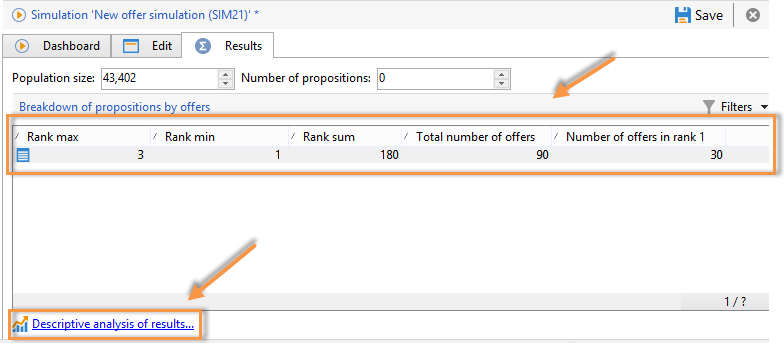

# 시뮬레이션 추적{#simulation-tracking}

시뮬레이션이 완료되면 시뮬레이션 창에 추가된 **[!UICONTROL Results]** 탭과 시뮬레이션 대시보드의 **[!UICONTROL Breakdown of offers by rank]** 보고서를 통해 결과를 분석할 수 있습니다.

시뮬레이션 결과에는 등급별 및 수신자별 제안 분류가 포함됩니다. 보고 축도 고려되며 이 탭에 표시됩니다.

이러한 결과를 저장하고 필요한 경우 결과에 대한 설명 분석을 만들어 내보낼 수 있습니다. 이렇게 하려면 결과 창에서 적절한 링크를 클릭합니다.

설명 분석 도우미에 대한 자세한 내용은 [이 섹션](../../reporting/using/about-descriptive-analysis.md)을 참조하세요.

피벗 테이블을 사용하면 순위별 오퍼 분류를 빠르게 볼 수 있습니다. Adobe Campaign의 모든 보고서와 마찬가지로 웹 브라우저에서 내보내기, 인쇄, 보관 또는 표시할 수 있습니다.

이 작업에 대한 자세한 정보는 [이 섹션](../../reporting/using/actions-on-reports.md)을 참조하십시오.

