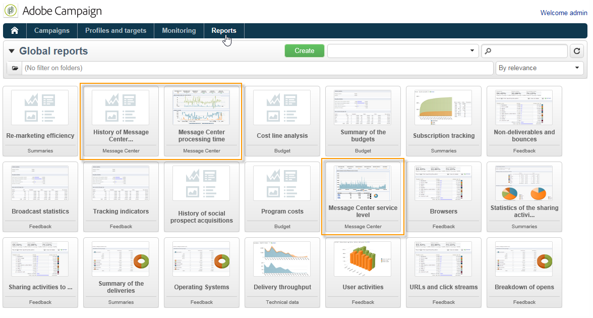

# 트랜잭션 메시지 보고서 액세스 {#about-transactional-messaging-reports}

Adobe Campaign에서는 실행 인스턴스의 활동 및 원활한 실행을 제어할 수 있는 몇 가지 보고서를 제공합니다.

이러한 메시지 센터 보고서는 **제어 인스턴스**&#x200B;의 **[!UICONTROL Reports]** 탭에서 액세스할 수 있습니다.

