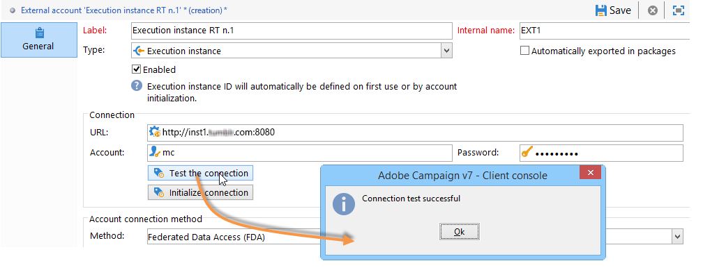

# 인스턴스 구성 {#creating-a-shared-connection}

트랜잭션 메시지 기능을 사용하려면 제어 및 실행 인스턴스를 구성해야 합니다. 다음 중 하나를 사용할 수 있습니다.
* [하나의 컨트롤 인스턴스](#control-instance) 하나 이상의 실행 인스턴스와 연결되어 있습니다.
* [여러 컨트롤 인스턴스](#using-several-control-instances) 여러 실행 인스턴스와 연결되어 있습니다.

>[!IMPORTANT]
>
>스키마 확장은 [메시지 센터 기술 워크플로우](../../message-center/using/additional-configurations.md#technical-workflows) 제어 또는 실행 인스턴스에서 트랜잭션 메시지 모듈에서 사용하는 다른 인스턴스에 복제해야 합니다.

또한 실행 인스턴스를 지정하고 제어 인스턴스에 연결해야 합니다.

제어 및 실행 인스턴스를 구성하고 연결하는 데 필요한 모든 단계는 이 섹션에 설명되어 있습니다.

>[!IMPORTANT]
>
>제어 인스턴스와 실행 인스턴스는 다른 컴퓨터에 설치해야 합니다. 동일한 Campaign 인스턴스를 공유할 수 없습니다.

## 컨트롤 인스턴스 구성 {#control-instance}

컨트롤 인스턴스와 실행 인스턴스를 연결하려면 먼저 제어 인스턴스를 만들고 구성해야 합니다 **[!UICONTROL Execution instance]** 외부 계정 유형 **컨트롤 인스턴스에서**. 따라서 한 번 [게시됨](../../message-center/using/publishing-message-templates.md#template-publication), 트랜잭션 메시지 템플릿을 실행 인스턴스에 배포할 수 있습니다.

여러 실행 인스턴스를 사용하는 경우 실행 인스턴스만큼 외부 계정을 만들어야 합니다.

>[!NOTE]
>
>여러 컨트롤 인스턴스에서 실행 인스턴스를 사용하면 데이터를 폴더와 연산자로 나눌 수 있습니다. 자세한 내용은 [여러 컨트롤 인스턴스 사용](#using-several-control-instances).

### 외부 계정 만들기

>[!NOTE]
>
>아래 단계를 수행해야 합니다 **컨트롤 인스턴스에서**.

을(를) 만들려면 **[!UICONTROL Execution instance]** 외부 계정을 입력하고 다음을 적용합니다.

1. 로 이동합니다. **[!UICONTROL Administration > Platform > External accounts]** 폴더를 입력합니다.
1. Adobe Campaign과 함께 기본적으로 제공되는 실행 인스턴스 유형 외부 계정 중 하나를 선택하고 마우스 오른쪽 단추를 클릭하고 을(를) 선택합니다 **[!UICONTROL Duplicate]** .

   

1. 필요에 따라 레이블을 변경합니다.

   

1. 을(를) 선택합니다 **[!UICONTROL Enabled]** 외부 계정을 작동시키는 옵션입니다.

   

1. 실행 인스턴스가 설치된 서버의 주소를 지정합니다.

   

1. 계정은 운영자 폴더에 정의된 메시지 센터 에이전트와 일치해야 합니다. 기본적으로 Adobe Campaign에서 제공하는 기본 계정은 다음과 같습니다 **[!UICONTROL mc]** .

   

1. 운영자 폴더에 정의된 대로 계정의 암호를 입력합니다.

   >[!NOTE]
   >
   >인스턴스에 로그온할 때마다 암호를 입력하지 않도록 하려면 실행 인스턴스에서 제어 인스턴스의 IP 주소를 지정할 수 있습니다. 자세한 내용은 [실행 인스턴스 구성](#execution-instance).

1. 실행 인스턴스에서 사용할 복구 방법을 지정합니다. 복구할 데이터는 트랜잭션 메시지 및 이벤트 아카이브에 추가하기 위해 실행 인스턴스에서 제어 인스턴스로 전달됩니다.

   

   데이터 수집은 HTTP/HTTPS 액세스를 사용하는 웹 서비스 또는 FDA(Federated Data Access) 모듈을 통해 발생합니다.

   >[!NOTE]
   >
   >HTTP에서 FDA를 사용할 때는 PostgreSQL 데이터베이스를 사용하는 실행 인스턴스만 지원됩니다. MSSQL 또는 Oracle 데이터베이스가 지원되지 않습니다.

   두 번째 메서드(FDA)는 제어 인스턴스가 실행 인스턴스의 데이터베이스에 직접 액세스할 수 있는 경우 권장됩니다. 없는 경우 웹 서비스 액세스를 선택합니다. 지정할 FDA 계정은 제어 인스턴스에서 생성된 다양한 실행 인스턴스의 데이터베이스에 대한 연결과 일치합니다.

   

   FDA(Federated Data Access)에 대한 자세한 내용은 [이 섹션](../../installation/using/about-fda.md).

1. 클릭 **[!UICONTROL Test the connection]** 제어 인스턴스와 실행 인스턴스가 연결되어 있는지 확인합니다.

   

여러 실행 인스턴스를 사용할 때 이러한 단계를 반복하여 실행 인스턴스만큼 외부 계정을 만듭니다.

### 실행 인스턴스 식별 {#identifying-execution-instances}

각 실행 인스턴스는 제어 인스턴스에서 볼 때 각 실행 인스턴스의 기록을 구분하려면 고유 식별자와 연결해야 합니다.

이 식별자는 각 실행 인스턴스에 귀속될 수 있습니다 **수동**. 이 경우 이 단계를 수행해야 합니다 **각 실행 인스턴스에 대해**. 이렇게 하려면 다음과 같이 배포 마법사를 사용합니다.

1. 실행 인스턴스에서 배포 마법사를 엽니다.
1. 로 이동합니다. **[!UICONTROL Message Center]** 창을 엽니다.
1. 선택한 식별자를 인스턴스에 지정합니다.

   

1. 각 실행 인스턴스에서 위의 단계를 반복합니다.

식별자는 **자동으로** 기여도 분석. 이렇게 하려면 로 이동합니다. **제어 인스턴스**&#x200B;를 클릭하고 를 클릭한 다음 **[!UICONTROL Initialize connection]** 버튼을 클릭합니다.

## 실행 인스턴스 구성 {#execution-instance}

>[!NOTE]
>
>아래 단계를 수행해야 합니다 **실행 인스턴스에서**.

실행 인스턴스를 제어 인스턴스에 연결하려면 아래 단계를 따르십시오.

암호를 지정하지 않고 제어 인스턴스가 실행 인스턴스에 연결할 수 있도록 하려면 **메시지 센터** 액세스 권한 섹션. 그러나 기본적으로 빈 암호는 사용할 수 없습니다.

빈 암호를 사용하려면 실행 인스턴스로 이동하고 이벤트를 전달하는 정보 시스템의 IP 주소로 제한된 보안 영역을 정의합니다. 이 보안 영역은 빈 암호를 허용하고 허용해야 합니다 `<identifier> / <password>` 유형 연결. 이 작업에 대한 자세한 정보는 [이 섹션](../../installation/using/security-zones.md)을 참조하십시오.

>[!NOTE]
>
>여러 컨트롤 인스턴스에서 실행 인스턴스를 사용하면 데이터를 폴더와 연산자로 나눌 수 있습니다. 자세한 내용은 [여러 컨트롤 인스턴스 사용](#using-several-control-instances).

1. 실행 인스턴스에서 연산자 폴더( **[!UICONTROL Administration > Access management > Operators]** ).
1. 을(를) 선택합니다 **메시지 센터** 에이전트.

   

1. 을(를) 선택합니다 **[!UICONTROL Edit]** 탭, **[!UICONTROL Access rights]** 를 클릭한 다음 **[!UICONTROL Edit the access parameters...]** 링크를 클릭합니다.

   

1. 에서 **[!UICONTROL Access settings]** 창에서 **[!UICONTROL Add a trusted IP mask]** 를 연결하고 컨트롤 인스턴스의 IP 주소를 추가합니다.

   

여러 실행 인스턴스를 사용하는 경우 각 실행 인스턴스에 대해 이러한 단계를 반복합니다.

## 여러 컨트롤 인스턴스 사용 {#using-several-control-instances}

실행 클러스터를 다양한 제어 인스턴스와 공유할 수 있습니다. 이러한 유형의 아키텍처에는 다음 구성이 필요합니다.

예를 들어, 회사에서 각각 고유한 제어 인스턴스를 사용하여 두 브랜드를 관리한다고 가정해 보겠습니다. **컨트롤 1** 및 **컨트롤 2**. 두 개의 실행 인스턴스도 사용됩니다. 각 제어 인스턴스에 대해 다른 메시지 센터 연산자를 입력해야 합니다. an **mc1** 연산자 **컨트롤 1** 인스턴스 및 **mc2** 연산자 **컨트롤 2** 인스턴스.

모든 실행 인스턴스의 트리에서 연산자당 하나의 폴더를 만듭니다(**폴더 1** 및 **폴더 2**)를 채울 수 있고 각 연산자의 데이터 액세스 권한을 해당 폴더에 제한합니다.

### 제어 인스턴스 구성 {#configuring-control-instances}

>[!NOTE]
>
>아래 단계를 수행해야 합니다 **컨트롤 인스턴스**.

1. 설정 **컨트롤 1** 제어 인스턴스를 만들고 실행 인스턴스당 하나의 외부 계정을 만든 다음 **mc1** 연산자를 사용할 수 있습니다. 다음 **mc1** 그런 다음 모든 실행 인스턴스에 연산자가 만들어집니다( [실행 인스턴스 구성](#configuring-execution-instances)).

   

1. 설정 **컨트롤 2** 제어 인스턴스를 만들고 실행 인스턴스당 하나의 외부 계정을 만든 다음 **mc2** 연산자를 사용할 수 있습니다. 다음 **mc2** 그런 다음 모든 실행 인스턴스에 연산자가 만들어집니다( [실행 인스턴스 구성](#configuring-execution-instances)).

   

   >[!NOTE]
   >
   >컨트롤 인스턴스 구성에 대한 자세한 내용은 [이 섹션](#control-instance).

### 실행 인스턴스 구성 {#configuring-execution-instances}

>[!NOTE]
>
>아래 단계를 수행해야 합니다 **실행 인스턴스에서**.

여러 제어 인스턴스를 사용하려면 ALL 실행 인스턴스에서 이 구성을 수행해야 합니다.

1. 에서 연산자당 하나의 폴더를 만듭니다. **[!UICONTROL Administration > Production > Message Center]** 노드: **폴더 1** 및 **폴더 2**. 폴더 및 보기 만들기에 대한 자세한 내용은 [이 페이지](../../platform/using/access-management-folders.md).

   

1. 만들기 **mc1** 및 **mc2** 기본적으로 제공되는 메시지 센터 연산자를 복제하여 연산자(**mc**). 연산자 만들기에 대한 자세한 내용은 [이 섹션](../../platform/using/access-management-operators.md).

   

   >[!NOTE]
   >
   >**mc1** 및 **mc2** 연산자는 **[!UICONTROL Message Center execution]** 권한 및 Adobe Campaign 클라이언트 콘솔에 액세스할 수 없습니다. 연산자는 항상 보안 영역에 연결되어 있어야 합니다. 이 작업에 대한 자세한 정보는 [이 섹션](../../installation/using/security-zones.md)을 참조하십시오.

1. 각 연산자에 대해 **[!UICONTROL Restrict to information found in sub-folders of]** 상자를 선택하고 관련 폴더(**폴더 1** 대상 **mc1** 연산자 및 **폴더 2** 대상 **mc2** 연산자)

   

1. 각 연산자가 해당 폴더에 대한 읽기 및 쓰기 권한을 지정합니다. 이렇게 하려면 폴더를 마우스 오른쪽 단추로 클릭하고 **[!UICONTROL Properties]** . 그런 다음 **[!UICONTROL Security]** 탭하고 관련 연산자 추가(**mc1** 대상 **폴더 1** 및 **mc2** 대상 **폴더 2**). 다음을 확인합니다. **[!UICONTROL Read/Write data]** 상자를 선택합니다.

   
