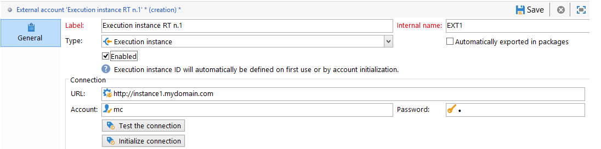
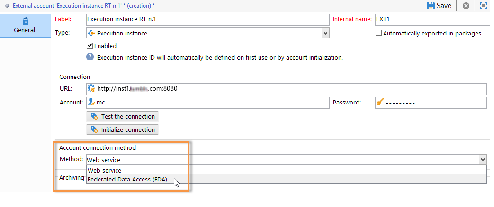

# 공유 연결 만들기{#creating-a-shared-connection}

>[!CAUTION]
>
>* Message Center 기술 워크플로에서  제어 또는 실행 인스턴스에 사용되는 스키마에서 만들어진 스키마 확장은 Adobe Campaign 트랜잭션 메시징 모듈에서 사용하는 다른 인스턴스에서 복제되어야 합니다.
>* 컨트롤 인스턴스와 실행 인스턴스를 다른 컴퓨터에 설치해야 합니다. 동일한 캠페인 인스턴스를 공유할 수 없습니다.
>

## 컨트롤 인스턴스 {#control-instance}

상세 아키텍처가 있는 경우 제어 인스턴스에 연결된 실행 인스턴스를 지정하고 연결해야 합니다. 트랜잭션 메시지 템플릿은 실행 인스턴스에 배포됩니다. 제어 인스턴스와 실행 인스턴스 간의 연결은 **[!UICONTROL Execution instance]** 외부 계정 유형을 구성하여 만듭니다. 실행 인스턴스만큼 외부 계정을 만들어야 합니다.

>[!NOTE]
>
>실행 인스턴스를 여러 제어 인스턴스에서 사용하면 데이터를 폴더 및 연산자로 나눌 수 있습니다. 자세한 내용은 여러 [컨트롤 인스턴스](#using-several-control-instances)사용을 참조하십시오.

실행 인스턴스 유형 외부 계정을 만들려면 다음 단계를 적용합니다.

1. 폴더로 **[!UICONTROL Administration > Platform > External accounts]** 이동합니다.
1. Adobe Campaign과 함께 즉시 제공된 실행 인스턴스 유형 외부 계정 중 하나를 선택하고 마우스 오른쪽 단추를 클릭한 다음 을 선택합니다 **[!UICONTROL Duplicate]** .

   

1. 필요에 따라 레이블을 변경합니다.

   

1. 외부 계정을 작동하게 하려면 **[!UICONTROL Enabled]** 옵션을 선택합니다.

   

1. 실행 인스턴스가 설치된 서버의 주소를 지정합니다.

   

1. 계정은 연산자 폴더에 정의된 메시지 센터 에이전트와 일치해야 합니다. 기본적으로 Adobe Campaign에서 제공하는 기본 계정은 **[!UICONTROL mc]** 입니다.

   

1. 연산자 폴더에 정의된 대로 계정의 암호를 입력합니다.

   >[!NOTE]
   >
   >인스턴스에 로그온할 때마다 암호를 입력하지 않도록 하려면 실행 인스턴스에서 제어 인스턴스의 IP 주소를 지정할 수 있습니다. 자세한 내용은 실행 [인스턴스를](#execution-instance)참조하십시오.

1. 실행 인스턴스에서 사용할 복구 방법을 지정합니다.

   복구할 데이터는 트랜잭션 메시지 및 이벤트 보관에 추가하기 위해 실행 인스턴스별로 제어 인스턴스로 전달됩니다.

   

   데이터 수집은 HTTP/HTTPS 액세스를 사용하는 웹 서비스나 FDA(Federated Data Access) 모듈을 통해 이루어집니다.

   >[!NOTE]
   >
   >HTTP를 통해 FDA를 사용하는 경우 Postgres 데이터베이스를 사용하는 예외 인스턴스만 지원됩니다. MSSQL 또는 Oracle 데이터베이스는 지원되지 않습니다.

   두 번째 방법은 제어 인스턴스가 실행 인스턴스의 데이터베이스에 직접 액세스하는 경우 권장됩니다. 그렇지 않은 경우 웹 서비스 액세스를 선택합니다. 지정할 FDA 계정은 제어 인스턴스에서 만든 다양한 실행 인스턴스의 데이터베이스에 대한 연결과 일치합니다.

   

   Federated Data Access(FDA)에 대한 자세한 내용은 [외부 데이터베이스](../../platform/using/about-fda.md)액세스를 참조하십시오.

1. 을 **[!UICONTROL Test the connection]** 클릭하여 제어 인스턴스와 실행 인스턴스가 연결되어 있는지 확인합니다.

   

1. 각 실행 인스턴스는 식별자와 연결되어 있어야 합니다. 이 식별자는 배포 마법사를 사용하여 수동으로 또는(실행 인스턴스 식별 참조) [또는 제어 인스턴스에서 연결](../../message-center/using/identifying-execution-instances.md)초기화 **** 단추를 클릭하여 자동으로 각 실행 인스턴스에적용될 수 있습니다.

   

## 실행 인스턴스 {#execution-instance}

제어 인스턴스가 암호를 부여하지 않고도 실행 인스턴스에 연결할 수 있도록 하려면 메시지 센터 액세스 권한 섹션에 제어 인스턴스의 **IP 주소를** 입력하면 됩니다. 그러나 기본적으로 빈 암호는 사용할 수 없습니다.

빈 암호를 사용하려면 실행 인스턴스로 이동하여 이벤트를 전달하는 정보 시스템의 IP 주소로 제한된 보안 영역을 정의합니다. 이 보안 영역은 빈 암호를 허용하고 `<identifier> / <password>` 문자 연결을 허용해야 합니다. For more on this, refer to [this section](../../installation/using/configuring-campaign-server.md#defining-security-zones).

>[!NOTE]
>
>실행 인스턴스를 여러 제어 인스턴스에서 사용하면 데이터를 폴더 및 연산자로 나눌 수 있습니다. 자세한 내용은 여러 [컨트롤 인스턴스](#using-several-control-instances)사용을 참조하십시오.

1. 실행 인스턴스( **[!UICONTROL Administration > Access management > Operators]** )의 연산자 폴더로 이동합니다.
1. 메시지 센터 **에이전트를** 선택합니다.

   

1. 탭을 선택하고 **[!UICONTROL Edit]** 을 클릭한 다음 **[!UICONTROL Access rights]** **[!UICONTROL Edit the access parameters...]** 링크를 클릭합니다.

   

1. 창에서 **[!UICONTROL Access settings]** **[!UICONTROL Add a trusted IP mask]** 링크를 클릭하고 제어 인스턴스의 IP 주소를 추가합니다.

   

## 여러 컨트롤 인스턴스 사용 {#using-several-control-instances}

실행 클러스터를 다양한 제어 인스턴스와 공유할 수 있습니다. 이러한 유형의 아키텍처는 다음 구성이 필요합니다.

예를 들어 회사가 각각 자체 제어 인스턴스를 사용하여 두 개의 브랜드를 관리하는 경우,Control **1** 및 **Control 2**. 두 개의 실행 인스턴스가 사용됩니다. 각 제어 인스턴스에 대해 다른 메시지 센터 연산자를 입력해야 합니다.Control **1** 인스턴스에 대한 **연산자와 Control** 2 **** mc **mc** 인스턴스에 대한mc2연산자가반환됩니다.

모든 실행 인스턴스의 트리에서 연산자당 하나의 폴더(폴더&#x200B;**1** 및 **폴더 2**)를 만들고 각 연산자의 데이터 액세스를 해당 폴더에 제한합니다.

### 제어 인스턴스 구성 {#configuring-control-instances}

1. Control **1** 제어 인스턴스에서 실행 인스턴스당 외부 계정 하나를 만들고 각 외부 계정에 **mc1** 연산자를 입력합니다. 그런 **후 mc1** 연산자는 모든 실행 인스턴스에 생성됩니다(실행 인스턴스 [구성 참조](#configuring-execution-instances)).

   

1. Control **2** 제어 인스턴스에서 실행 인스턴스당 외부 계정 하나를 만들고 각 외부 계정에 **mc2** 연산자를 입력합니다. 그런 다음 **mc2** 연산자는 모든 실행 인스턴스에 생성됩니다(실행 인스턴스 [구성 참조](#configuring-execution-instances)).

   

   >[!NOTE]
   >
   >컨트롤 인스턴스 구성에 대한 자세한 내용은 제어 [인스턴스를](#control-instance)참조하십시오.

### 실행 인스턴스 구성 {#configuring-execution-instances}

여러 제어 인스턴스를 사용하려면 ALL 실행 인스턴스에서 이 구성을 수행해야 합니다.

1. 다음 **[!UICONTROL Administration > Production > Message Center]** 노드에서 연산자당 하나의 폴더를 만듭니다.폴더 **1** 및 **폴더 2**. 폴더 및 보기 만들기에 대한 자세한 내용은 플랫폼을 [참조하십시오](../../platform/using/access-management.md#folders-and-views).

   

1. 기본적으로 제공되는 메시지 센터 연산자( **mc** )를 복제하여 **mc1** 및&#x200B;**mc2**&#x200B;연산자를 만듭니다. For more on creating operators, refer to [this section](../../platform/using/access-management.md#operators).

   

   >[!NOTE]
   >
   >**mc1** 및 **mc2** 연산자는 **[!UICONTROL Message Center execution]** 권한이 있어야 하며 Adobe Campaign 클라이언트 콘솔에 액세스할 수 없습니다. 연산자는 항상 보안 영역에 연결되어 있어야 합니다. For more on this, refer to [this section](../../installation/using/configuring-campaign-server.md#defining-security-zones).

1. 각 연산자에 대해 **[!UICONTROL Restrict to information found in sub-folders of]** 확인란을 선택하고 관련 폴더(**mcMc1** 연산자는 폴더 1 **,** Folder 2 **는 McMc2 연산자는 폴더 2** **** )를 선택합니다.

   

1. 각 운영자에게 해당 폴더에 대한 읽기 및 쓰기 권한을 부여합니다. 이렇게 하려면 폴더를 마우스 오른쪽 단추로 클릭하고 을 선택합니다 **[!UICONTROL Properties]** . 그런 다음 **[!UICONTROL Security]** 탭을 선택하고 관련 연산자(**폴더 1** 의 경우 **mc1** , **폴더 2의** 경우 **mc2**)를 추가합니다. 상자가 선택되어 있는지 **[!UICONTROL Read/Write data]** 확인합니다.

   

