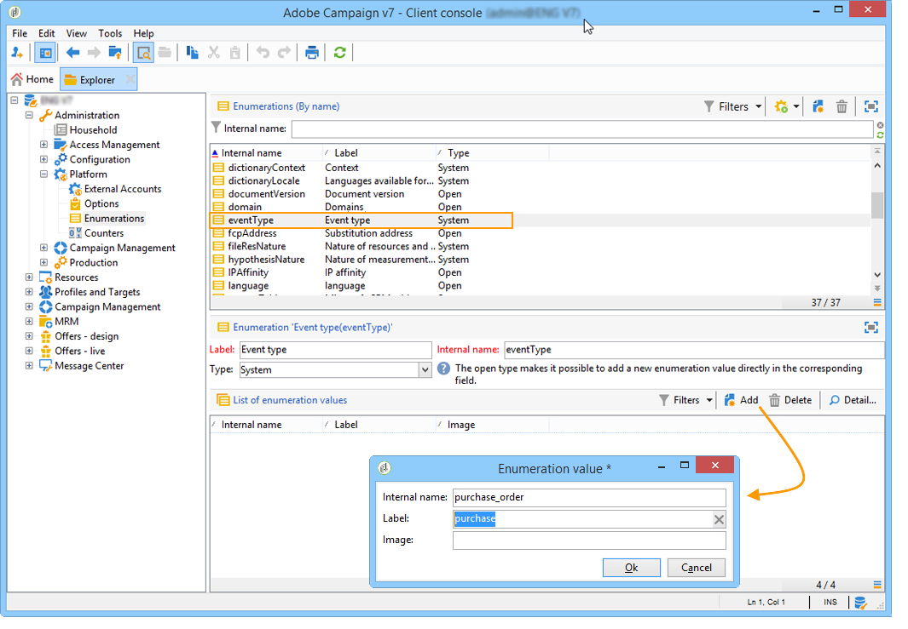

# 이벤트 유형 만들기{#creating-event-types}

Adobe Campaign에서 처리할 이벤트 유형은 제어 인스턴스에서 만들어야 합니다. 이 작업은 트리의 **[!UICONTROL Administration > Platform > Enumerations]** 폴더를 통해 수행할 수 있습니다. 각 이벤트 유형은 열거형의 값과 **[!UICONTROL eventType]** 일치합니다. 주문 확인, 암호 또는 주문 전달 변경 등이 가능합니다.

항목별 목록에 대한 자세한 내용은 열거형 [관리를 참조하십시오](../../platform/using/managing-enumerations.md).

항목별 목록 값이 만들어지면, 작성을 효과적으로 하기 위해 사용자 인스턴스에 로그오프했다가 다시 로그온합니다.
