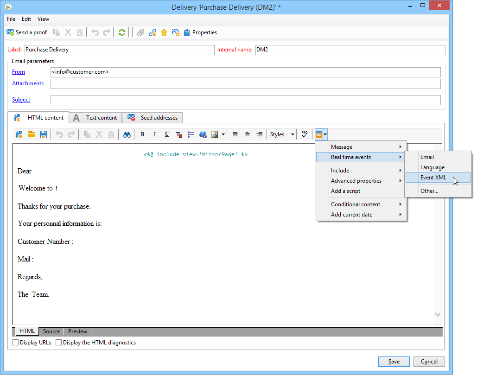

# 메시지 콘텐츠 만들기{#creating-message-content}

트랜잭션 메시지 컨텐츠의 정의는 Adobe Campaign의 일반 배달과 동일합니다. 예를 들어 이메일 전달의 경우 HTML 또는 텍스트 형식의 컨텐츠를 만들거나 첨부 파일을 추가하거나 전달 개체를 개인화할 수 있습니다. 자세한 내용은 [이메일 전달](../../delivery/using/about-email-channel.md)장을 참조하십시오.

>[!IMPORTANT]
>
>메시지에 포함된 이미지는 공개적으로 액세스할 수 있어야 합니다. Adobe Campaign은 트랜잭션 메시지에 대한 이미지 업로드 메커니즘을 제공하지 않습니다.\
>JSSP 또는 webApp과 달리 기본 이스케이프도 `<%=` 없습니다.
>
>이 경우 이벤트에서 제대로 나오는 각 데이터를 escape해야 합니다. 이 탈출은 이 필드의 사용 방법에 따라 달라집니다. 예를 들어 URL 내에서 encodeURIComponent를 사용하십시오. HTML에 표시하려면 escapeXMLString을 사용할 수 있습니다.

메시지 내용을 정의한 후에는 이벤트 정보를 메시지 본문에 통합하고 개인화할 수 있습니다. 개인화 태그 덕분에 이벤트 정보가 텍스트 본문에 삽입됩니다.

* 모든 개인화 필드는 페이로드에서 가져옵니다.
* 트랜잭션 메시지에서 하나 또는 여러 개의 개인화 블록을 참조할 수 있습니다. 게시 중에 전달 내용에 블록 컨텐츠가 추가됩니다.

이메일 메시지 본문에 개인화 태그를 삽입하려면 다음 단계를 수행하십시오.

1. 메시지 템플릿에서 이메일 형식(HTML 또는 텍스트)과 일치하는 탭을 클릭합니다.
1. 메시지 본문을 입력합니다.
1. 텍스트 본문에 메뉴를 사용하여 태그를 **[!UICONTROL Real time events>Event XML]** 삽입합니다.

   

1. 다음 구문을 사용하여 태그를 채웁니다. **요소 이름**.@**attribute name** as shown below.

   

