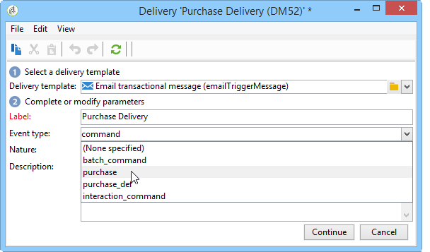

# 메시지 템플릿 만들기{#creating-the-message-template}

1. Adobe Campaign 트리의 **[!UICONTROL Message Center >Transactional message templates]** 폴더로 이동합니다.
1. 트랜잭션 메시지 템플릿 목록에서 마우스 오른쪽 단추를 클릭하여 드롭다운 **[!UICONTROL New]** 메뉴에서 선택하거나 트랜잭션 메시지 템플릿 목록 위의 **[!UICONTROL New]** 단추를 클릭합니다.

   

1. 배달 창에서 사용할 채널에 적합한 배달 템플릿을 선택합니다.

   

1. 필요한 경우 레이블을 변경합니다.
1. 전송할 메시지와 일치하는 이벤트 유형을 선택합니다.

   

   콘솔에서 미리 이벤트 유형을 만들어야 합니다. 자세한 내용은 이벤트 [유형](../../message-center/using/creating-event-types.md)만들기를 참조하십시오.

   >[!NOTE]
   >
   >이벤트 유형은 두 개 이상의 템플릿에 링크되어서는 안 됩니다.

1. 성격과 설명을 입력한 다음 을 클릭하여 메시지 본문을 **[!UICONTROL Continue]** 만듭니다(메시지 컨텐츠 [만들기 참조](../../message-center/using/creating-message-content.md)).

   

