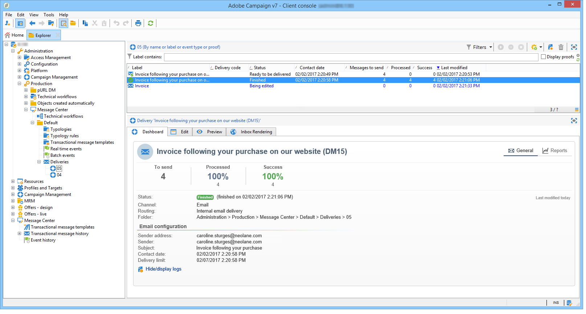

# 게재 실행 {#delivery-execution}

## {#transactional-message-send} 전송 트랜잭션 메시지

실행 인스턴스에서 데이터 보강 단계가 완료되고 게재 템플릿이 이벤트에 연결되어 있으면 게재가 전송됩니다.

>[!NOTE]
>
>MTA는 다른 어떤 게재보다도 트랜잭션 메시지 처리에 우선 순위를 둡니다.

모든 게재는 **[!UICONTROL Administration > Production > Message Center > Default > Deliveries]** 폴더에 그룹화됩니다.

기본적으로 배달 월별로 하위 폴더로 정렬됩니다. 이 정렬은 아래와 같이 메시지 템플릿 속성에서 변경할 수 있습니다.

>[!NOTE]
>
>호스팅 또는 하이브리드 설치의 경우 [Enhanced MTA](../../delivery/using/sending-with-enhanced-mta.md)로 업그레이드한 경우 게재 능력, 처리량 및 반송 처리를 위해 Adobe Campaign Enhanced MTA와 함께 모든 트랜잭션 메시지를 전송할 수도 있습니다. 모든 영향은 표준 마케팅 메시지와 동일합니다.

## 트랜잭션 메시지 모니터링 {#transactional-message-monitoring}

트랜잭션 메시지를 모니터링하려면 [게재 로그](../../delivery/using/delivery-dashboard.md#delivery-logs-and-history)를 확인합니다.

실행 인스턴스에서 전송된 트랜잭션 게재는 매시간마다 실행되는 기술 워크플로우(**[!UICONTROL Message Center execution instance]**)를 통해 제어 인스턴스로 다시 동기화됩니다.

>[!NOTE]
>
>게재 주마다 이벤트 생성 날짜가 아니라 최신 이벤트 업데이트를 기반으로 이벤트를 누적합니다. 따라서 제어 인스턴스에서 트랜잭션 메시지 게재 로그를 추출할 때 로그가 업데이트되면(예를 들어, 이벤트에 대해 인바운드 바운스가 수신될 때) 각 게재 로그 ID와 연관된 게재 ID가 시간에 따라 변경될 수 있습니다.

<!--The transactional deliveries sent from the execution instance are synchronized back to the control instance as follows.

Let's take a [delivery template](../../message-center/using/introduction.md) labelled *Template_1*.

1. An event corresponding to *Template_1* is received on the execution instance.
1. The **Processing real time events** (rtEventsProcessing) workflow processes the event and searches for an existing delivery for the current month.

    >[!NOTE]
    >
    >If not found, a new delivery is created and the event is assigned to the new delivery.

1. The transactional email is sent and the delivery status changes to **[!UICONTROL Sent]**.
1. The **Message Center execution instance** (mcSync_mcExec) workflow retrieves the delivery logs from the execution instance and updates the delivery logs on the control instance.
1. The control instance searches for an existing delivery for week 40 (2020-09-28_Template_1).

    >[!NOTE]
    >
    >If not found, a new delivery is created.

1. The week after, an inbound bounce is received for the event.
1. The status of the event changes to **[!UICONTROL Delivery failed]**.
1. The **Message Center execution instance** (mcSync_mcExec) workflow retrieves the delivery logs from the execution instance and searches for a delivery for week 41 (2020-10-05_Template_1) to update the delivery logs. The delivery logs are then linked to a new delivery for the current week.

To summarize, the deliveries weekly accumulate the events based on the latest event update, and not on the event creation date.

Therefore, when extracting transactional messaging delivery logs from the control instance, the delivery ID associated with each delivery log ID changes every week.-->

활동 및 실행 인스턴스의 실행을 모니터링하려면 [트랜잭션 메시지 보고서](../../message-center/using/about-transactional-messaging-reports.md)를 참조하십시오.
