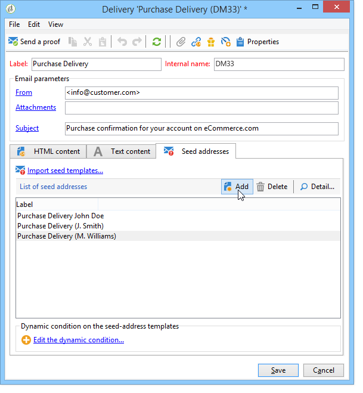

# 트랜잭션 메시지의 시드 주소 관리{#managing-seed-addresses-in-transactional-messages}

시드 주소를 사용하면 이메일 또는 SMS 전달 전에 메시지 미리 보기를 표시하고 증거를 전송하며 메시지 개인화를 테스트할 수 있습니다. 시드 주소는 게재와 연결되어 있으므로 다른 게재에 사용할 수 없습니다.

## 시드 주소 만들기 {#creating-a-seed-address}

1. In the transactional message template, click the **[!UICONTROL Seed addresses]** tab.

   

1. 나중에 쉽게 선택할 수 있도록 레이블을 할당합니다.

   

1. 시드 주소(통신 채널에 따라 이메일 또는 휴대폰)를 입력합니다.

   

1. 외부 식별자를 입력합니다.이 선택 필드에서는 비즈니스 키(고유 ID, 이름 + 이메일 등)를 입력할 수 있습니다. 이는 프로파일을 식별하는 데 사용되는 웹 사이트의 모든 애플리케이션에 일반적으로 사용됩니다. 이 필드가 Adobe Campaign 마케팅 데이터베이스에도 있을 경우, 이벤트를 데이터베이스의 프로필과 대사할 수 있습니다.

   

1. 테스트 데이터를 삽입합니다(개인화 데이터 [를](../../message-center/using/personalization-data.md)참조하십시오).

   

   <!--## Creating several seed addresses {#creating-several-seed-addresses}-->
1. 링크를 **[!UICONTROL Add other seed addresses]** 클릭한 다음 **[!UICONTROL Add]** 단추를 클릭합니다.

   

   <!--1. Follow the configuration steps for a seed address detailed in the [Creating a seed address](#creating-a-seed-address) section.-->
1. 이 과정을 반복하여 필요한 만큼 주소를 만듭니다.

   

주소가 만들어지면 미리 보기와 개인화를 표시할 수 있습니다. 트랜잭션 메시지 미리 [보기를 참조하십시오](../../message-center/using/transactional-message-preview.md).
