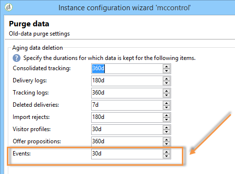

# 이벤트 제거{#purging-events}

배포 마법사를 사용하여 데이터베이스에 데이터를 저장할 기간을 구성할 수 있습니다.

이벤트 제거는 **[!UICONTROL Database cleanup]** 워크플로우에 의해 자동으로 수행됩니다. 이 워크플로우는 수신 및 제어 인스턴스에 보관된 실행 인스턴스 및 이벤트에 저장된 이벤트를 제거합니다.

화살표를 적절히 사용하여 제거 설정을 변경합니다.

제어 인스턴스에 대한 이벤트 제거 설정:

실행 인스턴스의 이벤트 제거 설정:

데이터베이스 정리 워크플로우에 대한 자세한 내용은 [이 섹션을](../../production/using/database-cleanup-workflow.md)참조하십시오.
