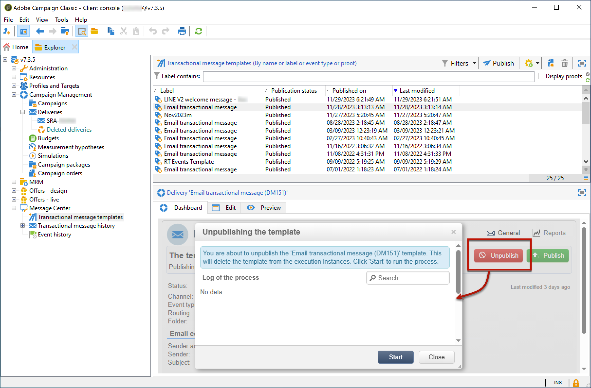

# 템플릿 게시 취소{#template-unpublication}

메시지 템플릿이 실행 인스턴스에 게시되면 게시 취소할 수 있습니다.

>[!NOTE]
>
>이 기능은 Campaign 20.2 릴리스에서 사용할 수 있습니다.

게시된 템플릿은 여전히 호출할 수 있습니다. 따라서 더 이상 메시지 템플릿을 사용하지 않는 경우 게시 취소하는 것이 좋습니다. 실수로 원하지 않는 트랜잭션 메시지를 보내지 않기 위한 것입니다. 예를 들어, 크리스마스 캠페인에만 사용하는 메시지 템플릿을 게시했습니다. 크리스마스 기간이 끝난 후에 게시 취소하고, 내년에 다시 게시하십시오.

또한 **[!UICONTROL Published]** 상태가 있는 트랜잭션 메시지 템플릿은 삭제할 수 없습니다. 먼저 게시 취소해야 합니다.

트랜잭션 메시지 템플릿의 게시를 취소하려면 아래 절차를 따르십시오.

1. 제어 인스턴스에서 트리의 **[!UICONTROL Message Center > Transactional message templates]** 폴더로 이동합니다.
1. 게시를 취소할 템플릿을 선택합니다.
1. **[!UICONTROL Unpublish]**&#x200B;을(를) 클릭합니다.

   <!--1. Fill in the **[!UICONTROL Log of the process]** field.-->

1. **[!UICONTROL Start]**&#x200B;을(를) 클릭합니다.

트랜잭션 메시지 템플릿 상태가 에서 (으)로 다시 **[!UICONTROL Published]** 변경됩니다 **[!UICONTROL Being edited]**.

게시 취소 완료 후:

* 두 메시지 템플릿(일괄 처리 및 실시간 유형 이벤트에 적용)이 모두 각 실행 인스턴스에서 삭제됩니다. 더 이상 **[!UICONTROL Administration > Production > Message Center Execution > Default > Transactional message templates]** 폴더에 표시되지 않습니다.

* 템플릿의 게시를 취소하면 필요한 경우 제어 인스턴스에서 템플릿을 삭제할 수 있습니다. 이렇게 하려면 목록에서 선택하고 화면 오른쪽 위에 있는 **[!UICONTROL Delete]** 단추를 클릭합니다.