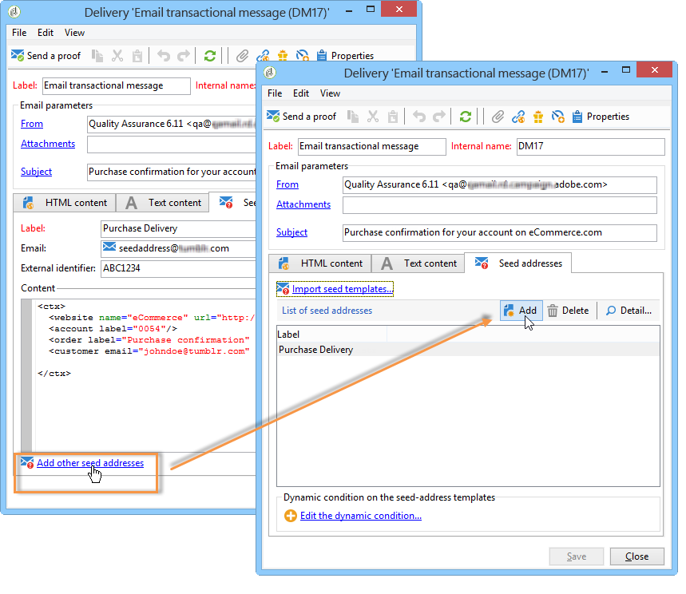
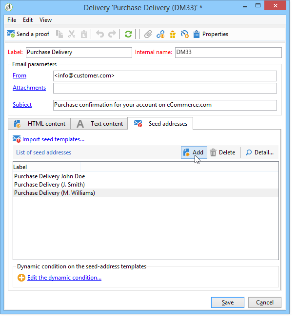

# 트랜잭션 메시지 템플릿 테스트 {#testing-message-templates}

한 번 [메시지 템플릿](../../message-center/using/creating-the-message-template.md) 준비가 되었습니다. 아래 단계에 따라 미리 보고 테스트하십시오.

## 트랜잭션 메시지의 시드 주소 관리 {#managing-seed-addresses-in-transactional-messages}

시드 주소를 사용하면 이메일 또는 SMS 게재 전에 메시지 미리보기를 표시하고 증명을 보내고, 메시지 개인화를 테스트할 수 있습니다. 시드 주소는 게재에 연결되며 다른 게재에 사용할 수 없습니다.

트랜잭션 메시지에 시드 주소를 만들려면 아래 단계를 수행합니다.

1. 트랜잭션 메시지 템플릿에서 **[!UICONTROL Seed addresses]** 탭.

   

1. 나중에 쉽게 선택할 수 있도록 레이블을 지정합니다.

   

1. 시드 주소(통신 채널에 따라 이메일 또는 휴대폰)를 입력합니다.

   

1. 외부 식별자 입력: 이 선택적 필드를 사용하면 비즈니스 키(고유 ID, 이름 + 이메일 등)를 입력할 수 있습니다. 이는 웹 사이트의 모든 애플리케이션에 공통적이며, 프로필을 식별하는 데 사용됩니다. 이 필드가 Adobe Campaign 마케팅 데이터베이스에도 있는 경우 데이터베이스의 프로필과 이벤트를 조정할 수 있습니다.

   

1. 테스트 데이터 삽입( 참조) [개인화 데이터](#personalization-data)).

   

   <!--## Creating several seed addresses {#creating-several-seed-addresses}-->
1. 다음을 클릭합니다. **[!UICONTROL Add other seed addresses]** 링크를 클릭한 다음 **[!UICONTROL Add]** 단추를 클릭합니다.

   

   <!--1. Follow the configuration steps for a seed address detailed in the [Creating a seed address](#creating-a-seed-address) section.-->
1. 필요한 수만큼 주소를 만들려면 이 프로세스를 반복합니다.

   

주소가 생성되면 미리보기 및 개인화를 표시할 수 있습니다. 을(를) 참조하십시오 [트랜잭션 메시지 미리 보기](#transactional-message-preview).

## 개인화 데이터 {#personalization-data}

메시지 템플릿의 데이터를 사용하여 트랜잭션 메시지 개인화를 테스트할 수 있습니다. 이 기능은 미리보기를 생성하거나 증명을 전송하는 데 사용됩니다. 다양한 인터넷 액세스 공급자에 대해 메시지 렌더링을 표시할 수도 있습니다. 자세한 내용은 [받은 편지함 렌더링](../../delivery/using/inbox-rendering.md).

이 데이터의 목적은 최종 게재 전에 메시지를 테스트하는 것입니다. 이러한 메시지는 처리할 실제 데이터와 일치하지 않습니다. 단, XML 구조는 아래와 같이 실행 인스턴스에 저장된 이벤트의 구조와 동일해야 합니다.

이 정보를 통해 개인화 태그를 사용하여 메시지 콘텐츠를 개인화할 수 있습니다(자세한 내용은 다음을 참조하십시오.) [메시지 콘텐츠 만들기](../../message-center/using/creating-the-message-template.md#creating-message-content)).

1. 트랜잭션 메시지 템플릿을 선택합니다.

1. 템플릿에서 **[!UICONTROL Seed addresses]** 탭.

1. 이벤트 콘텐츠에서 테스트 정보를 XML 형식으로 입력합니다.

   

1. **[!UICONTROL Save]**&#x200B;를 클릭합니다.

## 트랜잭션 메시지 미리 보기 {#transactional-message-preview}

시드 주소와 메시지 본문을 한 개 이상 만들면 메시지를 미리 보고 개인화를 확인할 수 있습니다.

1. 메시지 템플릿에서 **[!UICONTROL Preview]** 탭.

   

1. 선택 **[!UICONTROL A seed address]** 을 클릭합니다.

   

1. 이전에 만든 시드 주소를 선택하여 개인화된 메시지를 표시합니다.

   

시드 주소를 사용하여 다양한 인터넷 액세스 공급자에 대한 메시지 렌더링을 표시할 수도 있습니다. 자세한 내용은 [받은 편지함 렌더링](../../delivery/using/inbox-rendering.md).

## 증명 보내기 {#sending-a-proof}

이전에 만든 시드 주소로 증명을 전송하여 메시지 게재를 테스트할 수 있습니다.

증명 보내기에 와(과) 동일한 프로세스가 포함됩니다. [정기 분만](../../delivery/using/steps-validating-the-delivery.md#sending-a-proof). 그러나 트랜잭션 메시지를 보내려면 먼저 다음 작업을 수행해야 합니다.

* 하나 이상 만들기 [시드 주소](#managing-seed-addresses-in-transactional-messages) 포함 [개인화 데이터](#personalization-data).
* [메시지 콘텐츠 만들기](../../message-center/using/creating-the-message-template.md#creating-message-content).

증명을 보내려면:

1. 다음을 클릭합니다. **[!UICONTROL Send a proof]** 게재 창의 단추.
1. 게재 분석.
1. 오류를 수정하고 게재를 확인합니다.

   

1. 메시지가 시드 주소로 전달되었고 해당 콘텐츠가 구성을 준수하는지 확인합니다.

   

증명을 각 템플릿에서 **[!UICONTROL Audit]** 탭. 자세한 내용은 [증명 보내기](../../delivery/using/steps-validating-the-delivery.md#sending-a-proof).

이제 메시지 템플릿을 사용할 준비가 되었습니다. [게시됨](../../message-center/using/publishing-message-templates.md).