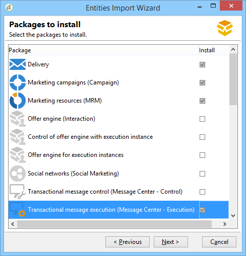

# 트랜잭션 메시지 아키텍처 {#transactional-messaging-architecture}


트랜잭션 메시지는 여러 인스턴스로 구성된 특정 아키텍처를 기반으로 합니다.

* A **컨트롤 인스턴스**(메시지 템플릿이 작성됨)

* 하나 이상 **실행 인스턴스**: 이벤트를 수신하고 메시지를 전달합니다.


| 컨트롤 인스턴스 | 실행 인스턴스 |
|--- |--- |
| Adobe Campaign 사용자는 제어 인스턴스에 로그온하여 다음을 수행합니다. <ul><li>트랜잭션 메시지 템플릿 만들기</li><li>시드 목록을 사용하여 메시지 미리 보기 생성</li><li>보고서 표시</li><li>실행 인스턴스 모니터링</li></ul> | 실행 인스턴스는 여기에서 다음을 수행합니다. <ul><li>이벤트 수신</li><li>트랜잭션 메시지 템플릿에 연결</li><li>각 수신자에게 개인화된 메시지 보내기</li></ul> |

## 인스턴스 설치 {#installing-instances}

트랜잭션 메시지 패키지를 설치할 때 몇 가지 주의 사항이 있습니다. Adobe은 프로덕션에 들어가기 전에 테스트 환경에서 작업하는 것을 권장합니다. 호환 가능한 Adobe Campaign 라이센스도 있어야 합니다. 자세한 내용은 Adobe 계정 담당자에게 문의하십시오.

>[!IMPORTANT]
>
>제어 인스턴스와 실행 인스턴스를 다른 컴퓨터에 설치해야 합니다. 동일한 Campaign 인스턴스를 공유할 수 없습니다.

여러 채널을 사용해야 하는 경우 트랜잭션 메시지 패키지를 설치하기 전에 관련 패키지를 설치하고 구성해야 합니다. 자세한 내용은 [게재 채널 추가](#adding-a-delivery-channel).

## 컨트롤 인스턴스 {#control-instance}

컴퓨터에 컨트롤 인스턴스를 설치하려면 **[!UICONTROL Transactional message control]** 를 통한 패키지 **[!UICONTROL Tools]** > **[!UICONTROL Advanced]** > **[!UICONTROL Import package]** 메뉴 아래의 제품에서 사용할 수 있습니다. 자세한 내용은 [Campaign Classic 표준 패키지 설치](../../installation/using/installing-campaign-standard-packages.md).


컨트롤 인스턴스를 구성하는 자세한 단계는 [이 섹션](../../message-center/using/configuring-instances.md#control-instance).

### 여러 컨트롤 인스턴스 지원 {#supporting-several-control-instances}

>[!IMPORTANT]
>
>실행 클러스터를 여러 제어 인스턴스와 공유하는 기능은 온-프레미스 환경에서만 지원됩니다.

여러 제어 인스턴스 간에 실행 클러스터를 공유할 수 있습니다. 예를 들어 여러 전문 스토어를 관리하는 경우 브랜드당 하나의 제어 인스턴스를 구성하고 이러한 모든 제어 인스턴스를 동일한 실행 클러스터에 연결할 수 있습니다.


>[!NOTE]
>
>필요한 구성에 대한 자세한 내용은 [여러 컨트롤 인스턴스 사용](../../message-center/using/configuring-instances.md#using-several-control-instances).

## 실행 인스턴스 {#execution-instance}

컴퓨터에 실행 인스턴스를 설치하려면 **[!UICONTROL Transactional message execution]** 를 통한 패키지 **[!UICONTROL Tools]** > **[!UICONTROL Advanced]** > **[!UICONTROL Import package]** 메뉴 아래의 제품에서 사용할 수 있습니다. 자세한 내용은 [Campaign Classic 표준 패키지 설치](../../installation/using/installing-campaign-standard-packages.md).



실행 인스턴스를 구성하는 자세한 단계는에 나와 있습니다 [이 섹션](../../message-center/using/configuring-instances.md#execution-instance).

## 사용 가능한 게재 채널

이메일 채널은 기본적으로 사용할 수 있습니다. 여러 채널에 트랜잭션 메시지를 게재하기 위해 다른 채널(모바일 채널, 모바일 앱 채널 등)을 추가할 수 있습니다.

>[!IMPORTANT]
>
>게재 채널(모바일 채널, 모바일 앱 채널 등) 추가 트랜잭션 메시지 패키지를 설치하기 전에 수행해야 합니다.

### 게재 채널 추가 {#adding-a-delivery-channel}

Adobe은 다음을 권장합니다. **트랜잭션 메시지 패키지를 설치하기 전에 항상 게재 채널 패키지를 추가하십시오.**.

하지만 이메일 채널에서 트랜잭션 메시지 프로젝트를 시작한 다음 프로젝트 중에 새 채널을 추가할지 결정하는 경우 아래 단계를 따를 수 있습니다.

>[!NOTE]
>
>이 절차는 작업 중인 시스템과 동일한 시스템에 설치된 Windows NLServer를 사용하는 고객에게만 적용됩니다.

1. 필요한 채널 설치(예: ) **모바일 채널**, 패키지 가져오기 마법사 사용(**[!UICONTROL Tools > Advanced > Import package... > Adobe Campaign Package]**).
1. 파일 가져오기 수행(**[!UICONTROL Tools > Advanced > Import package... > File]**)을 클릭하고 **datakinms **`[Your language]`**packagemessageCenter.xml** 파일.
1. 다음에서 **[!UICONTROL XML content of the data to import]**&#x200B;를 클릭하고, 추가된 채널에 해당하는 게재 템플릿만 유지합니다. 예를 들어 를 추가한 경우 **모바일 채널**, 다음 항목만 유지 **엔티티** 에 해당하는 요소 **[!UICONTROL Mobile transactional message]** (smsTriggerMessage). 을(를) 추가한 경우 **모바일 앱 채널**, 다음 항목만 유지 **iOS 트랜잭션 메시지** (iosTriggerMessage) 및 **Android 트랜잭션 메시지** (androidTriggerMessage).

   

<!--## Transactional messages and inbound Interaction {#transactional-messages-and-inbound-interaction}

When combined with the Inbound Interaction module, transactional messaging enables you to insert a marketing offer dedicated to the recipient into the message.

>[!NOTE]
>
>The Interaction module is detailed in [Interaction](../../interaction/using/interaction-and-offer-management.md).

To use transactional messaging with Interaction, you need to apply the following configurations:

* Install the **Interaction** package onto the control instance and configure your offer catalog.

  >[!IMPORTANT]
  >
  >Do not replicate the offers onto the execution instances.

* The event must include an identifier linked to the recipients, for personalizing offers. The **@externalId** attribute must contain the value of this identifier. **Interaction** is configured by default to identify the recipient of the primary key:

  ```
  <rtEvent type="order_confirmation" email="john.doe@adobe.com" externalId="1242"> 
  ```

  You can configure **Interaction** so that identification takes place in the field of your choice, for example on the email address:

  ```
  <rtEvent type="order_confirmation" email="john.doe@adobe.com" externalId="john.doe@yahoo.com"> 
  ```

Create your delivery templates the way you would for an email campaign:

* Add the offer to your transactional message template.
* Check the preview, send a proof and publish the template.

You also have to enable the unitary mode on your offer spaces. For more on this, refer to [this section](../../interaction/using/creating-offer-spaces.md).-->

### 트랜잭션 푸시 알림 {#transactional-messaging-and-push-notifications}

트랜잭션 메시지를 모바일 앱 채널 모듈과 결합하면 모바일 장치의 알림을 통해 트랜잭션 메시지를 푸시할 수 있습니다.

>[!NOTE]
>
>모바일 앱 채널에 대해 자세히 설명합니다. [이 섹션](../../delivery/using/about-mobile-app-channel.md).

모바일 앱 채널에 트랜잭션 메시지 모듈을 사용하려면 다음 구성을 적용해야 합니다.

1. 설치 **모바일 앱 채널** 컨트롤 및 실행 인스턴스에 패키지합니다.
1. 복제 **모바일 애플리케이션** 실행 인스턴스에 포함된 모바일 애플리케이션과 Adobe Campaign 서비스를 입력합니다.

이벤트에는 다음 요소가 포함되어야 합니다.

* 모바일 장치 ID(**registrationId** Android 및 **deviceToken** iOS의 경우). 이 ID는 알림이 전송될 &quot;주소&quot;를 나타냅니다.
* 모바일 애플리케이션 또는 통합 키 링크(**uuid**) 응용 프로그램과 관련된 연결 정보를 복구할 수 있습니다.
* 알림을 전송할 채널(**wishedChannel**): iOS의 경우 41, Android의 경우 42
* 개인화에 유용한 모든 데이터

다음은 이 정보를 포함하는 이벤트의 예입니다.

```
<SOAP-ENV:Envelope xmlns:xsd="http://www.w3.org/2001/XMLSchema" xmlns:xsi="http://www.w3.org/2001/XMLSchema-instance" xmlns:SOAP-ENV="http://schemas.xmlsoap.org/soap/envelope/">
   <SOAP-ENV:Body>
     <urn:PushEvent>
         <urn:sessiontoken>mc/</urn:sessiontoken>
         <urn:domEvent>

              <rtEvent wishedChannel="41" type="DELIVERY" registrationToken="2cefnefzef758398493srefzefkzq483974">
                <mobileApp _operation=”none” uuid="com.adobe.NeoMiles"/>
                <ctx>
                    <deliveryTime>1:30 PM</deliveryTime>
                    <url>http://www.adobe.com</url>
                </ctx>
              </rtEvent>

         </urn:domEvent>
     </urn:PushEvent>           
   </SOAP-ENV:Body>
</SOAP-ENV:Envelope>
```

>[!NOTE]
>
>메시지 템플릿 만들기는 동일하게 유지됩니다.

### 트랜잭션 메시지 및 LINE {#transactional-messaging-and-line}

LINE 채널과 결합된 트랜잭션 메시지를 사용하면 소비자 모바일 장치에 설치된 LINE 앱에서 실시간 메시지를 보낼 수 있습니다. LINE 사용자가 브랜드의 페이지를 추가할 때 시작 메시지를 보내는 데 사용됩니다.

LINE과 함께 트랜잭션 메시지 모듈을 사용하려면 **마케팅** 인스턴스 및 사용자 **실행** 인스턴스:

* 설치 **[!UICONTROL LINE Connect]** 두 인스턴스에 모두 패키지합니다.
* 설치 **[!UICONTROL Transactional message control]** 마케팅 인스턴스에 패키지화 및 **[!UICONTROL Transactional message execution]** 실행 인스턴스의 패키지입니다.
* 라인 만들기 **외부 계정** 및 **서비스** 동기화할 동일한 이름을 가진 두 인스턴스에서. LINE 외부 계정 및 서비스를 만드는 방법에 대한 자세한 내용은 [이 섹션](../../delivery/using/line-channel.md#setting-up-line-channel).

그런 다음 **[!UICONTROL Explorer]** , 위치 **[!UICONTROL Platform]** > **[!UICONTROL External account]** , 두 인스턴스에서 서로 다른 외부 계정을 구성해야 합니다.

1. 만들기 **[!UICONTROL External database]** 의 외부 계정 **실행** 다음 구성을 사용하는 인스턴스:

   

   * **[!UICONTROL Label]** 및 **[!UICONTROL Internal name]** : 필요에 따라 외부 계정의 이름을 지정합니다.
   * **[!UICONTROL Type]** : 선택 **[!UICONTROL External database]** .
   * **[!UICONTROL Enabled]** 상자를 선택해야 합니다.

   다음에서 **[!UICONTROL Connection]** 범주:

   * **[!UICONTROL Type]** : 데이터베이스 서버(예: PostgresSQL)를 선택합니다.
   * **[!UICONTROL Server]** : 데이터베이스 서버 URL을 입력합니다.
   * **[!UICONTROL Account]** : 데이터베이스 계정을 입력합니다.

      >[!NOTE]
      >
      >데이터베이스 사용자는 FDA 연결을 위해 XtkOption, NmsVisitor, NmsVisitorSub, NmsService, NmsBroadLogRtEvent, NmsBroadLogBatchEvent, NmsTrackingLogRtEvent, NmsTrackingLogBatchEvent, NmsRtEvent, NmsBatchEvent, NmsBroadLogMsg, NmsTrackingUrl, NmsDelivery, NmsWebTrackingLogXtkFolder 테이블에 대한 읽기 권한이 있어야 합니다.

   * **[!UICONTROL Password]** : 데이터베이스 계정의 암호를 입력합니다.
   * **[!UICONTROL Database]** : 실행 인스턴스의 데이터베이스 이름을 입력합니다.
   * **[!UICONTROL Target of an HTTP relay to remote database's account]** 상자를 선택해야 합니다.


1. 만들기 **[!UICONTROL External Database]** 계정 **마케팅** 다음 구성을 사용하는 인스턴스입니다.

   

   * **[!UICONTROL Label]** 및 **[!UICONTROL Internal name]** : 필요에 따라 외부 계정의 이름을 지정합니다.
   * **[!UICONTROL Type]** : 선택 **[!UICONTROL External database]** .
   * 사용 상자를 선택해야 합니다.

   다음에서 **[!UICONTROL Connection]** 범주:

   * **[!UICONTROL Type]** : 선택 **[!UICONTROL HTTP relay to remote Database]** .
   * **[!UICONTROL Server]** : 실행 인스턴스의 캠페인 서버 URL을 입력합니다.
   * **[!UICONTROL Account]** : 실행 인스턴스에 액세스하는 데 사용되는 계정을 입력합니다.
   * **[!UICONTROL Password]** : 실행 인스턴스에 액세스하는 데 사용되는 계정의 암호를 입력합니다.
   * **[!UICONTROL Data Source]** : 다음 구문을 입력합니다 **[!UICONTROL nms:extAccount:ID of your external database account in the execution instance]** .


1. 만들기 **[!UICONTROL Execution instance]** 의 외부 계정 **마케팅** 다음 구성을 사용하여 데이터 동기화 워크플로우를 생성하는 인스턴스:

   

   * **[!UICONTROL Label]** 및 **[!UICONTROL Internal name]** : 필요에 따라 외부 계정의 이름을 지정합니다.
   * **[!UICONTROL Type]** : 선택 **[!UICONTROL Execution instance]** .
   * 사용 상자를 선택해야 합니다.

   다음에서 **[!UICONTROL Connection]** 범주:

   * **[!UICONTROL URL]** : 실행 인스턴스의 URL을 입력합니다.
   * **[!UICONTROL Account]** : 실행 인스턴스에 액세스하는 데 사용되는 계정을 입력합니다.
   * **[!UICONTROL Password]** : 실행 인스턴스에 액세스하는 데 사용되는 계정의 암호를 입력합니다.

   다음에서 **[!UICONTROL Account connection method]** 범주:

   * **[!UICONTROL Method]** : 선택 **[!UICONTROL Federated Data Access (FDA)]** .
   * **[!UICONTROL FDA account]** : 드롭다운에서 FDA 계정을 선택합니다.
   * **[!UICONTROL Create the archiving workflow]** 버튼을 클릭합니다.
   * 다음을 클릭합니다. **[!UICONTROL Create data synchronization workflow]** LINE 데이터 동기화 워크플로를 만드는 단추입니다.


1. 이제 시작할 수 있습니다. [트랜잭션 메시지 만들기](../../message-center/using/creating-the-message-template.md).
