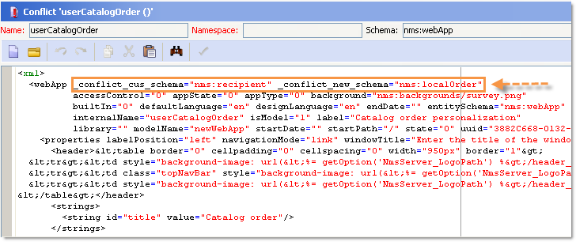
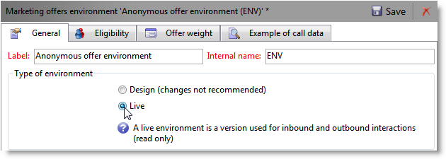

# 일반 구성{#general-configurations}

이 섹션에서는 v5.11 또는 v6.02에서 마이그레이션하는 경우 Adobe Campaign v7에서 수행되는 구성에 대해 자세히 설명합니다.

추가:

* v5.11에서 마이그레이션하는 경우 v5.11의 특정 [구성에 대한 자세한 구성도 완료해야](../../migration/using/specific-configurations-in-v5-11.md) 합니다.
* v6.02에서 마이그레이션하는 경우 v6.02의 특정 [구성에 대한 자세한 구성도 완료해야](../../migration/using/specific-configurations-in-v6-02.md) 합니다.

## 시간대 {#time-zones}

### 시간대 모드 {#multi-time-zone-mode}

v6.02에서 &quot;복수 시간대&quot; 모드는 PostgreSQL 데이터베이스 엔진에만 사용할 수 있었습니다. 이제 데이터베이스 엔진 유형에 상관없이 제공됩니다. 기본 시간대를 &quot;다중 시간대&quot; 기준으로 변경하는 것이 좋습니다.

TIMEZONE을 사용하는 TIMESTAMP 모드를 사용하려면 **-userTimestamptz:1** 옵션을 업그레이드 후 명령줄에 추가해야 합니다.

>[!CAUTION]
>
>호환되지 않는 **데이터베이스 엔진과 함께 -usetimestamptz:1** 매개 변수를 사용하는 경우 데이터베이스가 손상되며 데이터베이스 백업을 복원하고 위의 명령을 다시 실행해야 합니다.

>[!NOTE]
>
>콘솔(**[!UICONTROL Administration > Platform > Options > WdbcTimeZone]** 노드)을 통한 마이그레이션 후 시간대를 변경할 수 있습니다.
>
>시간대 관리에 대한 자세한 내용은 [이 섹션을](../../installation/using/time-zone-management.md)참조하십시오.

### Oracle {#oracle}

업그레이드 후 **ORA 파섹 01805 오류가 발생하면 애플리케이션 서버와 데이터베이스 서버 사이의 Oracle 시간대 파일이 동기화되지 않습니다.** 다시 동기화하려면 다음 단계를 수행하십시오.

1. 사용된 표준 시간대 파일을 식별하려면 다음 명령을 실행하십시오.

   ```
   select * from v$timezone_file
   ```

   표준 시간대 파일은 일반적으로 ORACLE_HOME/ **oracore/zoneinfo/** 폴더에 있습니다.

1. 표준 시간대 파일이 두 서버 모두에서 동일한지 확인합니다.

자세한 내용은 다음을 참조하십시오.https://download.oracle.com/docs/cd/E11882_01/server.112/e10729/ch4datetime.htm [](http://download.oracle.com/docs/cd/E11882_01/server.112/e10729/ch4datetime.htm).

클라이언트와 서버 간의 표준 시간대 맞춤이 잘못되면 일부 시차가 발생할 수 있습니다. 따라서 클라이언트와 서버 측에서 동일한 버전의 Oracle 라이브러리를 사용하는 것이 좋습니다. 두 시간대는 동일해야 합니다.

양쪽이 동일한 시간대에 있는지 확인하려면

1. 다음 명령을 실행하여 클라이언트측에서 시간대 파일의 버전을 확인합니다.

   ```
   genezi -v
   ```

   genezi는 **$ORACLE_HOME/bin** 저장소에서 찾은 바이너리입니다.

1. 다음 명령을 실행하여 서버측에서 시간대 파일의 버전을 확인합니다.

   ```
   select * from v$timezone_file
   ```

1. 클라이언트측에서 시간대 파일을 변경하려면 ORA 파섹 환경 변수를 사용합니다.****

## 보안 {#security}

### 보안 영역 {#security-zones}

>[!CAUTION]
>
>보안상의 이유로 Adobe Campaign 플랫폼에 더 이상 기본적으로 액세스할 수 없습니다.보안 영역을 구성해야 하므로 연산자 IP 주소를 수집해야 합니다.

Adobe Campaign v7에는 **보안 영역의**&#x200B;개념이 포함되어 있습니다. 인스턴스에 로그온하려면 각 사용자가 영역에 연결해야 하며 사용자의 IP 주소가 보안 영역에 정의된 주소 또는 주소 범위에 포함되어야 합니다. 보안 영역 구성은 Adobe Campaign 서버 구성 파일에서 수행할 수 있습니다. 사용자가 연결된 보안 영역은 콘솔(**[!UICONTROL Administration > Access management > Operators]**)에서 정의해야 합니다.

**마이그레이션**&#x200B;전에 네트워크 관리자에게 마이그레이션 후 활성화할 보안 영역을 정의할 수 있도록 도움을 요청하십시오.

**업그레이드** 후(서버를 다시 시작하기 전에) 보안 영역을 구성해야 합니다.

보안 영역 구성이 [이 섹션에](../../installation/using/configuring-campaign-server.md#defining-security-zones)있습니다.

### 사용자 암호 {#user-passwords}

v7에서 **내부** 및 **관리자** 연산자 연결은 암호로 보호되어야 합니다. 마이그레이션 **전에 이러한 계정 및 모든 연산자 계정에 암호를 지정하는 것이 좋습니다**. **내부**&#x200B;암호를 지정하지 않은 경우 연결할 수 없습니다. 암호를 **내부**&#x200B;계정에 할당하려면 다음 명령을 입력합니다.

```
nlserver config -internalpassword
```

>[!CAUTION]
>
>모든 추적 서버에 대해 **내부** 암호가 동일해야 합니다. 자세한 내용은 [이 섹션](../../installation/using/campaign-server-configuration.md#internal-identifier) 및 [이 섹션을](../../platform/using/access-management.md#about-permissions)참조하십시오.

### v7의 새로운 기능 {#new-features-in-v7}

* 권한이 없는 사용자는 더 이상 Adobe Campaign에 연결할 수 없습니다. 예를 들어, **connect**&#x200B;라는 권한을 만들어 권한을 수동으로 추가해야 합니다.

   이 수정으로 영향을 받은 사용자는 업그레이드 후 중에 식별되고 나열됩니다.

* 암호가 비어 있는 경우 추적이 더 이상 작동하지 않습니다. 이러한 경우 오류 메시지가 표시되어 다시 구성할 것을 요청합니다.
* 사용자 암호는 **xtk:sessionInfo 스키마에 더 이상 저장되지** 않습니다.
* 이제 xtk:builder:EvaluateJavaScript 및 **xtk:builder:EvaluateJavaScriptTemplate** 함수를 사용하려면 관리 권한이 **필요합니다** .

기본적으로 특정 기본 스키마는 수정되었으며 **관리** 권한이 있는 연산자에 대한 쓰기 액세스 권한만 사용하여 액세스할 수 있습니다.

* ncm:게시
* nl:모니터링
* nms:일정
* xtk:builder
* xtk:연결
* xtk:dbInit
* xtk:entityBackup새로운 기능
* xtk:entityBackupOriginal
* xtk:entityOriginal
* xtk:양식
* xtk:funcList
* xtk:fusion
* xtk:이미지
* xtk:javascript
* xtk:jssp
* xtk:jst
* xtk:navtree
* xtk:operatorGroup
* xtk:package
* xtk:queryDef
* xtk:resourceMenu
* xtk:rights
* xtk:스키마
* xtk:scriptContext
* xtk:specFile
* xtk:sql
* xtk:sqlSchema
* xtk:srcSchema
* xtk:문자열
* xtk:xslt

### 세션 토큰 매개 변수 {#sessiontoken-parameter}

v5에서 **세션 토큰** 매개 변수는 두 클라이언트측 모두에서 작동했습니다(개요 유형 화면, 링크 편집기 등). 및 서버측(웹 응용 프로그램, 보고서, jsp, jssp 등) v7에서는 서버쪽에서만 작동합니다. v5에서처럼 전체 기능으로 돌아가려면 이 매개 변수를 사용하여 링크를 수정하고 연결 페이지를 통과해야 합니다.

링크 예:

```
/view/recipientOverview?__sessiontoken=<trusted login>
```

연결 페이지를 사용하는 새 링크:

```
/nl/jsp/logon.jsp?login=<trusted login>&action=submit&target=/view/recipientOverview
```

>[!CAUTION]
>
>신뢰할 수 있는 IP 마스크와 연결된 연산자를 사용하는 경우 최소 권한이 있는지, 그리고 sessionTokenOnly **모드의 보안 영역에 있는지 확인하십시오** .

### SQL 함수 {#sql-functions}

알 수 없는 SQL 함수 호출이 더 이상 서버로 자연스럽게 전송되지 않습니다. 현재 모든 SQL 함수를 **xtk:funcList** 스키마에 추가해야 합니다(자세한 내용은 [이 섹션을](../../configuration/using/adding-additional-sql-functions.md)참조하십시오). 마이그레이션할 때 업그레이드 후 업그레이드 시 선언되지 않은 이전 SQL 함수와 호환성을 유지할 수 있는 옵션이 추가됩니다. 이러한 함수를 계속 사용하려면 XtkPassUnknownSQLFunitsToRDBMS **** 옵션이 실제로 **[!UICONTROL Administration > Platform > Options]** 노드 수준에서 정의되어 있는지 확인하십시오.

>[!CAUTION]
>
>보안 위험 때문에 이 옵션을 사용하지 않는 것이 좋습니다.

### JSSP {#jssp}

HTTPS가 아닌 HTTP 프로토콜을 통해 특정 페이지에 대한 액세스를 인증하려는 경우 예를 들어 보안 영역에서 수행되는 구성에 관계없이 웹 앱에서 **httpAllowed=&quot;true&quot;** 매개 변수를 해당 릴레이 규칙에 지정해야 합니다.

익명 JSSP를 사용하는 경우 JSSP( **파일)에 대한 릴레이 규칙에** httpAllowed=&quot;true&quot;**[!UICONTROL serverConf.xml]** 매개 변수를 추가해야 합니다.

예:

```
<url IPMask="" deny="" hostMask="" httpAllowed="true" relayHost="true" relayPath="true"
           status="blacklist" targetUrl="https://localhost:8080" timeout="" urlPath="*/cus/myPublicPage.jssp"/>
```

## 구문 {#syntax}

### JavaScript {#javascript}

Adobe Campaign v7은 최신 JavaScript 인터프리터를 통합합니다. 그러나 이 업데이트는 특정 스크립트가 작동하지 않을 수 있습니다. 이전 엔진이 좀 더 유연했기 때문에, 어떤 구문들은 더 이상 새로운 버전의 엔진에서는 사용할 수 없게 될 것이다.

이제 **[!UICONTROL myObject.@attribute]** 구문은 XML 객체에만 유효합니다. 이 구문은 게재 및 컨텐츠 관리를 개인화하는 데 사용할 수 있습니다. XML이 아닌 개체에서 이 유형의 구문을 사용한 경우 개인화 기능이 더 이상 작동하지 않습니다.

다른 모든 객체 유형의 경우 구문은 이제 **[!UICONTROL myObject`[`&quot;attribute&quot;`]`]**입니다. 예를 들어, 다음 구문을 사용한 비XML 객체입니다.**[!UICONTROL employee.@sn]**이제 다음 구문을 사용해야 합니다.&quot;**[!UICONTROL employee`[`&quot;sn&quot;`]`]**.

* 이전 구문:

   ```
   employee.@sn
   ```

* 새 구문:

   ```
   employee["sn"]
   ```

XML 객체의 값을 변경하려면 XML 노드를 추가하기 전에 값을 업데이트하여 시작해야 합니다.

* 이전 JavaScript 코드:

   ```
   var cellStyle = node.style.copy();
   this.styles.appendChild(cellStyle);
   cellStyle.@width = column.@width;
   ```

* 새 JavaScript 코드:

   ```
   var cellStyle = node.style.copy();
   cellStyle.@width = column.@width;
   this.styles.appendChild(cellStyle);
   ```

더 이상 XML 속성을 표 키로 사용할 수 없습니다.

* 이전 구문:

   ```
   if(serverForm.activities[ctx.activityHistory.activity[0].@name].type !="end")
   ```

* 새 구문:

   ```
   if(serverForm.activities[String(ctx.activityHistory.activity[0].@name)].type !="end"
   ```

### SQLData {#sqldata}

인스턴스 보안을 강화하기 위해 Adobe Campaign v7에서 SQLData 기반 구문을 대체할 새 구문이 도입되었습니다. 이 구문과 함께 이러한 코드 요소를 사용하는 경우 이를 수정해야 합니다. 주요 요소는 다음과 같습니다.

* 하위 쿼리별 필터링:새 구문은 하위 쿼리를 정의하는 `<subQuery>` 요소를 기반으로 합니다
* 집계:새 구문은 &quot;aggregate function(collection)&quot;입니다.
* 가입별 필터링:새 구문은 `[schemaName:alias:xPath]`

queryDef(xtk:queryDef) 스키마가 수정되었습니다.

* SQLData에 포함된 SELECT를 대체할 새 `<subQuery>` 요소를 사용할 수 있습니다.
* @setOperator 속성에 대해 &quot;IN&quot; 및 &quot;NOT IN&quot;이라는 두 개의 새로운 값이 도입되었습니다.
* 요소의 하위 요소인 새 `<where>` `<node>` 요소:이렇게 하면 SELECT에서 &quot;하위 선택&quot;을 만들 수 있습니다.

&quot;@expr&quot; 속성을 사용하는 경우 SQLData가 있을 수 있습니다. 다음 용어 검색을 수행할 수 있습니다.&quot;SQLData&quot;, &quot;aliasSqlTable&quot;, &quot;sql&quot;.

Adobe Campaign v7 인스턴스는 기본적으로 보호됩니다. 보안은 **[!UICONTROL serverConf.xml]** 파일에서 보안 영역의 정의 측면에서 제공됩니다.allowSQLInjection **속성은** SQL 구문 보안을 관리합니다.

업그레이드 후 실행 중에 SQLData 오류가 발생하는 경우 코드를 다시 작성할 수 있도록 SQLData 기반 구문을 일시적으로 사용할 수 있도록 이 속성을 수정해야 합니다. 이렇게 하려면 serverConf.xml **파일에서 다음 옵션을 변경해야 합니다** .

```
allowSQLInjection="true"
```

따라서 다음 명령을 사용하여 사후 업그레이드를 다시 시작합니다.

```
nlserver config -postupgrade -instance:<instance_name> -force
```

보안 영역을 구성(보안 참조) [한](#security)다음 옵션을 변경하여 보안을 다시 활성화해야 합니다.

```
allowSQLInjection="false"
```

아래에서 이전 구문과 새 구문 간의 비교 예를 확인할 수 있습니다.

**하위 쿼리별 필터링**

* 이전 구문:

   ```
   <condition expr="@id NOT IN ([SQLDATA[SELECT iOperatorId FROM XtkOperatorGroup WHERE iGroupId = $(../@owner-id)]])" enabledIf="$(/ignored/@ownerType)=1"/>
   ```

* 새 구문:

   ```
   <condition setOperator="NOT IN" expr="@id" enabledIf="$(/ignored/@ownerType)=1">
     <subQuery schema="xtk:operatorGroup">
        <select>
          <node expr="[@operator-id]" />
        </select>
        <where>
          <condition expr="[@group-id]=$long(../@owner-id)"/>
        </where>
      </subQuery>
   </condition>
   ```

* 이전 구문:

   ```
   <queryFilter name="dupEmail" label="Emails duplicated in the folder" schema="nms:recipient">
       <where>
         <condition sql="sEmail in (select sEmail from nmsRecipient where iFolderId=$(folderId) group by sEmail having count(sEmail)>1)" internalId="1"/>
       </where>
       <folder _operation="none" name="nmsSegment"/>
     </queryFilter>
   ```

* 새 구문:

   ```
   <queryFilter name="dupEmail" label=" Emails duplicated in the folder " schema="nms:recipient">
       <where>
         <condition expr="@email" setOperator="IN" internalId="1">
           <subQuery schema="nms:recipient">
             <select><node expr="@email"/></select>
             <where><condition expr="[@folder-id]=$(folderId)"/></where>
             <groupBy><node expr="@email"/></groupBy>
             <having><condition expr="count(@email)>1"/></having>
           </subQuery>
         </condition>
       </where>
       <folder _operation="none" name="nmsSegment"/>
     </queryFilter>
   ```

**The aggregate**

Aggregate function(collection)

* 이전 구문:

   ```
   <node sql="(select count(*) from NmsNewsgroup WHERE O0.iOperationId=iOperationId)" alias="@nbMessages"/>
   ```

* 새 구문:

   ```
   <node expr="count([newsgroup/@id])" alias="../@nbMessages"/>
   ```

   >[!NOTE]
   >
   >관절은 자동적으로 집계 기능을 위해 이행된다. WHERE O0.iOperationId=iOperationId 조건을 더 이상 지정할 필요가 없습니다.
   >
   >더 이상 &quot;count(*)&quot; 함수를 사용할 수 없습니다. &quot;countall()&quot;을 사용해야 합니다.

* 이전 구문:

   ```
   <node sql="(select Sum(iToDeliver) from NmsDelivery WHERE O0.iOperationId=iOperationId AND iSandboxMode=0 AND iState>=45)" alias="@nbMessages"/>
   ```

* 새 구문:

   ```
   <node expr="Sum([delivery-linkedDelivery/properties/@toDeliver])" alias= "../@sumToDeliver">
                     <where><condition expr="[validation/@sandboxMode]=0 AND @state>=45" /></where></node>
   ```

**연결별 필터**

`[schemaName:alias:xPath]`

별칭은 선택 사항입니다

* 이전 구문:

   ```
   <condition expr={"[" + joinPart.destination.nodePath + "] = [SQLDATA[W." + joinPart.source.SQLName + "]]"}
                                            aliasSqlTable={nodeSchemaRoot.SQLTable + " W"}/>
   ```

* 새 구문:

   ```
   <condition expr={"[" + joinPart.destination.nodePath + "] = [" + nodeSchema.id + ":" + joinPart.source.nodePath + "]]"}/>
   ```

**팁 및 기법**

요소에서 기본 `<subQuery>` `<queryDef>` 요소의 &quot;필드&quot; 필드를 참조하려면 다음 구문을 사용합니다. `[../@field]`

예:

```
<queryDef operation="select" schema="xtk:jobLog" startPath="/" xtkschema="xtk:queryDef">
  <select>
    <node expr="[job/@pid]" alias="@pid"/>
    <node expr="@id" ordered="true"/>
    <node expr="@logType"/>
  </select>
  <where>
    <condition expr="[@job-id]=99"/>
    <condition expr="@logType" setOperator="IN">
      <subQuery schema="xtk:jobLog">
        <select><node expr="@logType"/></select>
        <where><condition expr="[@job-id]=[../job/@id]"/></where>
        <groupBy><node expr="@logType"/></groupBy>
        <having><condition expr="count(@logType)>1"/></having>
      </subQuery>
    </condition>
  </where>
</queryDef>
```

## 충돌 {#conflicts}

마이그레이션은 업그레이드 후를 통해 수행되며 보고서, 양식 또는 웹 애플리케이션에서 충돌이 발생할 수 있습니다. 콘솔에서 이러한 충돌을 해결할 수 있습니다.

리소스 동기화 후 **사후 업그레이드** 명령을 사용하면 동기화가 오류 또는 경고를 생성하는지 감지할 수 있습니다.

### 동기화 결과 보기 {#view-the-synchronization-result}

동기화 결과는 다음 두 가지 방법으로 볼 수 있습니다.

* 명령줄 인터페이스에서 3단계 V형 **>>>** V자식으로 오류가 발생하고 동기화가 자동으로 중지됩니다. 경고는 이중 V형 **>>** 에 의해 구현되며 동기화가 완료되면 해결되어야 합니다. 업그레이드 후 종료 시 명령 프롬프트에 요약이 표시됩니다. 예:

   ```
   2013-04-09 07:48:39.749Z        00002E7A          1     info    log     =========Summary of the update==========
   2013-04-09 07:48:39.749Z        00002E7A          1     info    log     test instance, 6 warning(s) and 0 error(s) during the update.
   2013-04-09 07:48:39.749Z        00002E7A          1     warning log     The document with identifier 'mobileAppDeliveryFeedback' and type 'xtk:report' is in conflict with the new version.
   2013-04-09 07:48:39.749Z        00002E7A          1     warning log     The document with identifier 'opensByUserAgent' and type 'xtk:report' is in conflict with the new version.
   2013-04-09 07:48:39.750Z        00002E7A          1     warning log     The document with identifier 'deliveryValidation' and type 'nms:webApp' is in conflict with the new version.
   2013-04-09 07:48:39.750Z        00002E7A          1     warning log     Document of identifier 'nms:includeView' and type 'xtk:srcSchema' updated in the database and found in the file system. You will have to merge the two versions manually.
   ```

   경고에서 리소스가 충돌할 경우 이를 해결하려면 운영자 주의가 필요합니다.

* postupgrade **.log`<server version number>`파일의 post_upgrade_`>`** _time에는 동기화 결과가 들어 있습니다. 다음 디렉토리에서 기본적으로 사용할 수 있습니다. **설치 디렉토리/var/`<instance>`postupgrade**. 오류 및 경고는 **오류** 및 **경고** 특성으로 표시됩니다.

### 충돌 해결 {#resolve-a-conflict}

충돌 해결은 고급 연산자와 &#39;관리자&#39; 권한이 부여된 연산자만 수행해야 합니다.

충돌을 해결하려면 다음 프로세스를 적용합니다.

1. Adobe Campaign 트리 구조에서 커서를 위에 **[!UICONTROL Administration > Configuration > Package management > Edit conflicts]**&#x200B;놓습니다.
1. 목록에서 해결할 충돌을 선택합니다.

충돌을 해결하는 방법에는 세 가지가 있습니다.

* **[!UICONTROL Declared as resolved]**:사전에 연산자 개입이 필요합니다.
* **[!UICONTROL Accept the new version]**:사용자가 Adobe Campaign과 함께 제공된 리소스를 변경하지 않은 경우 권장합니다.
* **[!UICONTROL Keep the current version]**:은 업데이트가 거부됨을 의미합니다.

   >[!CAUTION]
   이 해상도 모드를 선택하면 새 버전에서 패치가 손실될 위험이 있습니다. 따라서 이 옵션은 전문가 연산자만 사용하거나 예약하지 않는 것이 좋습니다.

충돌을 수동으로 해결하도록 선택한 경우 다음과 같이 진행하십시오.

1. 창의 하단 섹션에서 를 검색하여 충돌이 있는 엔티티를 **`_conflict_ string`** 찾습니다. 새 버전과 함께 설치되는 엔티티에는 **new** 인수가 포함되어 있으며, 이전 버전과 일치하는 엔티티에는 **cus** 인수가 포함되어 있습니다.

   

1. 보관하지 않을 버전을 삭제합니다. 보관하고 **`_conflict_argument_ string`** 있는 엔티티의 항목을 삭제합니다.

   

1. 해결할 충돌로 이동합니다. 아이콘을 **[!UICONTROL Actions]** 클릭하고 **[!UICONTROL Declare as resolved]**&#x200B;선택합니다.
1. 변경 내용 저장:이제 충돌이 해결되었습니다.

## Tomcat {#tomcat}

Adobe Campaign v7의 통합 Tomcat 서버가 버전을 변경했습니다(Tomcat 7). 따라서 설치 폴더(tomcat-6)도 변경되었습니다(tomcat 7). 업그레이드 후 경로가 업데이트된 폴더에 연결되어 있는지 확인하십시오( **[!UICONTROL serverConf.xml]** 파일에서).

```
$(XTK_INSTALL_DIR)/tomcat-7/bin/bootstrap.jar 
$(XTK_INSTALL_DIR)/tomcat-7/bin/tomcat-juli.jar
$(XTK_INSTALL_DIR)/tomcat-7/lib/tomcat-util.jar
$(XTK_INSTALL_DIR)/tomcat-7/lib/tomcat-api.jar
$(XTK_INSTALL_DIR)/tomcat-7/lib/servlet-api.jar
$(XTK_INSTALL_DIR)/tomcat-7/lib/jsp-api.jar
$(XTK_INSTALL_DIR)/tomcat-7/lib/el-api.jar
```

## 인터랙션 {#interaction}

### 사전 요구 사항 {#prerequisites}

**업그레이드**&#x200B;후 전에 v7에 더 이상 존재하지 않는 모든 스키마 참조를 6.02에서 삭제해야 합니다.

* nms:emailOfferView
* nms:webOfferView
* nms:callCenterOfferView
* nms:mobileOfferView
* nms:paperOfferView

### 오퍼 컨텐츠 {#offer-content}

v7에서 오퍼 컨텐츠가 이동되었습니다. v6.02에서 컨텐츠는 각 표현 스키마에 있었습니다(**nms:emailOfferView**). v7에서 컨텐츠는 이제 오퍼 스키마에 있습니다. 업그레이드 후 콘텐츠가 인터페이스에 표시되지 않으므로 업그레이드 후 오퍼 컨텐츠를 다시 만들거나 컨텐츠를 표현 스키마에서 오퍼 스키마로 자동으로 이동하는 스크립트를 개발해야 합니다.

>[!CAUTION]
구성된 오퍼를 사용하는 일부 배달이 마이그레이션 후 전송되도록 한 경우, v7에서 이러한 모든 제공을 삭제하고 다시 생성해야 합니다. 이렇게 할 수 없는 경우 &quot;호환성 모드&quot;가 제공됩니다. 이 모드는 Interaction v7의 모든 새로운 기능을 사용하지 않으므로 권장되지 않습니다. 이것은 실제 6.1 마이그레이션 전에 진행 중인 캠페인을 완료할 수 있는 전환 모드입니다. 이 모드에 대한 자세한 내용은 Adobe에 문의하십시오.

이동 스크립트(interactionTo610_**full_XX.js**)의 예는 Adobe Campaign v7 폴더 **내의 마이그레이션** 폴더에서 사용할 수 있습니다. 이 파일은 오퍼당 하나의 이메일 표현을 사용하는 클라이언트에 대한 스크립트( **[!UICONTROL htmlSource]** 및 **[!UICONTROL textSource]** 필드)의 예를 보여줍니다. NmsEmailOfferView **테이블에 있던** 컨텐츠가 오퍼 테이블로 이동되었습니다.

>[!NOTE]
이 스크립트를 사용하면 &quot;컨텐츠 관리&quot; 및 &quot;렌더링 함수&quot; 옵션을 사용할 수 없습니다. 이러한 기능을 활용하려면 카탈로그 제안, 특히 오퍼 컨텐츠 및 구성 공간을 재고해야 합니다.

```
loadLibrary("/nl/core/shared/nl.js");

NL.require("/nl/core/shared/xtk.js");

// 1. Restore old emailOfferView schema
logInfo("Restoring old emailOfferView schema");
var oldOfferViewSchemas = <entities schema="xtk:srcSchema"/>;

oldOfferViewSchemas.appendChild(
  <srcSchema img="nms:offerView.png"
             label="Email offer representations"
             labelSingular="Email offer representation"
             name="emailOfferView" namespace="nlmig"
             genAccessors="false" implements="xtk:persist">
    <element name="emailOfferView" template="nms:offerView" sqltable="NmsEmailOfferView">
      <element name="offer" revLabel="Email representation" revIntegrity="owncopy"/>
      <element   name="htmlSource"      type="html" label="HTML content"  xml="true"/>
      <element   name="textSource"      type="CDATA" label="Text content" xml="true"/>
      <element   name="htmlSource_jst"  type="CDATA" label="HTML script"  desc="HTML content calculation script."  xml="true" advanced="true"/>
      <element   name="textSource_jst"  type="CDATA" label="Text script" desc="Text content calculation script." xml="true" advanced="true"/>
    </element>
  </srcSchema>);

var oldOfferViewsPkg = <builder><package buildNumber="*">{oldOfferViewSchemas}</package></builder>;
xtk.builder.InstallPackage(oldOfferViewsPkg);

// 2. Migrate data from old emailOfferView table to nms:offer
logInfo("Moving data from old EmailOfferView table to NmsOffer");
var OFFER_STATUS_VALIDATED = 3;

var queryDef = xtk.queryDef.create(
  <queryDef operation="select" schema="nlmig:emailOfferView">
    <select>
      <node expr="[@offer-id]"/>
      <node expr="[@space-id]"/>
      <node expr="htmlSource_jst"/>
      <node expr="textSource_jst"/>
    </select>
  </queryDef>);
var res = queryDef.ExecuteQuery();

var processedOffers = {};
for each( var emailOfferView in res.emailOfferView )
{
  if( processedOffers[String(emailOfferView.@["offer-id"])] != undefined )
  {
    logWarning("Found 2 or more eff fffffmail representations for offer " + String(emailOfferView.@["offer-id"]) + ". Only keep the first one here.");
    continue;
  }
  xtk.session.Write(
    <offer id={emailOfferView.@["offer-id"]} status={OFFER_STATUS_VALIDATED} xtkschema="nms:offer">
      <view>
        {emailOfferView.mdSource_jst}
        {emailOfferView.textSource_jst}
      </view>
    </offer>
  );
  processedOffers[String(emailOfferView.@["offer-id"])] = 1;
}

// 3. Get rid of emailOfferView schema now that data has been moved.
logInfo("Deleting EmailOfferView schema");
xtk.session.Write(<srcSchema xtkschema="xtk:srcSchema" name="emailOfferView" namespace="nlmig" _operation="delete"/>);

logInfo("Done");
```

### 테스트 및 구성 {#tests-and-configuration}

하나의 환경만 있는 경우 오퍼 컨텐츠를 이동한 후 따라야 할 절차입니다. 이 경우 &quot;ENV&quot;를 예로 들어보겠습니다.

1. 모든 &quot;ENV&quot; 환경에서 사용 중인 필드 목록을 업데이트합니다. 예를 들어 오퍼만 사용하는 오퍼 공간의 경우 **[!UICONTROL htmlSource]**&#x200B;를 추가해야 합니다 **[!UICONTROL view/htmlSource]**.

   

1. 탭 **[!UICONTROL Type of Environment]** 내의 **[!UICONTROL General]** 필드에서 을 선택합니다 **[!UICONTROL Live]**.

   

1. 디자인 환경(&quot;ENV_DESIGN&quot; 등)을 만들어 ENV 온라인 환경에 연결합니다.

   

1. 모든 &quot;ENV&quot; 환경 오퍼 공간을 배포하고(오른쪽 클릭 > **[!UICONTROL Actions > Deploy]**) &quot;ENV_DESIGN&quot; 환경을 선택합니다.

   

1. 모든 &quot;ENV&quot; 환경 오퍼에 대해서도 동일하게 하십시오.
1. 관련 채널에서 모든 환경 제공 &quot;ENV_DESIGN&quot;을 활성화합니다.
1. 효과적인 오퍼 제작 테스트 문제가 발생하지 않는 경우 최신 워크플로우 작업(offerMgt)에서 보류 중인 작업을 실행하여 **[!UICONTROL Offer notification]** 모든 오퍼를 라이브로 만드십시오.

   

1. 포괄적인 테스트를 수행합니다.

   >[!NOTE]
   온라인상에서 제공되는 카테고리 및 오퍼의 이름은 라이브한 후 수정됩니다. 들어오는 채널에서 오퍼와 카테고리에 대한 모든 참조를 업데이트합니다.

## 보고서 {#reports}

### 표준 보고서 {#standard-reports}

모든 표준 보고서는 현재 렌더링 엔진 v6.x를 사용합니다.이러한 보고서에 JavaScript를 추가한 경우 특정 요소가 더 이상 작동하지 않을 수 있습니다. 실제로 이전 버전의 JavaScript는 v6.x 렌더링 엔진과 호환되지 않습니다. 따라서 JavaScript 코드를 확인하고 나중에 수정해야 합니다. 모든 보고서, 특히 내보내기 기능을 테스트해야 합니다.

### 맞춤형 보고서 {#personalized-reports}

v7의 파란색 배너를 사용하고(우주에 액세스할 수 있도록 허용) 싶으면 보고서를 다시 게시해야 합니다. 문제가 발생하면 v6.0 렌더링 엔진을 강제 적용할 수 있습니다. 이렇게 하려면 보고서 **[!UICONTROL Properties]** 내에서 **[!UICONTROL Rendering]** 을 클릭하고 **[!UICONTROL Version 6.0 (Flash & OpenOffice)]** 렌더링 엔진을 선택합니다.


새로운 보고서 기능을 활용하려면 v.6.x 렌더링 엔진을 선택해야 합니다. 이 경우 모든 스크립트를 확인하고 필요한 경우 변경합니다. PDF 내보내기와 관련하여 OpenOffice용 특정 스크립트를 추가한 경우 새로운 PDF 내보내기 엔진(PhantomJS)에서 더 이상 작동하지 않습니다.

## 웹 애플리케이션 {#web-applications}

두 개의 웹 애플리케이션 제품군이 있습니다.

* 식별된 웹 애플리케이션(함께 보기, 승인 양식, 외부 내부 개발)
* 익명의 웹 애플리케이션(웹 또는 설문지 양식)

### 식별된 웹 애플리케이션 {#identified-web-applications}

보고서의 경우와 마찬가지로(보고서 [참조](#reports)), JavaScript를 추가한 경우 필요한 경우 확인하고 수정해야 합니다. v7 파란색 배너(유니버스 포함)를 받으려면 웹 애플리케이션을 다시 게시해야 합니다. JavaScript 코드가 작동하면 v6.x 렌더링 엔진을 선택할 수 있습니다. 그렇지 않은 경우 코드를 조정하는 동안 v6.0 렌더링 엔진을 사용한 다음 v6.x 렌더링 엔진을 사용할 수 있습니다.

>[!NOTE]
렌더링 엔진을 선택하는 단계는 보고서를 선택하는 단계와 동일합니다. 개인화된 [보고서를](#personalized-reports)참조하십시오.

v7에서 웹 응용 프로그램 연결 방법이 변경되었습니다. 식별된 웹 애플리케이션에서 연결 문제가 발생하면 serverConf.xml **파일에서** allowUserPassword **및** sessionTokenOnly **옵션을 임시로** 활성화해야합니다. 업그레이드 후 다음 옵션 값을 수정합니다.

```
allowUserPassword="true"
```

```
sessionTokenOnly="true"
```

따라서 다음 명령을 사용하여 사후 업그레이드를 다시 시작합니다.

```
nlserver config -postupgrade -instance:<instance_name> -force
```

웹 애플리케이션을 게시하기 전에 v6.x 렌더링 엔진에서 테스트할 수 있습니다. 그런 다음 이 두 옵션을 비활성화합니다.

```
allowUserPassword="false"
```

```
sessionTokenOnly="false"
```

### 익명의 웹 애플리케이션 {#anonymous-web-applications}

문제가 발생하면 웹 애플리케이션을 다시 게시합니다. 문제가 계속되면 v6.0 렌더링 엔진을 선택할 수 있습니다. JavaScript를 추가하지 않은 경우 v6.x 렌더링 엔진을 선택하고 새로운 기능을 활용할 수 있습니다.

>[!NOTE]
렌더링 엔진을 선택하는 단계는 보고서를 선택하는 단계와 동일합니다. 개인화된 [보고서를](#personalized-reports)참조하십시오.

## Red-Hat {#red-hat}

v6.02 또는 v5.11에서 기본 스키마를 삭제한 경우 업그레이드 후 스키마를 더 이상 편집할 수 없습니다. 이 경우 다음 명령을 실행합니다.

```
su - neolane
nlserver config -postupgrade -instance:<instance name> -force
```
