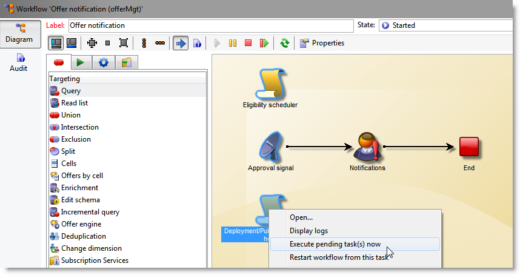

# 일반 구성{#general-configurations}


이 섹션에서는 v5.11 또는 v6.02에서 마이그레이션할 때 Adobe Campaign v7에서 수행해야 하는 구성에 대해 자세히 설명합니다.

또한

* v5.11에서 마이그레이션하는 경우에 설명된 구성도 완료해야 합니다. [이 섹션](../../migration/using/configuring-your-platform.md#specific-configurations-in-v5-11).
* v6.02에서 마이그레이션하는 경우에 설명된 구성도 완료해야 합니다. [이 섹션](../../migration/using/configuring-your-platform.md#specific-configurations-in-v6-02).

## 시간대 {#time-zones}

### 다중 시간대 모드 {#multi-time-zone-mode}

v6.02에서 &quot;다중 시간대&quot; 모드는 PostgreSQL 데이터베이스 엔진에만 사용할 수 있습니다. 이제 어떤 유형의 데이터베이스 엔진을 사용하든 관계없이 제공됩니다. 기준을 &quot;다중 시간대&quot; 기준으로 변환하는 것이 좋습니다.

TIMESTAMP WITH TIMEZONE 모드를 사용하려면 **-userTimestamptz:1** 업그레이드 후 명령줄에 옵션을 추가합니다.

>[!IMPORTANT]
>
>다음과 같은 경우 **-usetimestamptz:1** 매개 변수가 호환되지 않는 데이터베이스 엔진과 함께 사용되면 데이터베이스가 손상되므로 데이터베이스의 백업을 복원하고 위의 명령을 다시 실행해야 합니다.

>[!NOTE]
>
>콘솔을 통해 마이그레이션 후 시간대를 변경할 수 있습니다(**[!UICONTROL Administration > Platform > Options > WdbcTimeZone]** node).
>
>표준 시간대 관리에 대한 자세한 내용은 다음을 참조하십시오. [이 섹션](../../installation/using/time-zone-management.md).

### Oracle {#oracle}

If you get an **오라 01805** 업그레이드 후 오류가 발생했습니다. 즉, 응용 프로그램 서버와 데이터베이스 서버 사이의 Oracle 시간대 파일이 동기화되지 않습니다. 다시 동기화하려면 다음 단계를 적용합니다.

1. 사용된 시간대 파일을 식별하려면 다음 명령을 실행합니다.

   ```
   select * from v$timezone_file
   ```

   시간대 파일은 일반적으로 **ORACLE_HOME/oracore/zoneinfo/** 폴더를 삭제합니다.

1. 표준 시간대 파일이 두 서버에서 동일한지 확인합니다.

자세한 내용은 다음을 참조하십시오. [https://docs.oracle.com/cd/E11882_01/server.112/e10729/ch4datetime.htm#NLSPG004](https://docs.oracle.com/cd/E11882_01/server.112/e10729/ch4datetime.htm#NLSPG004).

클라이언트와 서버 간 시간대가 잘못 정렬되면 일부 지연도 발생할 수 있습니다. 따라서 클라이언트와 서버측에서 동일한 버전의 Oracle 라이브러리를 사용하는 것이 좋습니다. 두 시간대는 동일해야 합니다.

양쪽이 동일한 시간대에 있는지 확인하려면 다음을 수행합니다.

1. 다음 명령을 실행하여 클라이언트측에서 시간대 파일의 버전을 확인합니다.

   ```
   genezi -v
   ```

   genezi는에서 발견된 이성분입니다. **$ORACLE_HOME/bin** 리포지토리.

1. 다음 명령을 실행하여 서버측에서 시간대 파일의 버전을 확인합니다.

   ```
   select * from v$timezone_file
   ```

1. 클라이언트측에서 시간대 파일을 변경하려면 **ORA_TZFILE** 환경 변수입니다.

## 보안 {#security}

### 보안 영역 {#security-zones}

>[!IMPORTANT]
>
>보안상의 이유로 Adobe Campaign 플랫폼에서는 더 이상 기본적으로 액세스할 수 없습니다. 보안 영역을 구성해야 운영자 IP 주소를 수집해야 합니다.

Adobe Campaign v7에는 다음과 같은 개념이 포함됩니다. **보안 영역**. 인스턴스에 로그온하려면 각 사용자가 영역과 연결되어 있어야 하며 사용자의 IP 주소는 보안 영역에 정의된 주소 또는 주소 범위에 포함되어야 합니다. Adobe Campaign 서버 구성 파일에서 보안 영역을 구성할 수 있습니다. 사용자가 연결되는 보안 영역은 콘솔에서 정의되어야 합니다(**[!UICONTROL Administration > Access management > Operators]**).

**마이그레이션 전**&#x200B;마이그레이션 후 활성화할 보안 영역을 정의하는 데 도움이 되도록 네트워크 관리자에게 문의하십시오.

**업그레이드 후** 서버를 다시 시작하기 전에 보안 영역을 구성해야 합니다.

보안 영역 구성은에서 찾을 수 있습니다. [이 섹션](../../installation/using/security-zones.md).

### 사용자 암호 {#user-passwords}

v7에서, **내부** 및 **admin** 운영자 연결은 암호로 보호되어야 합니다. 이러한 계정 및 모든 운영자 계정에 암호를 할당하는 것이 좋습니다. **마이그레이션 전**. 에 대한 암호를 지정하지 않은 경우 **내부**&#x200B;을 클릭하여 연결할 수 없습니다. 암호를 할당하려면 **내부**&#x200B;를 클릭하고 다음 명령을 입력합니다.

```
nlserver config -internalpassword
```

>[!IMPORTANT]
>
>다음 **내부** 모든 추적 서버에 대해 암호가 동일해야 합니다. 자세한 내용은 다음을 참조하십시오. [이 섹션](../../installation/using/configuring-campaign-server.md#internal-identifier) 및 [이 섹션](../../platform/using/access-management.md).

### v7의 새로운 기능 {#new-features-in-v7}

* 권한이 없는 사용자는 더 이상 Adobe Campaign에 연결할 수 없습니다. 이러한 권한은 수동으로 추가해야 합니다. 예를 들어, 라는 권한을 만들 수 있습니다. **연결**.

  이 수정 사항의 영향을 받는 사용자는 업그레이드 후 식별 및 나열됩니다.

* 암호가 비어 있으면 추적이 더 이상 작동하지 않습니다. 이 경우 오류 메시지가 표시되어 재구성을 요청합니다.
* 사용자 암호는 더 이상 **xtk:sessionInfo** 스키마.
* 이제 를 사용하려면 관리 권한이 필요합니다 **xtk:builder:EvaluateJavaScript** 및 **xtk:builder:EvaluateJavaScriptTemplate** 함수.

특정 기본 스키마가 수정되었으며 이제 를 사용하는 연산자에 대한 쓰기 권한으로만 기본적으로 액세스할 수 있습니다. **admin** 권한:

* ncm:게시
* nl:monitoring
* nms:calendar
* xtk:builder
* xtk:connections
* xtk:dbInit
* xtk:entityBackupNew
* xtk:entityBackupOriginal
* xtk:entityOriginal
* xtk:form
* xtk:funcList
* xtk:fusion
* xtk:image
* xtk:javascript
* xtk:jssp
* xtk:jst
* xtk:navtree
* xtk:operatorGroup
* xtk:package
* xtk:queryDef
* xtk:resourceMenu
* xtk:rights
* xtk:schema
* xtk:scriptContext
* xtk:specFile
* xtk:sql
* xtk:sqlSchema
* xtk:srcSchema
* xtk:strings
* xtk:xslt

### 세션 토큰 매개 변수 {#sessiontoken-parameter}

v5에서 **sessiontoken** 양쪽 클라이언트 측에서 작동하는 매개 변수(개요 유형 화면, 링크 편집기 등의 목록) 및 서버측(웹 애플리케이션, 보고서, jsp, jssp 등). v7에서는 서버측에서만 작동합니다. v5에서처럼 전체 기능으로 돌아가려면 이 매개 변수를 사용하여 링크를 수정하고 연결 페이지를 통해 전달해야 합니다.

링크 예:

```
/view/recipientOverview?__sessiontoken=<trusted login>
```

연결 페이지를 사용하는 새 링크:

```
/nl/jsp/logon.jsp?login=<trusted login>&action=submit&target=/view/recipientOverview
```

>[!IMPORTANT]
>
>신뢰할 수 있는 IP 마스크와 연결된 연산자를 사용하는 경우 최소 권한이 있는지, 의 보안 영역에 있는지 확인합니다. **sessionTokenonly** 모드.

### SQL 함수 {#sql-functions}

알 수 없는 SQL 함수 호출이 더 이상 서버로 자연히 전송되지 않습니다. 현재 모든 SQL 함수는 **xtk:funcList** 스키마(자세한 내용은 [이 섹션](../../configuration/using/adding-additional-sql-functions.md)). 마이그레이션할 때 업그레이드 후 선언되지 않은 이전 SQL 함수와의 호환성을 유지할 수 있는 옵션이 추가됩니다. 이 함수를 계속 사용하려면 다음을 확인하십시오. **XtkPassUnknownSQLFunactionsToRDBMS** 옵션은 실제로 **[!UICONTROL Administration > Platform > Options]** 노드 수준.

>[!IMPORTANT]
>
>이 옵션을 사용하면 보안 위험이 따르므로 사용하지 않는 것이 좋습니다.

### JSSP {#jssp}

예를 들어 보안 영역에서 수행되는 구성과 관계없이 웹 앱에서 HTTP 프로토콜(HTTPS가 아님)을 통해 특정 페이지에 대한 액세스를 승인하려면 다음을 지정해야 합니다. **httpAllowed=&quot;true&quot;** 해당 릴레이 규칙의 매개 변수.

익명 JSSP를 사용하는 경우 **httpAllowed=&quot;true&quot;** jssp에 대한 릴레이 규칙의 매개 변수(**[!UICONTROL serverConf.xml]** file):

예제:

```
<url IPMask="" deny="" hostMask="" httpAllowed="true" relayHost="true" relayPath="true"
           status="blacklist" targetUrl="https://localhost:8080" timeout="" urlPath="*/cus/myPublicPage.jssp"/>
```

## 구문 {#syntax}

### JavaScript {#javascript}

Adobe Campaign v7에는 최신 JavaScript 인터프리터가 통합되어 있습니다. 그러나 이 업데이트로 인해 특정 스크립트가 제대로 작동하지 않을 수 있습니다. 이전 엔진이 더 허용적이었기 때문에 특정 구문은 더 이상 엔진의 새 버전에 해당되지 않습니다.

다음 **[!UICONTROL myObject.@attribute]** 구문은 이제 XML 개체에만 사용할 수 있습니다. 이 구문은 게재 및 콘텐츠 관리를 개인화하는 데 사용할 수 있습니다. XML이 아닌 개체에서 이 유형의 구문을 사용한 경우 개인화 기능이 더 이상 작동하지 않습니다.

다른 모든 객체 유형의 경우 구문은 다음과 같습니다 **[!UICONTROL myObject`[`&quot;attribute&quot;`]`]**. 예를 들어 다음 구문을 사용한 비 XML 객체: **[!UICONTROL employee.@sn]**&#x200B;는 이제 다음 구문을 사용해야 합니다. **[!UICONTROL employee`[`&quot;sn&quot;`]`]**.

* 이전 구문:

  ```
  employee.@sn
  ```

* 새 구문:

  ```
  employee["sn"]
  ```

XML 객체의 값을 변경하려면 XML 노드를 추가하기 전에 값을 업데이트하여 시작해야 합니다.

* 이전 JavaScript 코드:

  ```
  var cellStyle = node.style.copy();
  this.styles.appendChild(cellStyle);
  cellStyle.@width = column.@width;
  ```

* 새 JavaScript 코드:

  ```
  var cellStyle = node.style.copy();
  cellStyle.@width = column.@width;
  this.styles.appendChild(cellStyle);
  ```

더 이상 XML 특성을 테이블 키로 사용할 수 없습니다.

* 이전 구문:

  ```
  if(serverForm.activities[ctx.activityHistory.activity[0].@name].type !="end")
  ```

* 새 구문:

  ```
  if(serverForm.activities[String(ctx.activityHistory.activity[0].@name)].type !="end"
  ```

### SQLData {#sqldata}

인스턴스 보안을 강화하기 위해 Adobe Campaign v7에 SQLData 기반 구문을 대체하는 새로운 구문이 도입되었습니다. 이러한 코드 요소를 이 구문과 함께 사용하는 경우 해당 요소를 수정해야 합니다. 관련된 주요 요소는 다음과 같습니다.

* 하위 쿼리별 필터링: 새 구문은 `<subQuery>`  하위 쿼리를 정의하는 요소
* 합계: 새 구문은 &quot;aggregate function(collection)&quot;입니다.
* 조인으로 필터링: 새 구문은 다음과 같습니다. `[schemaName:alias:xPath]`

queryDef(xtk:queryDef) 스키마가 수정되었습니다.

* 새 항목 `<subQuery>`  요소는 SQLData에 포함된 SELECT를 대체할 수 있습니다.
* 두 개의 새 값 &quot;IN&quot; 및 &quot;NOT IN&quot;이 @setOperator 속성에 도입됩니다
* 새 항목 `<where>`  요소: 의 자식 `<node>` 요소: SELECT에서 &quot;하위 선택&quot;을 수행할 수 있습니다.

&quot;@expr&quot; 속성을 사용하면 SQLData가 있을 수 있습니다. &quot;SQLData&quot;, &quot;aliasSqlTable&quot;, &quot;sql&quot; 검색어를 수행할 수 있습니다.

Adobe Campaign v7 인스턴스는 기본적으로 보호됩니다. 보안은 의 보안 영역에 대한 정의와 관련하여 제공됩니다. **[!UICONTROL serverConf.xml]** 파일: **allowSQLInjection** 속성은 SQL 구문 보안을 관리합니다.

업그레이드 후 실행 중에 SQLData 오류가 발생하면 일시적으로 SQLData 기반 구문을 사용할 수 있도록 이 속성을 수정하여 코드를 다시 작성할 수 있습니다. 이렇게 하려면 다음에서 옵션을 변경해야 합니다. **serverConf.xml** 파일:

```
allowSQLInjection="true"
```

따라서 다음 명령을 사용하여 업그레이드 후 를 다시 시작합니다.

```
nlserver config -postupgrade -instance:<instance_name> -force
```

보안 영역을 구성해야 합니다( 참조). [보안](#security))를 클릭한 다음 옵션을 변경하여 보안을 다시 활성화합니다.

```
allowSQLInjection="false"
```

아래에서는 이전 구문과 새 구문의 비교 예를 찾을 수 있습니다.

**하위 쿼리별 필터링**

* 이전 구문:

  ```
  <condition expr="@id NOT IN ([SQLDATA[SELECT iOperatorId FROM XtkOperatorGroup WHERE iGroupId = $(../@owner-id)]])" enabledIf="$(/ignored/@ownerType)=1"/>
  ```

* 새 구문:

  ```
  <condition setOperator="NOT IN" expr="@id" enabledIf="$(/ignored/@ownerType)=1">
    <subQuery schema="xtk:operatorGroup">
       <select>
         <node expr="[@operator-id]" />
       </select>
       <where>
         <condition expr="[@group-id]=$long(../@owner-id)"/>
       </where>
     </subQuery>
  </condition>
  ```

* 이전 구문:

  ```
  <queryFilter name="dupEmail" label="Emails duplicated in the folder" schema="nms:recipient">
      <where>
        <condition sql="sEmail in (select sEmail from nmsRecipient where iFolderId=$(folderId) group by sEmail having count(sEmail)>1)" internalId="1"/>
      </where>
      <folder _operation="none" name="nmsSegment"/>
    </queryFilter>
  ```

* 새 구문:

  ```
  <queryFilter name="dupEmail" label=" Emails duplicated in the folder " schema="nms:recipient">
      <where>
        <condition expr="@email" setOperator="IN" internalId="1">
          <subQuery schema="nms:recipient">
            <select><node expr="@email"/></select>
            <where><condition expr="[@folder-id]=$(folderId)"/></where>
            <groupBy><node expr="@email"/></groupBy>
            <having><condition expr="count(@email)>1"/></having>
          </subQuery>
        </condition>
      </where>
      <folder _operation="none" name="nmsSegment"/>
    </queryFilter>
  ```

**집계**

Aggregate 함수(입력)

* 이전 구문:

  ```
  <node sql="(select count(*) from NmsNewsgroup WHERE O0.iOperationId=iOperationId)" alias="@nbMessages"/>
  ```

* 새 구문:

  ```
  <node expr="count([newsgroup/@id])" alias="../@nbMessages"/>
  ```

  >[!NOTE]
  >
  >합계 함수에 대해 조인트가 자동으로 수행됩니다. WHERE O0.iOperationId=iOperationId 조건을 더 이상 지정할 필요가 없습니다.
  >
  >더 이상 &quot;count(&#42;)&quot; 함수를 참조하십시오. &quot;countall()&quot;을 사용해야 합니다.

* 이전 구문:

  ```
  <node sql="(select Sum(iToDeliver) from NmsDelivery WHERE O0.iOperationId=iOperationId AND iSandboxMode=0 AND iState>=45)" alias="@nbMessages"/>
  ```

* 새 구문:

  ```
  <node expr="Sum([delivery-linkedDelivery/properties/@toDeliver])" alias= "../@sumToDeliver">
                    <where><condition expr="[validation/@sandboxMode]=0 AND @state>=45" /></where></node>
  ```

**조인을 통한 필터**

`[schemaName:alias:xPath]`

별칭은 선택 사항입니다.

* 이전 구문:

  ```
  <condition expr={"[" + joinPart.destination.nodePath + "] = [SQLDATA[W." + joinPart.source.SQLName + "]]"}
                                           aliasSqlTable={nodeSchemaRoot.SQLTable + " W"}/>
  ```

* 새 구문:

  ```
  <condition expr={"[" + joinPart.destination.nodePath + "] = [" + nodeSchema.id + ":" + joinPart.source.nodePath + "]]"}/>
  ```

**팁과 트릭**

다음 기간 `<subQuery>` 요소, 기본 항목의 &quot;필드&quot; 필드 참조 `<queryDef>`   요소를 사용하려면 다음 구문을 사용합니다. `[../@field]`

예제:

```
<queryDef operation="select" schema="xtk:jobLog" startPath="/" xtkschema="xtk:queryDef">
  <select>
    <node expr="[job/@pid]" alias="@pid"/>
    <node expr="@id" ordered="true"/>
    <node expr="@logType"/>
  </select>
  <where>
    <condition expr="[@job-id]=99"/>
    <condition expr="@logType" setOperator="IN">
      <subQuery schema="xtk:jobLog">
        <select><node expr="@logType"/></select>
        <where><condition expr="[@job-id]=[../job/@id]"/></where>
        <groupBy><node expr="@logType"/></groupBy>
        <having><condition expr="count(@logType)>1"/></having>
      </subQuery>
    </condition>
  </where>
</queryDef>
```

## 충돌 {#conflicts}

마이그레이션은 업그레이드 후 수행되며 보고서, 양식 또는 웹 애플리케이션에 충돌이 표시될 수 있습니다. 이러한 충돌은 콘솔에서 해결할 수 있습니다.

리소스 동기화 후 **업그레이드 후** 명령을 사용하면 동기화에서 오류 또는 경고가 생성되는지 감지할 수 있습니다.

### 동기화 결과 보기 {#view-the-synchronization-result}

동기화 결과는 다음 두 가지 방법으로 볼 수 있습니다.

* 명령줄 인터페이스에서는 트리플 V자형 V자형 V자형 V자형으로 오류가 나타납니다 **>>>** 동기화가 자동으로 중지됩니다. 경고는 이중 V자형 화살표로 표시됩니다 **>>** 동기화가 완료되면 및 을(를) 해결해야 합니다. 업그레이드 후 요약이 명령 프롬프트에 표시됩니다. 예제:

  ```
  2013-04-09 07:48:39.749Z        00002E7A          1     info    log     =========Summary of the update==========
  2013-04-09 07:48:39.749Z        00002E7A          1     info    log     test instance, 6 warning(s) and 0 error(s) during the update.
  2013-04-09 07:48:39.749Z        00002E7A          1     warning log     The document with identifier 'mobileAppDeliveryFeedback' and type 'xtk:report' is in conflict with the new version.
  2013-04-09 07:48:39.749Z        00002E7A          1     warning log     The document with identifier 'opensByUserAgent' and type 'xtk:report' is in conflict with the new version.
  2013-04-09 07:48:39.750Z        00002E7A          1     warning log     The document with identifier 'deliveryValidation' and type 'nms:webApp' is in conflict with the new version.
  2013-04-09 07:48:39.750Z        00002E7A          1     warning log     Document of identifier 'nms:includeView' and type 'xtk:srcSchema' updated in the database and found in the file system. You will have to merge the two versions manually.
  ```

  경고가 리소스 충돌과 관련된 경우 이를 해결하기 위해 운영자의 주의가 필요합니다.

* 다음 **업그레이드 후_`<server version number>`업그레이드 후 시간(_t)`>`.log** 파일에 동기화 결과가 포함되어 있습니다. 기본적으로 다음 디렉터리에서 사용할 수 있습니다. **설치 디렉토리/var/`<instance>`업그레이드 후**. 오류 및 경고는 **오류** 및 **경고** 속성.

### 충돌 해결 {#resolve-a-conflict}

충돌 해결은 고급 연산자와 &#39;관리자&#39; 권한이 부여된 연산자만 수행해야 합니다.

충돌을 해결하려면 다음 프로세스를 적용합니다.

1. Adobe Campaign 트리 구조에서 커서를 위에 놓습니다 **[!UICONTROL Administration > Configuration > Package management > Edit conflicts]**.
1. 목록에서 해결할 충돌을 선택합니다.

세 가지 방법으로 충돌을 해결할 수 있습니다.

* **[!UICONTROL Declared as resolved]**: 사전에 운영자 개입이 필요합니다.
* **[!UICONTROL Accept the new version]**: Adobe Campaign과 함께 제공된 리소스가 사용자에 의해 변경되지 않은 경우 권장됩니다.
* **[!UICONTROL Keep the current version]**: 업데이트가 거부됨을 의미합니다.

  >[!IMPORTANT]
  >
  >이 해결 모드를 선택하면 새 버전에서 패치가 손실될 위험이 있습니다. 따라서 이 옵션은 전문가 연산자에만 사용하거나 예약하지 않는 것이 좋습니다.

충돌을 수동으로 해결하도록 선택하는 경우 다음과 같이 진행합니다.

1. 창의 아래쪽에서 **`_conflict_ string`** 를 클릭하여 충돌이 있는 엔티티를 찾습니다. 새 버전과 함께 설치된 엔티티에는 **신규** 인수, 이전 버전과 일치하는 엔터티에 **cus** 인수.

   

1. 보관하지 않을 버전을 삭제합니다. 삭제 **`_conflict_argument_ string`** 유지 중인 엔티티의 일부입니다.

   

1. 해결되었을 충돌로 이동합니다. 다음을 클릭합니다. **[!UICONTROL Actions]** 아이콘 및 선택 **[!UICONTROL Declare as resolved]**.
1. 변경 내용을 저장합니다. 이제 충돌이 해결되었습니다.

## Tomcat {#tomcat}

Adobe Campaign v7에 통합된 Tomcat 서버의 버전이 변경되었습니다. 따라서 설치 폴더(tomcat-6)도 변경되었습니다(tomcat 7). 업그레이드 후 경로가 업데이트된 폴더( 의 )에 연결되어 있는지 확인하십시오. **[!UICONTROL serverConf.xml]** file):

```
$(XTK_INSTALL_DIR)/tomcat-8/bin/bootstrap.jar 
$(XTK_INSTALL_DIR)/tomcat-8/bin/tomcat-juli.jar
$(XTK_INSTALL_DIR)/tomcat-8/lib/tomcat-util.jar
$(XTK_INSTALL_DIR)/tomcat-8/lib/tomcat-api.jar
$(XTK_INSTALL_DIR)/tomcat-8/lib/servlet-api.jar
$(XTK_INSTALL_DIR)/tomcat-8/lib/jsp-api.jar
$(XTK_INSTALL_DIR)/tomcat-8/lib/el-api.jar
```

## 상호 작용 {#interaction}

### 전제 조건 {#prerequisites}

**업그레이드 후 이전**, v7에 더 이상 존재하지 않는 6.02에서 모든 스키마 참조를 삭제해야 합니다.

* nms:emailOfferView
* nms:webOfferView
* nms:callCenterOfferView
* nms:mobileOfferView
* nms:paperOfferView

### 오퍼 콘텐츠 {#offer-content}

v7에서 오퍼 콘텐츠가 이동되었습니다. v6.02에서 콘텐츠는 각 표시 스키마(**nms:emailOfferView**). v7에서 콘텐츠는 이제 오퍼 스키마에 있습니다. 따라서 업그레이드 후 콘텐츠는 인터페이스에 표시되지 않습니다. 업그레이드 후 오퍼 콘텐츠를 다시 만들거나 표시 스키마에서 오퍼 스키마로 콘텐츠를 자동으로 이동하는 스크립트를 개발해야 합니다.

>[!IMPORTANT]
>
>마이그레이션 후 구성된 오퍼를 사용하는 일부 게재를 전송해야 하는 경우 v7에서 이러한 모든 게재를 삭제하고 다시 만들어야 합니다. 이 작업을 수행할 수 없는 경우 &quot;호환성 모드&quot;가 제공됩니다. 이 모드는 Interaction v7의 모든 새로운 기능을 활용할 수 없으므로 권장되지 않습니다. 실제 6.1 마이그레이션 전에 진행 중인 캠페인을 완료할 수 있는 전환 모드입니다. 이 모드에 대한 자세한 내용은 당사에 문의하십시오.

이동 스크립트의 예(**interactionTo610_full_XX.js**)는에서 사용할 수 있습니다. **마이그레이션** Adobe Campaign v7 폴더 내의 폴더입니다. 이 파일은 오퍼당 단일 이메일 표현을 사용하는 클라이언트용 스크립트의 예를 보여 줍니다(다음 **[!UICONTROL htmlSource]** 및 **[!UICONTROL textSource]** 필드). 에 있었던 콘텐츠 **NmsEmailOfferView** 테이블이 오퍼 테이블로 이동되었습니다.

>[!NOTE]
>
>이 스크립트를 사용해도 &quot;콘텐츠 관리&quot; 및 &quot;렌더링 기능&quot; 옵션의 혜택을 얻을 수 없습니다. 이러한 기능을 활용하려면 카탈로그 오퍼, 특히 오퍼 콘텐츠 및 구성 공간을 다시 고려해야 합니다.

```
loadLibrary("/nl/core/shared/nl.js");

NL.require("/nl/core/shared/xtk.js");

// 1. Restore old emailOfferView schema
logInfo("Restoring old emailOfferView schema");
var oldOfferViewSchemas = <entities schema="xtk:srcSchema"/>;

oldOfferViewSchemas.appendChild(
  <srcSchema img="nms:offerView.png"
             label="Email offer representations"
             labelSingular="Email offer representation"
             name="emailOfferView" namespace="nlmig"
             genAccessors="false" implements="xtk:persist">
    <element name="emailOfferView" template="nms:offerView" sqltable="NmsEmailOfferView">
      <element name="offer" revLabel="Email representation" revIntegrity="owncopy"/>
      <element   name="htmlSource"      type="html" label="HTML content"  xml="true"/>
      <element   name="textSource"      type="CDATA" label="Text content" xml="true"/>
      <element   name="htmlSource_jst"  type="CDATA" label="HTML script"  desc="HTML content calculation script."  xml="true" advanced="true"/>
      <element   name="textSource_jst"  type="CDATA" label="Text script" desc="Text content calculation script." xml="true" advanced="true"/>
    </element>
  </srcSchema>);

var oldOfferViewsPkg = <builder><package buildNumber="*">{oldOfferViewSchemas}</package></builder>;
xtk.builder.InstallPackage(oldOfferViewsPkg);

// 2. Migrate data from old emailOfferView table to nms:offer
logInfo("Moving data from old EmailOfferView table to NmsOffer");
var OFFER_STATUS_VALIDATED = 3;

var queryDef = xtk.queryDef.create(
  <queryDef operation="select" schema="nlmig:emailOfferView">
    <select>
      <node expr="[@offer-id]"/>
      <node expr="[@space-id]"/>
      <node expr="htmlSource_jst"/>
      <node expr="textSource_jst"/>
    </select>
  </queryDef>);
var res = queryDef.ExecuteQuery();

var processedOffers = {};
for each( var emailOfferView in res.emailOfferView )
{
  if( processedOffers[String(emailOfferView.@["offer-id"])] != undefined )
  {
    logWarning("Found 2 or more eff fffffmail representations for offer " + String(emailOfferView.@["offer-id"]) + ". Only keep the first one here.");
    continue;
  }
  xtk.session.Write(
    <offer id={emailOfferView.@["offer-id"]} status={OFFER_STATUS_VALIDATED} xtkschema="nms:offer">
      <view>
        {emailOfferView.mdSource_jst}
        {emailOfferView.textSource_jst}
      </view>
    </offer>
  );
  processedOffers[String(emailOfferView.@["offer-id"])] = 1;
}

// 3. Get rid of emailOfferView schema now that data has been moved.
logInfo("Deleting EmailOfferView schema");
xtk.session.Write(<srcSchema xtkschema="xtk:srcSchema" name="emailOfferView" namespace="nlmig" _operation="delete"/>);

logInfo("Done");
```

### 테스트 및 구성 {#tests-and-configuration}

환경이 한 개만 있는 경우 오퍼 콘텐츠를 이동한 후 따라야 하는 절차입니다. 이 경우 &quot;ENV&quot;를 예로 들어 보겠습니다.

1. 모든 &quot;ENV&quot; 환경 오퍼 공간에서 사용된 필드 목록을 업데이트합니다. 예를 들어 오퍼 공간만 사용하는 경우 **[!UICONTROL htmlSource]**, 다음을 추가해야 합니다. **[!UICONTROL view/htmlSource]**.

   

1. 다음에서 **[!UICONTROL Type of Environment]** 필드 내 **[!UICONTROL General]** 탭, 선택 **[!UICONTROL Live]**.

   

1. 디자인 환경(&quot;ENV_DESIGN&quot; 등)을 만들고 이를 ENV 온라인 환경에 연결합니다.

   

1. 모든 &quot;ENV&quot; 환경 오퍼 공간 배포(마우스 오른쪽 버튼 클릭 > **[!UICONTROL Actions > Deploy]**)를 클릭하고 &quot;ENV_DESIGN&quot; 환경을 선택합니다.

   

1. 모든 &quot;ENV&quot; 환경에 대해 동일한 작업을 수행합니다.
1. 관련 채널에서 모든 환경 오퍼 &quot;ENV_DESIGN&quot;을 활성화합니다.
1. 오퍼를 라이브로 만드는 것을 테스트합니다. 문제가 발생하지 않으면 최신 워크플로우 작업에 대해 보류 중인 작업을 실행하십시오 **[!UICONTROL Offer notification]** (offerMgt) 모든 오퍼를 라이브로 만듭니다.

   

1. 포괄적인 테스트를 수행합니다.

   >[!NOTE]
   >
   >온라인 카테고리 및 오퍼 이름은 라이브로 전환된 후 수정됩니다. 수신 채널에서 오퍼 및 카테고리에 대한 모든 참조를 업데이트합니다.

## 보고서 {#reports}

### 표준 보고서 {#standard-reports}

현재 모든 표준 보고서는 렌더링 엔진 v6.x를 사용합니다. 이러한 보고서에 JavaScript를 추가한 경우 특정 요소가 더 이상 작동하지 않을 수 있습니다. 실제로, 이전 버전의 JavaScript는 v6.x 렌더링 엔진과 호환되지 않습니다. 따라서 JavaScript 코드를 확인하고 나중에 조정해야 합니다. 모든 보고서, 특히 내보내기 기능을 테스트해야 합니다.

### 개인화된 보고서 {#personalized-reports}

<!--If you want to have the blue banner from v7 (allowing you access to the tabs), you must republish reports. If you encounter problems, you can force the v6.0 rendering engine. To do this, go to **[!UICONTROL Properties]** within the report, click **[!UICONTROL Rendering]** and choose the **[!UICONTROL Version 6.0 (Flash & OpenOffice)]** rendering engine.


-->
새로운 보고서 기능을 활용하려면 보고서를 다시 게시해야 합니다. 이 경우 모든 스크립트를 확인하고 필요한 경우 변경합니다. PDF 내보내기와 관련하여 Open Office용 특정 스크립트를 추가한 경우 새 PDF 내보내기 엔진(PhantomJS)에서 더 이상 작동하지 않습니다.

## 웹 애플리케이션 {#web-applications}

다음 두 가지 웹 애플리케이션 제품군이 있습니다.

* 식별된 웹 애플리케이션(승인 양식, 익스트라넷 내부 개발)
* 익명 웹 애플리케이션(웹 또는 설문지 양식).

### 식별된 웹 애플리케이션 {#identified-web-applications}

보고서와 같음([자세히 알아보기](#reports)) JavaScript를 추가한 경우 필요한 경우 확인하고 조정해야 합니다. v7 파란색 배너(파란색 탭 포함)의 혜택을 받으려면 웹 애플리케이션을 다시 게시해야 합니다.

v7에서 웹 응용 프로그램 연결 방법이 변경되었습니다. 식별된 웹 애플리케이션에서 연결 문제가 발생하면 을 일시적으로 활성화해야 합니다. **allowUserpassword** 및 **sessionTokenonly** 의 옵션 **serverConf.xml** 파일. 업그레이드 후 다음 옵션 값을 수정합니다.

```
allowUserPassword="true"
```

```
sessionTokenOnly="true"
```

따라서 다음 명령을 사용하여 업그레이드 후 를 다시 시작합니다.

```
nlserver config -postupgrade -instance:<instance_name> -force
```

웹 응용 프로그램을 게시하기 전에 v6.x 렌더링 엔진에서 테스트합니다. 그런 다음 이 두 옵션을 비활성화합니다.

```
allowUserPassword="false"
```

```
sessionTokenOnly="false"
```

### 익명 웹 애플리케이션 {#anonymous-web-applications}

문제가 발생하면 웹 애플리케이션을 다시 게시합니다.
