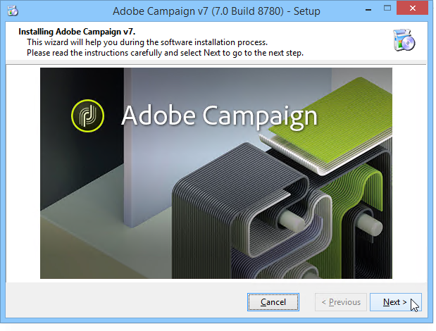

# Adobe Campaign 7용 Windows에서 마이그레이션{#migrating-in-windows-for-adobe-campaign}

## 일반 절차 {#general-procedure}

Windows의 경우 마이그레이션 단계는 다음과 같습니다.

1. 서비스 중지:서비스 [중지를](#service-stop)참조하십시오.
1. 데이터베이스 백업:데이터베이스 [및 현재 설치](#back-up-the-database-and-the-current-installation)백업을 참조하십시오.
1. 플랫폼 마이그레이션:adobe [Campaign v7 배포를 참조하십시오](#deploying-adobe-campaign-v7).
1. 리디렉션 서버(IIS) 마이그레이션:리디렉션 [서버(IIS)](#migrating-the-redirection-server--iis-)마이그레이션을 참조하십시오.
1. 서비스 다시 시작:서비스 [다시 시작을 참조하십시오](#re-starting-the-services).
1. 이전 Adobe Campaign 버전 삭제 및 정리:adobe [Campaign 이전 버전](#deleting-and-cleansing-adobe-campaign-previous-version)삭제 및 삭제를 참조하십시오.

## 서비스 중지 {#service-stop}

먼저, 관련된 모든 컴퓨터에서 데이터베이스에 대한 액세스 권한을 가진 모든 프로세스를 중지합니다.

1. 리디렉션 모듈(**webmdl** 서비스)을 사용하는 모든 서버를 중지해야 합니다. IIS의 경우 다음 명령을 실행합니다.

   ```
   iisreset /stop
   ```

1. 다음 명령을 사용하여 **mta** 모듈과 하위 모듈(**matchild**)을 중지해야 합니다.

   ```
   nlserver stop mta@<instance name>
   nlserver stop mtachild@<instance name>
   ```

1. 모든 서버에서 Adobe Campaign 서비스를 중지합니다. 관리자 권한으로 로그인하고 다음 명령을 실행합니다.

   ```
   net stop nlserver6
   ```

   v5.11에서 마이그레이션하는 경우 다음 명령을 실행합니다.

   ```
   net stop nlserver5
   ```

1. 각 서버에 대해 Adobe Campaign 서비스가 제대로 중지되었는지 확인하십시오. 관리자 권한으로 로그인하고 다음 명령을 실행합니다.

   ```
   tasklist /FI "IMAGENAME eq nlserver*"
   ```

   ID(PID)와 함께 활성 프로세스 목록이 표시됩니다.

   ```
   Image Name                     PID Session Name        Session#    Mem Usage
   ========================= ======== ================ =========== ============
   nlserver.exe                  3192 Console                    1     13,108 K
   ```

1. 몇 분 후에도 하나 이상의 Adobe Campaign 프로세스가 활성 상태이거나 차단된 경우 프로세스를 종료합니다. 관리자 권한으로 로그인하고 다음 명령을 실행합니다.

   ```
   taskkill /IM nlserver* /T
   ```

1. 몇 분 후에도 일부 프로세스가 여전히 활성 상태인 경우 다음 명령을 사용하여 프로세스를 강제로 닫을 수 있습니다.

   ```
   taskkill /F /IM nlserver* /T
   ```

## 데이터베이스 및 현재 설치 백업 {#back-up-the-database-and-the-current-installation}

절차는 Adobe Campaign 이전 버전에 따라 다릅니다.

### Adobe Campaign v5.11에서 마이그레이션 {#migrating-from-adobe-campaign-v5-11}

1. Adobe Campaign 데이터베이스의 백업을 만듭니다.
1. 다음 명령을 사용하여 Neolane **v5** 디렉토리를 백업합니다.

   ```
   ren "Neolane v5" "Neolane v5.back"
   ```

   >[!IMPORTANT]
   >
   >예방 차원에서 Neolane v5.back **폴더를 압축** 해제하고 서버가 아닌 다른 곳에 저장하는 것이 좋습니다.

1. Windows 서비스 관리 콘솔에서 5.11 응용 프로그램 서버 서비스의 자동 시작을 비활성화합니다. 다음 명령을 사용할 수도 있습니다.

   ```
   sc config nlserver5 start= disabled
   ```

1. Neolane v5에서 **config-`<instance name>`.xml** 을 **편집합니다. 백** 폴더)를 사용하여 **mta**, **wfserver**, **stat**&#x200B;등을방지할 수 있습니다. 서비스가 자동으로 시작됩니다. 예를 들어 autoStart를 **_autoStart로** 바꿉니다 ****.

   ```
   <?xml version='1.0'?>
   <serverconf>
     <shared>
       <dataStore hosts="myServer*" lang="en_US">
         <dataSource name="default">
           <dbcnx encrypted="1" login="myLogin" password="myPassword"  provider="postgresql" server="myServer"/>
         </dataSource>
       </dataStore>
     </shared>
   
     <mta _autoStart="true" statServerAddress="myStatServer"/>
     <stat _autoStart="true"/>
     <wfserver _autoStart="true"/>
     <inMail _autoStart="true"/>
     <sms _autoStart="false"/>
   </serverconf>
   ```

### Adobe Campaign v6.02에서 마이그레이션 {#migrating-from-adobe-campaign-v6-02}

1. Adobe Campaign 데이터베이스의 백업을 만듭니다.
1. 다음 명령을 사용하여 **Neolane v6** 디렉토리를 백업합니다.

   ```
   ren "Neolane v6" "Neolane v6.back"
   ```

   >[!IMPORTANT]
   >
   >예방 차원에서 Neolane v6.back **폴더를 압축** 해제하고 서버가 아닌 다른 곳에 저장하는 것이 좋습니다.

1. Windows 서비스 관리자에서 6.02 응용 프로그램 서버 자동 시작을 비활성화합니다. 다음 명령을 사용할 수도 있습니다.

   ```
   sc config nlserver6 start= disabled
   ```

1. Neolane v6에서 **config-`<instance name>`.xml** 을 **편집합니다. 백** 폴더)를 사용하여 **mta**, **wfserver**, **stat**&#x200B;등을방지할 수 있습니다. 서비스가 자동으로 시작됩니다. 예를 들어 autoStart를 **_autoStart로** 바꿉니다 ****.

   ```
   <?xml version='1.0'?>
   <serverconf>
     <shared>
       <dataStore hosts="myServer*" lang="en_US">
         <dataSource name="default">
           <dbcnx encrypted="1" login="myLogin" password="myPassword" provider="postgresql" server="myServer"/>
         </dataSource>
       </dataStore>
     </shared>
   
     <mta _autoStart="true" statServerAddress="myStatServer"/>
     <stat _autoStart="true"/>
     <wfserver _autoStart="true"/>
     <inMail _autoStart="true"/>
     <sms _autoStart="false"/>
   </serverconf>
   ```

### Adobe Campaign v6.1에서 마이그레이션 {#migrating-from-adobe-campaign-v6-1}

1. Adobe Campaign 데이터베이스의 백업을 만듭니다.
1. 다음 명령을 사용하여 **Adobe Campaign v6** 디렉토리의 백업을 만듭니다.

   ```
   ren "Adobe Campaign v6" "Adobe Campaign v6.back"
   ```

   >[!IMPORTANT]
   >
   >예방 차원에서 Adobe Campaign v6.back **** 폴더를 압축한 다음 서버 이외의 안전한 위치에 저장하는 것이 좋습니다.

1. Windows 서비스 관리 콘솔에서 6.11 응용 프로그램 서버 서비스의 자동 시작을 비활성화합니다. 다음 명령을 사용할 수도 있습니다.

   ```
   sc config nlserver6 start= disabled
   ```

## Adobe Campaign v7 배포 {#deploying-adobe-campaign-v7}

Adobe Campaign 배포에는 두 가지 단계가 포함됩니다.

* 빌드 v7 설치:이 작업은 각 서버에서 수행해야 합니다.
* 업그레이드 후:이 명령은 각 인스턴스에서 시작해야 합니다.

Adobe Campaign을 배포하려면 다음 단계를 적용합니다.

1. 최신 Adobe Campaign v7 빌드를 **setup.exe** 설치 파일을 실행하여 설치합니다. Windows에서 Adobe Campaign 서버 설치에 대한 자세한 내용은 [이 섹션을](../../installation/using/installing-the-server.md)참조하십시오.

   

   >[!NOTE]
   >
   >Adobe Campaign v7은 기본적으로 C:\Program Files\Adobe\Adobe Campaign v7 **디렉토리에** 설치됩니다.

1. 클라이언트 콘솔 설치 프로그램을 사용할 수 있게 하려면 **setup-client-7.0.XXXX.exe** 파일을 Adobe Campaign 설치 디렉토리로 복사합니다.C:\Program Files\Adobe\Adobe Campaign v7\datakit\nl\eng\jsp ****.

   >[!NOTE]
   >
   >Windows에서 Adobe Campaign을 설치하는 방법에 대한 자세한 내용은 [이 섹션을](../../installation/using/installing-the-server.md)참조하십시오.

1. 다음 명령을 사용하여 처음 사용하기 위한 인스턴스를 시작합니다.

   ```
   net start nlserver6-v7
   net stop nlserver6-v7
   ```

   >[!NOTE]
   >
   >다음 명령을 사용하여 Adobe Campaign v7 내부 파일 시스템을 만들 수 있습니다.conf **디렉토리(** config-default.xml **및** serverConf.xml **파일 사용),** var **** 디렉토리 등.

1. Neolane v5.back, Neolv6.back **또는 Adobe Adobe V6.back****백업 파일을 통해 각 인스턴스의 구성 파일과 하위 폴더를 복사하여 붙여넣기(덮어쓰기)** (마이그레이션 중인 **버전에 따라** 캠페인 [이 섹션을 참조하십시오.](#back-up-the-database-and-the-current-installation)이 섹션을 참조하십시오.
1. 마이그레이션하는 버전에 따라 다음 명령을 실행합니다.

   ```
   copy "Neolane v5.back"/conf/config-<instance name>.xml "Adobe Campaign v7"/conf/
   copy "Neolane v5.back"/customers/* "Adobe Campaign v7"/customers/
   copy "Neolane v5.back"/var/* "Adobe Campaign v7"/var/
   ```

   ```
   copy "Neolane v6.back"/conf/config-<instance name>.xml "Adobe Campaign v7"/conf/
   copy "Neolane v6.back"/customers/* "Adobe Campaign v7"/customers/
   copy "Neolane v6.back"/var/* "Adobe Campaign v7"/var/
   ```

   ```
   copy "Adobe Campaign v6.back"/conf/config-<instance name>.xml "Adobe Campaign v7"/conf/
   copy "Adobe Campaign v6.back"/customers/* "Adobe Campaign v7"/customers/
   copy "Adobe Campaign v6.back"/var/* "Adobe Campaign v7"/var/
   ```

   >[!IMPORTANT]
   >
   >위의 첫 번째 명령에 대해서는 **config-default.xml** 파일을 복사하지 마십시오.

1. Adobe **Campaign v7의 serverConf.xml** 및 **config-default.xml** 파일에서 Adobe Campaign 이전 버전에 있었던 특정 구성을 적용합니다. serverConf. **xml** 파일의 경우 Neolane v5/conf/serverConf.xml.diff **,** Neolane v6/conf/serverConf.xml.diff **또는 Adobe Campaign** v6/conf/serverConf.xml.diffDiff **** 파일을 사용합니다.

   >[!NOTE]
   >
   >이전 버전의 Adobe Campaign에서 Adobe Campaign v7으로 구성을 보고할 때 실제 디렉토리 경로가 Adobe Campaign v7(Neolane v5, Neolane v6 또는 Adobe Campaign v6 아님)으로 연결되는지 확인하십시오.

1. 다음 명령을 사용하여 Adobe Campaign v7 구성을 다시 로드합니다.

   ```
   nlserver config -reload
   ```

1. 다음 명령을 사용하여 업그레이드 후 프로세스를 시작합니다.

   ```
   nlserver config -postupgrade -instance:<instance name>
   ```

>[!IMPORTANT]
>
>Adobe Campaign 서비스를 아직 시작하지 마십시오.IIS에서 일부 변경을 수행해야 합니다.

## 리디렉션 서버(IIS 파섹 {#migrating-the-redirection-server--iis-}

이 단계에서는 IIS 서버를 중지해야 합니다. 서비스 [중지를](#service-stop)참조하십시오.

1. IIS( **인터넷 정보 서비스) 관리자 콘솔을** 엽니다.
1. Adobe Campaign 이전 버전에 사용되는 사이트의 바인딩(수신 포트)을 변경합니다.

   * Adobe Campaign 이전 버전에 사용된 사이트를 마우스 오른쪽 단추로 클릭하고 **[!UICONTROL Edit bindings]**&#x200B;선택합니다.
   * 수신 포트(**[!UICONTROL http]** 및/또는 **[!UICONTROL https]**)의 각 유형에 대해 적절한 줄을 선택하고 **[!UICONTROL Edit]**&#x200B;을 클릭합니다.
   * 다른 포트를 입력합니다. 기본적으로 수신 포트는 http의 경우 80이고 https의 경우 443입니다. 새 포트가 사용 가능한지 확인합니다.

      

      >[!NOTE]
      >
      >IIS 서버에 고급 구성(공유 포트 및 다른 IP 주소)이 있는 Adobe Campaign용 웹 사이트가 여러 개 포함되어 있는 경우 관리자에게 문의하십시오.

1. Adobe Campaign v7용 새 웹 사이트 만들기:

   * 폴더를 마우스 오른쪽 단추로 클릭하고 **[!UICONTROL Sites]** 선택합니다 **[!UICONTROL Add Web Site...]**.

      

   * 사이트 이름(예: Adobe **Campaign v7** )을 입력합니다.
   * 웹 사이트의 기본 디렉토리에 대한 액세스 경로는 사용되지 않지만 **[!UICONTROL Physical access path]** 필드를 입력해야 합니다. 기본 IIS 액세스 경로를 입력합니다.C:\inetpub\wwwroot ****.
   * 단추로 **[!UICONTROL Connect as...]** 클릭하고 **[!UICONTROL Application user]** 옵션을 선택했는지 확인합니다.
   * 기본값을 **[!UICONTROL IP address]** 및 **[!UICONTROL Port]** 필드에 둘 수 있습니다. 다른 값을 사용하려면 IP 주소 및/또는 포트를 사용할 수 있는지 확인하십시오.
   * 체크 **[!UICONTROL Start Web site immediately]** 상자를 선택합니다.

      

1. 이전에 만든 **가상 디렉토리에서 Adobe Campaign 서버가 사용하는 리소스를 자동으로 구성하려면 iis_neolane_setup.vbs** 스크립트를 실행합니다.

   * 이 파일은 \tomcat-7\conf file **`[Adobe Campaign v7]`폴더에서 찾을&#x200B;**수 있습니다. 여기서&#x200B;**`[Adobe Campaign v7]`**은 Adobe Campaign 설치 디렉토리의 액세스 경로입니다. 스크립트 실행 명령은 다음과 같습니다(관리자용).

      ```
      cd C:\Program Files (x86)\Adobe Campaign\Adobe Campaign v7\tomcat-7\conf
      cscript iis_neolane_setup.vbs
      ```

   * 스크립트 실행을 **[!UICONTROL OK]** 확인하려면 을 클릭합니다.

      

   * Adobe Campaign v7용으로 이전에 만든 웹 사이트의 수를 입력하고 을 **[!UICONTROL OK]**&#x200B;클릭합니다.

      

   * 확인 메시지가 표시됩니다.

      

   * 이 **[!UICONTROL Content view]** 탭에서 웹 사이트 구성이 Adobe Campaign 리소스로 올바르게 구성되었는지 확인합니다.

      

      >[!NOTE]
      >
      >트리 구조가 표시되지 않으면 IIS를 다시 시작합니다.
      >
      >다음 IIS 구성 단계는 [이 섹션에](../../installation/using/integration-into-a-web-server-for-windows.md#configuring-the-iis-web-server)자세히 설명되어 있습니다.

## 보안 영역 {#security-zones}

v6.02 이전 버전에서 마이그레이션하는 경우 서비스를 시작하기 전에 보안 영역을 구성해야 합니다. 자세한 내용은 보안을 [참조하십시오](../../migration/using/general-configurations.md#security).

## 서비스 다시 시작 {#re-starting-the-services}

다음 각 서버에서 IIS 및 Adobe Campaign 서비스를 시작합니다.

1. 추적 및 리디렉션 서버
1. 중간 소싱 서버.
1. 마케팅 서버.

다음 단계로 이동하기 전에 새 설치에 대한 전체 테스트를 실행하고 일반 구성 [](../../migration/using/general-configurations.md) 섹션의 모든 권장 사항을 수행하여 회귀 현상이 없는지 확인합니다.

## Adobe Campaign 이전 버전 삭제 및 정리 {#deleting-and-cleansing-adobe-campaign-previous-version}

절차는 Adobe Campaign 이전 버전에 따라 다릅니다.

### Adobe Campaign v5 {#adobe-campaign-v5}

Adobe Campaign v5 설치를 삭제하고 정리하기 전에 다음 권장 사항을 적용해야 합니다.

* 기능 팀에서 새로운 설치 상태를 모두 점검합니다.
* 롤백이 필요하지 않다고 확신하면 Adobe Campaign v5만 제거합니다.

1. IIS에서 Neolane v5 **웹 사이트를 삭제한 다음** Neolane v5 **응용 프로그램** 풀을 삭제합니다.
1. Neolane **v5.back** 폴더의 이름을 **Neolane v5로**&#x200B;변경합니다.
1. 구성 요소 추가/제거 마법사를 사용하여 Adobe Campaign v5를 제거합니다.

   

1. 다음 명령을 **사용하여 nlserver5** Windows 서비스를 삭제합니다.

   ```
   sc delete nlserver5
   ```

1. 서버를 다시 시작합니다.

### Adobe Campaign v6.02 {#adobe-campaign-v6-02}

Adobe Campaign v6.02 설치를 삭제하고 정리하기 전에 다음 권장 사항을 적용해야 합니다.

* 기능 팀에서 새로운 설치 상태를 모두 점검합니다.
* 롤백이 필요하지 않다고 확신하면 Adobe Campaign v6.02만 제거합니다.

1. IIS에서 Neolane v6 **** 웹 사이트를 삭제한 다음 **Neolane v6** 응용 프로그램 풀을 삭제합니다.
1. Neolane **v6.back** 폴더의 이름을 **Neolane v6로**&#x200B;변경합니다.
1. 구성 요소 추가/제거 마법사를 사용하여 Adobe Campaign v6.02를 제거합니다.

   

1. 서버를 다시 시작합니다.

### Adobe Campaign v6.1 {#adobe-campaign-v6-1}

Adobe Campaign v6 설치를 삭제하고 정리하기 전에 다음 권장 사항을 적용해야 합니다.

* 기능 팀에서 새로운 설치 상태를 모두 점검합니다.
* 롤백이 필요하지 않다고 확신하면 Adobe Campaign v6만 제거합니다.

1. IIS에서 Adobe Campaign **v6** 웹 사이트를 삭제한 다음 **Adobe Campaign v6** 응용 프로그램 풀을 삭제합니다.
1. Adobe Campaign **v6.back** 폴더의 이름을 Adobe Campaign **v6로**&#x200B;변경합니다.
1. 구성 요소 추가/제거 마법사를 사용하여 Adobe Campaign v6을 제거합니다.

   

1. 서버를 다시 시작합니다.

