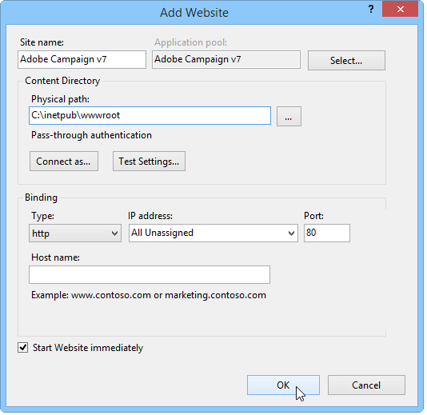

# Microsoft Windows 플랫폼을 Campaign v7로 마이그레이션{#migrating-in-windows-for-adobe-campaign}


Microsoft Windows 환경의 경우 마이그레이션 단계는 다음과 같습니다.

1. 모든 서비스 중지 - [자세히 알아보기](#service-stop).
1. 데이터베이스 백업 - [자세히 알아보기](#back-up-the-database).
1. 플랫폼 마이그레이션 - [자세히 알아보기](#deploying-adobe-campaign-v7).
1. 리디렉션 서버 마이그레이션(IIS) - [자세히 알아보기](#migrating-the-redirection-server--iis-).
1. 서비스 다시 시작 - [자세히 알아보기](#re-starting-the-services).
1. 이전 Adobe Campaign 버전 삭제 및 정리 - [자세히 알아보기](#deleting-and-cleansing-adobe-campaign-previous-version).

## 서비스 정지 {#service-stop}

먼저, 관련된 모든 시스템의 데이터베이스에 액세스할 수 있는 모든 프로세스를 중지합니다.

1. 리디렉션 모듈을 사용하는 모든 서버(**물갈퀴띠** service)를 중지해야 합니다. IIS의 경우 다음 명령을 실행합니다.

   ```
   iisreset /stop
   ```

1. 다음 **mta** 모듈 및 해당 하위 모듈(**일치 항목**)는 다음 명령을 사용하여 중지해야 합니다.

   ```
   nlserver stop mta@<instance name>
   nlserver stop mtachild@<instance name>
   ```

1. 모든 서버에서 Adobe Campaign 서비스를 중지합니다. 관리자 권한으로 로그인하고 다음 명령을 실행합니다.

   ```
   net stop nlserver6
   ```

<!--

   If you are migrating from v5.11, run the following command:

   ```
   net stop nlserver5
   ```

-->

1. 각 서버에 대해 Adobe Campaign 서비스가 제대로 중지되었는지 확인하십시오. 관리자 권한으로 로그인하고 다음 명령을 실행합니다.

   ```
   tasklist /FI "IMAGENAME eq nlserver*"
   ```

   ID(PID)와 함께 활성 프로세스 목록이 표시됩니다.

   ```
   Image Name                     PID Session Name        Session#    Mem Usage
   ========================= ======== ================ =========== ============
   nlserver.exe                  3192 Console                    1     13,108 K
   ```

1. 몇 분 후에도 하나 이상의 Adobe Campaign 프로세스가 여전히 활성 상태이거나 차단되는 경우 프로세스를 중단합니다. 관리자 권한으로 로그인하고 다음 명령을 실행합니다.

   ```
   taskkill /IM nlserver* /T
   ```

1. 몇 분 후에도 일부 프로세스가 활성 상태인 경우 다음 명령을 사용하여 프로세스를 강제로 닫을 수 있습니다.

   ```
   taskkill /F /IM nlserver* /T
   ```

## Campaign 데이터베이스 백업 {#back-up-the-database}

다음은 Adobe Campaign v6.1을 백업하는 절차입니다.

<!--

### For Adobe Campaign v5.11 {#migrating-from-adobe-campaign-v5-11}

1. Make a backup of the Adobe Campaign database.
1. Make a backup of the **Neolane v5** directory using the following command:

   ```
   ren "Neolane v5" "Neolane v5.back"
   ```

   >[!IMPORTANT]
   >
   >As a precaution, we recommend that you zip the **Neolane v5.back** folder and save it elsewhere in a safe location other than the server.

1. In the windows service management console, disable the automatic startup of the 5.11 application server service. You can also use the following command:

   ```
   sc config nlserver5 start= disabled
   ```

1. Edit the **config-`<instance name>`.xml** (in the **Neolane v5. back** folder) to prevent the **mta**, **wfserver**, **stat**, etc. services from starting automatically. For instance, replace **autoStart** with **_autoStart**.

   ```
   <?xml version='1.0'?>
   <serverconf>
     <shared>
       <dataStore hosts="myServer*" lang="en_US">
         <dataSource name="default">
           <dbcnx encrypted="1" login="myLogin" password="myPassword"  provider="postgresql" server="myServer"/>
         </dataSource>
       </dataStore>
     </shared>
   
     <mta _autoStart="true" statServerAddress="myStatServer"/>
     <stat _autoStart="true"/>
     <wfserver _autoStart="true"/>
     <inMail _autoStart="true"/>
     <sms _autoStart="false"/>
   </serverconf>
   ```

-->

<!--
### For Adobe Campaign v6.02 {#migrating-from-adobe-campaign-v6-02}

1. Make a backup of the Adobe Campaign database.
1. Make a backup of the **Neolane v6** directory using the following command:

   ```
   ren "Neolane v6" "Neolane v6.back"
   ```

   >[!IMPORTANT]
   >
   >As a precaution, we recommend that you zip the **Neolane v6.back** folder and save it elsewhere in a safe location other than the server.

1. In the Windows service manager, deactivate the 6.02 application server automatic startup. You can also use the following command:

   ```
   sc config nlserver6 start= disabled
   ```

1. Edit the **config-`<instance name>`.xml** (in the **Neolane v6. back** folder) to prevent the **mta**, **wfserver**, **stat**, etc. services from starting automatically. For instance, replace **autoStart** with **_autoStart**.

   ```
   <?xml version='1.0'?>
   <serverconf>
     <shared>
       <dataStore hosts="myServer*" lang="en_US">
         <dataSource name="default">
           <dbcnx encrypted="1" login="myLogin" password="myPassword" provider="postgresql" server="myServer"/>
         </dataSource>
       </dataStore>
     </shared>
   
     <mta _autoStart="true" statServerAddress="myStatServer"/>
     <stat _autoStart="true"/>
     <wfserver _autoStart="true"/>
     <inMail _autoStart="true"/>
     <sms _autoStart="false"/>
   </serverconf>
   ```

-->

1. Adobe Campaign 데이터베이스를 백업합니다.
1. 다음을 백업합니다. **Adobe Campaign v6** 다음 명령을 사용하는 디렉토리:

   ```
   ren "Adobe Campaign v6" "Adobe Campaign v6.back"
   ```

   >[!IMPORTANT]
   >
   >예방 차원에서 다음을 압축하는 것이 좋습니다. **Adobe Campaign v6.back** 폴더를 만들어 서버가 아닌 안전한 위치에 저장합니다.

1. Windows 서비스 관리 콘솔에서 6.11 응용 프로그램 서버 서비스의 자동 시작을 비활성화합니다. 다음 명령을 사용할 수도 있습니다.

   ```
   sc config nlserver6 start= disabled
   ```

## Adobe Campaign v7 배포 {#deploying-adobe-campaign-v7}

Adobe Campaign 배포에는 다음 두 단계가 포함됩니다.

* 빌드 v7 설치: 이 작업은 각 서버에서 수행해야 합니다.
* 업그레이드 후: 이 명령은 각 인스턴스에서 시작해야 합니다.

Adobe Campaign을 배포하려면 다음 단계를 적용합니다.

1. 를 실행하여 최신 Adobe Campaign v7 빌드 설치 **setup.exe** 설치 파일입니다. Windows에서 Adobe Campaign 서버 설치에 대한 자세한 내용은 [이 섹션](../../installation/using/installing-the-server.md).

   

   >[!NOTE]
   >
   >Adobe Campaign v7은 기본적으로 **C:\Program Files\Adobe\Adobe Campaign v7** 디렉토리.

1. 클라이언트 콘솔 설치 프로그램을 사용하려면 다음을 복사합니다. **setup-client-7.0.XXXX.exe** 파일을 Adobe Campaign 설치 디렉토리에 넣습니다. **C:\Program Files\Adobe\Adobe Campaign v7\datakit\nl\eng\jsp**.

   >[!NOTE]
   >
   >Windows에서 Adobe Campaign 설치에 대한 자세한 내용은 [이 섹션](../../installation/using/installing-the-server.md).

1. 다음 명령을 사용하여 인스턴스를 처음 시작합니다.

   ```
   net start nlserver6-v7
   net stop nlserver6-v7
   ```

   >[!NOTE]
   >
   >다음 명령을 사용하여 Adobe Campaign v7 내부 파일 시스템을 만들 수 있습니다. **conf** 디렉토리(포함) **config-default.xml** 및 **serverConf.xml** 파일), **var** 디렉토리 등

1. 를 통해 각 인스턴스의 구성 파일 및 하위 폴더를 복사하여 붙여넣기(덮어쓰기) **Neolane v5.back**, **Neolane v6.back** 또는 **Adobe Campaign v6.back** 백업 파일(마이그레이션 중인 버전에 따라 다름 - 참조 [이 섹션](#back-up-the-database-and-the-current-installation)).
1. 마이그레이션 중인 버전에 따라 다음 명령을 실행합니다.

   ```
   copy "Neolane v5.back"/conf/config-<instance name>.xml "Adobe Campaign v7"/conf/
   copy "Neolane v5.back"/customers/* "Adobe Campaign v7"/customers/
   copy "Neolane v5.back"/var/* "Adobe Campaign v7"/var/
   ```

   ```
   copy "Neolane v6.back"/conf/config-<instance name>.xml "Adobe Campaign v7"/conf/
   copy "Neolane v6.back"/customers/* "Adobe Campaign v7"/customers/
   copy "Neolane v6.back"/var/* "Adobe Campaign v7"/var/
   ```

   ```
   copy "Adobe Campaign v6.back"/conf/config-<instance name>.xml "Adobe Campaign v7"/conf/
   copy "Adobe Campaign v6.back"/customers/* "Adobe Campaign v7"/customers/
   copy "Adobe Campaign v6.back"/var/* "Adobe Campaign v7"/var/
   ```

   >[!IMPORTANT]
   >
   >위의 첫 번째 명령에 대해 **config-default.xml** 파일.

1. 다음에서 **serverConf.xml** 및 **config-default.xml** Adobe Campaign v7 파일의 경우 이전 Adobe Campaign 버전에서 사용했던 특정 구성을 적용합니다. 의 경우 **serverConf.xml** 파일, 사용 **Neolane v5/conf/serverConf.xml.diff**, **Neolane v6/conf/serverConf.xml.diff** 또는 **Adobe Campaign v6/conf/serverConf.xml.diff** 파일.

   >[!NOTE]
   >
   >Adobe Campaign 이전 버전에서 Adobe Campaign v7로 구성을 보고할 때 물리적 디렉토리에 대한 경로가 Adobe Campaign v7(Neolane v5, Neolane v6 또는 Adobe Campaign v6 아님)으로 이어졌는지 확인하십시오.

1. 다음 명령을 사용하여 Adobe Campaign v7 구성을 다시 로드합니다.

   ```
   nlserver config -reload
   ```

1. 다음 명령을 사용하여 업그레이드 후 프로세스를 시작합니다.

   ```
   nlserver config -postupgrade -instance:<instance name>
   ```

>[!IMPORTANT]
>
>아직 Adobe Campaign 서비스를 시작하지 마십시오. IIS에서 일부 사항을 변경해야 합니다.

## 리디렉션 서버 마이그레이션 {#migrating-the-redirection-server--iis-}

이 단계에서 IIS 서버를 중지해야 합니다. 을(를) 참조하십시오 [서비스 정지](#service-stop).

1. 를 엽니다. **IIS(인터넷 정보 서비스) 관리자** 콘솔.
1. Adobe Campaign 이전 버전에 사용된 사이트의 바인딩(수신 포트)을 변경합니다.

   * Adobe Campaign 이전 버전에 사용된 사이트를 마우스 오른쪽 단추로 클릭하고 를 선택합니다. **[!UICONTROL Edit bindings]**.
   * 각 유형의 수신 포트(**[!UICONTROL http]** 및/또는 **[!UICONTROL https]**)를 클릭하고 적절한 선을 선택한 다음 를 클릭합니다 **[!UICONTROL Edit]**.
   * 다른 포트를 입력하십시오. 기본적으로 수신 포트는 http의 경우 80이고 https의 경우 443입니다. 새 포트를 사용할 수 있는지 확인합니다.

      

      >[!NOTE]
      >
      >IIS 서버에 고급 구성(공유 포트 및 다른 IP 주소)이 있는 Adobe Campaign용 웹 사이트가 여러 개 포함된 경우 관리자에게 문의하십시오.

1. Adobe Campaign v7용 새 웹 사이트 만들기:

   * 마우스 오른쪽 단추 클릭 **[!UICONTROL Sites]** 폴더 및 선택 **[!UICONTROL Add Web Site...]**.

      

   * 사이트 이름 입력, **Adobe Campaign v7** 예.
   * 웹 사이트의 기본 디렉터리에 대한 액세스 경로는 사용되지 않지만 **[!UICONTROL Physical access path]** 필드를 입력해야 합니다. 기본 IIS 액세스 경로 입력: **C:\inetpub\wwwroot**.
   * 다음을 클릭합니다. **[!UICONTROL Connect as...]** as 단추 및 **[!UICONTROL Application user]** 옵션이 선택되어 있습니다.
   * 기본값은에 그대로 둘 수 있습니다. **[!UICONTROL IP address]** 및 **[!UICONTROL Port]** 필드. 다른 값을 사용하려면 IP 주소 및/또는 포트를 사용할 수 있는지 확인하십시오.
   * 다음 확인: **[!UICONTROL Start Web site immediately]** 상자.

      

1. 실행 **iis_neolane_setup.vbs** 이전에 만든 가상 디렉터리에 있는 Adobe Campaign 서버에서 사용하는 리소스를 자동으로 구성하는 스크립트입니다.

   * 이 파일은 **`[Adobe Campaign v7]`\conf** 디렉토리, 여기서 **`[Adobe Campaign v7]`** 는 Adobe Campaign 설치 디렉토리에 대한 액세스 경로입니다. 스크립트를 실행하는 명령은 다음과 같습니다(관리자용).

      ```
      cd C:\Program Files (x86)\Adobe Campaign\Adobe Campaign v7\conf
      cscript iis_neolane_setup.vbs
      ```

   * 클릭 **[!UICONTROL OK]** 스크립트 실행을 확인합니다.

      

   * 이전에 Adobe Campaign v7용으로 만든 웹 사이트의 번호를 입력하고 **[!UICONTROL OK]**.

      

   * 확인 메시지가 표시됩니다.

      

   * 다음에서 **[!UICONTROL Content view]** 탭에서 웹 사이트 구성이 Adobe Campaign 리소스로 올바르게 구성되었는지 확인합니다.

      

      >[!NOTE]
      >
      >트리 구조가 표시되지 않으면 IIS를 다시 시작합니다.
      >
      >다음 IIS 구성 단계는에 자세히 설명되어 있습니다 [이 섹션](../../installation/using/integration-into-a-web-server-for-windows.md#configuring-the-iis-web-server).

<!--
## Security zones {#security-zones}

If you are migrating from v6.02 or earlier, you must configure your security zones before starting services. [Learn more](../../migration/using/general-configurations.md#security)
-->

## 서비스 다시 시작 {#re-starting-the-services}

다음 각 서버에서 IIS 및 Adobe Campaign 서비스를 시작합니다.

1. 추적 및 리디렉션 서버.
1. 중간 소싱 서버.
1. 마케팅 서버.

다음 단계로 진행하기 전에 새 설치에 대한 전체 테스트를 실행하고, 회귀가 없는지, 모든 것이 작동하는지 확인하십시오.

## 이전 버전 삭제 {#deleting-and-cleansing-adobe-campaign-previous-version}

Adobe Campaign v6.1을 삭제하는 절차입니다.

<!--

### For Adobe Campaign v5 {#adobe-campaign-v5}

Before you delete and cleanse the Adobe Campaign v5 installation, you must apply the following recommendations:

* Get the functional teams to run a full check of the new installation.
* Only uninstall Adobe Campaign v5 once you are certain that no rollback is necessary.

1. In IIS, delete the **Neolane v5** website, then the **Neolane v5** application pool. 
1. Rename the **Neolane v5.back** folder as **Neolane v5**.
1. Uninstall Adobe Campaign v5 using the Add/remove components wizard. 

   

1. Delete the **nlserver5** Windows service using the following command:

   ```
   sc delete nlserver5
   ```

1. Re-start the server.

### For Adobe Campaign v6.02 {#adobe-campaign-v6-02}

Before you delete and cleanse the Adobe Campaign v6.02 installation, you must apply the following recommendations:

* Get the functional teams to run a full check of the new installation.
* Only uninstall Adobe Campaign v6.02 once you are certain that no rollback is necessary.

1. In IIS, delete the **Neolane v6** website, then the **Neolane v6** application pool. 
1. Rename the **Neolane v6.back** folder as **Neolane v6**.
1. Uninstall Adobe Campaign v6.02 using the Add/remove components wizard. 

   

1. Re-start the server.

-->

Adobe Campaign v6 설치를 삭제하고 정리하기 전에 다음 권장 사항을 적용해야 합니다.

* 기능 팀이 새 설치에 대한 전체 검사를 실행하도록 합니다.
* 롤백이 필요하지 않은 경우에만 Adobe Campaign v6을 제거합니다.

1. IIS에서 **Adobe Campaign v6** 웹 사이트, **Adobe Campaign v6** 응용 프로그램 풀.
1. 이름 바꾸기 **Adobe Campaign v6.back** 폴더 이름: **Adobe Campaign v6**.
1. 구성 요소 추가/제거 마법사를 사용하여 Adobe Campaign v6을 제거합니다.

   

1. 서버를 다시 시작합니다.
