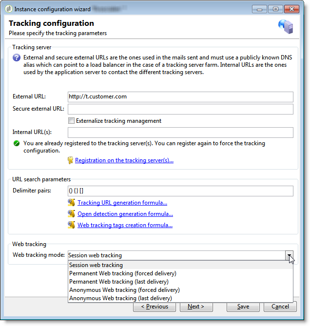

# v5.11의 특정 구성{#specific-configurations-in-v5-11}


이 섹션에서는 v5.11에서 마이그레이션할 때 필요한 추가 구성에 대해 자세히 설명합니다. [일반 구성](../../migration/using/general-configurations.md) 섹션에 자세히 설명되어 있는 설정도 구성해야 합니다.

## 웹 애플리케이션 {#web-applications}

마이그레이션 중에 다음 경고가 자동으로 표시됩니다.

```
The webApp ids have been modified during the migration process. Please make sure to check your scripts/css for broken compatibility (any client side JavaScript or css dealing directly with another element through its id is impacted). See file 'c:\svn\602\nl\build\ncs\var\upgrade/postupgrade/webAppsMigration_*************.txt' for details about the references that were automatically updated, if any.
```

웹 응용 프로그램의 일부 구성 요소(예: 다양한 공식 필드)에는 @id 속성이 있습니다. 이러한 파일은 웹 응용 프로그램의 XML 코드에서 사용되며 더 이상 동일한 방식으로 생성되지 않습니다. 인터페이스에는 표시되지 않으며 일반적으로 사용해서는 안 됩니다. 그러나 경우에 따라 @id 속성을 사용하여 스타일시트를 통해 또는 JavaScript 코드를 사용하여 웹 응용 프로그램의 렌더링을 개인화할 수 있습니다.

마이그레이션 중에 경고에 지정된 로그 파일 경로를 **반드시**&#x200B;해야 합니다.

* **파일이 비어 있지 않습니다**. 여기에는 마이그레이션 전에 기록된 불일치가 발생하고 여전히 존재하는 경고가 포함되어 있습니다. 존재하지 않는 ID를 참조하는 웹 애플리케이션에서 JavaScript 코드일 수 있습니다. 각 오류를 확인하고 수정해야 합니다.
* **파일이 비어** 있습니다. 즉, Adobe Campaign에서 문제를 감지하지 못했습니다.

파일이 비어 있는지 여부에 관계없이, 이러한 ID가 다른 곳에서 구성에 사용되지 않는지 확인해야 합니다(이 경우 구성을 조정).

## 워크플로우 {#workflows}

Adobe Campaign 설치 디렉토리의 이름이 변경되었으므로 마이그레이션 후 일부 워크플로우가 작동하지 않을 수 있습니다. 워크플로우가 활동 중 하나에서 nl5 디렉토리를 참조하는 경우 오류가 발생합니다. 이 참조를 **build**&#x200B;로 바꿉니다. SQL 쿼리를 실행하여 이러한 워크플로우를 식별할 수 있습니다(PostgreSQL 예).

```
SELECT   iWorkflowId, sInternalName, sLabel 
FROM XtkWorkflow 
WHERE mData LIKE '%nl5%';
```

## 사용자 친화성 {#user-friendliness}

Adobe Campaign v5.11 홈 페이지를 더 이상 사용할 수 없습니다.

권장되지는 않지만, 특정 인터페이스를 Adobe Campaign v5.11에서 유지하려는 경우 특정 솔루션이 있습니다. 자세한 내용은 문의하십시오.

## MySQL {#mysql}

>[!IMPORTANT]
>
>MySQL은 이 엔진을 사용하여 버전 6.02 또는 5.11에서 마이그레이션할 때 v7에서만 기본 데이터베이스 엔진으로 지원됩니다.

MySQL은 기본적으로 시간대를 관리하지 않습니다. 시간대 관리를 사용하려면 다음 명령을 실행하십시오.

```
mysql_tzinfo_to_sql /usr/share/zoneinfo | mysql -u root mysql
```

>[!NOTE]
>
>자세한 내용은 [https://dev.mysql.com/doc/refman/8.0/en/time-zone-support.html](https://dev.mysql.com/doc/refman/8.0/en/time-zone-support.html) 페이지를 참조하십시오.

데이터베이스 구조를 수정한 경우(예: 특정 인덱스를 만들고 SQL 보기 만들기 등) 구성 중에 마이그레이션할 때 특정 주의 사항이 수행되어야 합니다. 실제로, 마이그레이션 절차와의 호환되지 않으므로 특정 수정 사항을 생성할 수 있습니다. 예를 들어 **타임스탬프** 필드가 포함된 SQL 보기를 만들면 **usetimestamptz** 옵션과 호환되지 않습니다. 따라서 아래 권장 사항을 따르는 것이 좋습니다.

1. 마이그레이션을 시작하기 전에 데이터베이스를 백업합니다.
1. SQL 변경 내용을 삭제합니다.
1. [Adobe Campaign으로 마이그레이션 사전 요구 사항 7](../../migration/using/prerequisites-for-migration-to-adobe-campaign-7.md) 섹션에 설명된 절차에 따라 업그레이드 후 를 수행합니다.
   >[!NOTE]
   >
   >반드시 [Adobe Campaign으로 마이그레이션 사전 요구 사항 7](../../migration/using/prerequisites-for-migration-to-adobe-campaign-7.md) 섹션에 설명된 마이그레이션 단계를 따라야 합니다.
1. SQL 변경 사항을 다시 통합합니다.

이 예에서는 **NmcTrackingLogMessages** 보기가 생성되었으며 **Timestamp** 필드 이름이 **tslog**&#x200B;입니다. 이 경우 마이그레이션 절차가 실패하고 다음 오류 메시지가 표시됩니다.

```
2011-10-04 11:57:51.804Z B67B28C0 1 info log Updating table 'NmcTrackingLogMessages'
2011-10-04 11:57:51.804Z B67B28C0 1 error log PostgreSQL error: ERROR: cannot alter type of a column used by a view or rule\nDETAIL: rule _RETURN on view nmctrackinglogmessagesview depends on column "tslog"\n (iRc=-2006)
2011-10-04 11:57:51.804Z B67B28C0 1 error log SQL order 'ALTER TABLE NmcTrackingLogMessages ALTER COLUMN tsLog TYPE TIMESTAMPTZ' was not executed. (iRc=-2006)
```

업그레이드 후 작업이 작동하는지 확인하려면 마이그레이션 전에 보기를 삭제하고 마이그레이션 후 TIMESTAMP WITH TIMEZONE 모드에 적용하는 동안 해당 보기를 다시 만들어야 합니다.

## 추적 {#tracking}

추적 공식이 수정되었습니다. 마이그레이션할 때 이전 공식(v5)은 새 공식(v7)로 대체됩니다. Adobe Campaign v5에서 개인화된 공식을 사용하는 경우 이 구성을 Adobe Campaign v7(**NmsTracking_ClickFormula** 및 **NmsTracking_OpenFormula** 옵션)에서 수정해야 합니다.

웹 추적 관리도 수정되었습니다. v7로의 마이그레이션이 수행되면 배포 마법사를 시작하여 웹 추적 구성을 완료해야 합니다.



다음 세 가지 모드를 사용할 수 있습니다.

* **세션 웹 추적**: 패키지 **[!UICONTROL Leads]** 가 설치되지 않은 경우 이 옵션이 기본적으로 선택됩니다. 이 옵션은 성능 측면에서 가장 이상적입니다. 이 옵션을 사용하면 추적 로그 크기를 제한할 수 있습니다.
* **영구 웹 추적**
* **익명 웹 추적**: 패키지 **[!UICONTROL Leads]** 가 설치된 경우 기본적으로 이 옵션이 선택됩니다. 리소스를 가장 많이 사용하는 옵션입니다. 위와 같이 **sSourceId** 열은 인덱싱되어야 합니다( 추적 테이블 및 **CrmIncomingLead** 테이블).

>[!NOTE]
>
>이러한 세 가지 모드에 대한 자세한 내용은 [이 섹션](../../configuration/using/about-web-tracking.md)을 참조하십시오.

## Adobe Campaign v7 트리 구조 {#campaign-vseven-tree-structure}

마이그레이션 중에 트리 구조가 v7 표준에 따라 자동으로 재구성됩니다. 새 폴더가 추가되고, 오래된 폴더가 삭제되고, 해당 컨텐츠가 &quot;이동&quot; 폴더에 배치됩니다. 마이그레이션 후 이 폴더의 모든 항목을 확인해야 하며 컨설턴트는 이를 보관하거나 각 항목을 삭제하도록 결정해야 합니다. 보관해야 할 품목들은 적당한 곳으로 이동해야 한다.

탐색 트리의 자동 마이그레이션을 비활성화하는 옵션이 추가되었습니다. 이제 이 작업은 수동 작업입니다. 오래된 폴더는 삭제되지 않으며 새 폴더는 추가되지 않습니다. 이 옵션은 기본 제공 v5 탐색 트리가 너무 많은 변경 사항을 거친 경우에만 사용해야 합니다. 마이그레이션하기 전에 **[!UICONTROL Administration > Options]** 노드에서 옵션을 콘솔에 추가합니다.

* 내부 이름: NlMigration_KeepFolderStructure
* 데이터 유형: 정수
* 값(텍스트): 1

이 옵션을 사용하는 경우 마이그레이션 후 오래된 폴더를 삭제하고 새 폴더를 추가하고 필요한 모든 검사를 실행해야 합니다.

**새 폴더** 목록:

마이그레이션 후 다음 폴더를 추가해야 합니다.

| 내부 이름 | 레이블 | 조건 |
|---|---|---|
| nmsAutoObjects | 자동으로 생성된 개체 | - |
| nmsCampaignAdmin | 캠페인 관리 | - |
| nmsCampaignMgt | 캠페인 관리 | - |
| nmsCampaignRes | 캠페인 관리 | - |
| nmsModels | 템플릿 | - |
| nmsOnlineRes | 온라인 | - |
| nmsProduction | 프로덕션 | - |
| nmsProfileProcess | 프로세스 | - |
| xtkDashboard | 대시보드 | - |
| xtkPlatformAdmin | 플랫폼 | - |
| nmsLocalOrgUnit | 조직 단위 | - |
| nmsMRM | MRM | MRM이 설치됨 |
| nmsOperations | 캠페인 | 캠페인 설치 |

**오래된 폴더** 목록:

마이그레이션 후 삭제할 오래된 폴더는 다음과 같습니다.

>[!NOTE]
>
>오래된 폴더의 전체 컨텐츠를 확인해야 하며, 각 항목에 대해 컨설턴트가 보관 또는 삭제 여부를 결정합니다. 보관할 항목은 적절한 위치로 이동해야 합니다.

| 내부 이름 | 레이블 | 조건 |
|---|---|---|
| nmsAdministration | 관리 | - |
| nmsDeliveryMgt | 캠페인 실행 | - |
| ncmContent | 콘텐츠 관리 | Content Manager가 설치됨 |
| ncmForm | 입력 양식 | Content Manager가 설치됨 |
| ncmImage | 이미지 | Content Manager가 설치됨 |
| ncmJavascript | JavaScript 코드 | Content Manager가 설치됨 |
| ncmJst | JavaScript 템플릿 | Content Manager가 설치됨 |
| ncmParameters | 구성 | Content Manager가 설치됨 |
| ncmSrcSchema | 데이터 스키마 | Content Manager가 설치됨 |
| ncmStylesheet | XSL 스타일 파일 | Content Manager가 설치됨 |
| nmsAdminPlan | 관리 | 캠페인 설치 |
| nmsResourcePlan | 리소스 | 캠페인 설치 |
| nmsResourcesModels | 템플릿 | 캠페인 설치 |
| nmsRootPlan | 캠페인 관리 | 캠페인 설치 |
| nmsOperator | 마케팅 운영자 | MRM이 설치됨 |
