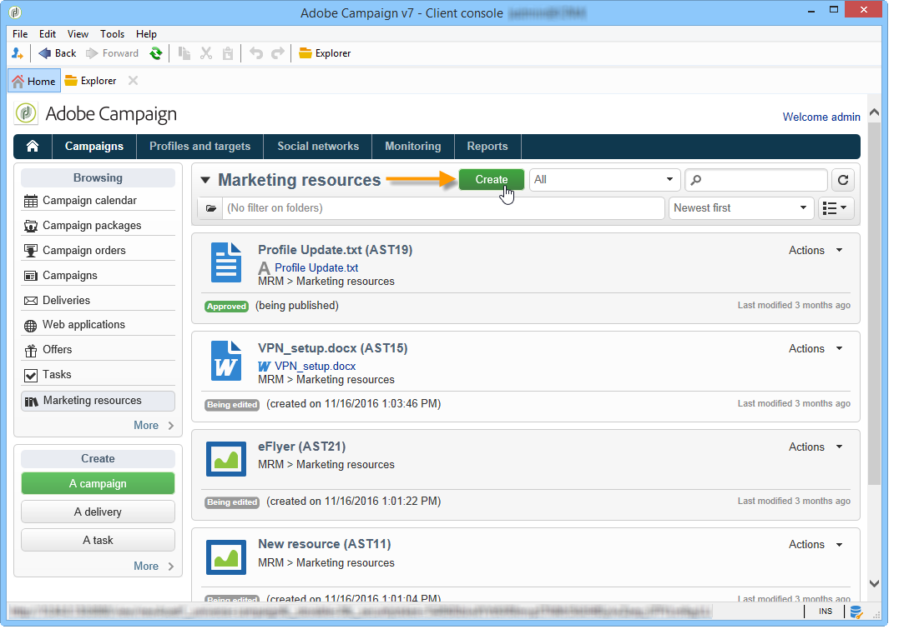
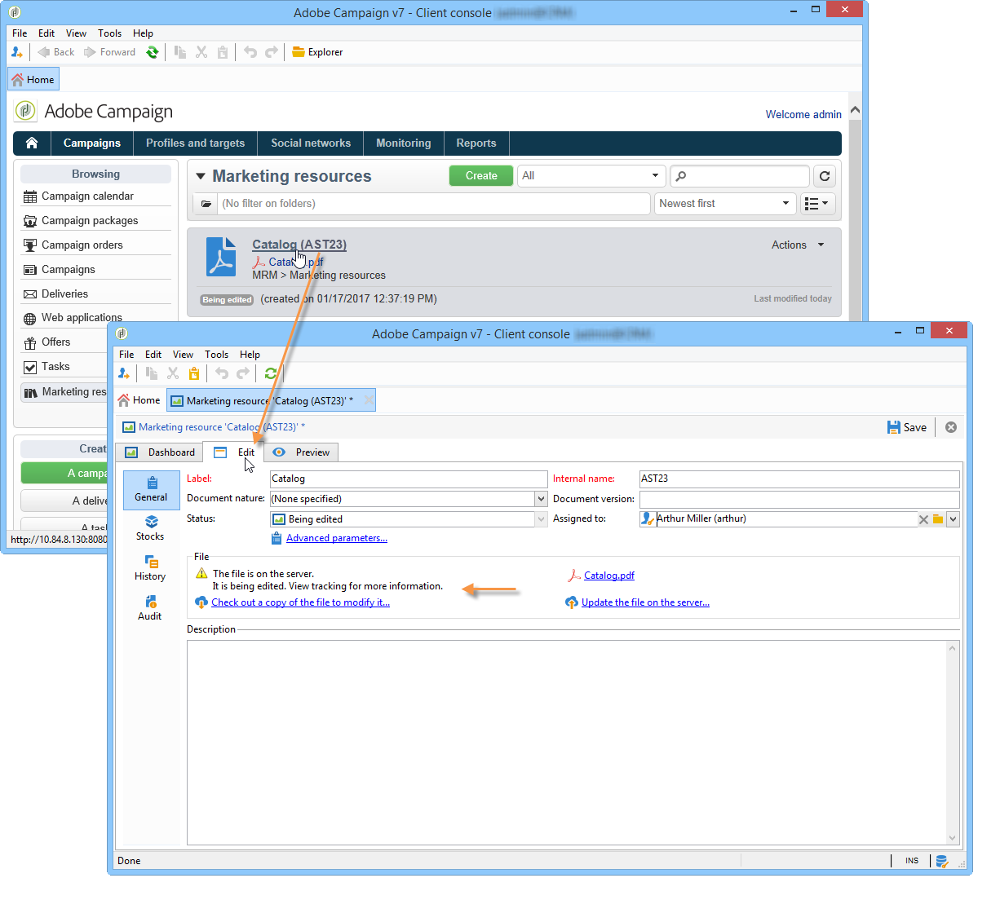

# 마케팅 리소스 관리{#managing-marketing-resources}

Adobe Campaign을 사용하면 캠페인 수명 주기와 관련된 마케팅 리소스를 관리하고 추적할 수 있습니다. 이러한 마케팅 리소스는 브로셔, 시각적 지원 또는 여러 운영자가 포함된 기타 통신 매체일 수 있습니다.

Adobe Campaign을 통해 관리되는 각 마케팅 리소스에 대해 언제든지 상태 및 내역을 추적하고 현재 버전을 볼 수 있습니다.

## 마케팅 리소스 추가 {#adding-a-marketing-resource}

마케팅 리소스는 **[!UICONTROL Campaigns]** 탭을 통해 액세스할 수 있습니다.

리소스를 추가하려면 **[!UICONTROL Create]** 단추를 클릭하십시오.

Adobe Campaign 서버에서 리소스를 사용할 수 있도록 하려면 원하는 리소스를 편집기의 가운데 영역에 끌어다 놓아 추가해야 합니다. **[!UICONTROL Upload file to server...]** 링크를 클릭할 수도 있습니다.

확인 메시지를 사용하여 업로드를 시작할 수 있습니다.

업로드가 완료되면 리소스가 사용 가능한 리소스 목록에 추가됩니다. Adobe Campaign 운영자가 액세스할 수 있습니다. **[!UICONTROL Preview]** 탭을 통해 보거나, 사본을 만들어 수정하거나, **[!UICONTROL Edit]** 탭을 사용하여 서버의 파일을 업데이트할 수 있습니다.

**[!UICONTROL General]** 탭을 클릭하여 이 리소스를 모니터링, 추적 및 승인하는 운영자 또는 운영자 그룹을 선택합니다. 검토자 선택은 **[!UICONTROL Advanced parameters]** 링크를 통해 수행됩니다.

* 리소스가 할당된 운영자는 리소스를 추적할 책임이 있습니다.
* 승인 운영자는 마케팅 리소스를 승인해야 합니다. 리소스 유효성 검사 프로세스가 시작되면 알림을 받게 됩니다.

  검토자를 선택하지 않으면 **[!UICONTROL cannot be]** 리소스가 승인 대상이 됩니다.

* 필요한 경우 교정자를 지정할 수도 있습니다.

리소스에 대한 (표시된) 가용성 날짜를 지정할 수 있습니다. 이 날짜 이후에 **[!UICONTROL Late]** 상태로 표시됩니다.

## 리소스에 대한 공동 작업 {#collaborative-work-on-resources}

마케팅 리소스를 수정 및 업데이트하고 필요한 경우 다른 Adobe Campaign 운영자에게 이를 알릴 수 있습니다. 다음을 수행할 수 있습니다.

* 리소스를 수정하려면 로컬로 다운로드합니다.
* 서버에서 파일을 업데이트하고 다른 운영자가 액세스할 수 있도록 합니다.
* 다른 운영자가 수정하지 못하도록 리소스를 잠급니다.

>[!NOTE]
>
>**[!UICONTROL History]** 탭에는 리소스에 대한 다운로드 및 업데이트 로그가 포함되어 있습니다. **[!UICONTROL Details]** 단추를 사용하면 선택한 버전을 볼 수 있습니다.

### 리소스 잠금/잠금 해제 {#locking-unlocking-a-resource}

리소스가 만들어지면 마케팅 리소스 대시보드에서 사용할 수 있으며, 운영자는 리소스를 편집하고 수정할 수 있습니다.

운영자가 리소스를 작업하려면 작업을 시작하기 전에 잠가 다른 운영자가 동시에 수정하지 않도록 하는 것이 좋습니다. 그런 다음 리소스는 예약되어 액세스가 가능한 상태로 유지되지만 다른 운영자가 서버에 게시하거나 업데이트할 수는 없습니다.

특수 메시지는 액세스를 시도하는 모든 운영자에게 알립니다:

**[!UICONTROL Tracking]** 탭은 리소스를 잠근 운영자의 이름과 계획된 업데이트 날짜를 나타냅니다.

리소스를 잠그려면 리소스를 클릭한 다음 리소스 대시보드에서 **[!UICONTROL Lock]** 단추를 클릭해야 합니다.

리소스의 **[!UICONTROL Tracking]** 탭에서 계획된 반환 날짜를 지정할 수 있습니다.

이 정보를 사용하여 다른 Adobe Campaign 운영자에게 리소스가 잠금 해제되는 날짜를 알릴 수 있습니다.

리소스가 업데이트되면 자동으로 잠금 해제되고 모든 운영자가 다시 사용할 수 있게 됩니다.

필요한 경우 대시보드에서 수동으로 잠금을 해제할 수도 있습니다.

>[!NOTE]
>
>리소스를 잠근 운영자와 관리자 권한이 있는 운영자만 리소스의 잠금을 해제할 권한이 있습니다.

### 토론 포럼 {#discussion-forums}

각 리소스에 대해 **[!UICONTROL Forum]** 탭을 사용하여 참가자가 정보를 교환할 수 있습니다.

[토론 포럼](../../mrm/using/discussion-forums.md)에서 Adobe Campaign의 토론 포럼이 작동하는 방식을 설명합니다.

## 마케팅 리소스의 수명 주기 {#life-cycle-of-a-marketing-resource}

리소스가 만들어지면 Adobe Campaign 연산자가 리소스를 디자인, 증명, 승인 및 게시하도록 지정됩니다. 기간은 이러한 캠페인에 대해 결정할 수 있습니다.

**[!UICONTROL Tracking]** 탭에서는 승인, 승인 거부, 관련 댓글 또는 게시와 같은 리소스에 대해 수행되는 모든 작업을 모니터링할 수 있습니다.

**[!UICONTROL History]** 탭에는 이 리소스에 대해 수행된 파일 전송이 표시됩니다.

### 승인 프로세스 {#approval-process}

**[!UICONTROL Tracking]** 탭에서 지정한 경우 예상 가용 날짜가 리소스 세부 정보에 표시됩니다. 이 날짜에 도달하면 리소스 대시보드의 **[!UICONTROL Submit for approval]** 버튼을 사용하여 승인 프로세스를 실행할 수 있습니다. 그러면 리소스 상태가 **[!UICONTROL Approval in progress]**(으)로 변경됩니다.

대시보드의 **[!UICONTROL Approve resource]** 단추를 통해 리소스를 승인할 수 있습니다.

그런 다음 승인된 운영자는 승인을 수락하거나 거부할 수 있습니다. 이 작업은 알림 메시지의 링크를 클릭하여 보낸 전자 메일 메시지를 통해 또는 **[!UICONTROL Approve]** 버튼을 클릭하여 콘솔을 통해 수행할 수 있습니다.

승인 창에서 설명을 입력할 수 있습니다.

**[!UICONTROL Tracking]** 탭을 사용하면 모든 연산자가 승인 프로세스의 다양한 단계를 추적할 수 있습니다.

>[!NOTE]
>
>각 마케팅 리소스에 대해 지정된 검토자 외에도 관리자 권한과 리소스 매니저를 가진 운영자는 마케팅 리소스를 승인할 수 있는 권한이 있습니다.

### 리소스 게시 {#publishing-a-resource}

승인되면 마케팅 리소스를 게시해야 합니다. 출판 과정은 회사 요구사항에 따라 구체적인 시행이 이루어져야 한다. 즉, 엑스트라넷 또는 다른 서버에 리소스를 게시할 수 있으며, 특정 정보를 외부 서비스 공급자 등으로 전송할 수 있습니다.

리소스를 게시하려면 마케팅 리소스 대시보드의 편집 영역에서 **[!UICONTROL Publish]** 단추를 클릭하십시오.

워크플로우를 통해 리소스 게시를 자동화할 수도 있습니다.

리소스를 게시하면 다른 작업(예: )에서 리소스를 사용할 수 있습니다. 이와 같은 게시는 리소스의 특성에 따라 다릅니다. 전단지의 경우 게시는 파일을 프린터에 보내는 것을 의미할 수 있으며, 웹 기관의 경우 웹 사이트에 게시하는 것을 의미할 수 있습니다.

Adobe Campaign을 게시하려면 적절한 워크플로우를 만들어 리소스에 연결해야 합니다. 이렇게 하려면 리소스의 **[!UICONTROL Advanced settings]** 상자를 연 다음 **[!UICONTROL Post-processing]** 필드에서 원하는 워크플로우를 선택합니다.

워크플로우가 실행됩니다.

* 검토자가 **[!UICONTROL Publish resource]** 링크를 클릭할 때(또는 검토자가 정의되지 않은 경우 리소스 책임자).
* 마케팅 리소스 만들기 작업을 통해 리소스를 관리하는 경우 작업에서 **[!UICONTROL Publish the marketing resource]** 상자를 선택하는 한 작업이 **[!UICONTROL Finished]**(으)로 설정되면 리소스가 실행됩니다([마케팅 리소스 만들기 작업](../../mrm/using/creating-and-managing-tasks.md#marketing-resource-creation-task) 참조).

워크플로가 즉시 시작되지 않으면(예: 워크플로가 중지된 경우) 리소스의 상태가 **[!UICONTROL Pending publication]**(으)로 변경됩니다. 워크플로가 시작되면 리소스의 상태가 **[!UICONTROL Published]**(으)로 변경됩니다. 이 상태는 게시 프로세스에서 발생할 수 있는 오류를 고려하지 않습니다. 워크플로우가 제대로 실행되었는지 워크플로우 상태를 확인합니다.

## 캠페인에 리소스 연결 {#linking-a-resource-to-a-campaign}

### 마케팅 리소스 참조 {#referencing-a-marketing-resource}

캠페인 템플릿에서 이 기능을 선택한 경우 마케팅 리소스를 캠페인과 연결할 수 있습니다.

>[!NOTE]
>
>캠페인 템플릿을 만들고 구성하는 방법에 대한 자세한 내용은 [캠페인 템플릿](../../campaign/using/marketing-campaign-templates.md#campaign-templates)을 참조하세요.

캠페인 대시보드에서 **[!UICONTROL Documents > Resources]** 탭을 클릭한 다음 **[!UICONTROL Add]**&#x200B;을(를) 클릭하여 관련 리소스를 선택합니다.

상태, 특성 또는 유형별로 리소스를 필터링하거나 개인화된 필터를 적용할 수 있습니다.

이 캠페인에 대해 참조된 마케팅 리소스 목록에 리소스를 추가하려면 **[!UICONTROL OK]**&#x200B;을(를) 클릭하십시오.

**[!UICONTROL Details]** 단추를 사용하여 편집하고 볼 수 있습니다.

추가된 리소스가 대시보드에 표시됩니다. 여기에서 편집할 수도 있습니다.

### 게재 개요에 마케팅 리소스 추가 {#adding-a-marketing-resource-to-a-delivery-outline}

마케팅 리소스는 게재 개요를 통해 게재와 연결할 수 있습니다.

>[!NOTE]
>
>게재 개요에 대한 자세한 내용은 [게재 개요를 통해 연결된 리소스 연결 및 구조화](../../campaign/using/marketing-campaign-deliveries.md#associating-and-structuring-resources-linked-via-a-delivery-outline)를 참조하세요.

## 재고 관리 {#stock-management}

공급을 관리하고 재고가 부족한 경우 대시보드에 경고를 표시하기 위해 마케팅 리소스를 하나 이상의 재고에 연관시킬 수 있습니다.

>[!NOTE]
>
>Adobe Campaign의 재고 관리에 대한 자세한 내용은 [재고 관리](../../campaign/using/providers-stocks-and-budgets.md#stock-management)를 참조하세요.

마케팅 리소스를 스톡과 연결하려면 스톡 맵을 편집하고 스톡을 편집하거나 만듭니다. 재고 라인을 추가하고 해당 마케팅 리소스를 선택합니다.

필요한 경우 리소스 오른쪽에 있는 **[!UICONTROL Edit the link]** 아이콘(돋보기)을 통해 선택한 리소스를 편집한 후 편집할 수 있습니다.

초기 스톡과 경고 스톡을 지정한 다음 저장합니다.

재고는 리소스 세부 정보에 표시됩니다.

재고가 부족하면 관련 사업자에게 경고를 보낸다.

## 고급 함수 {#advanced-functions}

마케팅 리소스 대시보드를 사용하면 추가, 편집, 잠금/잠금 해제, 승인, 게시와 같은 일반적인 작업 유형을 수행할 수 있습니다. Adobe Campaign 트리를 통해 다른 유형의 마케팅 리소스를 만들고 고급 기능에 액세스할 수 있습니다. 이렇게 하려면 Adobe Campaign 홈 페이지에서 **[!UICONTROL Explorer]**&#x200B;을(를) 클릭합니다.

기본적으로 마케팅 리소스는 트리의 **[!UICONTROL MRM > Marketing resources]** 노드에 저장됩니다.

이 보기에서 다음 리소스를 추가할 수 있습니다.

* 파일
* HTML
* 텍스트
* URL
