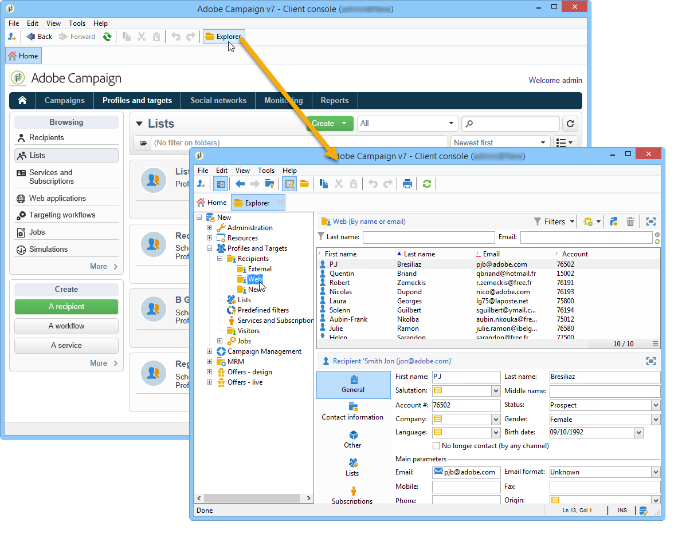

# 프로필 기본 정보{#about-profiles}

## 프로필 유형 {#profile-types}

Adobe Campaign을 사용하면 전체 라이프사이클 동안 프로파일을 관리할 수 있습니다.제작, 가져오기, 타깃팅, 작업 추적, 업데이트 등

각 프로필은 데이터베이스 항목과 일치합니다. 타깃팅, 적격한 개인 및 추적에 필요한 모든 정보가 포함되어 있습니다.

스토리지 공간을 기반으로 프로파일을 식별할 수 있습니다. 즉, 프로필은 일치할 수 있습니다.수신자, 방문자, 운영자, 가입자, 잠재 고객 등

## 수신자 프로필 {#recipient-profiles}

배달 수신자는 데이터베이스에 연결된 정보를 포함하는 프로필로 저장됩니다.성, 이름, 주소, 구독, 배달 등 캠페인을 만들 때 단순 또는 고급 기준에 따라 베이스의 프로파일 선택에 대한 게재 대상을 정의할 수 있습니다.

또한 프로파일이 데이터베이스가 아니라 파일에 저장된 수신자를 대상으로 하는 캠페인을 만들 수 있습니다. 이를 &quot;외부&quot; 배달이라고 합니다. 이러한 유형의 게재에 대한 자세한 내용은 [이 페이지를](../../delivery/using/steps-defining-the-target-population.md#selecting-external-recipients)참조하십시오.

수신자 프로필을 만드는 주요 방법은 다음과 같습니다.

* 그래픽 인터페이스 화면의 직접 입력,
* 수신자 목록 가져오기,
* 웹 양식을 통한 온라인 컬렉션

>[!NOTE]
>
>파일 및 웹 양식을 가져오는 방법을 알아보려면 [일반 가져오기 및 내보내기를](../../platform/using/generic-imports-and-exports.md)참조하십시오.

## 프로필 및 타겟 {#profiles-and-targets}

이 **[!UICONTROL Profiles and targets]** 링크를 사용하면 Adobe Campaign 데이터베이스에 저장된 수신자를 표시할 수 있습니다. 새 수신자를 만들고, 기존 수신자를 편집하고, 해당 프로필에 액세스할 수 있습니다. For more on this, refer to [this page](../../platform/using/editing-a-profile.md).

또한 다음과 같은 액세스 권한을 제공합니다.

* 목록;목록 [만들기 및 관리를](../../platform/using/creating-and-managing-lists.md)참조하십시오.
* 구독 서비스;이 [페이지를](../../delivery/using/managing-subscriptions.md)참조하십시오.
* 웹 애플리케이션;이 [페이지를](../../web/using/about-web-applications.md)참조하십시오.
* 수입 및 수출(일자리);일반 [가져오기 및 내보내기를](../../platform/using/generic-imports-and-exports.md)참조하십시오.
* 타깃팅 워크플로우;이 [페이지를](../../workflow/using/building-a-workflow.md#implementation-steps-)참조하십시오.

수신자 페이지에서는 프로필에 대해 자주 수행하는 작업을 수행할 수 있습니다.편집, 업데이트, 추가, 삭제, 정렬

고급 프로필 조작의 경우 Adobe Campaign 트리를 편집해야 합니다. 이렇게 하려면 Adobe Campaign 홈 페이지에서 **[!UICONTROL Explorer]** 링크를 클릭합니다.

기본적으로 수신자는 트리의 **[!UICONTROL Profiles and Targets > Recipients]** 노드에 저장됩니다. 이 보기뿐만 아니라 다음 보기에서 수신자를 만들 수 있습니다.

* 데이터베이스의 프로파일을 정렬 및 필터링합니다.필터링 [옵션](../../platform/using/filtering-options.md),
* 데이터베이스에서 프로파일 이동, 복사 또는 삭제프로필 [관리를](../../platform/using/managing-profiles.md)참조하십시오.
* 업데이트 프로파일;데이터 [업데이트를](../../platform/using/updating-data.md)참조하십시오.
* 받는 사람 내보내기프로필 [내보내기 및 가져오기](../../platform/using/exporting-and-importing-profiles.md),
* 수신자 그룹 만들기;목록 [만들기 및 관리를](../../platform/using/creating-and-managing-lists.md)참조하십시오.

고급 기능 및 구성에 액세스하려면 **[!UICONTROL Explorer]** 아이콘을 클릭해야 합니다.

Adobe Campaign 탐색기의 일반 레이아웃은 Adobe Campaign [사용 탐색기에서](../../platform/using/adobe-campaign-workspace.md#using-adobe-campaign-explorer)제공됩니다.

>[!NOTE]
>
>Adobe Campaign 트리에서 **[!UICONTROL Profiles and targets > Recipients]** 링크를 클릭하여 이 목록의 고급 보기를 표시할 수도 있습니다. 목록 표시를 필요에 맞게 구성할 수 있습니다. 열을 추가하거나 삭제할 수 있고 열 순서를 정의할 수 있으며 데이터를 정렬할 수 있습니다. 목록 표시 구성은 Adobe Campaign [사용 탐색기에서](../../platform/using/adobe-campaign-workspace.md#using-adobe-campaign-explorer)설명합니다.
>
>수신자 뷰를 정의할 수도 있습니다. 이 기능에 대한 자세한 내용은 폴더 및 [보기를](../../platform/using/access-management.md#folders-and-views)참조하십시오.

## 활성 프로필 {#active-profiles}

활성 프로필은 청구 용도로 카운트되는 프로필입니다.

&quot;**프로필**&quot;은 정보(예:최종 고객, 잠재 고객 또는 리드를 나타내는 nmsRecipient 테이블 또는 특정 채널과 관련된 쿠키 ID, 고객 ID, 모바일 식별자 또는 기타 정보가 포함된 외부 테이블의 레코드입니다.

청구 시 **유효한**&#x200B;프로필만 고려됩니다. 지난 12개월 동안 모든 채널을 통해 프로파일을 타깃팅하거나 커뮤니케이션한 경우 프로파일은 활성화된 것으로 간주됩니다.

>[!NOTE]
>
>Facebook 및 Twitter 채널은 고려되지 않습니다.

메뉴에 대한 개요를 볼 수 **[!UICONTROL Number of active profiles]****[!UICONTROL Administration > Campaign Management > Customer metrics]** 있습니다.

실제 개수는 **[!UICONTROL Number of active billing profiles]** (**[!UICONTROL billingActiveContactCount]**) [기술 워크플로우에](../../workflow/using/delivery.md)의해 수행됩니다. 이 워크플로우는 **[!UICONTROL Customer metrics]** 매일 실행되고메뉴에서 현재 기간 동안 기존 보고서에 새 데이터를 추가합니다. 각 기간은 12개월 동안 지속됩니다.

배달 준비 중 제외된 프로파일(Typical Rules, Quarterine)은 고려되지 않습니다. 여러 게재에서 타깃팅된 프로필은 한 번만 카운트됩니다.
