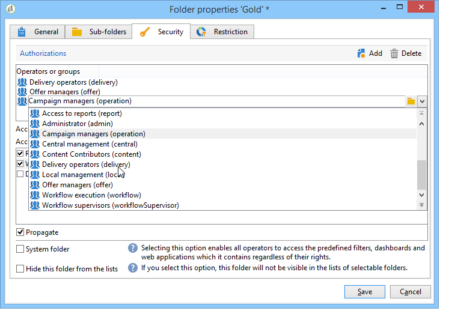
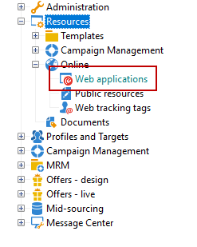

# 액세스 관리{#access-management}

## 권한 정보 {#about-permissions}

Adobe Campaign에서는 다양한 연산자에 할당된 권한을 정의하고 관리할 수 있습니다. 다음은 권한을 부여하거나 거부하는 권한 및 제한 세트입니다.

* 특정 기능에 대한 액세스(명명된 권한을 통해),
* 특정 레코드 액세스,
* 레코드 만들기, 수정 및/또는 삭제(작업, 연락처, 캠페인, 그룹 등)

권한은 연산자 프로필 또는 연산자 그룹에 적용됩니다.

연산자의 연결 모드에 연결된 안전 매개 변수에 의해 완료됩니다. 자세한 정보는 이 [페이지](../../installation/using/configuring-campaign-server.md#defining-security-zones)를 참조하십시오.

사용자에게 부여할 수 있는 권한은 두 가지 있습니다.

* 권한을 지정할 연산자 그룹을 정의한 다음 연산자를 하나 이상의 그룹에 연결할 수 있습니다. 따라서 권한을 재사용하고 연산자 프로파일을 보다 일관되게 만들 수 있습니다. 또한 프로파일을 손쉽게 관리하고 유지 관리할 수 있습니다. 그룹 만들기 및 관리는 [연산자 그룹](#operator-groups)에 있습니다.
* 그룹에 의해 할당된 권한을 오버로드하기 위해 이름이 지정된 권한을 사용자에게 직접 지정할 수 있습니다. 이러한 권한은 [명명된 권한](#named-rights)에 표시됩니다.

>[!NOTE]
>
>권한 정의를 시작하기 전에 [보안 구성 검사 목록](https://helpx.adobe.com/kr/campaign/kb/acc-security.html)을 읽어보는 것이 좋습니다.

## 연산자 {#operators}

### 연산자 {#about-operators} 정보

연산자는 로그인하고 작업을 수행할 권한이 있는 Adobe Campaign 사용자입니다.

기본적으로 연산자는 **[!UICONTROL Administration > Access management > Operators]** 노드에 저장됩니다.

연산자를 수동으로 만들거나 기존 LDAP 디렉토리에 매핑할 수 있습니다.

연산자를 만드는 전체 절차는 [이 페이지](#creating-an-operator)에 설명되어 있습니다.

Adobe Campaign 및 LDAP 통합에 대한 자세한 내용은 [이 페이지](../../installation/using/connecting-through-ldap.md)를 참조하십시오.

>[!IMPORTANT]
>
>연산자는 인스턴스에 로그온하려면 보안 영역에 연결해야 합니다. Adobe Campaign의 보안 영역에 대한 자세한 내용은 [이 페이지](../../installation/using/configuring-campaign-server.md#defining-security-zones)를 참조하십시오.

사용자는 Adobe ID을 사용하여 Adobe Campaign에 직접 연결할 수도 있습니다. 자세한 정보는 이 [페이지](../../integrations/using/about-adobe-id.md)를 참조하십시오.

### 연산자 {#creating-an-operator} 만들기

새 연산자를 만들고 권한을 부여하려면 아래 단계를 따르십시오.

1. 연산자 목록 위에 있는 **[!UICONTROL New]** 단추를 클릭하고 새 연산자의 세부 정보를 입력합니다.

   

1. 사용자의 **[!UICONTROL Identification parameters]**&#x200B;을(를) 지정합니다.로그인, 암호 및 이름입니다. 연산자가 로그인과 암호를 사용하여 Adobe Campaign에 로그온합니다. 사용자가 로그온하면 **[!UICONTROL Tools > Change password]** 메뉴를 통해 암호를 변경할 수 있습니다. 연산자의 이메일은 연산자가 승인을 처리할 때 알림을 수신할 수 있도록 해주므로 매우 중요합니다.

   이 섹션에서는 연산자를 조직 엔티티에 연결할 수도 있습니다. 자세한 내용은 [이 페이지](../../campaign/using/about-distributed-marketing.md)를 참조하십시오.

1. **[!UICONTROL Operator access rights]** 섹션에서 연산자에 부여된 권한을 선택합니다.

   연산자에 권한을 할당하려면 권한 목록 위에 있는 **[!UICONTROL Add]** 단추를 클릭한 다음 사용 가능한 그룹 목록에서 연산자 그룹을 선택합니다.

   

   하나 이상의 명명된 권한을 선택할 수도 있습니다([명명된 권한](#named-rights) 참조). 이렇게 하려면 **[!UICONTROL Folder]** 필드 오른쪽에 있는 화살표를 클릭하고 **[!UICONTROL Named rights]**:

   

   할당할 그룹 및/또는 명명된 권한을 선택하고 **[!UICONTROL OK]** 을 클릭하여 유효성을 확인합니다.

1. **[!UICONTROL Ok]**&#x200B;을 클릭하여 연산자를 만듭니다.기존 연산자 목록에 프로필이 추가됩니다.

   

>[!NOTE]
>
>새 연산자 폴더를 만들어 필요에 따라 연산자를 구성할 수 있습니다. 이렇게 하려면 연산자 폴더를 마우스 오른쪽 단추로 클릭하고 **[!UICONTROL Add an 'Operators' folder]**&#x200B;을 선택합니다.

연산자 프로필이 만들어지면 해당 정보를 추가하거나 업데이트할 수 있습니다. 이렇게 하려면 **[!UICONTROL Edit]** 탭을 클릭합니다.

>[!NOTE]
>
>**[!UICONTROL Session timeout]** 필드에서 FDA 세션 시간 초과 전의 지연을 조정할 수 있습니다. 자세한 내용은 [통합 데이터 액세스 정보](../../installation/using/about-fda.md)를 참조하십시오.

### {#time-zone-of-the-operator} 연산자의 시간대

**[!UICONTROL General]** 탭에서 연산자의 시간대를 선택할 수 있습니다. 기본적으로 연산자는 서버 시간대에서 작동합니다. 하지만 드롭다운 목록을 사용하여 다른 시간대를 선택할 수 있습니다.

시간대 구성은 [이 페이지](../../installation/using/time-zone-management.md)에 설명되어 있습니다.

>[!NOTE]
>
>다양한 시간대 내의 공동 작업은 UTC에 날짜 저장을 필요로 합니다. 날짜는 다음 컨텍스트의 해당 시간대에서 변환됩니다.날짜가 사용자 표준 시간대로 표시될 때, 파일을 가져오고 내보낼 때, 이메일 배달을 예약할 때, 작업이 워크플로우에서 예약된 시간(스케줄러, 대기, 시간 제한 등)
>
>이러한 컨텍스트에 연결된 제약 조건 및 권장 사항은 Adobe Campaign 문서의 관련 섹션에 표시됩니다.

또한 **[!UICONTROL Regional settings]** 드롭다운 목록을 사용하여 날짜 및 숫자를 표시할 형식을 선택할 수 있습니다.

### 액세스 권한 옵션 {#access-rights-options}

**[!UICONTROL Access rights]** 탭을 사용하여 연산자에 연결된 그룹과 명명된 권한을 업데이트합니다.

**[!UICONTROL Edit the access parameters...]** 링크를 사용하면 다음 옵션에 액세스할 수 있습니다.

* **[!UICONTROL Disable account]** 옵션을 사용하여 연산자의 계정을 비활성화할 수 있습니다.더 이상 Adobe Campaign에 액세스할 수 없습니다.

   >[!NOTE]
   >
   >계정이 비활성화되어도 운영자는 여전히 Campaign에서 알림 또는 알림을 받을 수 있습니다. 이 연산자에 대한 캠페인 알림 전송을 중지하려면 Adobe은 자신의 프로필에서 이메일 주소를 제거하는 것이 좋습니다.

* **[!UICONTROL Forbid access from the rich client]** 옵션을 사용하면 Adobe Campaign의 사용을 [웹 액세스](../../platform/using/adobe-campaign-workspace.md#console-and-web-access) 또는 API를 통해 제한할 수 있습니다.더 이상 Adobe Campaign 클라이언트 콘솔에 액세스할 수 없습니다.
* 안전구역을 운영자와 연결시킬 수 있습니다 자세한 정보는 이 [페이지](../../installation/using/configuring-campaign-server.md#defining-security-zones)를 참조하십시오.
* 적절한 링크를 사용하여 신뢰할 수 있는 IP 마스크를 정의할 수도 있습니다.

   IP 주소가 이 목록에 있는 경우 연산자를 사용하면 암호를 입력하지 않고도 Adobe Campaign에 연결할 수 있습니다.

   다음 예제와 같이 암호 없이 연결할 수 있도록 인증할 IP 주소 세트를 지정할 수도 있습니다.

   

   >[!NOTE]
   >
   >플랫폼에 안전하게 액세스하려면 이 옵션을 신중히 사용해야 합니다.

* **[!UICONTROL Restrict to information found in sub-folders of:]** 옵션을 사용하면 폴더 연산자에 속하는 권한을 제한할 수 있습니다. 이 옵션에 지정된 노드의 하위 폴더만 사용자에게 표시됩니다.

   

   >[!IMPORTANT]
   >
   >이것은 매우 엄격한 제한 사항이므로 주의해서 사용해야 한다. 이 유형의 권한으로 로그인한 연산자는 지정된 폴더의 컨텐츠만 볼 수 있고 탐색기를 통해 트리의 다른 노드에 액세스할 수 없습니다. 그러나 액세스할 수 있는 기능에 따라 달라집니다(예:워크플로우)에서 볼 수 없는 노드에 일반적으로 저장되는 데이터를 표시할 수 있습니다.

### 연산자 {#folders--approval-and-tasks-of-an-operator}의 폴더, 승인 및 작업

**[!UICONTROL Audit]** 탭에서는 연산자와 관련된 정보를 볼 수 있습니다. 연산자의 개입 영역에 정의된 설정을 기반으로 다양한 탭이 자동으로 추가됩니다.

다음 항목에 액세스할 수 있습니다.

* 연산자에 연결된 폴더의 권한 목록.

   

   >[!NOTE]
   >
   >자세한 내용은 [폴더 액세스 관리](#folder-access-management)를 참조하십시오.

* 운영자 승인 로그.

   

* 가입한 토론 포럼 목록.
* 달력 내 이벤트.
* 할당된 작업 목록입니다.

### 기본 연산자 {#default-operators}

Adobe Campaign은 기본적으로 프로파일을 구성하는 기술 운영업체를 사용합니다.관리자(&#39;관리자&#39;), 과금(&#39;과금&#39;), 모니터링, 웹 애플리케이션 에이전트(&#39;웹 앱&#39;) 등 이러한 옵션 중 일부는 플랫폼에 설치된 애플리케이션과 옵션에 따라 다릅니다.예를 들어 분산 마케팅 옵션이 설치된 경우에만 &#39;central&#39; 및 &#39;local&#39; 연산자를 볼 수 있습니다.

>[!IMPORTANT]
>
>정보 메시지가 플랫폼에서 반환되면 이러한 기술 운영자에게 기본적으로 통보됩니다. 해당 고객에게 연락처 이메일을 제공하는 것이 좋습니다.
>
>웹 응용 프로그램이 제대로 작동하는지 확인하려면 &#39;webapp&#39; 연산자에 대한 특정 지역 설정을 정의하지 않는 것이 좋습니다.

기본적으로 &#39;webapp&#39; 기술 운영자에게는 지정된 ADMINISTRATION 권한이 있으며 이로 인해 보안 위험이 발생할 수 있습니다. 이 문제를 해결하려면 이 권한을 제거하는 것이 좋습니다. 방법은 다음과 같습니다.

1. **[!UICONTROL Administration > Access management > Named rights]** 노드에서 **[!UICONTROL New]**&#x200B;을 클릭하여 권한을 만들고 이름을 WEBAPP로 지정합니다.

   

   명명된 권한은 [명명된 권한](#named-rights) 섹션에 자세히 설명되어 있습니다.

1. **[!UICONTROL Administration > Access management > Operators]** 노드에서 웹 응용 프로그램 에이전트 연산자(&#39;webapp&#39;)를 선택합니다.

   **[!UICONTROL Edit]** 탭을 선택한 다음 **[!UICONTROL Access rights]** 탭을 선택하고 목록에서 바로 명명된 ADMINISTRATION을 삭제합니다.

   

   **[!UICONTROL Add]**&#x200B;을(를) 클릭하고 방금 만든 WEBAPP을 선택한 다음 변경 내용을 저장합니다.

   

1. &#39;webapp&#39; 연산자가 주로 &#39;받는 사람&#39; 폴더인 이 연산자와 관련된 폴더에 데이터 액세스 권한을 읽고 쓰십시오.

   

   트리 폴더의 권한 수정은 [폴더 액세스 관리](#folder-access-management) 섹션에 자세히 설명되어 있습니다.

>[!NOTE]
>
>보안 지침에 대한 자세한 내용은 [Adobe Campaign 보안 구성 검사 목록](https://helpx.adobe.com/campaign/kb/acc-security.html)을 참조하십시오.

## 연산자 그룹 {#operator-groups}

연산자 그룹은 트리의 **[!UICONTROL Administration > Access management > Operator groups]** 노드를 통해 만들어집니다.

### 새 연산자 그룹 {#creating-a-new-operator-group} 만들기

새 연산자 그룹을 만들려면 다음 단계를 적용합니다.

1. 그룹 목록 오른쪽에 있는 **[!UICONTROL New]** 단추를 클릭하거나 목록을 마우스 오른쪽 단추로 클릭하고 **[!UICONTROL New]** 을 선택합니다.
1. 아래 섹션의 **[!UICONTROL General]** 탭에서 해당 필드에 이 그룹의 이름과 설명을 입력합니다.

   

1. **[!UICONTROL Content]** 탭을 클릭하여 이 그룹의 승인을 정의합니다.
1. **[!UICONTROL Add]** 단추를 클릭하여 지정된 권한을 선택하거나 그룹에 연결할 연산자를 선택합니다.
1. 드롭다운 목록 또는 **[!UICONTROL Folder]** 필드 오른쪽의 폴더를 클릭하여 이 그룹에 연결할 지정된 권한이나 연산자를 찾습니다.
1. 추가할 권한 또는 연산자를 선택하고 유효성을 검사하려면 **[!UICONTROL OK]**&#x200B;을 클릭합니다.

   

   다른 권한 또는 연산자를 추가하려면 이 작업을 반복합니다.

1. **[!UICONTROL Save]** 단추를 클릭하여 그룹에 추가합니다.

### 기본 그룹 {#default-groups}

기본 연산자 그룹은 다음과 같습니다.

1. **[!UICONTROL Administrator]**

   이 그룹의 연산자는 인스턴스에 대한 전체 액세스 권한을 가집니다. 관리자는 인터페이스에서 가장 기술적인 부분에 액세스할 수 있는 사용자입니다. **[!UICONTROL Administration]** 역할을 유지하고 플랫폼이 모두 설정되어 있는지 확인합니다.

   이 그룹에는 오른쪽이라는 이름의 다음 항목이 포함됩니다.

   * **[!UICONTROL ADMINISTRATION]**:워크플로우, 전달, 스크립트 등 모든 객체를 실행/생성/편집/삭제할 권리

1. **[!UICONTROL Delivery operators]**

   이 그룹의 연산자는 납품 관리를 담당합니다.이러한 구성 요소는 제공을 만들고 준비하는 데 필요한 기본 리소스(캠페인 유형, 배달 매핑, 기본 템플릿, 개인화 블록 등)에 대한 액세스를 가능하게 합니다.

   이 그룹에는 다음과 같은 명명된 권한이 포함됩니다.

   * **[!UICONTROL PREPARE DELIVERIES]**:전달 분석을 작성, 편집 및 시작할 수 있는 권한
   * **[!UICONTROL START DELIVERIES]**:이전에 분석한 전달을 승인할 수 있는 권리.

1. **[!UICONTROL Campaign managers]**

   이 그룹의 연산자는 마케팅 캠페인을 관리할 수 있습니다.캠페인(계획, 프로그램, 워크플로우, 예산 등)에 연결된 개체에 액세스할 수 있습니다. **[!UICONTROL Campaign]** 프레임워크 내에서(선택적 Adobe Campaign 모듈).

   이 그룹에는 다음과 같은 명명된 권한이 포함됩니다.

   * **[!UICONTROL INSERT FOLDERS]**:adobe campaign 트리에 폴더를 삽입할 권리(관련 분기에 대한 편집 권한이 있는 경우),
   * **[!UICONTROL WORKFLOW]**:워크플로우 사용 권한

   >[!NOTE]
   >
   >이 그룹에서는 연산자가 배달을 시작할 수 없습니다.

1. **[!UICONTROL Content contributors]**

   이 그룹의 연산자는 **[!UICONTROL Content management]**(선택적 Adobe Campaign 모듈) 프레임워크 내에서 콘텐트 폴더에 액세스할 수 있습니다. 이 그룹은 추가 권한을 부여하지 않습니다.

1. **[!UICONTROL Access to reports]**

   이 그룹은 웹 액세스를 통해 배달 보고서에 액세스하기 위해 외부 운영자를 위해 예약됩니다.

1. **[!UICONTROL Workflow execution]**

   이 그룹을 사용하면 캠페인과 관련이 없는 워크플로우를 관리할 수 있는 권한을 운영자에게 할당할 수 있습니다.

1. **[!UICONTROL Workflow supervisors]**

   이 그룹의 연산자는 캠페인 워크플로우에 대한 경고가 표시되는 경우 이메일 알림을 수신합니다.

1. 로컬 / 중앙 관리

   이러한 그룹을 사용하면 **[!UICONTROL Distributed marketing]**(선택적 Adobe Campaign 모듈)을 사용할 수 있습니다.

1. **[!UICONTROL Offer managers]**

   이 그룹의 연산자는 오퍼를 만들고 유지 관리할 수 있습니다. 이에 대한 자세한 내용은 이 [페이지](../../interaction/using/operator-profiles.md)를 참조하십시오.
이 그룹에는 다음과 같은 명명된 권한이 포함됩니다.

   * **[!UICONTROL INSERT FOLDERS]**:Adobe Campaign 트리에 폴더를 삽입할 권리(관련 분기에 대한 편집 권한이 있는 경우),
   * **[!UICONTROL EDIT FOLDERS]**:내부 이름, 레이블, 연결된 이미지, 하위 폴더 순서 등과 같은 폴더 속성을 변경할 수 있는 권한입니다.

## 명명된 권한 {#named-rights}

기본적으로 Adobe Campaign에서는 연산자 및 연산자 그룹에 할당된 승인을 정의할 수 있는 명명된 권한 집합을 제안합니다. 이러한 권한은 트리의 **[!UICONTROL Administration > Access management > Named rights]** 노드에서 편집할 수 있습니다.

이러한 권한은 다음과 같습니다.

* **[!UICONTROL ADMINISTRATION]**:권한이  **[!UICONTROL ADMINISTRATION]** 있는 연산자는 인스턴스에 대한 전체 액세스 권한을 가집니다. 관리 사용자는 워크플로우, 전달, 스크립트 등과 같은 모든 객체를 실행/생성/편집/삭제할 수 있습니다.

* **[!UICONTROL APPROVAL ADMINISTRATION]**:워크플로우 및 납품 내에서 여러 승인 단계를 설정하여 현재 상태가 지정된 연산자 또는 그룹에서 승인되었는지 확인할 수 있습니다. **[!UICONTROL APPROVAL ADMINISTRATION]** 권한을 가진 사용자는 승인 단계를 설정하고 해당 단계를 승인해야 하는 연산자 또는 연산자 그룹을 할당할 수도 있습니다.

* **[!UICONTROL CENTRAL]**:중앙 관리를 위한 권한(분산 마케팅).

* **[!UICONTROL DELETE FOLDER]**:폴더를 삭제할 권리. 이 권한을 사용하면 탐색기 보기에서 폴더를 삭제할 수 있습니다.

* **[!UICONTROL EDIT FOLDERS]**:내부 이름, 레이블, 연결된 이미지, 하위 폴더 순서 등과 같은 폴더 속성을 변경할 수 있는 권한입니다.

* **[!UICONTROL EXPORT]**:사용자는  **[!UICONTROL EXPORT]** 워크플로우 활동을 사용하여 Adobe Campaign 인스턴스에서 서버 또는 로컬 컴퓨터의 파일로 데이터를 내보낼 수 있습니다.

* **[!UICONTROL FILES ACCESS]**:서버에서 파일을 읽고 쓸 수 있도록  **[!UICONTROL JavaScript]** 워크플로우 활동에 작성할 수 있는 스크립트를 통해 파일을 읽고 쓸 수 있습니다.

* **[!UICONTROL IMPORT]**:범용 데이터 가져오기에 딱 맞는 권한 **[!UICONTROL IMPORT]** 다른 테이블로 데이터를 가져올 수 있지만  **[!UICONTROL RECIPIENT IMPORT]** 오른쪽에서는 수신자 테이블으로만 데이터를 가져올 수 있습니다.

* **[!UICONTROL INSERT FOLDERS]**:폴더를 삽입할 권리. **[!UICONTROL INSERT FOLDERS]** 권한을 가진 사용자는 탐색기 보기의 폴더 트리에 새 폴더를 만들 수 있습니다.

* **[!UICONTROL LOCAL]**:로컬 관리에 대한 권한(Distributed Marketing).

* **[!UICONTROL MERGE]**:선택한 레코드를 하나로 병합할 수 있습니다. 수신자가 중복으로 존재하는 경우 사용자가 **[!UICONTROL MERGE]** 권한을 사용하여 중복 항목을 선택하고 기본 수신자에게 병합할 수 있습니다.

* **[!UICONTROL PREPARE DELIVERIES]**:전달을 작성, 편집 및 저장할 수 있습니다. **[!UICONTROL PREPARE DELIVERIES]** 오른쪽의 사용자는 배달 분석 프로세스를 시작할 수도 있습니다.

* **[!UICONTROL PRIVACY DATA RIGHT]**:개인 정보 데이터를 수집 및 삭제할 권리. 자세한 정보는 이 [페이지](https://helpx.adobe.com/kr/campaign/kb/acc-privacy.html)를 참조하십시오.

* **[!UICONTROL PROGRAM EXECUTION]**:다양한 프로그래밍 언어로 명령을 실행할 수 있는 권한입니다.

* **[!UICONTROL RECIPIENT IMPORT]**:수신자를 가져올 수 있는 권리. **[!UICONTROL RECIPIENT IMPORT]** 권한이 있는 사용자는 로컬 파일을 수신자 테이블로 가져올 수 있습니다.

* **[!UICONTROL SQL SCRIPT EXECUTION]** 데이터베이스에서 직접 SQL 명령을 실행할 수 있는 권한입니다.

* **[!UICONTROL START DELIVERIES]**:이전에 분석한 제공을 승인할 수 있는 권리. 배달 분석 후, 배달은 다양한 승인 단계에서 일시 중지되며 다시 시작하려면 승인을 받아야 합니다. **[!UICONTROL START DELIVERIES]** 권한이 있는 사용자는 배달을 승인할 수 있습니다.

* **[!UICONTROL USE SQL DATA MANAGEMENT ACTIVITY]**:작업 테이블을 만들고 채우기 위해 SQL 데이터 관리 작업을 사용하여 고유한 SQL 스크립트를 작성할 수 있는 권한입니다( [이 섹션](../../workflow/using/sql-data-management.md) 참조).

* **[!UICONTROL WORKFLOW]**:워크플로우를 실행할 수 있는 권한 이 권한이 없으면 사용자는 워크플로우를 시작, 중지 또는 다시 시작할 수 없습니다.

* **[!UICONTROL WEBAPP]**:웹 애플리케이션 사용 권한

>[!NOTE]
>
>이 목록은 플랫폼에 설치된 추가 기능에 따라 다를 수 있습니다.

## 액세스 권한 매트릭스 {#access-rights-matrix}

기본 그룹 및 명명된 권한을 사용하여 연산자는 탐색 계층 구조의 특정 폴더에 액세스하고 읽기, 쓰기 및 삭제 권한을 부여할 수 있습니다.

Adobe Campaign 액세스 권한 매트릭스는 [여기](/help/platform/using/assets/access-rights-matrix.pdf)에서 사용할 수 있습니다.

## 폴더 액세스 관리 {#folder-access-management}

트리의 각 폴더에 첨부된 액세스 권한이 읽기, 쓰기 및 삭제됩니다. 파일에 액세스하려면 연산자 또는 연산자 그룹이 파일에 대한 읽기 권한을 적어도 가져야 합니다.

### {#edit-permissions-on-a-folder} 폴더에 대한 권한 편집

트리의 특정 폴더에 대한 권한을 편집하려면 아래 절차를 따르십시오.

1. 폴더를 마우스 오른쪽 단추로 클릭하고 **[!UICONTROL Properties...]**&#x200B;을 선택합니다.

   

1. 이 폴더의 승인을 보려면 **[!UICONTROL Security]** 탭을 클릭합니다.

   

### 권한 수정 {#modify-permissions}

권한을 수정하려면 다음을 수행합니다.

* **그룹 또는 연산자를 바꿉니다**. 이렇게 하려면 폴더에 대한 권한이 있는 그룹(또는 연산자) 중 하나를 클릭하고 드롭다운 목록에서 새 그룹(또는 새 연산자)을 선택합니다.

   

* **그룹 또는 연산자를 승인합니다**. 이렇게 하려면 **[!UICONTROL Add]** 단추를 클릭하고 이 폴더에 대한 승인을 할당할 그룹 또는 연산자를 선택합니다.
* **그룹 또는 연산자** 금지. 이렇게 하려면 **[!UICONTROL Delete]**&#x200B;을 클릭하고 이 폴더에 대한 권한을 제거할 그룹 또는 연산자를 선택합니다.
* **그룹 또는 연산자에 할당된 권한을 선택합니다**. 이렇게 하려면 해당 그룹 또는 연산자를 클릭한 다음 부여할 액세스 권한을 선택하고 다른 권한을 선택 취소합니다.

   

### 권한 전달 {#propagate-permissions}

인증 및 액세스 권한을 전파할 수 있습니다. 이렇게 하려면 폴더 속성에서 **[!UICONTROL Propagate]** 옵션을 선택합니다.

그러면 이 창에 정의된 인증이 현재 노드의 모든 하위 폴더에 적용됩니다. 그런 다음 하위 폴더 각각에 대해 이러한 승인을 오버로드할 수 있습니다.

>[!NOTE]
>
>폴더에 대해 이 옵션을 지우면 하위 폴더에 대해 자동으로 지워지지 않습니다. 각 하위 폴더에 대해 명시적으로 지우십시오.

### 모든 연산자 {#grant-access-to-all-operators}에 대한 액세스 권한 부여

**[!UICONTROL Security]** 탭에서 **[!UICONTROL System folder]** 옵션을 선택하면 모든 연산자가 해당 권한에 상관없이 이 데이터에 액세스할 수 있습니다. 이 옵션이 선택되어 있으면 연산자(또는 해당 그룹)를 인증 목록에 명시적으로 추가해야 사용자가 액세스할 수 있습니다.

## 폴더 및 보기 {#folders-and-views}

### {#about-folders} 폴더 정보

폴더는 Adobe Campaign 트리의 노드입니다. 이러한 노드는 **[!UICONTROL Add new folder]** 메뉴를 통해 트리를 마우스 오른쪽 단추로 클릭하여 만들어집니다. 기본적으로 첫 번째 메뉴를 사용하면 현재 컨텍스트에 해당하는 폴더를 추가할 수 있습니다.

트리의 다른 모든 폴더에서처럼 이러한 폴더에 권한을 부여할 수 있습니다. [폴더 액세스 관리](#folder-access-management)를 참조하십시오.

### 보기 정보 {#about-views}

또한 데이터에 대한 액세스를 제한하고 트리 내용을 요구 사항에 맞게 구성하기 위해 보기를 만들 수 있습니다. 그런 다음 보기에 권한을 할당할 수 있습니다.

보기는 같은 유형의 다른 폴더 하나 이상에 물리적으로 저장되는 레코드를 표시하는 폴더입니다. 예를 들어 뷰인 캠페인 폴더를 만드는 경우 기본적으로 데이터베이스에 있는 모든 캠페인이 원점에 상관없이 표시됩니다. 그런 다음 이 데이터를 필터링할 수 있습니다.

폴더를 보기로 변환할 때 데이터베이스에 있는 폴더 유형에 해당하는 모든 데이터가 저장되는 폴더에 관계없이 뷰에 표시됩니다. 그런 다음 필터링하여 표시되는 데이터 목록을 제한할 수 있습니다.

>[!IMPORTANT]
>
>보기에는 데이터가 들어 있고 데이터에 대한 액세스 권한을 제공하지만 데이터는 보기 폴더에 물리적으로 저장되지 않습니다. 연산자는 데이터 소스 폴더에서 원하는 작업에 대한 적절한 권한을 가지고 있어야 합니다(읽기 액세스 최소).
>
>소스 폴더에 대한 액세스 권한을 부여하지 않고 뷰에 대한 액세스를 제공하려면 소스 폴더의 부모 노드에 대한 읽기 액세스 권한을 부여하지 마십시오.

뷰를 폴더와 구분하기 위해 각 보기의 이름이 다른 색상(어두운 영역)으로 표시됩니다.

### 폴더 추가 및 보기 만들기 {#adding-folders-and-creating-views}

아래 예에서는 특정 데이터를 표시하는 새 폴더를 만듭니다.

1. 새 **[!UICONTROL Deliveries]** 유형 폴더를 만들고 이름을 **배달 프랑스**&#x200B;로 지정합니다.
1. 이 폴더를 마우스 오른쪽 단추로 클릭하고 **[!UICONTROL Properties...]**&#x200B;을 선택합니다.

   

1. **[!UICONTROL Restriction]** 탭에서 **[!UICONTROL This folder is a view]**&#x200B;를 선택합니다. 그러면 데이터베이스의 모든 배달이 표시됩니다.

   

1. 창의 가운데 섹션에 있는 쿼리 편집기에서 배달 필터 기준을 정의합니다.그러면 정의된 필터에 해당하는 캠페인이 표시됩니다.

   >[!NOTE]
   >
   >쿼리 편집기는 [이 섹션](../../platform/using/about-queries-in-campaign.md)에 있습니다.

   다음 필터 조건 사용:

다음 배달이 보기에 표시됩니다.

>[!NOTE]
>
>[트랜잭션 메시징](../../message-center/using/about-transactional-messaging.md) 이벤트를 관리할 때 액세스 권한 문제가 발생할 수 있으므로 **[!UICONTROL Real time events]** 또는 **[!UICONTROL Batch events]** 폴더를 실행 인스턴스에서 보기로 설정할 수 없습니다. 이벤트 컬렉션에 대한 자세한 내용은 [이 섹션](../../message-center/using/event-collection.md)을 참조하십시오.