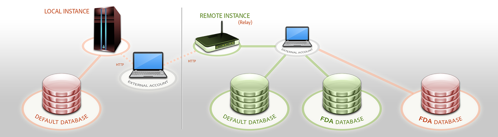

# 외부 데이터베이스 액세스{#accessing-an-external-database}

## 통합 데이터 액세스 정보 {#about-federated-data-access}

Adobe Campaign은 하나 이상의 **외부 데이터베이스에 저장된** 정보를 처리하기 위해 Federated Data Access(FDA) 옵션을 제공합니다.adobe Campaign 데이터 구조를 변경하지 않고 외부 데이터에 액세스할 수 있습니다.

>[!CAUTION]
>
>Federated **Data Access** (FDA) 모듈은 선택 사항입니다. Adobe Campaign 라이선스 계약서를 확인하십시오.
>  
>또한 FDA를 통해 외부 데이터베이스에 액세스하는 것은 사내 또는 하이브리드 설치에서만 가능합니다.

### 운영 원칙 {#operating-principle}

FDA 옵션을 사용하면 SQL 소스로부터 데이터를 수집하고 타깃팅된 테이블의 구조를 자동으로 검색할 수 있습니다.

이 기능을 사용하려면 다음을 수행해야 합니다.

1. Adobe Campaign FDA 모듈과 호환되는 외부 데이터베이스가 있어야 합니다. 데이터베이스 시스템 및 호환 버전 목록은 [호환성 매트릭스에](https://helpx.adobe.com/campaign/kb/compatibility-matrix.html)자세히 설명되어 있습니다. 또한 사용자는 Adobe Campaign 및 외부 데이터베이스에서 [필요한 권한을](#remote-database-access-rights) 가져야 합니다.
1. [Adobe Campaign 서버에 데이터베이스에 해당하는 드라이버를](#specific-configurations-by-database-type) 설치합니다.
1. [Adobe Campaign과 외부 데이터베이스 간의 연결을 설정할 수 있는 외부 계정을](#connecting-to-the-database) 만들고 구성합니다. 사용 가능한 외부 계정에 대한 자세한 내용은 이 [페이지를](../../platform/using/external-accounts.md)참조하십시오.
1. [Adobe Campaign에서 외부 데이터베이스의 읽기 스키마를](#creating-the-data-schema) 만듭니다. 이를 통해 외부 데이터베이스의 데이터 구조를 인식할 수 있습니다.
1. 마지막으로 [전달의 수신자가 외부 데이터베이스에서 오는 경우 이전에 생성된 스키마에서 새 대상 매핑을](#defining-data-mapping) 만듭니다. 이것은 특히 납품을 개인화하는 것과 관련하여 특정한 제한 사항을 나타낸다.

데이터 읽기 스키마가 만들어지면 Adobe Campaign 워크플로우에서 데이터를 처리할 수 있습니다. For more on this, refer to [this section](../../workflow/using/executing-a-workflow.md#architecture).

### 모범 사례 및 추천 {#best-practices-and-recommendations}

워크플로우에서 일괄 처리 모드에서 외부 데이터베이스의 데이터를 조작하기 위해 FDA 옵션이 제공됩니다. FDA를 다른 맥락에서 사용하는 경우, 예를 들면, 군 작전의 경우, 예방 조치(개인화, 상호 작용, 실시간 전달 등)를 수행해야 합니다.

외부 데이터베이스를 사용하기 전에 성능 테스트를 수행하여 가능한 문제를 감지하고 이 옵션을 사용하여 최적화합니다.

Adobe Campaign과 외부 데이터베이스를 최대한 모두 사용해야 하는 작업을 방지합니다. 이렇게 하려면 다음을 수행할 수 있습니다.

* 결과를 Adobe Campaign으로 다시 가져오기 전에 Adobe Campaign 데이터베이스를 외부 데이터베이스로 내보내고 외부 데이터베이스에서만 작업을 실행합니다.
* 외부 Adobe Campaign 데이터베이스에서 데이터를 수집하고 작업을 로컬로 실행합니다.

외부 데이터베이스의 데이터를 사용하여 게재에서 개인화를 수행하려는 경우 워크플로우에서 사용할 데이터를 수집하여 임시 테이블에서 사용할 수 있도록 합니다. 그런 다음 임시 테이블의 데이터를 사용하여 배달을 개인화합니다.

### 제한 사항 {#limitations}

FDA 옵션은 사용자가 사용하는 외부 데이터베이스 시스템의 소프트 사용에 따릅니다.

성능상의 이유로, Adobe는 이 기능을 사용하여 단일 작업(전달 개인화, 상호 작용 모듈, 실시간)을 수행하는 것을 권장하지 않습니다.

## 데이터베이스 유형별 특정 구성 {#specific-configurations-by-database-type}

Adobe Campaign에서 액세스할 수 있게 하려는 외부 데이터베이스에 따라 특정 구성을 수행해야 합니다. 이러한 구성은 기본적으로 드라이버를 설치하고 Adobe Campaign 서버의 각 RDBMS에 속하는 환경 변수를 선언하는 것과 관련되어 있습니다.

일반적으로 Adobe Campaign 서버의 외부 데이터베이스에 해당 클라이언트 레이어를 설치해야 합니다.

>[!NOTE]
>
>호환 버전은 캠페인 호환성 [매트릭스에 나와 있습니다](https://helpx.adobe.com/campaign/kb/compatibility-matrix.html#FederatedDataAccessFDA) .

### Hadoop에 대한 액세스 권한 구성 {#configure-access-to-hadoop}

FDA에서 Hadoop 외부 데이터베이스에 연결하려면 Adobe Campaign 서버에서 다음 구성이 필요합니다.

#### Windows용 {#for-windows}

1. Windows용 ODBC 및 [Azure HD](https://www.microsoft.com/en-us/download/details.aspx?id=40886) Insight 드라이버를 설치합니다.
1. ODBC DataSource 관리자 도구를 실행하여 DSN(데이터 소스 이름)을 만듭니다. Hive용 시스템 DSN 샘플이 제공되어 수정됩니다.

   ```
   Description: vorac (or any name you like)
   Host: vorac.azurehdinsight.net
   Port: 443
   Database: sm_tst611 (or your database name)
   Mechanism: Azure HDInsight Service
   User/Password: admin/<your password here>
   ```

1. 공유 연결 [](#creating-a-shared-connection) 만들기 섹션에 설명된 대로 Hadoop 외부 계정을 만듭니다.

#### Linux용 {#for-linux}

1. Linux용 통합 설치

   ```
   apt-get install unixodbc
   ```

1. HortonWorks에서 Apache Hive용 ODBC 드라이버 다운로드 및 설치:https://www.hortonworks.com/downloads/ [](https://www.hortonworks.com/downloads/).

   ```
   dpkg -i hive-odbc-native_2.1.10.1014-2_amd64.deb
   ```

1. ODBC 파일 위치를 확인합니다.

   ```
   root@campadpac71:/tmp# odbcinst -j
   unixODBC 2.3.1
   DRIVERS............: /etc/odbcinst.ini
   SYSTEM DATA SOURCES: /etc/odbc.ini
   FILE DATA SOURCES..: /etc/ODBCDataSources
   USER DATA SOURCES..: /root/.odbc.ini
   SQLULEN Size.......: 8
   SQLLEN Size........: 8
   SQLSETPOSIROW Size.: 8
   ```

1. DSN(데이터 소스 이름)을 만들고 odbc.ini 파일을 편집합니다. 그런 다음 하이브 연결에 대한 DSN을 만듭니다.

   다음은 HDInsight에서 &quot;viral&quot;이라는 연결을 설정하는 예입니다.

   ```
   [ODBC Data Sources]
   vorac 
   
   [vorac]
   Driver=/usr/lib/hive/lib/native/Linux-amd64-64/libhortonworkshiveodbc64.so
   HOST=vorac.azurehdinsight.net
   PORT=443
   Schema=sm_tst611
   HiveServerType=2
   AuthMech=6
   UID=admin
   PWD=<your password here>
   HTTPPath=
   UseNativeQuery=1
   ```

   >[!NOTE]
   >
   >여기서 **UseNativeQuery** 매개 변수는 매우 중요합니다. 캠페인은 하이브를 인식하므로 UseNativeQuery가 설정되지 않으면 제대로 작동하지 않습니다. 일반적으로 드라이버 또는 하이브 SQL 커넥터는 쿼리를 다시 작성하고 열 순서를 변경합니다.

   인증 설정은 하이브/Hadoop 구성에 따라 다릅니다. 예를 들어 HD Insight의 경우 [여기에](http://www.simba.com/products/Spark/doc/ODBC_InstallGuide/unix/content/odbc/hi/configuring/authenticating/azuresvc.htm)설명된 대로 사용자/암호 인증에는 AuthTech=6을 사용합니다.

1. 변수를 내보냅니다.

   ```
   export ODBCINI=/etc/myodbc.ini
   export ODBCSYSINI=/etc/myodbcinst.ini
   ```

1. /usr/lib/hive/lib/native/Linux-amd64-64/hortonworks.hiveodbc.ini를 통해 Hortonworks 드라이버를 설치합니다.

   Campaign 및 unix-odbc(libodbcinst)와 연결하려면 UTF-16을 사용해야 합니다.

   ```
   [Driver]
   
   DriverManagerEncoding=UTF-16
   ErrorMessagesPath=/usr/lib/hive/lib/native/hiveodbc/ErrorMessages/
   LogLevel=0
   LogPath=/tmp/hive
   SwapFilePath=/tmp
   
   ODBCInstLib=libodbcinst.so
   ```

1. 이제 isql을 사용하여 연결을 테스트할 수 있습니다.

   ```
   isql vorac
   isql vorac -v
   ```

1. 공유 연결 [](#creating-a-shared-connection) 만들기 섹션에 설명된 대로 Hadoop 외부 계정을 만듭니다.

### MySQL에 대한 액세스 구성 {#configure-access-to-mysql}

MySQL 데이터베이스를 구성하는 방법에 대한 자세한 내용은 이 [문서를](https://helpx.adobe.com/campaign/kb/campaign_fda_mysql.html)참조하십시오.

### Netezza 액세스 구성 {#configure-access-to-netezza}

FDA에서 Netezza 외부 데이터베이스에 연결하려면 Adobe Campaign 서버에 아래 추가 구성이 필요합니다.

1. 사용하는 운영 체제에 따라 Netezza용 ODBC 드라이버를 설치합니다.

   * **linux용 nz-linuxclient-v7.2.0.0.tar.gz** . 운영 체제(linux 또는 linux64)에 해당하는 폴더를 선택하고 압축 풀기 명령을 시작합니다. 기본적으로 제안되는 저장소에서 설치하도록 둘 수 있습니다.&quot;/usr/local/nz&quot;
   * **windows용 nz-winclient-v7.2.0.0.zip** . 파일의 압축을 풀고 운영 체제에 해당하는 실행 스크립트를 시작합니다.nzodbcsetup.exe 또는 nzodbcsetup64.exe. 마법사 지침에 따라 드라이버 설치를 완료합니다.

1. ODBC 드라이버를 구성합니다. 구성은 표준 파일에서 수행할 수 있습니다./etc/odbc.ini **일반** 매개 변수 및 **/etc/odbcinst.ini** 드라이버 선언을 위한 지침을 참조하십시오.

   * **/etc/odbc.ini**

      ```
      [ODBC]
      InstallDir=/etc/
      ```

      &quot;InstallDir&quot;은 odbcinst.ini 파일의 위치에 해당합니다.

   * **/etc/odbcinst.ini**

      ```
      [ODBC Drivers]
      NetezzaSQL = Installed
      
      [NetezzaSQL]
      Driver           = /usr/local/nz/lib/libnzsqlodbc3.so
      Setup            = /usr/local/nz/lib/libnzsqlodbc3.so
      APILevel         = 1
      ConnectFunctions = YYN
      Description      = Netezza ODBC driver
      DriverODBCVer    = 03.51
      DebugLogging     = false
      LogPath          = /tmp
      UnicodeTranslationOption = utf8
      CharacterTranslationOption = all
      PreFetch         = 256
      Socket           = 16384
      ```

1. Adobe Campaign 서버의 환경 변수를 지정합니다.

   * **LD_LIBRARY_PATH**:/usr/local/nz/lib 및 /usr/local/nz/lib64. &quot;/usr/local/nz&quot;는 드라이버를 설치할 때 기본적으로 제공되는 설치 저장소에 해당합니다. 여기에서 설치를 위해 선택한 저장소를 지정해야 합니다.
   * **ODBCINI**:odbc.ini 파일의 위치(예: /etc/odbc.ini).
   * **NZ_ODBC_INI_PATH**:odbc.ini 파일의 위치입니다. 또한 Netezza는 odbc.ini 파일을 사용하기 위해 이 두 번째 변수를 필요로 합니다.

1. 공유 연결 [](#creating-a-shared-connection) 만들기 섹션에 설명된 대로 Netezza 외부 계정을 만듭니다.

>[!NOTE]
>
>자동으로 생성된 기본 키를 포함하는 스키마에 대한 작업은 고려되지 않습니다.
>
>테이블에서 스키마에 정의된 첫 **번째 인덱스의 Organize on** 절을 사용합니다. 이 절은 Netezza와 함께 1-4개의 열로 제한되므로 이 인덱스는 4개 이상의 열을 포함할 수 없습니다.

### Oracle에 대한 액세스 구성 {#configure-access-to-oracle}

FDA에서 Oracle 외부 데이터베이스에 연결하려면 Adobe Campaign 서버에 아래 추가 구성이 필요합니다.

#### Linux용 {#for-linux-1}

1. Oracle 버전에 해당하는 Oracle 전체 클라이언트를 설치합니다.
1. TNS 정의를 설치에 추가합니다. 이렇게 하려면 /etc/oracle 저장소의 **tnsnames.ora** 파일에 지정합니다. 이 저장소가 없으면 이 저장소를 만듭니다.

   그런 다음 새 TNS_ADMIN 환경 변수를 만듭니다.TNS_ADMIN=/etc/oracle을 내보내고 시스템을 다시 시작합니다.

1. Oracle을 Adobe Campaign 서버(nlserver)에 통합합니다. 이렇게 하려면 **customer.sh** 파일이 Adobe Campaign 서버 트리 구조의 &quot;nl6&quot; 폴더에 있으며 Oracle 라이브러리에 대한 링크가 포함되어 있는지 확인하십시오.

   예를 들어 11.2의 클라이언트의 경우:

   ```
   export ORACLE_HOME=/usr/lib/oracle/11.2
   export TNS_ADMIN=/etc/oracle
   export LD_LIBRARY_PATH=$ORACLE_HOME/client64/lib:$LD_LIBRARY_PATH
   ```

   >[!NOTE]
   >
   >이러한 값(특히 ORACLE_HOME)은 설치 저장소에 따라 다릅니다. 이러한 값을 참조하기 전에 트리 구조를 확인해야 합니다.

1. Oracle에 필요한 라이브러리를 설치합니다.

   * **libclntsh.so**

      ```
      cd /usr/lib/oracle/<version>/client<architecture>/lib
      ln -s libclntsh.so.<version> libclntsh.so
      ```

   * **libaio1**

      ```
      aptitude install libaio1
      or
      yum install libaio1
      ```

#### Windows용 {#for-windows-1}

1. Oracle 클라이언트를 설치합니다.
1. C:Oracle 폴더에서 TNS **정의를 포함하는 tnsnames.ora** 파일을 생성합니다.

   C:Oracle을 값으로 사용하여 TNS_ADMIN 환경 변수를 추가하고 시스템을 다시 시작합니다.

### Sybase IQ에 대한 액세스 구성 {#configure-access-to-sybase-iq}

FDA에서 Sybase IQ 외부 데이터베이스에 연결하려면 Adobe Campaign 서버에 아래 추가 구성이 필요합니다.

1. 통합 패키지가 서버에 있는지 확인합니다.
1. iq_odbc **를 설치합니다**. 설치가 끝날 때 오류가 발생할 수 있습니다. 이 오류는 무시될 수 있습니다.
1. iq_ **client_common**&#x200B;설치 설치가 끝날 때 Java 오류가 발생할 수 있습니다. 이 오류는 무시될 수 있습니다.
1. ODBC 드라이버를 구성합니다. 구성은 표준 파일에서 수행할 수 있습니다./etc/odbc.ini일반 매개 변수 및 드라이버 선언용 /etc/odbcinst.ini를 참조하십시오.

   * **/etc/odbc.ini** (문자와 같은 `<server_alias>` 값 대신 자체):

      ```
      [ODBC Data Sources]
      <server_alias>=libdbodbc.so
      
      [<server_alias>]
      Driver=/opt/sybase/IQ-16_0/lib64/libdbodbc16.so
      Description=<description>
      Username=<username>
      Password=<password>
      ServerName=<server_name>
      CommLinks=tcpip(host=<host>)
      ```

   * **/etc/odbcinst.ini**

      ```
      [ODBC DRIVERS]
      SAP SybaseIQ=Installed
      
      [SAP SybaseIQ]
      Driver=/opt/sybase/IQ-16_0/lib64/libdbodbc16.so
      ```

1. LD_LIBRARY_PATH 변수에 새 libobc16.so 라이브러리의 경로를 추가합니다. 그렇게 하려면:

   * customer.sh 파일을 사용하여 경로를 선언하는 경우:ld_LIBRARY_PATH 변수에 대해 /opt/sybase/IQ-16_0/lib64 경로를 추가합니다.
   * 그렇지 않은 경우 Unix 명령을 사용합니다.

1. 공유 연결 [](#creating-a-shared-connection) 만들기 섹션에 설명된 대로 새 FDA 외부 계정을 만듭니다. Sybase IQ의 경우 서버 이름은 5단계에서 정의된 ODBC 연결(`<server_alias>`)에 해당합니다. 서버 이름이 반드시 필요한 것은 아닙니다.

>[!NOTE]
>
>Windows의 경우 Sybase IQ 클라이언트를 Adobe Campaign 서버에 설치하고 ODBC 연결을 만들어야 합니다. Windows에서 Adobe Campaign 서버(nlserver)가 서비스로 실행 중일 때 시스템 데이터 소스를 만들어야 합니다.

### Teradata에 대한 액세스 구성 {#configure-access-to-teradata}

FDA에서 Teradata 외부 데이터베이스에 연결하려면 Adobe Campaign 서버에 특정 추가 구성이 필요합니다. Teradata 데이터베이스를 구성하는 방법에 대한 자세한 내용은 이 [문서를](https://helpx.adobe.com/campaign/kb/campaign_fda_teradata.html)참조하십시오.

1. Teradata [용 ODBC 드라이버를 설치합니다](http://downloads.teradata.com/download/connectivity/odbc-driver/linux).

   Red Hat(또는 CentOS)/Suse에 다음 순서로 설치할 수 있는 세 개의 패키지로 구성됩니다.

   * TeraGSS
   * tdicu1510 (setup_wrapper.sh를 사용하여 설치)
   * tdobc1510 (setup_wrapper.sh를 사용하여 설치)

1. ODBC 드라이버를 구성합니다. 구성은 표준 파일에서 수행할 수 있습니다./etc/odbc.ini **일반** 매개 변수에 대한 자세한 내용 및 /etc/odbcinst.ini드라이버 선언:

   * **/etc/odbc.ini**

      ```
      [ODBC]
      InstallDir=/etc/
      ```

      &quot;InstallDir&quot;은 **odbcinst.ini** 파일의 위치에 해당합니다.

   * **/etc/odbcinst.ini**

      ```
      [ODBC DRIVERS]
      teradata=Installed
      
      [teradata]
      Driver=/opt/teradata/client/15.10/lib64/tdata.so
      APILevel=CORE
      ConnectFunctions=YYY
      DriverODBCVer=3.51
      SQLLevel=1
      ```

1. Adobe Campaign 서버의 환경 변수를 지정합니다.

   * **LD_LIBRARY_PATH**:/opt/teradata/client/15.10/lib64 및 /opt/teradata/client/15.10/odbc_64/lib.
   * **ODBCINI**:odbc.ini 파일의 위치(예: /etc/odbc.ini).
   * **NLSPATH**:opermsgs.cat 파일의 위치(/opt/teradata/client/15.10/msg/opermsgs.cat)

### SAP HANA에 대한 액세스 구성 {#configure-access-to-sap-hana}

FDA에서 SAP HANA 외부 데이터베이스에 연결하려면 Adobe Campaign 서버에 특정 추가 구성이 필요합니다.

1. 사용하는 운영 체제에 따라 SAP HANA용 ODBC 드라이버를 설치합니다.

   * **linux용 hdb_client_linux.tgz** . 압축을 푼 후 hdbinst 명령을 실행하고 지침에 따라 드라이버 설치를 완료하십시오.
   * **Windows용 hdb_client_windows.zip** . 파일의 압축을 풀고 실행 파일을 시작합니다. **hdbinst.exe**. 마법사 지침에 따라 드라이버 설치를 완료합니다.

1. ODBC 드라이버를 구성합니다. 구성은 표준 파일에서 수행할 수 있습니다./etc/odbc.ini를 참조하십시오.

   * **/etc/odbc.ini**

      ```
      [ODBC]
      InstallDir=/etc/
      
      [HDB]
      Driver=HDBODBC
      servernode=localhost:39013 (this value depend of your server)
      User:SYSTEM
      ```

      &quot;InstallDir&quot;은 **odbcinst.ini** 파일의 위치에 해당합니다.

   * **/etc/odbcinst.ini**

      ```
      [HDBODBC]
      Description = "SmartCloudPT HANA"
      Driver = /usr/sap/hdbclient/libodbcHDB.so
      ```

1. Adobe Campaign 서버의 환경 변수를 지정합니다.

   * **LD_LIBRARY_PATH**:SAP Hana 클라이언트(/usr/sap/hdbclient/ [libobcHDB.so](http://libodbchdb.so/) 기본)에 대한 링크가 포함되어야 합니다.
   * **ODBCINI**:odbc.ini 파일의 위치(예: /etc/odbc.ini).

1. 공유 연결 [](#creating-a-shared-connection) 만들기 섹션에 설명된 대로 SAP 하나 외부 계정을 만듭니다.

## 원격 데이터베이스 액세스 권한 {#remote-database-access-rights}

먼저 사용자가 FDA를 통해 외부 데이터베이스에서 작업을 수행할 수 있도록 Adobe Campaign에서 특정 이름이 지정되어 있어야 합니다.

1. Adobe Campaign **[!UICONTROL Administration > Access Management > Named Rights]** 탐색기에서 노드를 선택합니다.
1. 선택한 레이블을 지정하여 새 권한을 만듭니다.
1. 이 **[!UICONTROL Name]** 필드에는 다음 형식 **사용자가 있어야 합니다.base@server**. 여기서 :

   * **사용자는** 외부 데이터베이스의 사용자 이름과 일치합니다.
   * **base** 는 외부 데이터베이스 이름과 일치합니다.
   * **서버는** 외부 데이터베이스 서버의 이름과 일치합니다.

      >[!NOTE]
      >
      >Oracle에서 **:base** 부분은 선택 사항입니다.

1. 이름을 마우스 오른쪽 단추로 저장한 다음 Adobe Campaign 탐색기의 **[!UICONTROL Administration > Access Management > Operators]** 노드에서 선택한 사용자에게 연결합니다.

그런 다음 외부 데이터베이스에 포함된 데이터를 처리하려면 Adobe Campaign 사용자가 작업 테이블을 만들 수 있도록 데이터베이스에 대해 &#39;쓰기&#39; 권한이 있어야 합니다. Adobe Campaign에서 자동으로 삭제됩니다.

일반적으로 다음과 같은 권한이 필요합니다.

* **연결**:원격 데이터베이스에 대한 연결,
* **데이터 읽기**:고객 데이터가 포함된 테이블에 대한 읽기 전용 액세스,
* **&#39;MetaData&#39;**&#x200B;보기:서버 데이터 카탈로그에 액세스하여 테이블 구조를 가져옵니다.
* **로드**:작업 테이블에서 대량 로드(컬렉션 및 조인 작업 시 필수),
* **테이블/인덱스** / **프로시저/함수 만들기/삭제**,
* **설명** (권장):문제가 있을 경우 공연을 모니터링하기 위해
* **WRITE 데이터** (통합 시나리오에 따라 다름).

>[!NOTE]
>
>데이터베이스 관리자는 이러한 권한을 각 데이터베이스 엔진과 관련된 권한과 일치시켜야 합니다. 자세한 내용은 RDBMS [특정 권한을](https://docs.campaign.adobe.com/doc/AC6.1/en/technicalResources/technicalResources.html)참조하십시오.

## 데이터베이스에 연결 {#connecting-to-the-database}

외부 데이터베이스에 연결하려면 연결 매개 변수(즉, 대상 데이터 소스 및 로드해야 하는 데이터가 있는 테이블의 이름)를 표시해야 합니다.

>[!CAUTION]
>
>Adobe Campaign 사용자는 외부 데이터베이스의 데이터를 처리하기 위해 외부 데이터베이스 및 Adobe Campaign 애플리케이션 서버에 대한 특정 권한이 필요합니다. 자세한 내용은 원격 데이터베이스 [액세스 권한](#remote-database-access-rights) 섹션을 참조하십시오.
>
>오류를 방지하려면 원격 공유 데이터에 액세스하는 연산자는 별도의 공간에서 작업해야 합니다.

### 공유 연결 만들기 {#creating-a-shared-connection}

이 연결이 활성 상태인 경우 공유 외부 데이터베이스에 대한 연결을 활성화하려면 Adobe Campaign을 통해 데이터베이스에 액세스할 수 있습니다.

1. 구성을 **[!UICONTROL Administration > Platform > External accounts]** 노드를 통해 미리 정의해야 합니다.
1. 단추를 클릭하고 **[!UICONTROL New]** **[!UICONTROL External database]** 유형을 선택합니다.
1. 외부 데이터베이스의 **[!UICONTROL Connection]** 매개 변수를 정의합니다.

   ODBC **형식 데이터베이스에** 연결하려면 **[!UICONTROL Server]** 필드에 서버 이름이 아닌 ODBC 데이터 원본의 이름이 있어야 합니다. 또한 사용된 데이터베이스에 따라 특정 추가 구성이 필요할 수 있습니다. 데이터베이스 유형별 [특정 구성](#specific-configurations-by-database-type) 섹션을 참조하십시오.

1. 매개 변수가 입력되면 **[!UICONTROL Test the connection]** 단추를 클릭하여 승인합니다.

   

1. 필요한 경우 구성을 삭제하지 않고 이 데이터베이스에 대한 액세스를 비활성화하는 **[!UICONTROL Enabled]** 옵션을 선택 해제합니다.
1. Adobe Campaign이 이 데이터베이스에 액세스할 수 있도록 하려면 SQL 함수를 배포해야 합니다. 탭을 **[!UICONTROL Parameters]** 클릭한 다음 **[!UICONTROL Deploy functions]** 단추를 클릭합니다.

   

테이블 및 **[!UICONTROL Parameters]** 탭의 인덱스에 대한 특정 작업 테이블스페이스를 정의할 수 있습니다.

### Windows 인증으로 연결 만들기 {#creating-a-connection-with-windows-authentication}

Windows 인증을 사용하여 FDA를 통해 연결할 수도 있습니다. 이렇게 하려면:

* Adobe Campaign 서비스가 로컬 시스템 계정과 다른 Windows 계정으로 실행되는지 확인하십시오.
* Adobe Campaign 운영자가 Adobe Campaign 응용 프로그램 서버와 외부 데이터베이스에 대한 충분한 권한을 처리하는지 확인하십시오.
* 및 를 지정하지 않고 해당 외부 계정을 **[!UICONTROL Account]** 만듭니다 **[!UICONTROL Password]**. 데이터베이스 이름만 지정합니다.

### 임시 연결 만들기 {#creating-a-temporary-connection}

워크플로우 활동에서 외부 데이터베이스에 대한 연결을 직접 정의할 수 있습니다. 이 경우 현재 워크플로 내에서 사용하도록 예약된 로컬 외부 데이터베이스에 있게 됩니다.외부 계정에 저장되지 않습니다. 이러한 유형의 정확한 가상 연결은 워크플로우의 다른 활동, 특히 **[!UICONTROL Query]**&#x200B;활동 **[!UICONTROL Data loading (RDBMS)]**&#x200B;또는 **[!UICONTROL Enrichment]** **[!UICONTROL Split]** 활동에 대해 만들 수 있습니다.

>[!CAUTION]
>
>이러한 유형의 구성은 권장되지 않지만 정기적으로 데이터를 수집하는 데 사용할 수 있습니다. 그러나 공유 연결 [](#creating-a-shared-connection) 만들기 섹션에 설명된 대로 외부 계정을 만들어야 합니다.

예를 들어 쿼리 활동에서 외부 데이터베이스에 대한 정기 연결을 만드는 단계는 다음과 같습니다.

1. 을 **[!UICONTROL Add data...]** 클릭하고 **[!UICONTROL External data]** 옵션을 선택합니다.
1. 옵션을 **[!UICONTROL Locally defining the data source]** 선택합니다.

   

1. 드롭다운 목록에서 대상 데이터베이스 엔진을 선택합니다. 서버 이름을 입력하고 인증 매개 변수를 제공합니다.

   외부 데이터베이스의 이름도 지정합니다.

   

   단추를 **[!UICONTROL Next]** 클릭합니다.

1. 데이터가 저장되는 테이블을 선택합니다.

   해당 필드에 직접 테이블의 이름을 입력하거나 편집 아이콘을 클릭하여 데이터베이스 테이블 목록에 액세스할 수 있습니다.

   

1. 단추를 클릭하여 외부 데이터베이스 데이터와 Adobe Campaign 데이터베이스의 데이터 간에 하나 또는 여러 개의 조정 필드를 정의합니다. **[!UICONTROL Add]** 의 **[!UICONTROL Edit expression]** 아이콘을 **[!UICONTROL Remote field]** 통해 각 표의 필드 목록에 액세스할 수 **[!UICONTROL Local field]** 있습니다.

   

1. 필요한 경우 필터링 조건 및 데이터 정렬 모드를 지정합니다.
1. 외부 데이터베이스에서 수집할 추가 데이터를 선택합니다. 이렇게 하려면 추가할 필드를 두 번 클릭하여 에 **[!UICONTROL Output columns]**&#x200B;표시합니다.

   

   이 구성을 **[!UICONTROL Finish]** 확인하려면 을 클릭합니다.

### 보안 연결 {#secure-connection}

외부 FDA 계정을 구성할 때 외부 데이터베이스에 안전하게 액세스할 수 있습니다.

이렇게 하려면 사용된 포트의 서버 주소와 주소 뒤에 &quot;**:ssl**&quot;을 추가합니다. 예:192 **.168.0.52:4501:ssl**.

그러면 데이터는 보안 SSL 프로토콜을 통해 전송됩니다.

### 추가 구성 {#additional-configurations}

필요한 경우 외부 데이터베이스에서 데이터를 처리하기 위한 스키마를 만들 수 있습니다. 마찬가지로 Adobe Campaign을 사용하면 외부 테이블의 데이터에 대한 매핑을 정의할 수 있습니다. 이러한 구성은 일반적이며 워크플로우에만 적용되지 않습니다.

>[!NOTE]
>
>Adobe Campaign에서 스키마 만들기 및 새 데이터 매핑 정의에 대한 자세한 내용은 [이 페이지를](../../configuration/using/about-schema-edition.md)참조하십시오.

## 데이터 스키마 만들기 {#creating-the-data-schema}

외부 데이터베이스에 스키마를 만들려면 데이터 스키마 목록 위의 **[!UICONTROL New]** 단추를 클릭하고 **[!UICONTROL Access external data]**&#x200B;선택합니다.


스키마에 대한 이름과 설명을 입력하고 데이터베이스에 대한 연결을 활성화할 외부 계정을 선택합니다. 이렇게 하면 외부 베이스에서 사용할 수 있는 테이블 목록에 액세스할 수 있습니다. 수집할 데이터가 포함된 테이블을 선택합니다.


을 **[!UICONTROL OK]** 클릭하여 확인합니다. Adobe Campaign은 선택한 테이블의 구조를 자동으로 감지하고 논리 스키마를 생성합니다.

>[!NOTE]
>
>Adobe Campaign은 링크를 생성하지 않습니다.

만들기를 **[!UICONTROL Save]** 확인하려면 클릭합니다.


표를 매핑하면(표준 또는 FDA 매핑) 인덱스가 자동으로 생성됩니다.

## 데이터 매핑 정의 {#defining-data-mapping}

Adobe Campaign을 사용하면 외부 테이블의 데이터에 대한 매핑을 정의할 수 있습니다.

이렇게 하려면 외부 테이블의 스키마가 생성되면 이 테이블의 데이터를 배달 대상으로 사용하려면 새 배달 매핑을 만들어야 합니다.

이렇게 하려면 다음 단계를 적용합니다.

1. 새 배달 매핑을 만들고 방금 만든 스키마와 같은 타깃팅 차원을 선택합니다.

   

1. 배달 정보가 저장되는 필드(성, 이름, 이메일, 주소 등)를 지정합니다.

   

1. 확장 스키마를 쉽게 식별할 수 있도록 확장 스키마의 접미어를 포함하여 정보 저장 매개변수를 지정합니다.

   

   제외(**제외**)를 저장할지, 메시지(**브로드캐스트**)를 포함할지, 아니면 별도의 테이블에 저장할지를 선택할 수 있습니다.

   이 배달 매핑(**trackinglog**)에 대한 추적을 관리할지 여부를 선택할 수도 있습니다.

1. 그런 다음 사용할 익스텐션을 선택합니다. 확장 유형은 플랫폼의 매개 변수 및 옵션에 따라 다릅니다(라이선스 계약 보기).

   

   배달 매핑 만들기를 시작하려면 **[!UICONTROL Save]** 단추를 클릭합니다.연결된 모든 테이블은 선택한 매개변수를 기준으로 자동으로 생성됩니다.

## 추가 옵션 {#additional-options}

### 원격 인스턴스로 HTTP 릴레이 {#http-relay-to-a-remote-instance}

HTTP 프로토콜을 사용하여 원격 인스턴스에 구성된 외부 데이터베이스에 액세스할 수 있습니다.

>[!NOTE]
>
>이 기능에서 일부 SQL 데이터 유형을 지원하는 것은 아닙니다. Blob 데이터 유형은 전혀 지원되지 않습니다. 대상 데이터베이스(예: Microsoft SQL Server의 타임스탬프)에 따라 다른 데이터 형식이 작동하지 않을 수 있습니다. 자세한 내용은 Adobe 지원에 문의하십시오.

이렇게 하면 두 인스턴스 간의 데이터 전송 및 동기화가 간소화됩니다. 또한 이 데이터베이스에 액세스할 클라이언트 레이어 설치뿐만 아니라 인스턴스와 원격 데이터베이스 간의 터널링을 단계적으로 제거할 수 있습니다. 대상 인스턴스는 호스팅 인스턴스일 수 있습니다.

>[!CAUTION]
>
>이 옵션은 ETL(Data Replication Flow)을 용이하게 하는 용도로만 사용할 수 있습니다.
>
>예를 들어 클라우드 호스팅 인스턴스를 사용하면 &quot;온-프레미스&quot; 호스팅 데이터베이스의 데이터에 직접 액세스할 수 있습니다. 그러나 타깃팅이 클라우드에서 직접 &quot;온-프레미스&quot; 호스팅 데이터베이스에 전달되도록 허용하려는 의도는 없습니다.

이렇게 하려면 로컬 인스턴스가 HTTP 프로토콜을 사용하여 원격 인스턴스와 통신할 수 있도록 두 인스턴스의 외부 계정을 구성해야 합니다.

* 로컬 인스턴스:새 **[!UICONTROL HTTP relay to a remote database]** 연결 유형을 선택합니다.

   벌크 로드 데이터 전송의 경우 버퍼 크기도 지정합니다. 전송된 데이터의 크기를 줄이려면 압축 옵션을 선택합니다.

   다음 구문으로 정의해야 **[!UICONTROL Data source]** 합니다.&quot;nms:extAccount : `<internal_name_of_the_external_account>`&quot;

   

   >[!NOTE]
   >
   >HTTPS 연결을 사용하는 것이 좋습니다.

* 원격 인스턴스:http 릴레이를 통해 액세스한 데이터베이스의 FDA 외부 계정에서 Target을 **[!UICONTROL 'HTTP relay to a remote database' account option]**&#x200B;확인합니다.

   

다음 예는 새로운 가능한 운영 모드를 보여줍니다.



>[!CAUTION]
>
>원격 인스턴스의 기본 데이터베이스는 외부 계정을 통해 액세스해야 합니다.

이 운영 방법은 각 인스턴스의 정리 워크플로우가 해당 인스턴스를 릴레이로 사용하는 데이터베이스의 작업 테이블을 삭제하도록 합니다.

따라서 이전 예에서 원격 인스턴스의 정리 워크플로우는 로컬 인스턴스에서 사용되기 때문에 빨간색 FDA 데이터베이스에 대해 어떤 작업도 수행하지 않습니다.

### 임시 스키마 직접 생성 {#directly-creating-temporary-schemas}

FDA 외부 데이터베이스에 대한 여러 액세스를 관리하려는 경우 새 옵션을 사용하여 외부 계정을 구성할 때 작업 스키마를 직접 만들 수 있습니다.

>[!NOTE]
>
>이 옵션은 PostgreSQL에서만 작동합니다.


### 외부 데이터로 이메일 개인화 최적화 {#optimizing-email-personalization-with-external-data}

빌드 8740에서 이제 배달 속성의 **[!UICONTROL Prepare the personalization data with a workflow]** **[!UICONTROL Analysis]** 탭에서 옵션을 사용할 수 있습니다.

배달 분석 중에 이 옵션은 FDA에 연결된 테이블의 데이터를 포함하여, 대상에 연결된 모든 데이터를 임시 테이블에 저장하는 워크플로우를 자동으로 만들고 실행합니다.

이 옵션을 선택하면 개인화 실행을 위한 성능이 크게 향상될 수 있습니다.

### 클라우드 메시징 - FDA 동기화 {#cloud-messaging---fda-synchronization}

클라우드 메시지 서버 및 마케팅 서버가 오랫동안 동기화되지 않은 경우 마케팅 서버에서 누락된 브로드로그의 볼륨이 클 수 있습니다. FDA를 통해 브로드로그 동기화를 최적화하기 위해 **NmsMidSourcing_LogsPeriodHour** 옵션이 추가되었습니다. 이렇게 하면 동기화 워크플로우가 실행될 때마다 복구된 브로드로그의 수를 제한하도록 최대 기간(시간 단위)을 지정할 수 있습니다.

이 옵션은 **[!UICONTROL Administration > Options]** 노드의 콘솔에 추가됩니다.

>[!CAUTION]
>
>이 옵션은 **FDA를 통해 상당한 양의 방송을 동기화하는** 경우에만사용해야 합니다.

>[!NOTE]
>
>이 옵션은 마지막 복구 날짜가 있는 경우에만 고려됩니다(NmsMidSourcing_**LastBroadLog_*** 옵션).

### 메시지 센터 - XtkFolder 테이블에서 액세스 권한 읽기 {#message-center---read-access-on-the-xtkfolder-table}

메시지 센터에서 FDA를 보관 모드로 사용하는 경우 빌드 8141 이상에서 수동 작업이 필요합니다.

외부 FDA 계정에 연결된 사용자에게 XtKFolder 테이블에 대한 읽기 액세스 권한을 부여해야 합니다.

예를 들어 PostgreSQL 데이터베이스의 경우 명령은 다음과 같습니다.

```
GRANT SELECT ON XtkFolder TO DBUSER;
```

이 사용자는 다음 표에 대한 읽기 권한이 있어야 합니다.

* NmsBroadLogRtEvent
* NmsBroadLogBatchEvent
* NmsTrackingLogRtEvent
* NmsTrackingLogBatchEvent
* NmsRtEvent
* NmsBatchEvent
* NmsBroadLogMsg
* NmsTrackingUrl
* NmsDelivery
* NmsWebTrackingLog

>[!NOTE]
이 수정 사항은 &quot;관계 xtkfolder에 대해 권한 거부됨&quot; 오류 메시지를 삭제합니다.

외부 FDA 계정에서 선택한 작업 스키마가 최신 Neolane 계정이 아닌 경우 액세스 권한을 수정할 필요가 없습니다.

## 워크플로우에서 외부 데이터베이스의 데이터 사용 {#using-data-from-an-external-database-in-a-workflow}

여러 Adobe Campaign 워크플로우 활동에서 외부 데이터베이스에 저장된 데이터를 사용할 수 있습니다.

### 외부 데이터 필터링 {#filtering-on-external-data}

쿼리 활동을 사용하면 외부 데이터를 추가하고 정의된 필터 구성에서 사용할 수 있습니다.

자세한 내용은 쿼리 [섹션을 참조하십시오](../../workflow/using/targeting-data.md#selecting-data) .

### 하위 세트 만들기 {#creating-sub-sets}

분할 활동을 통해 하위 세트를 만들 수 있습니다. 외부 데이터를 사용하여 사용할 필터링 기준을 정의할 수 있습니다.

자세한 내용은 분할 [섹션을 참조하십시오](../../workflow/using/split.md) .

### 외부 데이터베이스 로드 {#loading-external-database}

RDBMS(데이터 로드)에서 외부 데이터를 사용할 수 있습니다. 이 활동은 데이터 [로드](../../workflow/using/data-loading--rdbms-.md) 섹션에 표시됩니다.

### 정보 및 링크 추가 {#adding-information-and-links}

추가 기능을 사용하면 워크플로우의 작업 테이블에 데이터를 추가하거나 외부 테이블에 대한 링크를 추가할 수 있습니다. 따라서 외부 데이터베이스의 데이터를 활용할 수 있습니다. 이 활동은 [우라늄 농축에](../../workflow/using/enrichment.md) 설명되어 있습니다.
