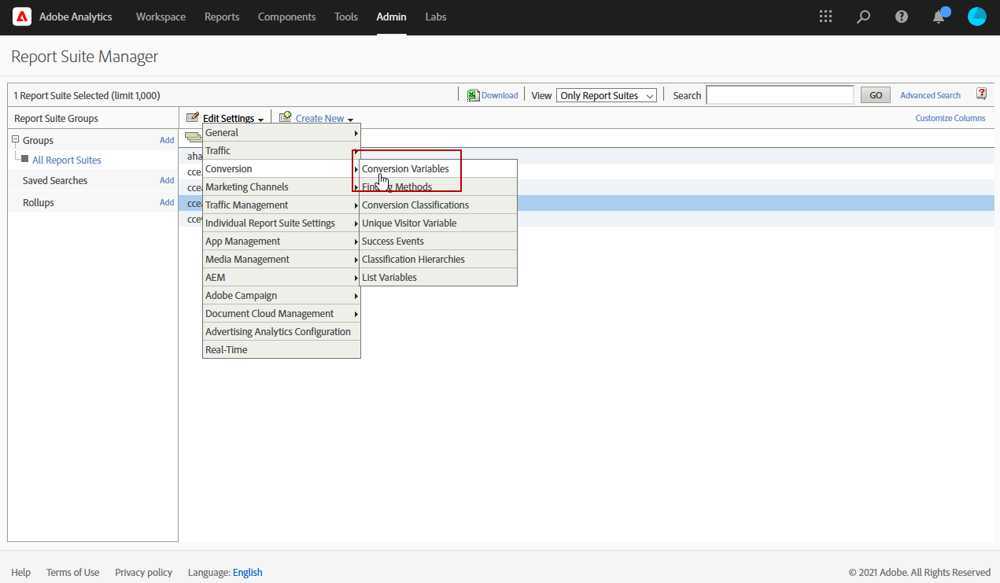
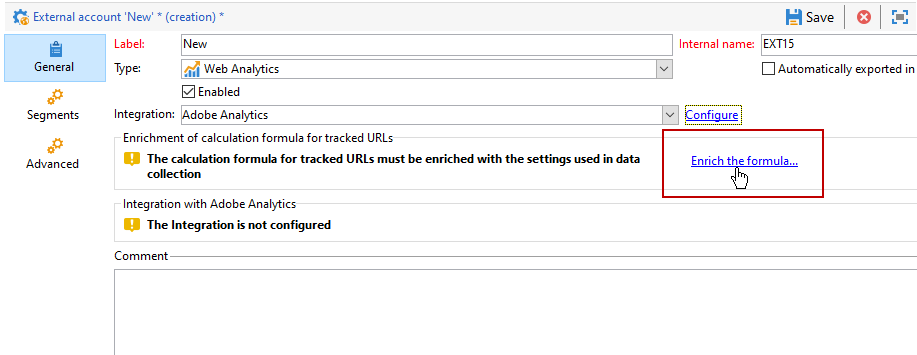
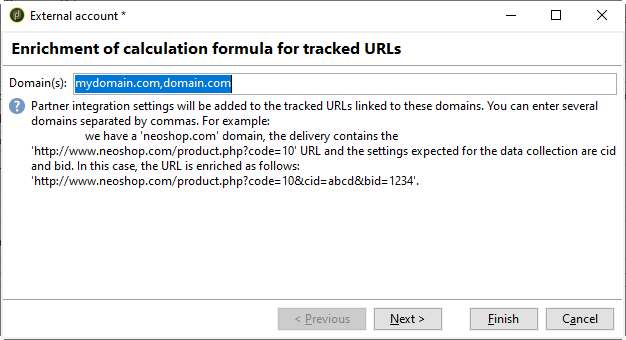

# Adobe Analytics 커넥터{#adobe-analytics-connector}

## Adobe Analytics 커넥터 통합 정보 {#about-analytics-connector-integration}

Adobe Analytics 커넥터를 사용하면 Adobe Campaign 및 Adobe Analytics이 **[!UICONTROL Web Analytics connectors]** 패키지를 통해 상호 작용할 수 있습니다. 캠페인 후 사용자 행동에 대한 세그먼트 형태로 데이터를 Adobe Campaign에 전달합니다. 반대로 Adobe Campaign에서 게재한 캠페인의 지표와 특성을 Adobe Analytics으로 보냅니다.

>[!CAUTION]
>
>* Adobe Analytics 커넥터는 트랜잭션 메시지(메시지 센터)와 호환되지 않습니다.
>
>* 시작하기 전에 Adobe IMS(Identity Management System)가 Campaign에서 구현되어 있는지 확인하십시오. [이 페이지에서 자세히 알아보십시오](../../integrations/using/about-adobe-id.md).

Adobe Campaign에는 Adobe Analytics 커넥터를 사용하여 인터넷 대상자를 측정하는 방법(웹 분석)이 있습니다. 이러한 통합 덕분에 Adobe Campaign은 마케팅 캠페인 후 하나 이상의 사이트에 대한 방문자 동작에 대한 데이터를 복구한 다음 (분석 후) 재마케팅 캠페인을 실행하여 방문자를 바이어로 전환할 수 있습니다. 반대로 웹 분석 도구를 사용하면 Adobe Campaign에서 지표와 캠페인 속성을 플랫폼에 전달할 수 있습니다.

각 도구의 작업 필드는 다음과 같습니다.

* 웹 분석의 역할:

   1. Adobe Campaign으로 시작한 캠페인을 표시합니다.
   1. 캠페인을 클릭한 후 검색한 사이트에서 수신자 동작을 세그먼트 형태로 저장합니다. 세그먼트는 포기한 제품(장바구니에 표시되지만 장바구니에 추가되지 않음), 구매 또는 장바구니 포기와 관련이 있습니다.

* Adobe Campaign의 역할:

   1. 지표 및 캠페인 속성을 커넥터로 전송하면 커넥터가 이 속성을 웹 분석 도구에 전달합니다.
   1. 세그먼트를 복구하고 분석합니다.
   1. 리마케팅 캠페인을 트리거합니다.

## 통합 설정 {#setting-up-the-integration}

>[!IMPORTANT]
>
> 하이브리드 및 온프레미스 구현의 경우 이 [페이지](../../platform/using/adobe-analytics-provisioning.md)에서 자세히 설명하는 프로비저닝 단계를 따라야 합니다.

데이터 커넥터를 설정하려면 Adobe Campaign 인스턴스에 연결하고 다음 작업을 수행해야 합니다.

1. [전환 변수 및 성공 이벤트 구성](#configure-conversion-success)
1. [Adobe Campaign Classic에서 외부 계정 구성](#external-account-classic)

<!--
### Create your Report suite in Adobe Analytics {#report-suite-analytics}

To set up the Adobe Analytics/Adobe Campaign Classic integration, you must connect to your [!DNL Adobe Analytics] instance and perform the following operations:

1. From [!DNL Adobe Analytics], select the **[!UICONTROL Admin tab]** then click **[!UICONTROL All admin]**.

   

1. Click **[!UICONTROL Report suites]**.

   

1. From the **[!UICONTROL Report suite manager]** page, click **[!UICONTROL Create new]** then **[!UICONTROL Report suite]**.

   For the detailed procedure on **[!UICONTROL Report suite]** creation, refer to this [section](https://experienceleague.adobe.com/docs/analytics/admin/manage-report-suites/new-report-suite/t-create-a-report-suite.html#prerequisites).

   

1. Select a template. 

1. Configure your new report suite with the following information:

   * **[!UICONTROL Report Suite ID]**
   * **[!UICONTROL Site Title]**
   * **[!UICONTROL Time Zone]**
   * **[!UICONTROL Go Live Date]**
   * **[!UICONTROL Estimated Page Views Per Day]**

   

1. When configured, click **[!UICONTROL Create report suite]**.
-->

### 전환 변수 및 성공 이벤트 구성 {#configure-conversion-success}

**[!UICONTROL Conversion variables]** 및 **[!UICONTROL Success events]**&#x200B;를 다음과 같이 구성해야 합니다.

1. Adobe Campaign에 연결할 **[!UICONTROL Report suite]**&#x200B;를 선택합니다.

1. **[!UICONTROL Edit settings]** 버튼에서, **[!UICONTROL Conversion]** > **[!UICONTROL Conversion variables]**&#x200B;를 선택합니다.

   

1. 클릭 **[!UICONTROL Add new]** 캠페인의 영향을 측정하는 데 필요한 식별자, 즉, 내부 캠페인 이름(cid) 및 iNmsBroadlog(bid) 테이블 ID를 만듭니다.

   **[!UICONTROL Conversion variables]**&#x200B;을(를) 편집하는 방법에 대해 알아보려면 이 [섹션](https://experienceleague.adobe.com/docs/analytics/admin/admin-tools/conversion-variables/t-conversion-variables-admin.html#admin-tools)을 참조하십시오.

   

1. 구성을 완료하면 **[!UICONTROL Save]** 을(를) 클릭합니다.

1. 그런 다음 **[!UICONTROL Success events]**&#x200B;을(를) 만들려면 **[!UICONTROL Edit settings]** 버튼에서 **[!UICONTROL Conversion]** > **[!UICONTROL Success events]**&#x200B;을(를) 선택합니다.

   

1. **[!UICONTROL Add new]**&#x200B;을(를) 클릭하여 다음 **[!UICONTROL Success events]**&#x200B;을(를) 구성합니다.

   * **[!UICONTROL Clicked]**
   * **[!UICONTROL Opened]**
   * **[!UICONTROL Person clicks]**
   * **[!UICONTROL Processed]**
   * **[!UICONTROL Scheduled]**
   * **[!UICONTROL Sent]**
   * **[!UICONTROL Total bounces]**
   * **[!UICONTROL Unique Clicks]**
   * **[!UICONTROL Unique Opens]**
   * **[!UICONTROL Unsubscribed]**

   **[!UICONTROL Success events]**&#x200B;를 구성하는 방법에 대해 알아보려면 이 [섹션](https://experienceleague.adobe.com/docs/analytics/admin/admin-tools/success-events/t-success-events.html#admin-tools)을 참조하십시오..

   >[!NOTE]
   >
   > 숫자 유형의 **[!UICONTROL Success events]**&#x200B;만 지원됩니다.

   

1. 완료하면 **[!UICONTROL Save]**&#x200B;을 클릭합니다.

**[!UICONTROL Conversion variables]** 및 **[!UICONTROL Success events]**&#x200B;를 구성한 뒤에는 변수가 Analytics 커넥터에 대해 만든 **[!UICONTROL Product Profile]**&#x200B;에 포함되어 있는지 확인합니다. 자세한 내용은 [Adobe Analytics 제품 프로필 만들기](../../platform/using/adobe-analytics-provisioning.md#analytics-product-profile)를 참조하세요.

그런 다음 Adobe Campaign Classic에서 **[!UICONTROL External accounts]**&#x200B;을 구성해야 합니다.

### Adobe Campaign Classic에서 외부 계정 구성 {#external-account-classic}

>[!IMPORTANT]
>
> 이 통합이 작동하려면 Adobe Campaign에 **[!UICONTROL Web Analytics connectors]** 패키지를 설치해야 합니다.
>
>패키지 설치에 대한 자세한 내용은 이 [페이지](../../installation/using/installing-campaign-standard-packages.md)를 참조하십시오.

이제 두 솔루션 간에 동기화를 활성화하려면 Adobe Campaign에서 **[!UICONTROL Web Analytics]** 외부 계정을 구성해야 합니다.

외부 계정을 구성할 때 **[!UICONTROL Report suite]**, **[!UICONTROL Conversion variables]** 또는 **[!UICONTROL Success events]** 중 하나가 표시되지 않으면 사용자와 연결된 **[!UICONTROL Product profile]**&#x200B;에서 새로 만든 이 구성 요소에 대한 권한이 누락되었음을 의미합니다.

자세한 내용은 [Adobe Analytics용 제품 프로필](https://experienceleague.adobe.com/docs/analytics/admin/admin-console/permissions/product-profile.html#product-profile-admins) 페이지를 참조하십시오.

1. Adobe Campaign 트리의 **[!UICONTROL Administration]** > **[!UICONTROL Platform]** > **[!UICONTROL External accounts]** 폴더로 이동하여 **[!UICONTROL New]**&#x200B;을(를) 클릭합니다.

   

1. 드롭다운 목록을 사용하여 **[!UICONTROL Web Analytics]** 유형과 **[!UICONTROL Adobe Analytics]**&#x200B;을(를) **[!UICONTROL Integration]** 드롭다운에서 선택합니다.

   

1. **[!UICONTROL Integration]** 드롭다운 옆에 있는 **[!UICONTROL Configure]** 을(를) 클릭합니다.

1. **[!UICONTROL Configure Analytics integration]** 창에서 외부 계정을 앞서 만든 보고서 세트 중 다음 정보를 제공하는 세트에 매핑합니다.

   * **[!UICONTROL E-Mail]**
   * **[!UICONTROL IMS Org]**
   * **[!UICONTROL Analytics Company]**
   * **[!UICONTROL Report Suite]**

1. **[!UICONTROL eVars]** 카테고리에서 [!DNL Adobe Analytics]에 구성된 두 **[!UICONTROL Conversion variables]**&#x200B;을(를) 매핑합니다.

   

1. **[!UICONTROL Events]** 카테고리에서 [!DNL Adobe Analytics]에 구성된 10개의 **[!UICONTROL Success events]**&#x200B;을(를) 매핑합니다.

1. 구성을 완료하면 **[!UICONTROL Submit]** 을(를) 클릭합니다. Adobe Campaign은 매핑된 Analytics **[!UICONTROL Report Suite]**&#x200B;에 **[!UICONTROL Data source]**, **[!UICONTROL Calculated metrics]**, **[!UICONTROL Remarketing segments]** 및 **[!UICONTROL Classifications]**&#x200B;을(를) 만듭니다.

   [!DNL Adobe Analytics]와(과) Adobe Campaign 간의 동기화가 완료되면 창을 닫을 수 있습니다.

1. 설정은 **[!UICONTROL Configure Analytics integration]** 창의 **[!UICONTROL Data Settings]** 탭에서 볼 수 있습니다.

   **[!UICONTROL Sync]** 버튼을 사용하면 [!DNL Adobe Campaign]이(가) [!DNL Adobe Analytics]에서 수행한 이름 변경 사항을 동기화합니다. 구성 요소가 [!DNL Adobe Analytics]에서 삭제되면 구성 요소는 [!DNL Adobe Campaign]에서 취소되거나 **을 찾을 수 없음** 메시지와 함께 표시됩니다.

   

1. 필요한 경우 **[!UICONTROL Update Segments]** 탭에서 세그먼트를 추가하거나 제거할 수 있습니다.

1. **[!UICONTROL External account]**&#x200B;에서 **[!UICONTROL Enrich the formula...]** 링크를 클릭하여 URL 계산 공식을 변경해서 웹 분석 도구 통합 정보(캠페인 ID)와 활동을 추적해야 하는 사이트의 도메인을 지정합니다.

   

1. 사이트의 도메인 이름을 지정합니다.

   

1. **[!UICONTROL Next]**&#x200B;을(를) 클릭하고 도메인 이름이 저장되었는지 확인합니다.

   

1. 필요한 경우 계산 공식에 과부하를 걸 수 있습니다. 이렇게 하려면 상자를 선택하고 창에서 바로 공식을 편집합니다.

   >[!IMPORTANT]
   >
   >이 구성 모드는 전문가 사용자용으로 예약되어 있습니다. 이 수식에 오류가 발생하면 게재가 중지될 수 있습니다.

1. **[!UICONTROL Advanced]** 탭에서는 더 많은 기술 설정을 구성하거나 수정할 수 있습니다.

   * **[!UICONTROL Lifespan]**: 기술 워크플로우로 Adobe Campaign에서 웹 이벤트가 복구되는 지연 시간(일)을 지정할 수 있도록 해줍니다. 기본값: 180일.
   * **[!UICONTROL Persistence]**: 모든 웹 이벤트(예: 구매)가 리마케팅 캠페인에 귀속될 수 있는 기간을 정의할 수 있습니다. 기본값: 7일.

>[!NOTE]
>
>여러 대상 측정 도구를 사용하는 경우 외부 계정을 만들 때 **[!UICONTROL Partners]** 드롭다운 목록에서 **[!UICONTROL Other]**&#x200B;을(를) 선택할 수 있습니다. 게재 속성에서 하나의 외부 계정만 참조할 수 있습니다.따라서 Adobe에서 기대하는 매개 변수와 사용된 다른 모든 측정 도구를 추가하여 추적된 URL의 공식을 조정해야 합니다.

### 웹 분석 프로세스의 기술 워크플로우 {#technical-workflows-of-web-analytics-processes}

Adobe Campaign과 Adobe Analytics 간의 데이터 교환은 백그라운드 작업으로 실행되는 4개의 기술 워크플로우에서 처리됩니다.

이러한 속성은 Adobe Campaign 트리의 **[!UICONTROL Administration]** > **[!UICONTROL Production]** > **[!UICONTROL Technical workflows]** > **[!UICONTROL Web analytics process]** 폴더 아래에서 사용할 수 있습니다.

* **[!UICONTROL Recovering of web events]**: 한 시간에 한 번, 이 워크플로우는 주어진 사이트에서 사용자의 행동에 대한 세그먼트를 다운로드하여 Adobe Campaign 데이터베이스에 포함하고 리마케팅 워크플로우를 시작합니다.
* **[!UICONTROL Event purge]**: 이 워크플로우를 사용하면 **[!UICONTROL Lifespan]** 필드에 구성된 기간에 따라 데이터베이스에서 모든 이벤트를 삭제할 수 있습니다. 자세한 내용은 Adobe Campaign Classic](#external-account-classic)에서 외부 계정 구성[을 참조하십시오.
* **[!UICONTROL Identification of converted contacts]**: 리마케팅 캠페인 후 구매한 방문자의 디렉토리. 이 워크플로우에서 수집한 데이터는 **[!UICONTROL Re-marketing efficiency]** 보고서에서 액세스할 수 있습니다. 이 [페이지](#creating-a-re-marketing-campaign)를 참조하십시오.
* **[!UICONTROL Sending of indicators and campaign attributes]**: Adobe Analytics Connector를 사용하여 Adobe Campaign을 통해 Adobe Experience Cloud으로 캠페인 지표를 보낼 수 있습니다. 이 워크플로우는 매일 오전 4시에 트리거되며 데이터를 Analytics에 전송하는 데 24시간이 걸릴 수 있습니다.

  이 워크플로우를 다시 시작하지 않아야 합니다. 그렇지 않으면 Analytics 결과를 왜곡할 수 있는 모든 이전 데이터가 다시 전송됩니다.

  관련 지표는 다음과 같습니다.

   * **[!UICONTROL Messages to deliver]** (@toDeliver)
   * **[!UICONTROL Processed]** (@processed)
   * **[!UICONTROL Success]** (@success)
   * **[!UICONTROL Total count of opens]** (@totalRecipientOpen)
   * **[!UICONTROL Recipients who have opened]** (@recipientOpen)
   * **[!UICONTROL Total number of recipients who clicked]** (@totalRecipientClick)
   * **[!UICONTROL People who clicked]** (@personClick)
   * **[!UICONTROL Number of distinct clicks]** (@recipientClick)
   * **[!UICONTROL Opt-Out]** (@optOut)
   * **[!UICONTROL Errors]** (@error)

  >[!NOTE]
  >
  >전송된 데이터는 지표 데이터에서 음수 값을 초래할 수 있는 마지막 스냅샷을 기반으로 하는 델타입니다.

  전송된 속성은 다음과 같습니다.

   * **[!UICONTROL Internal name]** (@internalName)
   * **[!UICONTROL Label]** (@label)
   * **[!UICONTROL Label]** (operation/@label): **Campaign** 패키지가 설치된 경우에만
   * **[!UICONTROL Nature]** (operation/@nature): **Campaign** 패키지가 설치된 경우에만
   * **[!UICONTROL Tag 1]** (webAnalytics/@tag1)
   * **[!UICONTROL Tag 2]** (webAnalytics/@tag2)
   * **[!UICONTROL Tag 3]** (webAnalytics/@tag3)
   * **[!UICONTROL Contact date]** (scheduling/@contactDate)

## Adobe Campaign에서 게재 추적 {#tracking-deliveries-in-adobe-campaign}

Adobe Campaign에서 게재를 보낸 후 Adobe Experience Cloud가 사이트에서 활동을 추적할 수 있도록 하려면 게재 속성에서 일치하는 커넥터를 참조해야 합니다. 그렇게 하려면 다음 단계를 적용합니다.

1. 추적할 캠페인 게재를 엽니다.

   

1. 게재 속성을 엽니다.
1. **[!UICONTROL Web Analytics]** 탭으로 이동하여 이전에 만든 외부 계정을 선택합니다. [Adobe Campaign Classic에서 외부 계정 구성](#external-account-classic)을 참조하십시오.

   

1. 이제 Adobe Analytics에서 게재를 보내고 보고서에 액세스할 수 있습니다.

## 리마케팅 캠페인 만들기 {#creating-a-re-marketing-campaign}

리마케팅 캠페인을 준비하려면 리마케팅 유형 캠페인에 사용할 게재 템플릿을 만들면 됩니다. 그런 다음 리마케팅 캠페인을 구성하고 세그먼트에 연결합니다. 각 세그먼트에는 다른 리마케팅 캠페인이 있어야 합니다.

Adobe Campaign이 초기 캠페인으로 타겟팅된 사람의 동작을 분석하는 세그먼트 복구를 완료하면 리마케팅 캠페인이 자동으로 시작됩니다. 구매하지 않고 장바구니 포기 또는 제품 보기를 하는 경우, 사이트 탐색이 구매에서 종료될 수 있도록 관련 수신자에게 게재가 전송됩니다.

Adobe Campaign은 캠페인을 준비하기 위해 사용하거나 데이터베이스를 구축할 수 있는 개인화된 게재 템플릿을 제공합니다.

1. **[!UICONTROL Explorer]**&#x200B;에서, Adobe Campaign 트리의 **[!UICONTROL Resources]** > **[!UICONTROL Templates]** > **[!UICONTROL Delivery templates]** 폴더로 이동합니다.

1. **[!UICONTROL Email delivery (re-marketing)]** 템플릿 또는 Adobe Campaign에서 제공하는 리마케팅 템플릿 예제를 복제합니다.

   

1. 필요에 따라 템플릿을 개인화하고 저장합니다.

1. 새 캠페인을 만들고 드롭다운 목록에서 **[!UICONTROL Re-marketing campaign]** 템플릿을 선택합니다.

   

1. **[!UICONTROL Configure...]** 링크를 클릭하여 캠페인에 연결된 세그먼트 및 게재 템플릿을 지정합니다.

1. 이전에 구성한 외부 계정을 선택합니다.

   

1. 관련 세그먼트를 선택합니다.

   

1. 이 리마케팅 캠페인에 사용할 게재 템플릿을 선택한 다음 **[!UICONTROL Finish]**&#x200B;을(를) 클릭하여 창을 닫습니다.

   

1. **[!UICONTROL OK]**&#x200B;을 클릭하여 캠페인 창을 닫습니다.

**[!UICONTROL Re-marketing efficiency]** 보고서는 글로벌 보고서 페이지를 통해 액세스합니다. 이 보고서는 Adobe Campaign 리마케팅 캠페인 이후 장바구니 포기 수와 관련하여 전환된(즉, 어떤 것을 구매한) 연락처 수를 볼 수 있도록 해줍니다. 전환율은 매주, 매월 또는 Adobe Campaign과 웹 분석 도구 간의 동기화 시작 이후마다 계산됩니다.

