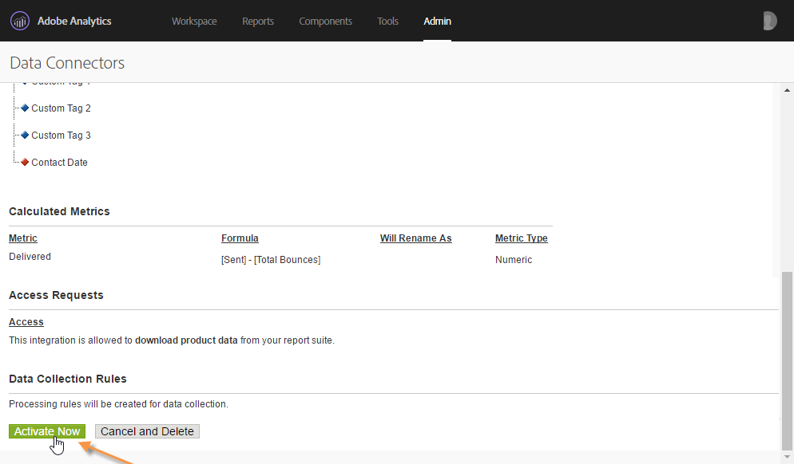
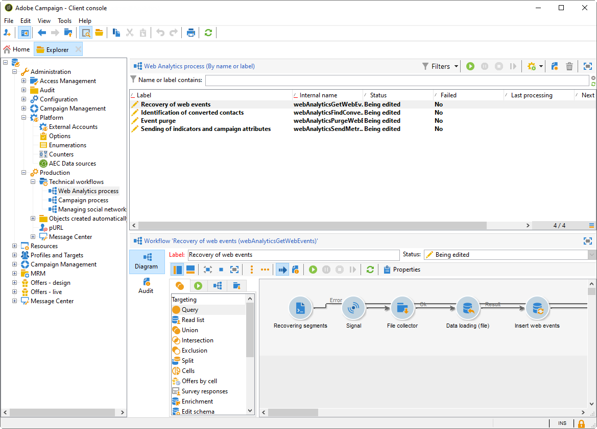

# Adobe Analytics 데이터 커넥터{#adobe-analytics-data-connector}

## 데이터 커넥터 통합 정보 {#about-data-connector-integration}

>[!CAUTION]
>
>Adobe Analytics 데이터 커넥터는 트랜잭션 메시지(메시지 센터)와 호환되지 않습니다.

데이터 커넥터(이전의 Adobe Genesis)를 사용하면 Adobe Campaign 및 Adobe Analytics가 **웹 분석 커넥터** 패키지를 통해 상호 작용할 수 있습니다. 이메일 캠페인 다음의 사용자 행동에 관한 세그먼트 형태로 데이터를 Adobe Campaign에 전달합니다. 반대로, Adobe Campaign에서 제공하는 이메일 캠페인의 지표와 속성을 Adobe Analytics - 데이터 커넥터로 보냅니다.

데이터 커넥터를 사용하는 Adobe Campaign은 인터넷 대상자(웹 분석)를 측정하는 방법을 제공합니다. 이러한 통합 덕분에 Adobe Campaign은 마케팅 캠페인 이후 하나 이상의 사이트에 대한 방문자 행동에 대한 데이터를 복구할 수 있으며 (분석 후)다시 마케팅 캠페인을 실행하여 바이어로 전환할 수 있습니다. 반대로, 웹 분석 도구를 사용하면 Adobe Campaign에서 지표와 캠페인 속성을 해당 플랫폼에 전달할 수 있습니다.

Adobe Analytics와 Adobe Campaign 통합 구현에 대한 자세한 내용은 이 [설명서를 참조하십시오](https://helpx.adobe.com/marketing-cloud/how-to/analytics-ac.html).

각 도구에 대한 작업 필드는 다음과 같습니다.

* 웹 분석 역할:

   1. Adobe Campaign으로 시작한 이메일 캠페인을 표시합니다.
   1. 수신자 동작을 저장할 수 있습니다. 세그먼트는 중단된 제품(장바구니에 보았지만 장바구니에 추가되지는 않음), 구매 또는 장바구니 포기에 대해 우려합니다.

* Adobe Campaign의 역할:

   1. 표시기 및 캠페인 속성을 커넥터로 전송하여 웹 분석 도구로 전달합니다.
   1. 세그먼트 복구 및 분석
   1. 재마케팅 캠페인을 트리거합니다.

## 통합 설정 {#setting-up-the-integration}

데이터 커넥터를 설정하려면 Adobe Campaign 인스턴스에 연결하고 다음 작업을 수행해야 합니다.

* [1단계: Analytics에서 통합 구성](#step-1--configure-integration-in-analytics)
* [2단계: Campaign에서 외부 계정 만들기](#step-2--create-the-external-account-in-campaign)
* [3단계: Adobe Campaign 및 Adobe Analytics 동기화](#step-3--synchronize-adobe-campaign-and-adobe-analytics)

### 1단계: Analytics에서 통합 구성 {#step-1--configure-integration-in-analytics}

다음 단계에서는 마법사를 사용한 데이터 커넥터 구성에 대해 자세히 설명합니다.

1. Adobe ID 또는 Enterprise ID를 사용하여 Adobe Experience Cloud에 로그인합니다.

   

1. Experience Cloud 솔루션 목록에서 을 선택합니다 **[!UICONTROL Analytics]**.

   

1. 탭에서 **[!UICONTROL Admin]** 를 선택합니다 **[!UICONTROL Data Connectors]**.

   메뉴에 액세스하려면 다음 Analytics 도구 권한이 있어야 **[!UICONTROL Data Connectors]** 합니다. 자세한 내용은 이 [페이지를 참조하십시오.](https://docs.adobe.com/content/help/en/analytics/admin/admin-console/permissions/analytics-tools.html)
   * 통합(만들기)
   * 통합(업데이트)
   * 통합(삭제)
   

1. 파트너 목록에서 를 선택합니다 **[!UICONTROL Adobe Campaign Classic]**.

   

1. 대화 **[!UICONTROL Add integration]** 상자에서 을 클릭합니다 **[!UICONTROL Activate]**.
1. 이 통합 **[!UICONTROL I accept these terms and conditions]** 에 **[!UICONTROL Report suite]** 연결된 항목을 선택하고 커넥터 레이블을 입력합니다.

   완료되면 을 클릭합니다 **[!UICONTROL Create and configure this integration]**.

   

1. 커넥터를 대신하여 알림을 받을 이메일 주소를 입력한 다음 외부 Adobe Campaign 계정에 나타나는 대로 **[!UICONTROL Account ID]** 복사합니다(자세한 내용은 [단계 2 참조: Campaign에서 외부 계정 만들기](#step-2--create-the-external-account-in-campaign)).

   

1. 이메일 캠페인의 영향을 측정하는 데 필요한 식별자(예: 내부 캠페인 이름(cid) 및 iNmsBroadlog(입찰) 테이블 ID)를 지정합니다. 수집할 이벤트에 대한 지표도 지정해야 합니다.
숫자 유형인지 확인하십시오. 그렇지 않으면 드롭다운 메뉴에 표시되지 않습니다. **[!UICONTROL Events]**

   

1. 필요한 경우 개인화된 세그먼트를 지정합니다.

   

1. 에서 데이터 복구 방법 **[!UICONTROL Data collection]**&#x200B;을 선택합니다. 이 경우 6단계에서 지정한 **[!UICONTROL cid]** 및 **[!UICONTROL bid]** 식별자를 선택합니다.

   

1. 대시보드에 표시할 정보를 선택합니다.

   

1. 이전 단계를 합산한 페이지의 구성을 확인합니다.

   

1. 구성을 승인하고 커넥터 **[!UICONTROL Activate Now]** 를 활성화하려면 클릭합니다.

   

   이제 데이터 커넥터가 구성됩니다.

### 2단계: Campaign에서 외부 계정 만들기 {#step-2--create-the-external-account-in-campaign}

Adobe Campaign과 Analytics 플랫폼의 통합은 커넥터를 사용하여 수행됩니다. 애플리케이션을 동기화하려면 다음 프로세스를 적용합니다.

1. Adobe Campaign에서 **웹 분석 커넥터** 패키지를 설치합니다.
1. Adobe Campaign 트리의 **[!UICONTROL Administration > Platform > External accounts]** 폴더로 이동합니다.
1. 외부 계정 목록을 마우스 오른쪽 단추로 클릭하고 드롭다운 메뉴 **[!UICONTROL New]** 에서 선택합니다(또는 외부 계정 목록 위에 있는 **[!UICONTROL New]** 단추 클릭).
1. 드롭다운 목록을 사용하여 유형을 **[!UICONTROL Web Analytics]** 선택합니다.
1. 커넥터용 공급자(예: 이 **[!UICONTROL Adobe Analytics - Data Connector]** 경우)를 선택합니다.

   

1. URL 계산 공식을 변경하려면 **[!UICONTROL Enrich the formula...]** 링크를 클릭하여 웹 분석 도구 통합 정보(캠페인 ID) 및 활동을 추적해야 하는 사이트의 도메인을 지정합니다.
1. 사이트의 도메인 이름을 지정합니다.

   

1. 을 **[!UICONTROL Next]** 클릭하고 도메인 이름이 저장되었는지 확인합니다.

   

1. 필요한 경우 계산 공식을 과부하해야 합니다. 이렇게 하려면 상자를 선택하고 창에서 바로 공식을 편집합니다.

   

   >[!CAUTION]
   >
   >이 구성 모드는 전문 사용자용으로 예약되어 있습니다. 이 공식에 오류가 있으면 이메일 배달이 중지될 수 있습니다.

1. 이 **[!UICONTROL Advanced]** 탭에서는 더 많은 기술 설정을 구성하거나 수정할 수 있습니다.

   * **[!UICONTROL Lifespan]**: 기술 워크플로우별로 Adobe Campaign에서 웹 이벤트가 복구되는 지연(일)을 지정할 수 있습니다. 기본값: 180일
   * **[!UICONTROL Persistence]**: 모든 웹 이벤트(예: 구매)가 재마케팅 캠페인으로 분류되는 기간, 기본값: 7일

>[!NOTE]
>
>여러 대상 측정 도구를 사용하는 경우 외부 계정 **[!UICONTROL Other]** 을 만들 때 **[!UICONTROL Partners]** 드롭다운 목록에서 선택할 수 있습니다. 배달 속성에서 외부 계정은 하나만 참조할 수 있습니다. 따라서 Adobe에서 기대하는 매개 변수와 사용된 기타 모든 측정 도구를 추가하여 추적된 URL의 공식을 수정해야 합니다.

### 3단계: Adobe Campaign 및 Adobe Analytics 동기화 {#step-3--synchronize-adobe-campaign-and-adobe-analytics}

외부 계정을 만든 후에는 두 애플리케이션을 모두 동기화해야 합니다.

1. 이전에 만든 외부 계정으로 이동합니다.
1. 필요에 따라 계정 **[!UICONTROL Label]** 을 변경합니다.
1. 데이터 커넥터 **[!UICONTROL Internal name]** 를 구성하는 동안 선택한 **[!UICONTROL Name]** 과 일치하도록 을 변경합니다.

   

1. 링크를 **[!UICONTROL Approve connection]** 클릭합니다.

   

   데이터 커넥터 구성 마법사 **[!UICONTROL Internal name]** 에 **[!UICONTROL Name]** 지정된 것과 일치하는지 확인합니다.

1. 데이터 커넥터 구성 마법사 **[!UICONTROL Account ID]** 에 을 입력합니다.

   

1. 데이터 커넥터 마법사 안내서에 따라 단계를 수행한 다음 Adobe Campaign의 외부 계정으로 돌아갑니다.
1. Adobe Campaign **[!UICONTROL Next]** 과 Adobe Analytics - 데이터 커넥터 간에 데이터 교환이 수행되도록 하려면 을 클릭합니다.

   동기화가 완료되면 세그먼트 목록이 표시됩니다.

   

Adobe Campaign과 Adobe Analytics - 데이터 커넥터 간의 데이터 동기화가 효과적일 때 데이터 커넥터 마법사에 정의된 세 개의 기본 세그먼트가 Adobe Campaign에서 복구되고 Adobe Campaign 외부 계정의 **[!UICONTROL Segments]** 탭에서 액세스할 수 있게 됩니다.

데이터 커넥터 마법사에서 추가 세그먼트가 구성된 경우 Adobe Campaign에 추가할 수 있습니다. 이렇게 하려면 **[!UICONTROL Update segment list]** 링크를 클릭하고 외부 계정 마법사에서 설명한 단계를 따릅니다. 작업이 수행되면 새 세그먼트가 목록에 표시됩니다.

### 웹 분석 프로세스의 기술 워크플로우 {#technical-workflows-of-web-analytics-processes}

Adobe Campaign과 Adobe Analytics 간의 데이터 교환 - 데이터 커넥터는 백그라운드 작업으로 실행되는 4개의 기술 워크플로우로 처리됩니다.

Adobe Campaign 트리의 폴더 아래에 **[!UICONTROL Administration > Production > Technical workflows > Web analytics process]** 있습니다.

* **[!UICONTROL Recovering of web events]**: 이 워크플로우는 한 시간에 한 번 특정 사이트의 사용자의 행동에 대한 세그먼트를 다운로드하고 Adobe Campaign 데이터베이스에 포함하고 다시 마케팅 워크플로우를 시작합니다.
* **[!UICONTROL Event purge]**: 이 워크플로우에서는 **[!UICONTROL Lifespan]** 필드에 구성된 기간에 따라 데이터베이스에서 모든 이벤트를 삭제할 수 있습니다. 자세한 내용은 다음 [단계를 참조하십시오. Campaign에서 외부 계정을 만듭니다](#step-2--create-the-external-account-in-campaign).
* **[!UICONTROL Identification of converted contacts]**: 재마케팅 캠페인 후 구매한 방문자의 디렉토리입니다. 이 워크플로우가 수집하는 데이터는 보고서에서 액세스할 수 있습니다. 이 **[!UICONTROL Re-marketing efficiency]** 페이지를 참조하십시오.
* **[!UICONTROL Sending of indicators and campaign attributes]**: adobe Campaign을 통해 Adobe Analytics - 데이터 커넥터를 사용하여 Adobe Experience Cloud로 이메일 캠페인 표시기를 전송할 수 있습니다. 이 워크플로우는 매일 오전 4시에 트리거되며 Analytics로 데이터를 전송하는 데 24시간이 걸릴 수 있습니다.

   이 워크플로우는 다시 시작하지 않아야 하며 그렇지 않으면 Analytics 결과를 왜곡할 수 있는 모든 이전 데이터가 다시 전송됩니다.

   관련 지표는 다음과 같습니다.

   * **[!UICONTROL Messages to deliver]** (@toDeliver)
   * **[!UICONTROL Processed]** (@processed)
   * **[!UICONTROL Success]** (@success)
   * **[!UICONTROL Total count of opens]** (@totalRecipientOpen)
   * **[!UICONTROL Recipients who have opened]** (@recipientOpen)
   * **[!UICONTROL Total number of recipients who clicked]** (@totalRecipientClick)
   * **[!UICONTROL People who clicked]** (@personClick)
   * **[!UICONTROL Number of distinct clicks]** (@recipientClick)
   * **[!UICONTROL Opt-Out]** (@optOut)
   * **[!UICONTROL Errors]** (@error)
   >[!NOTE]
   >
   >전송된 데이터는 지표 데이터에서 음수 값을 초래할 수 있는 마지막 스냅샷을 기반으로 하는 델타입니다.

   전송된 속성은 다음과 같습니다.

   * **[!UICONTROL Internal name]** (@internalName)
   * **[!UICONTROL Label]** (@label)
   * **[!UICONTROL Label]** (operation/@label): 캠페인 **패키지가** 설치된 경우에만
   * **[!UICONTROL Nature]** (operation/@nature): 캠페인 **패키지가** 설치된 경우에만
   * **[!UICONTROL Tag 1]** (webAnalytics/@tag1)
   * **[!UICONTROL Tag 2]** (webAnalytics/@tag2)
   * **[!UICONTROL Tag 3]** (webAnalytics/@tag3)
   * **[!UICONTROL Contact date]** (예약/@contactDate)

## Adobe Campaign에서 배달 추적 {#tracking-deliveries-in-adobe-campaign}

Adobe Campaign에서 배달을 보낸 후 Adobe Experience Cloud가 사이트에서 활동을 추적할 수 있도록 하려면 배달 속성에서 일치하는 커넥터를 참조해야 합니다. 이렇게 하려면 다음 단계를 적용합니다.

1. 추적할 캠페인 배달을 엽니다.

   

1. 배달 속성을 엽니다.
1. 탭으로 **[!UICONTROL Web Analytics]** 이동하여 이전에 만든 외부 계정을 선택합니다. 2단계를 [참조하십시오. Campaign에서 외부 계정 만들기](#step-2--create-the-external-account-in-campaign)).

   

1. 이제 Adobe Analytics에서 전달을 보내고 보고서에 액세스할 수 있습니다.

## 재마케팅 캠페인 만들기 {#creating-a-re-marketing-campaign}

재마케팅 캠페인을 준비하려면 재마케팅 유형 캠페인에 사용할 배달 템플릿을 만들면 됩니다. 그런 다음 재마케팅 캠페인을 구성하고 세그먼트에 연결합니다. 각 세그먼트에는 다른 재마케팅 캠페인이 있어야 합니다.

Adobe Campaign이 초기 캠페인으로 타깃팅된 사람의 동작을 분석하는 세그먼트 복구를 완료하면 재마케팅 캠페인이 자동으로 시작됩니다. 구매가 없는 장바구니 포기 또는 제품을 보는 경우, 구매 시 사이트 탐색을 종료하기 위해 관련 수신자에게 전달이 전송됩니다.

Adobe Campaign은 캠페인 준비를 위해 사용하거나 데이터베이스에 데이터베이스를 구성할 수 있는 개인화된 전달 템플릿을 제공합니다.

1. 에서 **[!UICONTROL Explorer]** Adobe Campaign 트리의 **[!UICONTROL Resources > Templates > Delivery templates]** 폴더로 이동합니다.
1. Adobe Campaign에서 제공하는 **[!UICONTROL Email delivery (re-marketing)]** 템플릿 또는 재마케팅 템플릿 예를 복제합니다.
1. 필요에 따라 템플릿을 개인화하여 저장합니다.

   

1. 새 캠페인을 만들고 드롭다운 목록에서 **[!UICONTROL Re-marketing campaign]** 템플릿을 선택합니다.

   

1. 링크를 클릭하여 캠페인에 연결된 세그먼트 및 배달 템플릿을 지정합니다. **[!UICONTROL Configure...]**
1. 이전에 구성한 외부 계정을 선택합니다.

   

1. 관련 세그먼트를 선택합니다.

   

1. 이 재마케팅 캠페인에 사용할 배달 템플릿을 선택한 다음 을 클릭하여 창 **[!UICONTROL Finish]** 을 닫습니다.

   

1. 캠페인 창 **[!UICONTROL OK]** 을 닫으려면 을 클릭합니다.

보고서는 글로벌 보고서 페이지를 통해 액세스할 수 있습니다 **[!UICONTROL Re-marketing efficiency]** . Adobe Campaign 재마케팅 캠페인 이후 장바구니 포기 수와 관련하여 전환된(예: 구매한 항목) 연락처 수를 볼 수 있습니다. 전환율은 Adobe Campaign과 웹 분석 도구 간의 동기화가 시작된 주, 월 또는 이후별로 계산됩니다.

