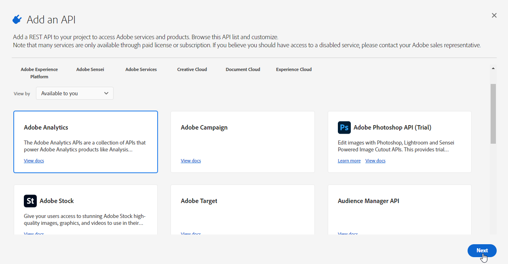

# Adobe Analytics 커넥터 프로비저닝 {#adobe-analytics-connector-provisioning}


>[!IMPORTANT]
>
> 이러한 단계는 하이브리드 및 온-프레미스 구현에서만 수행해야 합니다.
>
>호스팅된 구현의 경우 [고객 지원 Adobe](https://helpx.adobe.com/kr/enterprise/admin-guide.html/enterprise/using/support-for-experience-cloud.ug.html) 팀

Adobe Campaign Classic과 Adobe Analytics 인증 간의 통합은 IMS(Adobe Identity Management Service)를 지원합니다.

* 마이그레이션된 외부 계정을 관리하는 경우, Adobe IMS를 구현하고 Adobe ID을 통해 Adobe Campaign에 연결해야 합니다. Adobe ID IMS를 통해 로그인한 사용자는 **데이터 커넥터** Adobe Analytics의 계정을 설정하고 **제품 프로필** 아래에 언급되어 있습니다.

* 새 커넥터를 구현하는 경우 Adobe IMS 구현을 선택 사항입니다. Adobe ID 사용자가 없으면 Adobe Campaign은 기술 사용자를 사용하여 Adobe Analytics과 동기화합니다.

이 통합이 작동하려면 Analytics 커넥터에만 사용되는 Adobe Analytics 제품 프로필을 만들어야 합니다. 그런 다음 Adobe I/O 프로젝트를 만들어야 합니다.

## Adobe Analytics 제품 프로필 만들기 {#analytics-product-profile}

제품 프로필은 사용자의 다른 Analytics 구성 요소에 대한 액세스 수준을 결정합니다.

이미 Analytics 제품 프로필이 있는 경우 Analytics 커넥터에만 사용되는 새 Adobe Analytics 제품 프로필을 만들어야 합니다. 이렇게 하면 제품 프로필이 이 통합에 대한 올바른 권한으로 설정되어 있는지 확인할 수 있습니다.

제품 프로필에 대한 자세한 내용은 [Admin Console 설명서](https://helpx.adobe.com/mt/enterprise/admin-guide.html).

1. 에서 [Admin Console](https://adminconsole.adobe.com/), Adobe Analytics 선택 **[!UICONTROL Product]**.

   

1. **[!UICONTROL New Profile]**&#x200B;를 클릭합니다.

   

1. 추가 **[!UICONTROL Product profile name]**, 다음 구문을 사용하는 것이 좋습니다. `reserved_campaign_classic_<Company Name>`. 그런 다음 **[!UICONTROL Next]**.

   이 **[!UICONTROL Product profile]** 구성 오류가 발생하지 않도록 하려면 Analytics 커넥터에만 사용해야 합니다.

1. 새로 만든 **[!UICONTROL Product profile]** 을(를) 선택하고 을(를) 선택합니다. **[!UICONTROL Permissions]** 탭.

   

1. 다음 아이콘을 클릭하여 다양한 기능 구성 **[!UICONTROL Edit]** 및에 지정할 권한을 선택합니다. **[!UICONTROL Product profile]** 더하기(+) 아이콘을 클릭합니다.

   권한 관리 방법에 대한 자세한 내용은 [Admin Console 설명서](https://helpx.adobe.com/mt/enterprise/using/manage-permissions-and-roles.html).

1. 대상 **[!UICONTROL Report Suites]** 기능, 추가 **[!UICONTROL Report Suites]** 나중에 사용해야 합니다.

   보고서 세트가 없는 경우 다음에 만들 수 있습니다 [다음 단계](../../platform/using/adobe-analytics-connector.md#report-suite-analytics).

   

1. 대상 **[!UICONTROL Metrics]** 기능, 추가 **[!UICONTROL Metrics]** 나중에 를 구성해야 합니다.

   필요한 경우 모든 권한 항목을 포함된 목록에 추가하고 새 권한 항목을 자동으로 추가하는 자동 포함 옵션 을 전환할 수 있습니다.

   

1. 대상 **[!UICONTROL Dimensions]** 기능, 추가 **[!UICONTROL Dimensions]** 나중에 를 구성해야 합니다.

1. 대상 **[!UICONTROL Report Suite Tools]** 기능을 사용하려면 다음 권한을 추가하십시오.

   * **[!UICONTROL Report suite Mgmt]**
   * **[!UICONTROL Conversion variables]**
   * **[!UICONTROL Success events]**
   * **[!UICONTROL Custom data Warehouse report]**
   * **[!UICONTROL Data sources manager]**
   * **[!UICONTROL Classifications]**

1. 대상 **[!UICONTROL Analytics Tools]** 기능을 사용하려면 다음 권한을 추가하십시오.

   * **[!UICONTROL Code Manager - Web services]**
   * **[!UICONTROL Logs - Web services]**
   * **[!UICONTROL Web services]**
   * **[!UICONTROL Web service access]**
   * **[!UICONTROL Calculated metric creation]**
   * **[!UICONTROL Segment creation]**

이제 제품 프로필이 구성되었습니다. 그런 다음 Adobe I/O 프로젝트를 만들어야 합니다.

## Adobe I/O 프로젝트 만들기 {#create-adobe-io}

1. Adobe I/O에 액세스하고 **시스템 관리자** IMS 조직의

   관리자 역할에 대한 자세한 내용은 다음을 참조하십시오 [페이지](https://helpx.adobe.com/enterprise/using/admin-roles.html).

1. **[!UICONTROL Create a new project]**&#x200B;를 클릭합니다.

   

1. 클릭 **[!UICONTROL Add to Project]** 을(를) 선택합니다. **[!UICONTROL API]**.

   

1. [!DNL Adobe Analytics]을(를) 선택하고 **[!UICONTROL Next]**&#x200B;을(를) 클릭합니다 .

   

1. 선택 **[!UICONTROL Service Account (JWT)]** 인증 유형인 경우 **[!UICONTROL Next]**.

   

1. 을(를) 선택합니다 **[!UICONTROL Option 1: Generate a Key-Pair]** 옵션을 선택하고 **[!UICONTROL Generate a Key-Pair]**.

   그러면 config.zip 파일이 자동으로 다운로드됩니다.

   

1. **[!UICONTROL Next]**&#x200B;를 클릭합니다.

   

1. 을(를) 선택합니다 **[!UICONTROL Product profile]** 에 자세히 설명된 이전 단계에서 작성됨 [섹션](#analytics-product-profile).

1. 그런 다음 **[!UICONTROL Save Configured API]**.

   

1. 프로젝트에서 를 선택합니다. [!DNL Adobe Analytics] 및에서 다음 정보를 복사합니다. **[!UICONTROL Service Account (JWT)]**:

   * **[!UICONTROL Client ID]**
   * **[!UICONTROL Client Secret]**
   * **[!UICONTROL Technical account ID]**
   * **[!UICONTROL Organization ID]**

   

1. 6단계에서 생성된 개인 키를 사용합니다.

   이러한 자격 증명을 사용하여 트리거를 이미 설정한 경우 이 커넥터 구성에 대해 개인 키가 동일해야 합니다.

1. 다음 명령을 사용하여 개인 키를 인코딩합니다. `base64 ./private.key > private.key.base64`. 이렇게 하면 base64 컨텐츠가 새 파일에 저장됩니다 `private.key.base64`.

   >[!NOTE]
   >
   >개인 키를 복사/붙여넣을 때 추가 줄이 자동으로 추가되는 경우가 있습니다. 개인 키를 인코딩하기 전에 제거해야 합니다.

1. 파일에서 내용을 복사합니다. `private.key.base64`.

1. Adobe Campaign 인스턴스가 설치된 각 컨테이너에 SSH를 통해 로그인하고 다음 명령을 다음과 같이 실행하여 Adobe Campaign에 프로젝트 자격 증명을 추가합니다. `neolane` 사용자. 그러면 **[!UICONTROL Technical Account]** 인스턴스 구성 파일의 자격 증명입니다.

   ```
   nlserver config -instance:<instance name> -setimsjwtauth:Organization_Id/Client_Id/Technical_Account_ID/<Client_Secret>/<Base64_encoded_Private_Key>
   ```
이제 Analytics 커넥터 사용을 시작하고 고객 행동을 추적할 수 있습니다.
