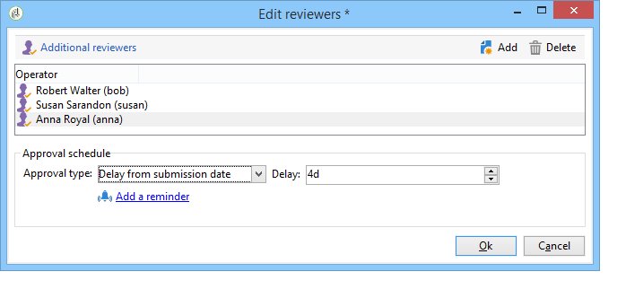

# Adobe Campaign 작업 영역{#adobe-campaign-workspace}

## Adobe Campaign 인터페이스 살펴보기 {#about-adobe-campaign-interface}

데이터베이스에 연결되면 대시보드인 Adobe Campaign 홈 페이지에 액세스합니다. 이 홈페이지는 설치와 일반 플랫폼 구성에 따라 기능에 액세스할 수 있는 링크 및 단축키로 구성됩니다.

홈페이지의 중앙 섹션에서 링크를 사용하여 Campaign 온라인 설명서 포털, 포럼 및 지원 웹 사이트에 액세스할 수 있습니다.

[ 비디오에서 캠페인 작업 영역 살펴보기](#video)

>[!NOTE]
>
>인스턴스에서 사용할 수 있는 Adobe Campaign 기능은 설치된 모듈 및 추가 기능에 따라 다릅니다. 사용 권한 및 특정 구성에 따라 일부 쿠키를 사용하지 못할 수도 있습니다.
>
>모듈이나 추가 기능을 설치하기 전에 라이선스 계약을 확인하거나 Adobe 계정 담당자에게 문의해야 합니다.

### 콘솔 및 웹 액세스 {#console-and-web-access}

Adobe Campaign 플랫폼은 콘솔 또는 인터넷 브라우저를 통해 액세스할 수 있습니다. 에서 호환되는 브라우저를 참조하십시오. [호환성 매트릭스](../../rn/using/compatibility-matrix.md#Browsers).

웹 액세스 인터페이스는 콘솔 인터페이스와 유사합니다. 브라우저에서 콘솔과 동일한 탐색 및 표시 기능을 사용할 수 있지만 캠페인에 대해 축소된 작업 세트만 수행할 수 있습니다. 예를 들어 캠페인을 보고 취소할 수 있지만 캠페인을 수정할 수는 없습니다. 지정된 연산자의 경우 캠페인이 콘솔에 다음 옵션과 함께 표시됩니다.

반면 웹 액세스의 경우 옵션은 주로 다음 보기를 활성화합니다.

자세히 알아보기 [웹 인터페이스 사용](../../campaign/using/accessing-marketing-campaigns.md#using-the-web-interface-).

### 언어 {#languages}

Adobe Campaign Classic 인스턴스를 설치할 때 언어가 선택됩니다.

다음 다섯 가지 언어 중에서 선택할 수 있습니다.

* 영어(영국)
* 영어(미국)
* 프랑스어
* 독일어
* 일본어

Adobe Campaign Classic 인스턴스에 대해 선택한 언어는 날짜 및 시간 형식에 영향을 줄 수 있습니다. 자세한 정보는 이 [섹션](../../platform/using/adobe-campaign-workspace.md#date-and-time)을 참조하십시오.

인스턴스를 만드는 방법에 대한 자세한 내용은 다음을 참조하십시오 [페이지](../../installation/using/creating-an-instance-and-logging-on.md).

>[!CAUTION]
>
>인스턴스를 만든 후에는 언어를 변경할 수 없습니다.

## 탐색 기본 사항 {#navigation-basics}

### 페이지 찾아보기 {#browsing-pages}

플랫폼의 다양한 기능은 핵심 기능으로 분류됩니다. 인터페이스의 상단 섹션에 표시되는 링크를 사용하여 기능에 액세스합니다.

액세스할 수 있는 핵심 기능 목록은 설치한 패키지 및 추가 기능과 액세스 권한에 따라 다릅니다.

각 기능에는 작업 관련 요구 사항 및 사용 컨텍스트를 기반으로 하는 기능 세트가 포함되어 있습니다. 예: **[!UICONTROL Profiles and targets]** 링크를 클릭하면 수신자 목록, 구독 서비스, 기존 타겟팅 워크플로 및 이러한 요소를 만들기 위한 바로 가기로 이동합니다.

이 목록은 **[!UICONTROL Lists]** 의 왼쪽 섹션에 있는 링크 **[!UICONTROL Profiles and Targets]** 인터페이스.

### 탭 사용 {#using-tabs}

* 핵심 기능 또는 링크를 클릭하면 관련 페이지가 현재 페이지를 대체합니다. 이전 페이지로 돌아가려면 **[!UICONTROL Back]** 단추를 클릭합니다. 홈 페이지로 돌아가려면 **[!UICONTROL Home]** 단추를 클릭합니다.

   

* 메뉴 또는 디스플레이 화면에 대한 바로 가기(예: 웹 애플리케이션, 프로그램, 게재, 보고서 등)의 경우, 일치하는 페이지가 다른 탭에 표시됩니다. 이 경우 탭을 사용하여 한 페이지에서 다른 페이지로 이동할 수 있습니다.

   

### 요소 만들기 {#creating-an-element}

각 핵심 기능 섹션을 통해 사용 가능한 요소 간을 검색할 수 있습니다. 이렇게 하려면 의 단축키를 사용합니다. **[!UICONTROL Browsing]** 섹션. 다음 **[!UICONTROL Other choices]** 링크를 사용하면 환경에 관계없이 다른 모든 페이지에 액세스할 수 있습니다.

새 요소(게재, 웹 애플리케이션, 워크플로우 등)를 만들 수 있습니다. 에서 단축키 사용 **[!UICONTROL Create]** 화면의 왼쪽에 있는 섹션입니다. 사용 **[!UICONTROL Create]** 목록에 새 요소를 추가하려면 목록 위에 있는 단추입니다.

예를 들어 게재 페이지에서 **[!UICONTROL Create]** 단추를 클릭하여 새 게재를 만듭니다.

## 형식 및 단위 {#formats-and-units}

### 일자 및 시간 {#date-and-time}

Adobe Campaign Classic 인스턴스의 언어는 날짜 및 시간 형식에 영향을 줍니다.

Campaign을 설치할 때 언어가 선택되며 나중에 변경할 수 없습니다. 영어(미국), 영어(영어), 프랑스어, 독일어 또는 일본어를 선택할 수 있습니다. 자세한 정보는 이 [페이지](../../installation/using/creating-an-instance-and-logging-on.md)를 참조하십시오.

미국 영어와 영국 영어의 주요 차이점은 다음과 같습니다.

<table> 
 <thead> 
  <tr> 
   <th> 형식  </th> 
   <th> 영어(미국)  </th> 
   <th> 영어(EN)  </th> 
  </tr> 
 </thead> 
 <tbody> 
  <tr> 
   <td> 날짜  </td> 
   <td> 일요일부터 주 시작  </td> 
   <td> 월요일부터 주 시작  </td> 
  </tr> 
  <tr> 
   <td> 간단한 날짜  </td> 
   <td> 
%2M/%2D/%4Y

<strong>예: 2018/09/25</strong>
 </td> 
   <td> 
%2D/%2M/%4Y

<strong>예: 2018/25/09</strong>
 </td> 
  </tr> 
  <tr> 
   <td> 시간이 포함된 간단한 날짜  </td> 
   <td> 
%2M/%2D/%4Y %I:%2N:%2S %P

<strong>예: 2018/09/25 10:47:25피코미터</strong>
 </td> 
   <td> 
%2D/%2M/%4Y %2H:%2N:%2S

<strong>예: 2018/25/09 22:47:25</strong>
 </td> 
  </tr> 
 </tbody> 
</table>

### 열거형에 값 추가 {#add-values-in-an-enumeration}

드롭다운 목록이 있는 입력 필드를 사용하여 열거형 값을 입력할 수 있습니다. 이 값은 저장한 다음 드롭다운 목록에서 옵션으로 제공할 수 있습니다. 예를 들어, **[!UICONTROL City]** 필드 **[!UICONTROL General]** 수신자 프로필의 탭에서 London을 입력할 수 있습니다. Enter 키를 눌러 이 값을 확인하면 필드와 연결된 열거형에 대해 이 값을 저장할지 묻는 메시지가 나타납니다.

다음을 클릭: **[!UICONTROL Yes]**, 관련 필드의 콤보 상자에서 이 값을 사용할 수 있습니다(이 경우: **[!UICONTROL London]**).

>[!NOTE]
>
>열거형(&#39;itemized list&#39;라고도 함)은 를 통해 관리자가 관리합니다. **[!UICONTROL Administration > Platform > Enumerations]** 섹션. 자세한 내용은 다음을 참조하십시오. [열거형 관리](../../platform/using/managing-enumerations.md).

### 기본 단위 {#default-units}

기간(예: 게재 리소스의 유효 기간, 작업에 대한 승인 마감 등)을 나타내는 필드에서는 값을 다음과 같이 표현할 수 있습니다 **단위**:

* **[!UICONTROL s]** 초 동안,
* **[!UICONTROL mn]** 분 동안,
* **[!UICONTROL h]** - 시간 동안,
* **[!UICONTROL d]** 며칠 동안이요.

## 튜토리얼 비디오 {#video}

이 비디오에서는 Campaign Classic 작업 영역을 제공합니다.

>[!VIDEO](https://video.tv.adobe.com/v/35130?quality=12)

추가 Campaign Classic 방법 비디오를 사용할 수 있습니다 [여기](https://experienceleague.adobe.com/docs/campaign-classic-learn/tutorials/overview.html?lang=ko).
