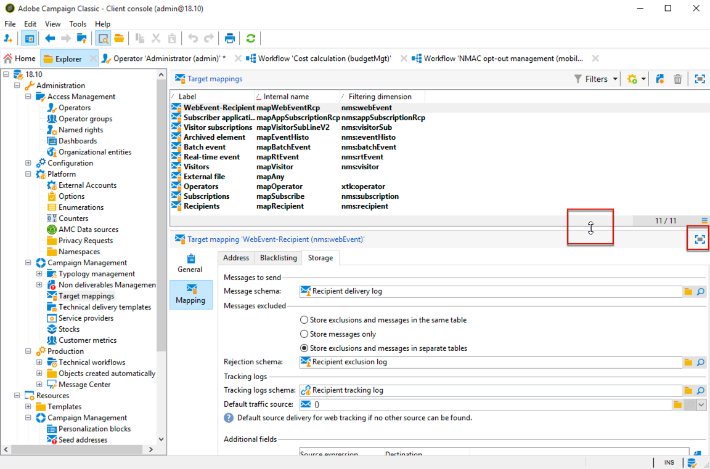
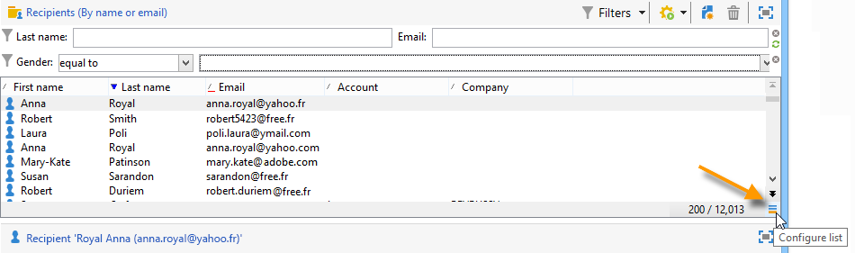
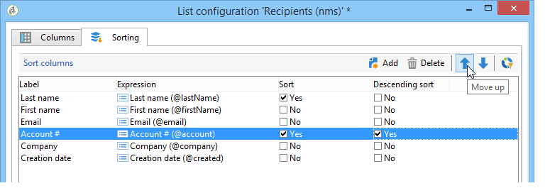

# Adobe Campaign 작업 영역{#adobe-campaign-workspace}

## About Adobe Campaign interface {#about-adobe-campaign-interface}

데이터베이스에 연결되면 대시보드인 Adobe Campaign 홈 페이지에 액세스합니다.이 단축키는 설치 및 일반 플랫폼 구성에 따라 기능에 액세스할 수 있는 링크와 단축키로 구성되어 있습니다.

홈 페이지의 중앙 섹션에서 링크를 사용하여 Campaign 온라인 문서 포털, 포럼 및 지원 웹 사이트에 액세스할 수 있습니다.

위 스크린샷은 Adobe Campaign 사용자를 위한 홈 페이지의 예입니다. 자세한 내용은 [Adobe Campaign 인터페이스 개요 비디오를 참조하십시오](https://docs.adobe.com/content/help/en/campaign-learn/campaign-classic-tutorials/getting-started/interface-overview.html).

>[!NOTE]
>
>인스턴스에 사용할 수 있는 Adobe Campaign 기능은 설치된 모듈 및 추가 기능에 따라 다릅니다. 사용 권한 및 특정 구성에 따라 일부 기능을 사용할 수도 없습니다.
>
>모듈 또는 Add-On을 설치하기 전에 사용권 계약을 확인하거나 Adobe 계정 관리자에게 문의하십시오.

### 콘솔 및 웹 액세스 {#console-and-web-access}

Adobe Campaign 플랫폼은 콘솔 또는 인터넷 브라우저를 통해 액세스할 수 있습니다.

웹 액세스는 콘솔과 유사하지만 기능 집합이 축소되는 인터페이스를 제공합니다.

예를 들어, 지정된 연산자에 대해 캠페인이 콘솔에 다음과 같은 옵션이 표시됩니다.

웹 액세스 시 옵션은 주로 보기를 활성화합니다.

### 언어 {#languages}

이 언어는 Adobe Campaign Classic 인스턴스를 설치할 때 선택되며 이후 변경할 수 없습니다. For more information on how to create an instance, refer to this [page](../../installation/using/creating-an-instance-and-logging-on.md).

5개의 언어를 선택할 수 있습니다.

* 영어(영국)
* 영어(미국)
* 프랑스어
* 독일어
* 일본어

Adobe Campaign Classic 인스턴스에 대해 선택한 언어는 날짜 및 시간 형식에 영향을 줄 수 있습니다. 자세한 정보는 이 [섹션](../../platform/using/adobe-campaign-workspace.md#date-and-time)을 참조하십시오.

## 탐색 기본 사항 {#navigation-basics}

### 페이지 검색 {#browsing-pages}

플랫폼의 다양한 기능은 다음과 같은 핵심 기능으로 분류됩니다.인터페이스의 상단 섹션에 있는 링크를 사용하여 링크에 액세스합니다.

사용자가 액세스할 수 있는 핵심 기능 목록은 설치한 패키지 및 추가 기능과 액세스 권한에 따라 다릅니다.

각 기능에는 작업 관련 요구 사항 및 사용 컨텍스트에 따라 일련의 기능이 포함됩니다. 예를 들어 이 링크를 통해 수신자 목록, 구독 서비스, 기존 타깃팅 워크플로우 및 이러한 요소를 만드는 단축키로 이동할 수 있습니다. **[!UICONTROL Profiles and targets]**

목록은 인터페이스의 왼쪽 섹션에 있는 **[!UICONTROL Lists]** 링크를 통해 사용할 수 **[!UICONTROL Profiles and Targets]** 있습니다.

### 탭 사용 {#using-tabs}

* 핵심 기능 또는 링크를 클릭하면 관련 페이지가 현재 페이지를 대체합니다. 이전 페이지로 돌아가려면 도구 모음에서 **[!UICONTROL Back]** 단추를 클릭합니다. 홈 페이지로 돌아가려면 **[!UICONTROL Home]** 단추를 클릭합니다.

   

* 표시 화면(예: 웹 애플리케이션, 프로그램, 전달, 보고서 등)으로 연결되는 메뉴 또는 단축키의 경우 일치하는 페이지가 다른 탭에 표시됩니다. 탭을 사용하여 한 페이지에서 다른 페이지로 이동할 수 있습니다.

   

### 요소 만들기 {#creating-an-element}

각 핵심 기능 섹션에서 사용 가능한 요소 간을 탐색할 수 있습니다. 이렇게 하려면 섹션의 단축키를 **[!UICONTROL Browsing]** 사용합니다. 이 **[!UICONTROL Other choices]** 링크를 사용하면 환경에 상관없이 다른 모든 페이지에 액세스할 수 있습니다.

새 요소(배달, 웹 애플리케이션, 워크플로우 등)를 만들 수 있습니다. 화면 왼쪽의 **[!UICONTROL Create]** 섹션에 있는 단축키를 사용합니다. 목록 **[!UICONTROL Create]** 위의 단추를 사용하여 목록에 새 요소를 추가합니다.

예를 들어 배달 페이지에서 단추를 사용하여 새 배달을 **[!UICONTROL Create]** 만듭니다.

## Adobe Campaign 탐색기 사용 {#using-adobe-campaign-explorer}

### About Adobe Campaign explorer {#about-adobe-campaign-explorer}

Adobe Campaign 탐색기는 도구 모음 아이콘을 통해 액세스할 수 있습니다. 모든 Adobe Campaign 기능, 구성 화면 및 일부 플랫폼 요소의 보다 자세한 보기를 Adobe Campaign에 액세스할 수 있습니다.

작업 **[!UICONTROL Explorer]** 공간은 세 영역으로 나뉘어집니다.

**1 - 트리**:트리의 컨텐츠를 개인화할 수 있습니다(노드 추가, 이동 또는 삭제). 이 절차는 전문 사용자에게만 해당됩니다. 자세한 정보는 이 [페이지](../../configuration/using/about-navigation-hierarchy.md)를 참조하십시오.

**2 - 목록**:이 목록을 필터링하거나 검색을 실행하거나 정보를 추가하거나 데이터를 정렬할 수 있습니다.

**3 - 세부 정보**:선택한 요소의 세부 사항을 표시할 수 있습니다. 오른쪽 상단의 아이콘을 사용하면 이 정보를 전체 화면 형식으로 표시할 수 있습니다.

### 화면 해상도 {#screen-resolution}

최적의 탐색 및 유용성을 위해 Adobe은 최소 1600x900픽셀의 화면 해상도를 사용하는 것이 좋습니다.

>[!CAUTION]
>
>1600x900픽셀 이하의 해상도는 Adobe Campaign에서 지원되지 않을 수 있습니다.

작업 **[!UICONTROL Explorer]** 공간에서 **[!UICONTROL Details]** 영역의 일부 부분이 잘린 것으로 나타나면 영역 상단에 있는 화살표를 사용하여 확장하거나 **[!UICONTROL Enlarge]** 단추를 클릭합니다.

### 검색 목록 {#browsing-lists}

목록을 찾아보려면 스크롤 막대 **** (가로 및 세로)를 사용하여 레코드 선택, 마우스 휠이나 **화살표 키**&#x200B;를 변경하지 **않고 스크롤**&#x200B;을 할 수있습니다.

>[!NOTE]
>
>목록 컨텐츠의 구성 및 개인화는 목록 [구성에 나와 있습니다](#configuring-lists).
>
>데이터를 정렬 및 필터링할 수도 있습니다. 필터링 [옵션을 참조하십시오](../../platform/using/filtering-options.md).

### 레코드 수 {#counting-records}

기본적으로 Adobe Campaign은 목록의 처음 200개의 레코드를 로드합니다. 즉, 표시 시 보고 있는 테이블의 모든 레코드가 반드시 표시되지 않습니다. 목록의 레코드 수를 실행하고 더 많은 레코드를 로드할 수 있습니다.

목록 화면의 오른쪽 하단에는 로드된 레코드 수와 데이터베이스의 총 레코드 수가 표시됩니다(필터를 적용한 후). **[!UICONTROL counter]**

&quot;라고&#x200B;**?**&#x200B;오른쪽에 숫자 대신 나타나는 카운터를 클릭하여 계산을 시작합니다.

### 더 많은 레코드 로드 {#loading-more-records}

추가 레코드를 로드하고 표시하려면(기본적으로 200개 라인) 을 클릭합니다 **[!UICONTROL Continue loading]**.

모든 레코드를 로드하려면 목록을 마우스 오른쪽 단추로 클릭하고 선택합니다 **[!UICONTROL Load all]**.

>[!CAUTION]
>
>레코드 수에 따라 전체 목록을 로드하는 시간이 길어질 수 있습니다.

### 기본 레코드 수 변경 {#change-default-number-of-records}

로드되는 기본 레코드 수를 변경하려면 목록의 오른쪽 아래 모서리 **[!UICONTROL Configure list]** 에서 을 클릭합니다.

목록 구성 창에서 &quot;고급 매개 변수&quot;(왼쪽 아래)를 클릭하고 검색할 줄 수를 변경합니다.

### 목록 구성 {#configuring-lists}

#### 열 추가 {#add-columns}

두 가지 방법으로 목록에 열을 추가할 수 있습니다.

레코드의 세부 사항에서 목록에 열을 빠르게 추가할 수 있습니다. 방법은 다음과 같습니다.

1. 세부 사항 화면에서 열에 표시할 필드를 마우스 오른쪽 단추로 클릭합니다.
1. **[!UICONTROL Add in the list]**&#x200B;을(를) 선택합니다.

   기존 열 오른쪽에 열이 추가됩니다.

예를 들어 세부 사항 화면에 표시되지 않는 데이터를 표시하려면 목록 구성 창을 사용하는 방법으로 열을 추가할 수 있습니다. 방법은 다음과 같습니다.

1. 아래 **[!UICONTROL Configure list]** 와 목록 오른쪽을 클릭합니다.

   

1. 목록 구성 창에서 목록에 추가할 필드를 두 번 클릭하여 **[!UICONTROL Available fields]** 목록에 추가합니다 **[!UICONTROL Output columns]**.

   

   >[!NOTE]
   >
   >기본적으로 고급 필드는 표시되지 않습니다. 표시하려면 **아래 및 사용 가능한 필드** 목록 오른쪽에 있는 고급 필드 표시를 클릭합니다.
   >
   >레이블은 표별로 표시된 다음 알파벳순으로 표시됩니다.
   >
   >검색 **필드를** 사용하여 사용 가능한 필드에서 검색을 실행합니다. 자세한 내용은 목록 [정렬을 참조하십시오](#sorting-a-list).
   >
   >필드는 특정 아이콘으로 식별됩니다.SQL 필드, 연결된 테이블, 계산된 필드 등 선택한 각 필드에 대해 사용 가능한 필드 목록 아래에 설명이 표시됩니다. [목록](#configuring-lists)구성
   >
   >데이터를 정렬 및 필터링할 수도 있습니다. 필터링 [옵션을 참조하십시오](../../platform/using/filtering-options.md).

1. 각 열이 표시되도록 이 단계를 반복합니다.
1. 화살표를 사용하여 **표시 순서를 수정합니다**. 가장 높은 열은 레코드 목록의 왼쪽에 있습니다.

   

1. 필요한 경우 을 클릭하여 현재 폴더 **[!UICONTROL Distribution of values]** 에서 선택한 필드에 대한 값의 재분할 영역을 볼 수 있습니다.

   

1. 구성 **[!UICONTROL OK]** 을 확인하고 결과를 표시하려면 을(를) 클릭합니다.

#### 새 열 만들기 {#create-a-new-column}

새 열을 만들어 목록에 추가 필드를 표시할 수 있습니다. 방법은 다음과 같습니다.

1. 아래 **[!UICONTROL Configure the list]** 와 목록의 오른쪽에 있는 을 클릭합니다.
1. 을 **[!UICONTROL Add]** 클릭하여 목록에 새 필드를 표시합니다.

#### 열 제거 {#remove-a-column}

아래 및 목록 오른쪽에 있는 레코드 목록에서 하나 이상의 열을 마스크 **[!UICONTROL Configure list]** 할 수 있습니다.

목록 구성 창에서 영역에서 마스크할 열을 선택하고 삭제 단추를 **[!UICONTROL Output columns]** 클릭합니다.

마스크할 각 열에 대해 반복합니다. 구성 **[!UICONTROL OK]** 을 확인하고 결과를 표시하려면 을(를) 클릭합니다.

#### 열 너비 조정 {#adjust-column-width}

목록이 활성 상태인 경우, 즉 한 개 이상의 줄을 선택한 경우 F9를 사용하여 모든 열을 화면에 표시할 수 있도록 열의 너비를 조정할 수 있습니다.

#### 하위 폴더 레코드 표시 {#display-sub-folders-records}

목록은 다음을 표시할 수 있습니다.

* 선택한 폴더에만 포함된 레코드
* 또는 선택한 폴더 및 하위 폴더의 레코드

한 표시 모드에서 다른 표시 모드로 전환하려면 도구 모음 **[!UICONTROL Display sub-levels]** 에서 을 클릭합니다.

### 목록 구성 저장 {#saving-a-list-configuration}

목록 구성은 워크스테이션 수준에서 로컬로 정의됩니다. 로컬 캐시가 지워지면 로컬 구성이 비활성화됩니다.

기본적으로 정의된 표시 매개 변수는 해당 폴더 유형이 있는 모든 목록에 적용됩니다. 따라서 폴더에서 수신자 목록을 표시하는 방법을 수정하면 이 구성이 다른 모든 수신자 폴더에 적용됩니다.

그러나 동일한 유형의 다른 폴더에 둘 이상의 구성을 저장할 수 있습니다. 구성은 데이터가 포함된 폴더의 속성과 함께 저장되며 다시 적용할 수 있습니다.

예를 들어 배달 폴더의 경우 다음 표시를 구성할 수 있습니다.

이 목록 구성을 다시 사용할 수 있도록 저장하려면 아래 단계를 따르십시오.

1. 표시된 데이터가 들어 있는 폴더를 마우스 오른쪽 단추로 클릭합니다.
1. **[!UICONTROL Properties]**&#x200B;을(를) 선택합니다.
1. 을 **[!UICONTROL Advanced settings]** 클릭한 다음 **[!UICONTROL Configuration]** 필드 이름을 지정합니다.

   

1. 을 클릭한 **[!UICONTROL OK]** 다음 을 클릭합니다 **[!UICONTROL Save]**.

그런 다음 이 구성을 다른 **배달** 폴더에 적용할 수 있습니다.

폴더 속성 창 **[!UICONTROL Save]** 에서 을 클릭합니다. 목록 표시가 지정된 구성과 일치하도록 수정되었습니다.

### 목록 내보내기 {#exporting-a-list}

목록에서 데이터를 내보내려면 내보내기 마법사를 사용해야 합니다. 이 파일에 액세스하려면 목록에서 내보낼 요소를 선택하고 마우스 오른쪽 버튼을 클릭한 다음 선택합니다 **[!UICONTROL Export...]**.

가져오기 및 내보내기 기능의 사용은 일반 가져오기 및 내보내기에 [설명되어 있습니다](../../platform/using/generic-imports-and-exports.md).

>[!CAUTION]
>
>목록의 요소는 복사/붙여넣기 기능을 사용하여 내보내면 안 됩니다.

### 목록 정렬 {#sorting-a-list}

목록에는 대량의 데이터가 포함될 수 있습니다. 이러한 데이터를 정렬하거나 단순 또는 고급 필터를 적용할 수 있습니다. 정렬을 사용하면 데이터를 오름차순 또는 내림차순으로 표시할 수 있습니다. 필터를 사용하면 선택한 데이터만 표시하도록 기준을 정의하고 결합할 수 있습니다.

열 헤더를 클릭하여 오름차순 또는 내림차순 정렬을 적용하거나 데이터 정렬을 취소합니다. 활성 정렬 상태 및 정렬 순서는 열 레이블 앞에 파란색 화살표로 표시됩니다. 열 레이블 앞의 빨간색 대시는 데이터베이스에서 인덱싱된 데이터에 정렬이 적용됨을 의미합니다. 이 정렬 방법은 정렬 작업을 최적화하는 데 사용됩니다.

정렬 기준을 구성하거나 결합할 수도 있습니다. 이렇게 하려면 아래 단계를 수행합니다:

1. **[!UICONTROL Configure list]** 아래 및 목록의 오른쪽에 있습니다.

   

1. 목록 구성 창에서 **[!UICONTROL Sorting]** 탭을 클릭합니다.
1. 정렬할 필드와 정렬 방향(오름차순 또는 내림차순)을 선택합니다.

   

1. 정렬 우선 순위는 정렬 열의 순서로 정의됩니다. 우선 순위를 변경하려면 해당 아이콘을 사용하여 열 순서를 변경합니다.

   

   정렬 우선 순위는 목록의 열 표시에 영향을 주지 않습니다.

1. 이 구성 **[!UICONTROL Ok]** 을 확인하고 결과를 목록에 표시하려면 을(를) 클릭합니다.

### 검색 실행 {#running-a-search}

필드 목록 위에 있는 필드를 사용하여 편집기에서 사용 가능한 필드 **[!UICONTROL Search]** 를 검색할 수 있습니다. 키보드에서 **Enter** 키를 누르거나 목록을 찾습니다. 검색과 일치하는 필드에는 굵은 레이블이 표시됩니다.

>[!NOTE]
>
>필터를 만들어 목록에 일부 데이터만 표시할 수 있습니다. 필터 [만들기를 참조하십시오](../../platform/using/creating-filters.md).

## 포맷 및 단위 {#formats-and-units}

### 날짜 및 시간 {#date-and-time}

Adobe Campaign Classic 인스턴스의 언어는 날짜 및 시간 형식에 영향을 줍니다.

Campaign을 설치할 때 언어가 선택되므로 나중에 변경할 수 없습니다. 다음을 선택할 수 있습니다.영어(미국), 영어(EN), 프랑스어, 독일어 또는 일본어입니다. 자세한 정보는 이 [페이지](../../installation/using/creating-an-instance-and-logging-on.md)를 참조하십시오.

미국 영어와 영국 영어의 주요 차이점은 다음과 같습니다.

<table> 
 <thead> 
  <tr> 
   <th> 형식  </th> 
   <th> 영어(미국)  </th> 
   <th> 영어(EN)  </th> 
  </tr> 
 </thead> 
 <tbody> 
  <tr> 
   <td> 날짜  </td> 
   <td> 일요일부터 한 주  </td> 
   <td> 월요일부터 한 주  </td> 
  </tr> 
  <tr> 
   <td> 짧은 날짜  </td> 
   <td> 
%2M/%2D/%4Y

<strong>ex:2018년 09월 25일</strong>
 </td> 
   <td> 
%2D/%2M/%4Y

<strong>ex:2018년 25월 09일</strong>
 </td> 
  </tr> 
  <tr> 
   <td> 짧은 날짜 및 시간  </td> 
   <td> 
%2M/%2D/%4Y %I:%2N:%2S %P

<strong>ex:2018년 09월 25일 오후 10시 47분 25초</strong>
 </td> 
   <td> 
%2D/%2M/%4Y %2H:%2N:%2S

<strong>ex:2018년 25월 09일 22시 47분 25초</strong>
 </td> 
  </tr> 
 </tbody> 
</table>

### 열거형에 값 추가 {#add-values-in-an-enumeration}

드롭다운 목록과 함께 입력 필드를 사용하여 드롭다운 목록에 옵션으로 제공되는 열거형 값을 입력할 수 있습니다. 예를 들어 수신자 프로필의 **[!UICONTROL City]** 탭 필드 **[!UICONTROL General]** 에서 London을 입력할 수 있습니다. Enter 키를 눌러 이 값을 확인하면 필드와 연관된 열거형에 이 값을 저장할지 묻는 메시지가 나타납니다.

클릭하면 관련 필드 **[!UICONTROL Yes]**&#x200B;의 콤보 상자에서 이 값을 사용할 수 있습니다(이 경우: **[!UICONTROL London]**).

>[!NOTE]
>
>열거형(&#39;항목별 목록&#39;이라고도 함)은 관리자가 **[!UICONTROL Administration > Platform > Enumerations]** 섹션을 통해 관리합니다. For more on this, refer to [Managing enumerations](../../platform/using/managing-enumerations.md).

### 기본 단위 {#default-units}

지속 기간을 설명하는 필드(예: 납품 자원의 유효 기간, 작업의 승인 기한 등)에서 이 값은 다음 **단위로 나타낼 수 있습니다**.

* **[!UICONTROL s]** 초,
* **[!UICONTROL mn]** 몇 분 동안
* **[!UICONTROL h]** 몇 시간 동안
* **[!UICONTROL d]** for days.

