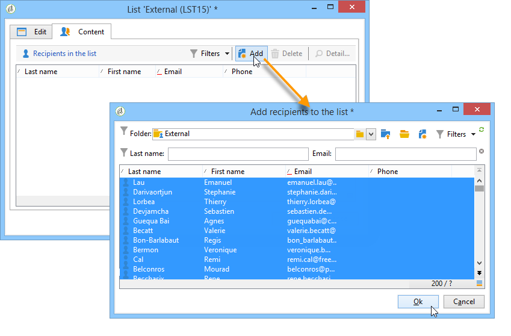

# 목록 만들기 및 관리{#creating-and-managing-lists}

## Adobe Campaign {#about-lists-in-adobe-campaign}의 목록 정보

목록은 가져오기 작업 또는 워크플로우 실행 중에 배달 작업에서 타깃팅하거나 업데이트할 수 있는 정적 프로필 집합입니다. 예를 들어 쿼리를 통해 데이터베이스에서 추출한 모집단은 목록을 제공할 수 있습니다.

목록은 **[!UICONTROL Profiles and targets]** 탭의 **[!UICONTROL Lists]** 링크를 통해 만들고 관리됩니다.

Adobe Campaign에서는 두 가지 유형의 목록을 사용할 수 있습니다.

* **[!UICONTROL Group]** type:유형  **[!UICONTROL Group]** 목록은  **** 특정 기준에 따라 선택한 사람들의 통계치에 속합니다. 목록은 일련의 프로파일 스냅샷과 같습니다. 데이터베이스에 프로파일이 추가되는 경우에는 자동으로 업데이트되지 않습니다.

   **[!UICONTROL Group]** 유형 목록을 만드는 방법에 대한 자세한 내용은 이 [페이지](#creating-a-profile-list-from-a-group)를 참조하십시오.

* **[!UICONTROL List]** type:유형  **[!UICONTROL List]** 목록을 사용하면 워크플로우를 사용하여 목록을 만들고 관리할 수 있습니다. 이러한 목록은 전용 **[!UICONTROL List update]** 워크플로우 활동을 통해 업데이트할 수 있는 데이터 가져오기로 인한 특정 목록입니다.

   **[!UICONTROL Group]** 유형 목록과 달리 이 유형 목록은 **[!UICONTROL Scheduler]** 활동으로 자동으로 업데이트할 수 있습니다. **[!UICONTROL List]** 유형 목록을 만드는 방법에 대한 예제는 [이 페이지](../../workflow/using/list-update.md)를 참조하십시오.

 [비디오에서 이 기능 살펴보기](#create-list-video)

## {#creating-a-profile-list-from-a-group} 그룹에서 프로필 목록 만들기

**[!UICONTROL Group]** 링크를 통해 만든  **[!UICONTROL Profiles and targets]** 유형 목록은 기본 Adobe Campaign 프로필 테이블(nms:recipient)을 기반으로 해야 합니다.

>[!NOTE]
>
>다른 유형의 데이터가 포함된 목록을 만들려면 Workflow를 실행해야 합니다. 예를 들어 방문자 테이블에서 쿼리를 사용한 다음 목록을 업데이트하면 방문자 목록을 만들 수 있습니다. 워크플로우에 대한 자세한 내용은 [이 섹션](../../workflow/using/about-workflows.md)을 참조하십시오.

새 **[!UICONTROL Group]** 유형 목록을 만들려면 다음 단계를 적용합니다.

1. **[!UICONTROL Create]** 단추를 클릭하고 **[!UICONTROL New list]**&#x200B;을 선택합니다.

   

1. 목록 만들기 창의 **[!UICONTROL Edit]** 탭에 정보를 입력합니다.

   * **[!UICONTROL Label]** 필드에 목록 이름을 입력하고 필요한 경우 내부 이름을 변경합니다.
   * 이 목록에 대한 설명을 추가합니다.
   * 만료 날짜를 지정할 수 있습니다.이 날짜가 되면 목록이 삭제되고 자동으로 삭제됩니다.

      

1. **[!UICONTROL Content]** 탭에서 **[!UICONTROL Add]**&#x200B;을 클릭하여 목록에 속하는 프로필을 선택합니다.

   

1. **[!UICONTROL Save]**&#x200B;을 클릭하여 목록을 저장합니다. 그런 다음 목록 개요에 추가됩니다.

**[!UICONTROL Create]**&#x200B;을 클릭하여 &#39;프로파일 추가&#39; 창에서 직접 새 프로파일을 만들 수 있습니다. 프로필이 데이터베이스에 추가됩니다.

프로필 목록은 다른 목록과 마찬가지로 구성할 수 있습니다. [목록 구성](../../platform/using/adobe-campaign-workspace.md#configuring-lists)을 참조하십시오.

## 데이터를 목록 {#linking-data-to-a-list}에 연결

>[!NOTE]
>
>목록에 데이터를 연결하는 작업은 **[!UICONTROL Group]** 유형 목록에서만 수행할 수 있습니다.

프로파일 세트의 프로파일을 필터링하여 목록에 연결할 수 있습니다. 그런 다음 전달 작업을 이 목록으로 전송하여 대상 프로파일을 만들 수 있습니다. 프로필을 그룹화하려면:

1. 프로파일을 선택하고 마우스 오른쪽 버튼을 클릭합니다.
1. **[!UICONTROL Actions > Associate selection with a list...]**&#x200B;을(를) 선택합니다.

   

1. 원하는 목록을 선택하거나 **[!UICONTROL Create]** 단추를 사용하여 새 목록을 만든 다음 **[!UICONTROL Next]**&#x200B;을 클릭합니다.

   

1. **[!UICONTROL Start]** 버튼을 클릭합니다.

   

**[!UICONTROL Recreate the list]** 옵션은 목록에서 이전 컨텐츠를 삭제합니다. 프로파일이 목록에 이미 연결되어 있는지 여부를 확인하는 데 쿼리가 필요하므로 이 모드는 최적화되어 있습니다.

**[!UICONTROL No trace of this job is saved in the database]** 옵션의 선택을 취소하면 이 프로세스에 연결된 정보가 저장되는 실행 폴더를 선택하거나 만들 수 있습니다.

창의 위쪽 섹션에서 실행을 모니터링할 수 있습니다. **[!UICONTROL Stop]** 단추를 사용하여 프로세스를 중지할 수 있습니다. 이미 처리된 연락처가 목록에 연결됩니다.

이 작업과 관련된 프로파일의 **[!UICONTROL Lists]** 탭을 통해 프로세스를 모니터링할 수 있습니다.

Adobe Campaign 홈 페이지를 통해 목록을 편집할 수도 있습니다.**[!UICONTROL Profiles and Targets > Lists]** 메뉴를 클릭하고 관련 목록을 선택합니다. **[!UICONTROL Content]** 탭에는 이 목록에 연결된 프로필이 표시됩니다.

## 목록 {#removing-a-profile-from-a-list}에서 프로필 제거

목록에서 프로파일을 제거하려면 다음을 수행할 수 있습니다.

* 목록을 편집하고 **[!UICONTROL Content]** 탭에서 프로필을 선택한 다음 **[!UICONTROL Delete]** 아이콘을 클릭합니다.

   

* 프로필을 편집하고 **[!UICONTROL List]** 탭을 클릭한 다음 **[!UICONTROL Delete]** 아이콘을 클릭합니다.

   

## 프로필 목록 {#deleting-a-list-of-profiles} 삭제

Adobe Campaign 트리의 그룹 목록에서 하나 이상의 목록을 삭제할 수 있습니다. 이렇게 하려면 Adobe Campaign 홈 페이지의 **[!UICONTROL Advanced > Explorer]** 링크를 통해 트리를 편집합니다. 관련 그룹을 선택하고 마우스 오른쪽 단추를 클릭합니다. **[!UICONTROL Delete]**&#x200B;을(를) 선택합니다. 삭제를 확인하는 경고 메시지가 표시됩니다.

>[!NOTE]
>
>목록을 삭제할 때 목록의 프로필은 영향을 받지 않지만 프로필의 데이터는 업데이트됩니다.

## 자습서 비디오 {#create-list-video}

### 받는 사람 목록을 만드는 방법

목록은 게재 작업에서 타겟팅되거나 가져오기 작업 또는 워크플로우 실행 중에 업데이트될 수 있는 정적 수신자 집합입니다. 수신자 목록은 대상자라고도 합니다.

탐색기에서 받는 사람 목록을 구성하여 대상을 만드는 방법을 알아봅니다.

>[!VIDEO](https://video.tv.adobe.com/v/25602/quality=12)

### 워크플로 {#create-list-in-a-wf-video}으로 받는 사람 목록을 만드는 방법

수신자를 타깃팅하기 위해 워크플로우를 만드는 방법과 이메일 타겟에서 목록을 사용하기 전에 반복하는 방법을 알아봅니다.

>[!VIDEO](https://video.tv.adobe.com/v/25603?quality=12)

추가 Campaign Classic 방법 비디오는 [여기](https://experienceleague.adobe.com/docs/campaign-classic-learn/tutorials/overview.html?lang=ko)에서 사용할 수 있습니다.