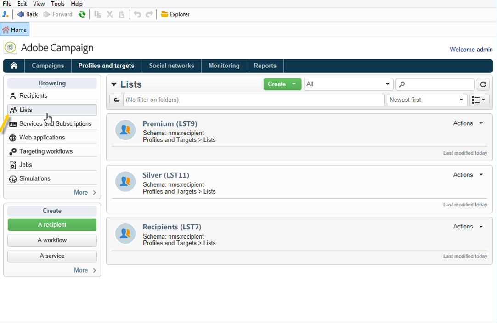

# 목록 만들기 및 관리{#creating-and-managing-lists}

## 목록이 무엇입니까? {#about-lists-in-adobe-campaign}

목록은 게재 작업에서 타겟팅되거나 가져오기 작업 또는 워크플로우 실행 중에 업데이트될 수 있는 정적 프로필 세트입니다. 예를 들어 쿼리를 통해 데이터베이스에서 추출한 모집단은 목록을 제공할 수 있습니다.

목록은 를 통해 만들고 관리됩니다 **[!UICONTROL Lists]** 링크 위치 **[!UICONTROL Profiles and targets]** 탭.

Adobe Campaign에서는 두 가지 유형의 목록을 사용할 수 있습니다.

* **[!UICONTROL Group]** 유형: 다음 **[!UICONTROL Group]** 유형 목록이 **정적** 특정 기준에 따라 선택한 사람 목록입니다. 목록은 프로필 집합의 스냅샷과 같습니다. 데이터베이스에 프로필을 추가하는 경우 자동으로 업데이트되지 않습니다.

   을(를) 만드는 방법에 대한 자세한 내용은 **[!UICONTROL Group]** 유형 목록, 다음 참조 [페이지](#creating-a-profile-list-from-a-group).

* **[!UICONTROL List]** 유형: 다음 **[!UICONTROL List]** 유형 목록을 사용하면 워크플로우를 사용하여 목록을 만들고 관리할 수 있습니다. 이러한 목록은 데이터 가져오기로 인한 특정 목록이며, 전용 목록을 통해 업데이트할 수 있습니다 **[!UICONTROL List update]** 워크플로우 활동.

   와 달리 **[!UICONTROL Group]** 유형 목록, 이 유형 목록은 **[!UICONTROL Scheduler]** 활동. 만들기 방법의 예는 를 참조하십시오 **[!UICONTROL List]** 유형 목록, [이 페이지](../../workflow/using/list-update.md).

 [비디오에서 이 기능 살펴보기](#create-list-video)

## 그룹에서 프로필 목록 만들기 {#creating-a-profile-list-from-a-group}

**[!UICONTROL Group]** 을 통해 만든 유형 목록 **[!UICONTROL Profiles and targets]** 링크는 기본 Adobe Campaign 프로필 테이블(nms:recipient)을 기반으로 해야 합니다.

>[!NOTE]
>
>다른 유형의 데이터가 포함된 목록을 만들려면 워크플로우를 실행해야 합니다. 예를 들어 방문자 테이블에서 쿼리를 사용한 다음 목록을 업데이트하여 방문자 목록을 만들 수 있습니다. 워크플로우에 대한 자세한 내용은 [이 섹션](../../workflow/using/about-workflows.md).

새 **[!UICONTROL Group]** list를 입력하고 다음 단계를 적용합니다.

1. 을(를) 클릭합니다. **[!UICONTROL Create]** 단추를 누르고 선택합니다. **[!UICONTROL New list]**.

   

1. 에 정보를 입력합니다. **[!UICONTROL Edit]** 목록 작성 창의 탭입니다.

   * 에 목록 이름을 입력합니다. **[!UICONTROL Label]** 필드 및 필요한 경우 내부 이름을 변경합니다.
   * 이 목록에 대한 설명을 추가합니다.
   * 만료 날짜를 지정할 수 있습니다. 이 날짜에 도달하면 목록이 삭제되고 자동으로 삭제됩니다.

      

1. 에서 **[!UICONTROL Content]** 탭, **[!UICONTROL Add]** 목록에 속하는 프로필을 선택하려면 다음을 수행하십시오.

   

1. 클릭 **[!UICONTROL Save]** 목록을 저장합니다. 그런 다음 목록 개요에 추가됩니다.

&#39;프로필 추가&#39; 창에서 **[!UICONTROL Create]**. 프로필이 데이터베이스에 추가됩니다.

프로필 목록은 다른 목록처럼 구성할 수 있습니다. [이 섹션](../../platform/using/adobe-campaign-workspace.md#configuring-lists)을 참조하십시오.

## 목록에 데이터 연결 {#linking-data-to-a-list}

>[!NOTE]
>
>데이터에 대한 연결은 **[!UICONTROL Group]** 목록 을 입력합니다.

프로필 세트의 프로필을 필터링하고 목록에 연결할 수 있습니다. 그런 다음 게재 작업을 이 목록으로 전송하여 프로필을 타겟팅할 수 있습니다. 프로필을 그룹화하려면 다음과 같이 하십시오.

1. 프로필을 선택하고 마우스 오른쪽 단추를 클릭합니다.
1. **[!UICONTROL Actions > Associate selection with a list...]**&#x200B;을(를) 선택합니다.

   

1. 원하는 목록을 선택하거나 **[!UICONTROL Create]** 단추를 클릭한 다음 **[!UICONTROL Next]**.

   

1. **[!UICONTROL Start]** 버튼을 클릭합니다.

   

다음 **[!UICONTROL Recreate the list]** 선택 사항을 선택하면 목록에서 이전 컨텐츠가 삭제됩니다. 프로필이 이미 목록에 연결되어 있는지 여부를 확인하는 데 쿼리가 필요 없으므로 이 모드가 최적화되었습니다.

선택을 취소하고 **[!UICONTROL No trace of this job is saved in the database]** 옵션을 선택하면 이 프로세스에 연결된 정보가 저장되는 실행 폴더를 선택하거나 생성할 수 있습니다.

창의 위쪽 섹션에서 실행을 모니터링할 수 있습니다. 다음 **[!UICONTROL Stop]** 버튼을 사용하면 프로세스를 중지할 수 있습니다. 이미 처리된 연락처가 목록에 연결됩니다.

를 통해 프로세스를 모니터링할 수 있습니다 **[!UICONTROL Lists]** 탭에서 이 작업을 수행할 수 있습니다.

Adobe Campaign 홈페이지에서 목록을 편집할 수도 있습니다. 를 클릭합니다. **[!UICONTROL Profiles and Targets > Lists]** 메뉴를 선택하고 관련 목록을 선택합니다. 다음 **[!UICONTROL Content]** 이 목록에 연결된 프로필이 탭에 표시됩니다.

## 목록에서 프로필 제거 {#removing-a-profile-from-a-list}

목록에서 프로파일을 제거하려면 다음을 수행할 수 있습니다.

* 목록을 편집하고, **[!UICONTROL Content]** 탭을 클릭한 다음 **[!UICONTROL Delete]** 아이콘.

   

* 프로필을 편집하고 **[!UICONTROL List]** 탭을 클릭한 다음 **[!UICONTROL Delete]** 아이콘.

   

## 프로필 목록 삭제 {#deleting-a-list-of-profiles}

Adobe Campaign 트리의 그룹 목록에서 하나 이상의 목록을 삭제할 수 있습니다. 이렇게 하려면 **[!UICONTROL Advanced > Explorer]** 링크를 클릭합니다. 관련 그룹을 선택하고 마우스 오른쪽 버튼을 클릭합니다. **[!UICONTROL Delete]**&#x200B;을(를) 선택합니다. 삭제 확인을 묻는 경고 메시지가 표시됩니다.

>[!NOTE]
>
>목록을 삭제하면 목록의 프로필이 영향을 받지 않지만, 해당 프로필의 데이터가 업데이트됩니다.

## 튜토리얼 비디오 {#create-list-video}

### 수신자 목록을 만드는 방법

목록은 게재 작업에서 타겟팅되거나 가져오기 작업 또는 워크플로우 실행 중에 업데이트될 수 있는 정적 수신자 집합입니다. 수신자 목록은 대상자라고도 합니다.

Explorer에서 수신자 목록을 구성하여 대상자를 만드는 방법을 알아봅니다.

>[!VIDEO](https://video.tv.adobe.com/v/25602/quality=12)

### 워크플로우를 사용하여 수신자 목록을 만드는 방법 {#create-list-in-a-wf-video}

수신자를 타겟팅하기 위한 워크플로우를 만드는 방법과 이메일 타겟의 목록을 사용하기 전에 되풀이되도록 하는 방법을 알아봅니다.

>[!VIDEO](https://video.tv.adobe.com/v/25603?quality=12)

추가 Campaign Classic 방법 비디오를 사용할 수 있습니다 [여기](https://experienceleague.adobe.com/docs/campaign-classic-learn/tutorials/overview.html?lang=ko).
