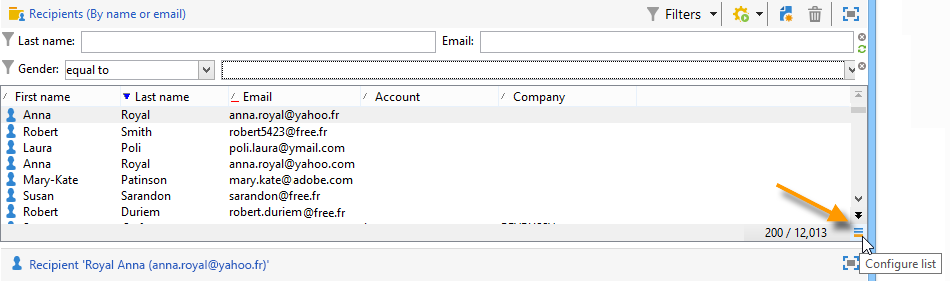
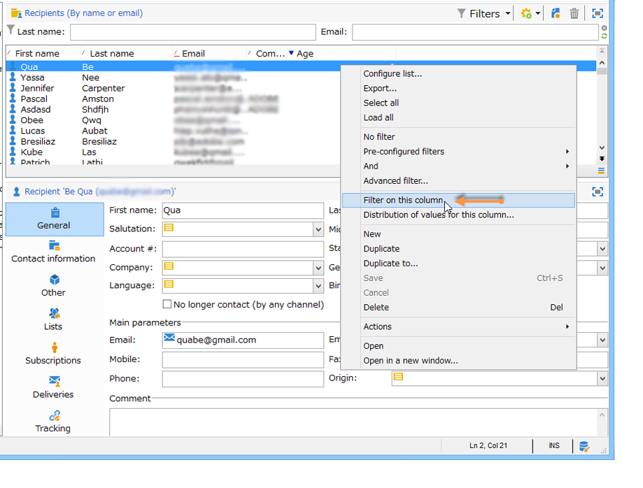
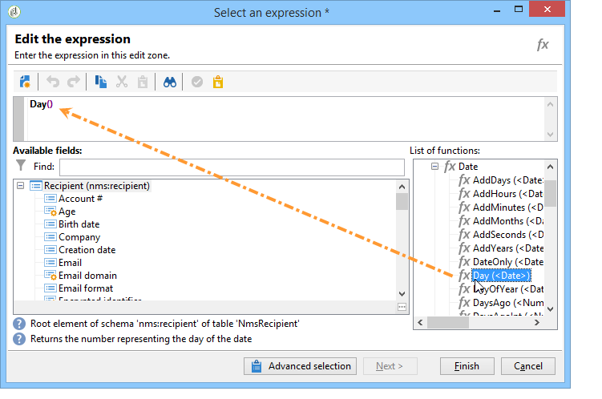
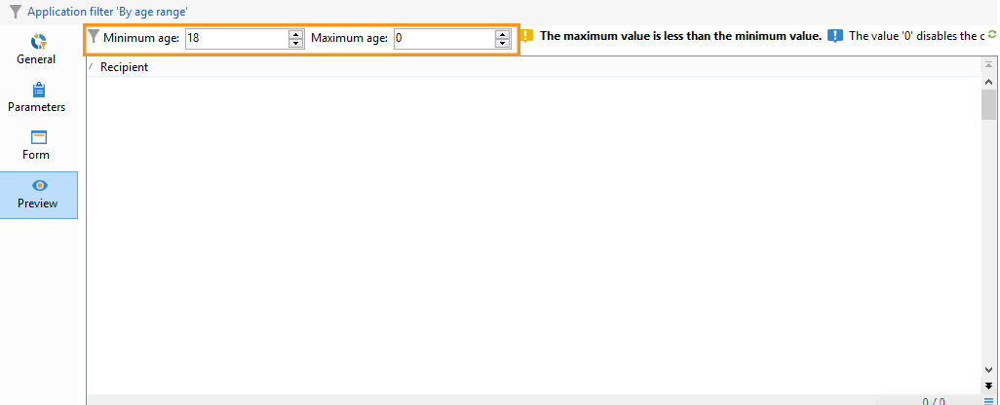

# 필터 만들기{#creating-filters}

## 소개 {#introduction}

Adobe Campaign 트리(홈 페이지의 **[!UICONTROL Explorer]** 메뉴)에서 탐색하면 데이터베이스에 포함된 데이터가 목록에 표시됩니다. 이러한 목록은 연산자에 필요한 데이터만 표시하도록 구성할 수 있습니다. 그런 다음 필터링된 데이터에 대해 작업을 시작할 수 있습니다. 필터 구성을 사용하여 목록에서 데이터를 선택할 수 **[!UICONTROL dynamically]**&#x200B;있습니다. 데이터가 수정되면 필터링된 데이터가 업데이트됩니다.

>[!NOTE]
>
>디스플레이 구성은 워크스테이션 수준에서 로컬로 정의됩니다. 숨겨진 파일에 저장되며, 특히 데이터를 새로 고칠 때 문제가 발생하는 경우 이 데이터를 정리해야 할 수도 있습니다. 이렇게 하려면 **[!UICONTROL File > Clear the local cache]** 메뉴를 사용하십시오.

## 사용 가능한 필터의 유형 {#typology-of-available-filters}

Adobe Campaign을 사용하면 데이터 목록에 필터를 적용할 수 있습니다.

이러한 필터는 한 번 사용하거나 나중에 사용할 수 있도록 저장할 수 있습니다. 여러 필터를 동시에 적용할 수 있습니다.

Adobe Campaign에서 다음 필터 유형을 사용할 수 있습니다.

* 기본 필터

   목록 위에 있는 필드를 통해 **기본 필터에** 액세스할 수 있습니다. 미리 정의된 필드(수신자 프로필의 경우 기본적으로 이름 및 이메일 주소)를 필터링할 수 있습니다. 필드를 사용하여 필터링할 문자를 입력하거나 드롭다운 목록에서 필터 조건을 선택할 수 있습니다.

   
<!--
  >[!NOTE]
  >
  >The **%** character replaces any character string. For example, the string `%@yahoo.com` lets you display all the profiles with an e-mail address in the domain "yahoo.com".
-->
목록의 기본 필터를 변경할 수 있습니다. 자세한 내용은 기본 필터 [변경을 참조하십시오](#altering-the-default-filter).

* 간단한 필터

   **단순 필터는** 열에서 일회성 필터입니다. 표시된 열에 하나 이상의 단순 검색 기준으로 정의됩니다.

   동일한 데이터 목록에 여러 개의 간단한 필터를 결합하여 검색을 세분화할 수 있습니다. 필터 필드가 다른 필터 아래에 표시됩니다. 서로 독립적으로 삭제할 수 있습니다.

   

   단순 필터는 간단한 필터 [만들기에서](#creating-a-simple-filter)자세히 설명합니다.

* 고급 필터

   **고급 필터는** 데이터에 대한 쿼리 또는 쿼리 조합을 사용하여 만들어집니다.

   고급 필터 만들기에 대한 자세한 내용은 [고급 필터](#creating-an-advanced-filter)만들기를 참조하십시오.

   함수를 사용하여 필터의 컨텐츠를 정의할 수 있습니다. 자세한 내용은 함수를 [사용하여 고급 필터 만들기를 참조하십시오](#creating-an-advanced-filter-with-functions).

   >[!NOTE]
   >
   >Adobe Campaign에서 쿼리 작성에 대한 자세한 내용은 [이 섹션을](../../platform/using/about-queries-in-campaign.md)참조하십시오.

* 사용자 필터

   애플리케이션 **필터는** 저장된 고급 필터로서, 다른 연산자와 구성을 사용하고 공유할 수 있습니다.

   목록 위에 있는 **[!UICONTROL Filters]** 단추는 필터링을 세분화하기 위해 결합할 수 있는 애플리케이션 필터 세트를 제공합니다. 이러한 필터를 만드는 방법은 필터 [저장에](#saving-a-filter)있습니다.

## 기본 필터 변경 {#altering-the-default-filter}

수신자 목록에 대한 기본 필터를 변경하려면 트리의 **[!UICONTROL Profiles and Targets > Pre-defined filters]** 노드를 클릭합니다.

다른 모든 유형의 데이터에 대해 **[!UICONTROL Administration > Configuration > Predefined filters]** 노드를 통한 기본 필터를 구성합니다.

다음 단계를 적용합니다.

1. 기본적으로 사용할 필터를 선택합니다.
1. 탭을 클릭하고 **[!UICONTROL Parameters]** 선택합니다 **[!UICONTROL Default filter for the associated document type]**.

   

   >[!CAUTION]
   >
   >목록에 기본 필터가 이미 적용된 경우 새 필터를 적용하기 전에 기본 필터를 비활성화해야 합니다. 이렇게 하려면 필터링 필드 오른쪽에 있는 빨간색 십자를 클릭합니다.

1. 필터를 **[!UICONTROL Save]** 적용하려면 클릭합니다.

   >[!NOTE]
   >
   >필터 정의 창은 고급 필터 [만들기 및 필터](#creating-an-advanced-filter) 저장에서 자세히 설명합니다 .

## 간단한 필터 만들기 {#creating-a-simple-filter}

**단순 필터를**&#x200B;만들려면 다음 단계를 적용합니다.

1. 필터링할 필드를 마우스 오른쪽 단추로 클릭하고 **[!UICONTROL Filter on this field]**&#x200B;선택합니다.

   

   기본 필터 필드가 목록 위에 표시됩니다.

1. 드롭다운 목록에서 필터 옵션을 선택하거나 적용할 필터 기준을 입력합니다. 기준을 선택하거나 입력하는 방법은 필드 유형에 따라 달라집니다.텍스트, 열거형 등).

   

1. 필터를 활성화하려면 키보드에서 Enter 키를 누르거나 필터 필드 오른쪽에 있는 녹색 화살표를 클릭합니다.

데이터를 필터링할 필드가 프로필 형식으로 표시되지 않으면 표시된 열에 데이터를 추가한 다음 해당 열을 필터링할 수 있습니다. 이렇게 하려면

1. 아이콘을 **[!UICONTROL Configure the list]** 클릭합니다.

   

1. 표시할 열(예: 수신자의 연령)을 선택합니다.

   

1. 수신자 목록에서 **[연령** ] 열을 마우스 오른쪽 단추로 클릭하고 **[!UICONTROL Filter on this column]**&#x200B;선택합니다.

   

   그런 다음 연령 필터링 옵션을 선택할 수 있습니다.

   

## 고급 필터 만들기 {#creating-an-advanced-filter}

**고급 필터를**&#x200B;만들려면 다음 단계를 적용합니다.

1. 단추를 **[!UICONTROL Filters]** 클릭하고 **[!UICONTROL Advanced filter...]**&#x200B;선택합니다.

   

   필터링할 데이터 목록을 마우스 오른쪽 단추로 클릭하고 선택할 수도 **[!UICONTROL Advanced filter...]**&#x200B;있습니다.

   필터링 조건 정의 창이 표시됩니다.

1. 입력 값을 정의하려면 **[!UICONTROL Expression]** 열을 클릭합니다.
1. 필터를 적용할 필드를 **[!UICONTROL Edit expression]** 클릭하여 선택합니다.

   

1. 목록에서 데이터를 필터링할 필드를 선택합니다. 을 **[!UICONTROL Finish]** 클릭하여 확인합니다.
1. 열을 **[!UICONTROL Operator]** 클릭하고 드롭다운 목록에서 적용할 연산자를 선택합니다.
1. 열에서 예상 값을 **[!UICONTROL Value]** 선택합니다. 여러 필터를 결합하여 쿼리를 수정할 수 있습니다. 필터 조건을 추가하려면 을 클릭합니다 **[!UICONTROL Add]**.

   

1. 도구 모음 화살표를 사용하여 표현식에 계층을 할당하거나 쿼리 표현식 순서를 변경할 수 있습니다.
1. 표현식 간의 기본 연산자는 **And**&#x200B;이지만 필드를 클릭하여 변경할 수 있습니다. Or 연산자를 선택할 수 **있습니다** .

   

1. 필터 작성을 **[!UICONTROL OK]** 확인하고 목록에 적용하려면 을 클릭합니다.

적용된 필터가 목록 위에 표시됩니다.

이 필터를 편집하거나 수정하려면 해당 레이블을 클릭합니다.

이 필터를 취소하려면 필터 오른쪽에 있는 **[!UICONTROL Remove this filter]** 아이콘을 클릭합니다.

나중에 사용할 수 있도록 고급 필터를 저장할 수 있습니다. 이 유형의 필터에 대한 자세한 내용은 필터 [저장을 참조하십시오](#saving-a-filter).

### 함수를 사용하여 고급 필터 만들기 {#creating-an-advanced-filter-with-functions}

고급 필터는 함수를 사용할 수 있습니다.함수가 **있는** 필터는 데이터베이스 데이터 및 고급 함수를 사용하여 공식을 만들 수 있는 표현식 편집기를 통해 생성됩니다. 함수로 필터를 만들려면 고급 필터 작성 단계 1, 2 및 3을 반복한 다음 다음과 같이 진행하십시오.

1. 필드 선택 창에서 을 클릭합니다 **[!UICONTROL Advanced selection]**.
1. 사용할 공식 유형을 선택합니다.집계, 기존 사용자 필터 또는 표현식.

   

   다음 옵션을 사용할 수 있습니다.

   * **[!UICONTROL Field only]** 필드를 선택합니다. 기본 모드입니다.
   * **[!UICONTROL Aggregate]** 사용할 합계 공식(수, 합계, 평균, 최대, 최소)을 선택합니다.
   * **[!UICONTROL User filter]** 을 클릭하여 기존 사용자 필터 중 하나를 선택합니다. 사용자 필터는 필터 [저장에](#saving-a-filter)자세히 설명되어 있습니다.
   * **[!UICONTROL Expression]** 를 클릭하여 표현식 편집기에 액세스합니다.

      표현식 편집기를 사용하여 고급 필터를 정의할 수 있습니다. 다음과 같습니다.

      

      데이터베이스 테이블에서 필드를 선택하고 여기에 고급 함수를 첨부할 수 있습니다.에서 사용할 함수를 **[!UICONTROL List of functions]**&#x200B;선택합니다. 사용할 수 있는 기능은 함수 [목록에](../../platform/using/defining-filter-conditions.md#list-of-functions)자세히 설명되어 있습니다. 그런 다음 해당 함수와 관련된 필드나 필드를 선택하고 을 클릭하여 **[!UICONTROL OK]** 표현식을 승인합니다.

      >[!NOTE]
      >
      >표현식을 기반으로 하는 필터 작성의 예는 생일이 [있는](../../workflow/using/sending-a-birthday-email.md#identifying-recipients-whose-birthday-it-is)받는 사람 식별을 참조하십시오.

## 필터 저장 {#saving-a-filter}

필터는 각 연산자에 따라 다르며, 연산자가 클라이언트 콘솔의 캐시를 지울 때마다 다시 초기화됩니다.

고급 필터를 저장하여 **애플리케이션 필터를** 만들 수 있습니다.목록을 마우스 오른쪽 단추로 클릭하거나 목록 위에 있는 **[!UICONTROL Filters]** 단추를 통해 다시 사용할 수 있습니다.

이러한 필터는 대상 선택 단계의 배달 마법사를 통해 직접 액세스할 수도 있습니다(배달 생성에 대한 자세한 내용은 [이 섹션](../../delivery/using/creating-an-email-delivery.md) 참조). 애플리케이션 필터를 만들려면 다음을 수행할 수 있습니다.

* 고급 필터를 애플리케이션 필터로 변환합니다. 이렇게 하려면 고급 필터 편집기를 닫기 **[!UICONTROL Save]** 전에 을 클릭합니다.

   

* 트리의 **[!UICONTROL Administration > Configuration > Predefined filters]** (또는 수신자) 노드를 통해 **[!UICONTROL Profiles and targets > Predefined filters]** 이 응용 프로그램 필터를 만듭니다. 이렇게 하려면 필터 목록을 마우스 오른쪽 단추로 클릭하고 **[!UICONTROL New...]**&#x200B;선택합니다. 절차는 고급 필터를 만드는 절차와 동일합니다.

   이 **[!UICONTROL Label]** 필드에서 이 필터의 이름을 지정할 수 있습니다. 이 이름은 **[!UICONTROL Filters...]** 단추의 콤보 상자에 나타납니다.

   

마우스 오른쪽 단추를 클릭하여 선택하거나 목록 위에 있는 아이콘을 통해 현재 목록의 모든 필터를 삭제할 **[!UICONTROL No filter]** 수 **[!UICONTROL Filters]** 있습니다.

단추를 클릭하고 **[!UICONTROL Filters]** **[!UICONTROL And...]** 메뉴를 사용하여 필터를 결합할 수 있습니다.

## 수신자 필터링 {#filtering-recipients}

미리 정의된 필터( [필터](#saving-a-filter)저장 참조)를 사용하면 데이터베이스에 포함된 수신자의 프로필을 필터링할 수 있습니다. 트리의 **[!UICONTROL Profiles and Targets > Predefined filters]** 노드에서 필터를 편집할 수 있습니다. 필터는 **[!UICONTROL Filters]** 버튼을 통해 작업 영역의 상단 섹션에 나열됩니다.

필터를 선택하여 해당 정의를 표시하고 필터링된 데이터의 미리 보기에 액세스합니다.

>[!NOTE]
>
>사전 정의된 필터 만들기에 대한 자세한 예는 사용 [사례를](../../platform/using/use-case.md)참조하십시오.

사전 정의된 필터는 다음과 같습니다.

<table> 
 <tbody> 
  <tr> 
   <td> <strong>레이블</strong>  </td> 
   <td> <strong>쿼리</strong>  </td> 
  </tr> 
  <tr> 
   <td> 열림  </td> 
   <td> 배달을 연 수신자를 선택합니다.  </td> 
  </tr> 
  <tr> 
   <td> 열었지만 클릭하지 않음  </td> 
   <td> 배달을 열었지만 링크를 클릭하지 않은 수신자를 선택합니다.  </td> 
  </tr> 
  <tr> 
   <td> 비활성 수신자  </td> 
   <td> X개월 내에 배달을 열지 않은 수신자를 선택합니다.  </td> 
  </tr> 
  <tr> 
   <td> 장치 유형별 마지막 활동  </td> 
   <td> 최근 Z일 동안 장치 X를 사용하여 배달 Y를 클릭하거나 연 수신자를 선택합니다.  </td> 
  </tr> 
  <tr> 
   <td> 장치 유형별 마지막 활동(추적)  </td> 
   <td> 최근 Z일 동안 장치 X를 사용하여 배달 Y를 클릭하거나 연 수신자를 선택합니다.  </td> 
  </tr> 
  <tr> 
   <td> 타깃팅되지 않은 받는 사람  </td> 
   <td> X개월 동안 채널 Y를 통해 타깃팅되지 않은 수신자를 선택합니다.  </td> 
  </tr> 
  <tr> 
   <td> 매우 활동적인 수신자  </td> 
   <td> 지난 Y개월 동안 배달을 최소 X번 클릭한 수신자를 선택합니다.  </td> 
  </tr> 
  <tr> 
   <td> 블랙리스트에 추가된 이메일 주소  </td> 
   <td> 이메일 주소가 블랙리스트에 추가된 수신자를 선택합니다.  </td> 
  </tr> 
  <tr> 
   <td> 격리된 이메일 주소  </td> 
   <td> 이메일 주소가 격리된 수신자를 선택합니다.  </td> 
  </tr> 
  <tr> 
   <td> 폴더에 중복된 이메일 주소  </td> 
   <td> 폴더에서 이메일 주소가 중복되는 수신자를 선택합니다.  </td> 
  </tr> 
  <tr> 
   <td> 열지 클릭하지 않음  </td> 
   <td> 배달을 열지 않았거나 배달을 클릭한 수신자를 선택합니다.  </td> 
  </tr> 
  <tr> 
   <td> 새 받는 사람(일)  </td> 
   <td> 지난 X일 동안 만든 수신자를 선택합니다.  </td> 
  </tr> 
  <tr> 
   <td> 새 받는 사람(분)  </td> 
   <td> 지난 X분 동안 만든 수신자를 선택합니다.  </td> 
  </tr> 
  <tr> 
   <td> 새 받는 사람(개월)  </td> 
   <td> 지난 X개월 동안 만든 수신자를 선택합니다.  </td> 
  </tr> 
  <tr> 
   <td> 사용료 지불 요금제로  </td> 
   <td> 구독별로 수신자를 선택합니다.  </td> 
  </tr> 
  <tr> 
   <td> 특정 링크를 클릭하여  </td> 
   <td> 배달에서 특정 URL을 클릭한 수신자를 선택합니다.  </td> 
  </tr> 
  <tr> 
   <td> 게시 배달 동작별  </td> 
   <td> 배달을 받은 후 행동에 따라 수신자를 선택합니다.  </td> 
  </tr> 
  <tr> 
   <td> 생성 날짜별  </td> 
   <td> X개월(현재 날짜 빼기 n개월)부터 Y개월(현재 날짜 빼기 n개월)까지의 기간 동안 만들기 날짜별로 받는 사람을 선택합니다.  </td> 
  </tr> 
  <tr> 
   <td> 목록별  </td> 
   <td> 수신자를 목록별로 선택합니다.  </td> 
  </tr> 
  <tr> 
   <td> 클릭 수 기준  </td> 
   <td> 지난 X개월 동안 배달을 클릭한 수신자를 선택합니다.  </td> 
  </tr> 
  <tr> 
   <td> 받은 메시지 수  </td> 
   <td> 수신자가 받은 메시지 수에 따라 수신자를 선택합니다.  </td> 
  </tr> 
  <tr> 
   <td> 열기 횟수별  </td> 
   <td> Z 시간 동안 X와 Y 배달 사이에 연 수신자를 선택합니다.  </td> 
  </tr> 
  <tr> 
   <td> 이름 또는 이메일  </td> 
   <td> 이름이나 이메일에 따라 수신자를 선택합니다.  </td> 
  </tr> 
  <tr> 
   <td> 연령 범위별  </td> 
   <td> 연령에 따라 수신자를 선택합니다.  </td> 
  </tr> 
 </tbody> 
</table>

>[!NOTE]
>
>계산 및 기간과 관련된 모든 비교는 더 광범위한 의미로 해석됩니다(쿼리 제한에 해당하는 수신자는 비교에 포함됩니다).

데이터 계산 방법의 예:

* 30세 미만인 수신자를 선택합니다.

   

* 18세 이상의 수신자를 선택합니다.

   

* 18세에서 30세 사이의 수신자를 선택합니다.

   

## 데이터 필터에 대한 고급 설정 {#advanced-settings-for-data-filters}

다음 옵션에 액세스하려면 **[!UICONTROL Settings]** 탭을 클릭합니다.

* **[!UICONTROL Default filter for the associated document type]**:이 옵션을 사용하면 정렬 기준으로 해당 목록의 편집기에서 기본적으로 이 필터를 제안할 수 있습니다.

   예를 들어 필터가 연산자에 **[!UICONTROL By name or login]** 적용됩니다. 이 옵션을 선택하면 필터가 항상 모든 연산자 목록에 제공됩니다.

* **[!UICONTROL Filter shared with other operators]**:이 옵션을 사용하면 현재 데이터베이스의 다른 모든 연산자가 필터를 사용할 수 있도록 할 수 있습니다.
* **[!UICONTROL Use parameter entry form]**:이 옵션을 사용하면 이 필터를 선택할 때 목록 위에 표시할 필터 필드를 정의할 수 있습니다. 이러한 필드를 사용하여 필터 설정을 정의할 수 있습니다. 이 양식은 **[!UICONTROL Form]** 단추를 통해 XML 형식으로 입력해야 합니다. 예를 들어 수신자 목록에서 사용할 수 **[!UICONTROL Recipients who have opened]**&#x200B;있는 미리 구성된 필터는 필터가 목적인 배달을 선택할 수 있는 필터 필드를 표시합니다.

   이 **[!UICONTROL Preview]** 단추는 선택한 필터의 결과를 표시합니다.

* 이 **[!UICONTROL Advanced parameters]** 링크를 통해 추가 설정을 정의할 수 있습니다. 특히 SQL 테이블을 필터와 연결하여 테이블을 공유하는 모든 편집자에게 공통으로 만들 수 있습니다.

   사용자가 이 필터를 덮어쓰지 않도록 하려면 **[!UICONTROL Do not restrict the filter]** 옵션을 선택합니다.

   이 옵션은 배달 마법사에서 제공하는 &quot;배달 받는 사람&quot; 및 &quot;폴더에 속하는 배달 받는 사람&quot; 필터에 대해 오버로드할 수 없는 옵션을 사용할 수 있습니다.

   

