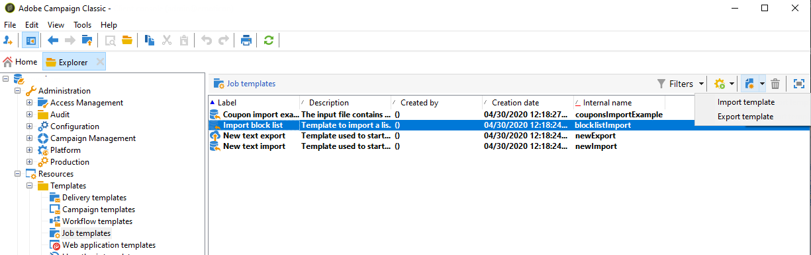

# 가져오기 및 내보내기 템플릿 만들기 {#creating-import-export-templates}

가져오기 및 내보내기 템플릿은 Adobe Campaign 트리의 **[!UICONTROL Resources > Templates > Job templates]** 디렉토리에 저장됩니다.

기본적으로 이 디렉토리에는 3개의 가져오기 템플릿과 1개의 내보내기 템플릿이 있습니다. 수정할 수 없습니다.

* 기본 템플릿 **[!UICONTROL Import denylist]**&#x200B;이(가) 이미에 추가된 이메일 주소 목록을 가져오도록 차단 목록 구성되었습니다.

* **[!UICONTROL New text import]** 및 **[!UICONTROL New text export]** 템플릿을 사용하면 처음부터 가져오기 또는 내보내기를 구성할 수 있습니다.

기존 템플릿을 복제하여 고유한 템플릿을 만들거나 **[!UICONTROL New > Import template]** / **[!UICONTROL Export template]** 메뉴를 통해 새 템플릿을 만들 수 있습니다.

템플릿을 구성하는 프로세스는 다음 섹션에 표시되는 프로세스와 동일합니다.

* [가져오기 작업 구성](../../platform/using/executing-import-jobs.md)
* [내보내기 작업 구성](../../platform/using/executing-export-jobs.md)
