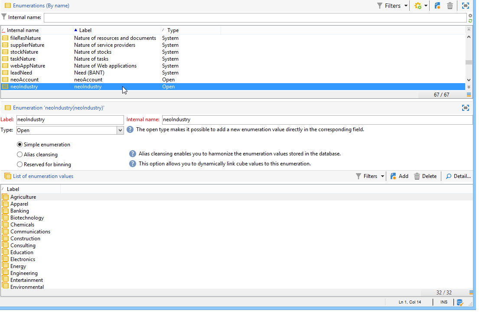
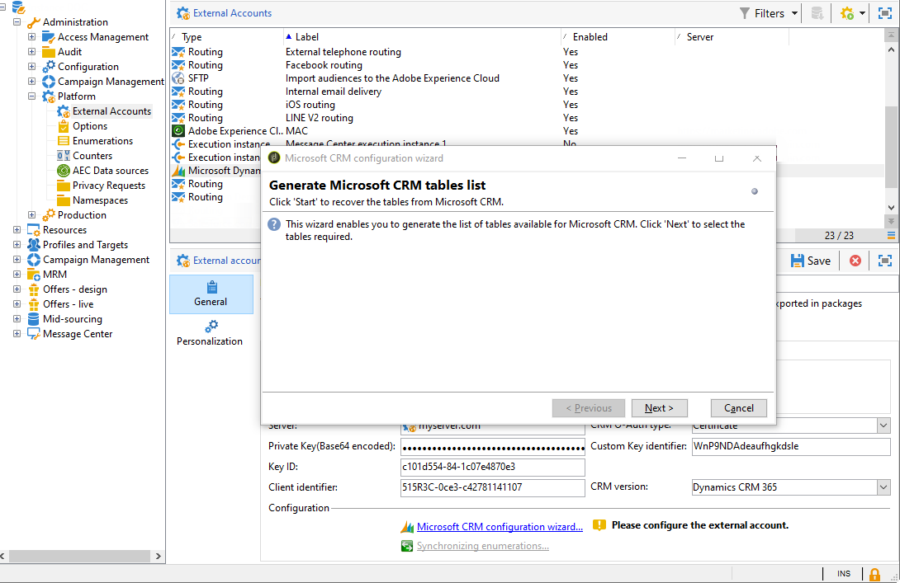

# CRM 커넥터{#crm-connectors}

## CRM 커넥터 정보 {#about-crm-connectors}

Adobe Campaign은 Adobe Campaign 플랫폼을 타사 시스템에 연결하는 다양한 CRM 커넥터를 제공합니다. 이러한 CRM 커넥터를 사용하면 연락처, 계정, 구매 등을 동기화할 수 있습니다. 또한 다양한 타사 및 비즈니스 애플리케이션과 애플리케이션을 손쉽게 통합할 수 있습니다.

이러한 커넥터를 사용하면 빠르고 손쉽게 데이터를 통합할 수 있습니다.Adobe Campaign은 CRM에서 사용할 수 있는 표를 수집하고 선택하는 전용 마법사를 제공합니다. 이렇게 하면 두 가지 방향 동기화를 통해 데이터가 시스템 전체에서 항상 최신 상태로 유지되는지 확인할 수 있습니다.

>[!NOTE]
>
>이 기능은 CRM 커넥터 전용 패키지를 통해 **Adobe Campaign에서** 사용할 수 있습니다.

CRM에 연결하면 전용 워크플로우 활동을 통해 수행됩니다. 이러한 활동은 [이 섹션에](../../workflow/using/crm-connector.md)제시된 장에서 자세히 설명합니다.

### 호환 가능한 CRM 시스템 및 제한 사항 {#compatible-crm-systems-and-limitations}

아래 나열된 CRM은 Adobe Campaign에 통합할 수 있습니다.

지원되는 버전은 호환성 [매트릭스에서 자세히 설명합니다](https://helpx.adobe.com/campaign/kb/compatibility-matrix.html).

* **Salesforce.com**

   Salesforce.com과의 연결을 설정하는 방법은 [이 섹션을](#example-for-salesforce-com) 참조하십시오.

   >[!CAUTION]
   >
   >Adobe Campaign과 Salesforce.com을 연결할 때 제한 사항은 다음과 같습니다.
   >
   >    
   >    
   >    * 테스트 제작 인스턴스가 지원됩니다.
   >    * 할당 규칙이 지원됩니다.
   >    * Adobe Campaign에서 여러 선택 열거형을 지원하지 않습니다.

* **Oracle On Demand**

   Oracle On Demand와의 접속 설정 방법은 [이 섹션을](#example-for-oracle-on-demand) 참조하십시오.

   >[!CAUTION]
   >
   >Adobe Campaign을 Oracle On Demand와 연결할 때 제한 사항은 다음과 같습니다.
   >
   >    
   >    
   >    * Adobe Campaign은 표준 Oracle On Demand 템플릿에서 사용 가능한 모든 객체를 동기화할 수 있습니다. Oracle On Demand에서 개인화된 테이블을 추가한 경우 Adobe Campaign에서 복구되지 않습니다.
   >    * API 버전 v1.0을 사용하면 쿼리 중에 데이터를 정렬하거나 필터링할 수 있지만 두 가지 작업을 동시에 수행할 수는 없습니다.
   >    * Oracle On Demand에서 전송한 날짜는 시간대 정보를 포함하지 않습니다.
   >    * Adobe Campaign에서 여러 선택 열거형을 지원하지 않습니다.

* **MS Dynamics CRM** 및 **MS Dynamics Online**

   Microsoft Dynamics와의 연결 설정 방법에 대해서는 [이 섹션을](#example-for-microsoft-dynamics) 참조하십시오.

   이 비디오에서 Adobe Campaign 및 Microsoft Dynamics 통합 활용 사례에 대해 [알아보십시오](https://helpx.adobe.com/campaign/kt/acc/using/acc-integrate-dynamics365-with-acc-feature-video-set-up.html).

   >[!CAUTION]
   >
   >Adobe Campaign과 Microsoft Dynamics를 연결할 때 제한 사항은 다음과 같습니다.
   >
   >    
   >    
   >    * 플러그인을 설치하면 CRM의 동작을 변경할 수 있으므로 Adobe Campaign과의 호환성 문제가 발생할 수 있습니다.
   >    * Adobe Campaign에서 여러 선택 열거형을 지원하지 않습니다.

## 연결 설정 {#setting-up-the-connection}

Adobe Campaign에서 CRM 커넥터를 사용하려면 다음 단계를 수행하십시오.

1. 외부 계정 만들기
1. CRM 테이블 수집
1. 열거형 동기화
1. 동기화 워크플로우 만들기

>[!NOTE]
>
>CRM 커넥터는 보안 URL(https)에서만 작동합니다.

### Salesforce.com의 예 {#example-for-salesforce-com}

Adobe Campaign을 **사용하여 Salesforce.com** 커넥터를 구성하려면 아래 단계를 따르십시오.

1. Adobe Campaign 트리의 **[!UICONTROL Administration > Platform > External accounts]** 노드를 통해 새 외부 계정을 만듭니다.
1. 구성 마법사를 실행하여 사용 가능한 CRM 테이블을 생성합니다.

   

   구성 마법사를 사용하여 테이블을 수집하고 일치하는 스키마를 만들 수 있습니다.

   을 **[!UICONTROL Start]** 클릭하여 실행을 실행합니다.

   

   >[!NOTE]
   >
   >설정을 승인하려면 Adobe Campaign 콘솔을 로그인하여 다시 로그온해야 합니다.

1. 노드의 Adobe Campaign에서 생성된 스키마를 **[!UICONTROL Administration > Configuration > Data schemas]** 확인합니다.

   

1. 스키마가 만들어지면 CRM을 통해 열거형을 Adobe Campaign과 자동으로 동기화할 수 있습니다.

   이렇게 하려면 **[!UICONTROL Synchronizing enumerations...]** 링크를 클릭하고 CRM 열거형과 일치하는 Adobe Campaign 열거형을 선택합니다.

   Adobe Campaign 열거형의 모든 값을 CRM의 값으로 바꿀 수 있습니다.이렇게 하려면 **[!UICONTROL Yes]** 열에서 선택합니다 **[!UICONTROL Replace]** .

   

   을 **[!UICONTROL Next]** 클릭한 다음 목록 가져오기를 **[!UICONTROL Start]** 시작합니다.

1. 메뉴에서 가져온 값을 **[!UICONTROL Administration > Platform > Enumerations]** 확인합니다.

   

1. Salesforce 데이터를 가져오거나 Adobe Campaign 데이터를 Salesforce로 내보내려면 워크플로우를 만들고 **[!UICONTROL CRM connector]** 활동을 사용해야 합니다.

   

### Oracle On Demand의 예 {#example-for-oracle-on-demand}

Adobe Campaign에서 **작동하도록 Oracle** On Demand 커넥터를 구성하려면 다음 단계를 수행하십시오.

1. Adobe Campaign 트리의 **[!UICONTROL Administration > Platform > External accounts]** 노드를 통해 새 외부 계정을 만듭니다.

   

1. 구성 마법사를 엽니다.Adobe Campaign은 Oracle 데이터 모델의 테이블을 자동으로 표시합니다. 수집할 테이블을 선택합니다.

   

1. 을 **[!UICONTROL Next]** 클릭하여 일치 스키마 만들기를 시작합니다.

   일치하는 데이터 스키마를 Adobe Campaign에서 사용할 수 있게 됩니다.

   

1. Adobe Campaign과 Oracle On Demand 간에 열거형 동기화를 시작합니다.

   

1. Oracle On Demand 데이터를 Adobe Campaign으로 가져오려면 다음 유형의 워크플로우를 만드십시오.

   

   이 워크플로우는 Oracle On Demand를 통해 연락처를 가져오고, 기존 Adobe Campaign 데이터와 이들을 동기화하며, 중복 연락처를 삭제하고, Adobe Campaign 데이터베이스를 업데이트합니다.

   다음과 같이 **[!UICONTROL CRM Connector]** 활동을 구성해야 합니다.

   

1. Adobe Campaign 데이터를 Oracle On Demand로 내보내려면 다음 워크플로우를 만드십시오.

   

   이 워크플로우는 쿼리를 사용하여 관련 데이터를 수집한 다음 Oracle On Demand 연락처 테이블로 내보냅니다.

### Microsoft Dynamics의 예 {#example-for-microsoft-dynamics}

Adobe Campaign에서 작동하도록 Microsoft Dynamics 커넥터를 구성하려면 다음 단계를 수행하십시오.

1. Adobe Campaign 트리의 **[!UICONTROL Administration > Platform > External accounts]** 노드를 통해 새 외부 계정을 만듭니다.

   

1. 배포 **유형을**&#x200B;선택합니다.또는 **[!UICONTROL On-premise]**&#x200B;구성할 커넥터에 **[!UICONTROL Office 365]** 따라 **[!UICONTROL Web API]**&#x200B;달라집니다.

   Adobe Campaign Classic은 인증을 위해 OAuth 프로토콜을 사용하는 Dynamics 365 REST 인터페이스를 지원합니다.

   배포를 선택하는 **[!UICONTROL WebAPI]** 경우 Azure 디렉터리에 앱을 등록하고 Azure **디렉터리에서 clientId** 를 가져와야 합니다. 이 등록은 [이 페이지에](https://msdn.microsoft.com/en-us/library/mt622431.aspx)설명되어 있습니다.

   >[!NOTE]
   >
   >redirectURL 매개 변수는 Adobe Campaign Classic에서 필요하지 않습니다.

   clientId **값은** 부여 유형 암호를 사용하여 전달자 토큰을 가져오기 위해 사용자 이름/암호와 함께 사용됩니다. 이를 리소스 소유자 **암호 자격 증명 부여라고 합니다**. For more on this, refer to [this page](https://blogs.msdn.microsoft.com/wushuai/2016/09/25/resource-owner-password-credentials-grant-in-azure-ad-oauth/).

   

   CRM 버전 호환성에 대한 자세한 내용은 호환성 [매트릭스를 참조하십시오](https://helpx.adobe.com/campaign/kb/compatibility-matrix.html).

1. 구성 마법사를 엽니다. Adobe Campaign은 Microsoft Dynamics 데이터 템플릿에서 테이블을 자동으로 검색합니다.

   

   복구할 표를 선택합니다.

   

1. 을 클릭하고 해당 스키마 만들기를 **[!UICONTROL Next]** 시작합니다.

   

   >[!NOTE]
   >
   >구성을 승인하려면 Adobe Campaign 콘솔의 연결을 끊거나 다시 연결해야 합니다.

   일치하는 데이터 스키마를 Adobe Campaign에서 사용할 수 있게 됩니다.

   

1. Adobe Campaign과 Microsoft Dynamics 간에 열거형 동기화를 시작합니다.

   

1. Microsoft Dynamics 데이터를 Adobe Campaign으로 가져오려면 다음 유형의 워크플로우를 만드십시오.

   

   이 워크플로우는 Microsoft Dynamics를 통해 연락처를 가져오고, 기존 Adobe Campaign 데이터와 연락처를 동기화하고, 중복된 연락처를 삭제하고, Adobe Campaign 데이터베이스를 업데이트합니다.

   활동을 **[!UICONTROL CRM Connector]** 다음과 같이 구성해야 합니다.

   

## 데이터 동기화 {#data-synchronization}

Adobe Campaign과 CRM 간의 동기화는 전용 워크플로우 활동을 통해 수행됩니다.CRM [커넥터](../../workflow/using/crm-connector.md).

이 활동을 통해 다음을 수행할 수 있습니다.

* CRM에서 가져오기(CRM에서 [가져오기 참조](#importing-from-the-crm)),
* CRM으로 내보내기(CRM으로 [내보내기 참조](#exporting-to-the-crm)),
* CRM에서 삭제된 개체 가져오기(CRM [에서 삭제된 개체 가져오기 참조](#importing-objects-deleted-in-the-crm)),
* CRM에서 개체를 삭제합니다(CRM [에서 개체 삭제 참조](#deleting-objects-in-the-crm)).

동기화를 구성할 CRM과 일치하는 외부 계정을 선택한 다음 동기화할 객체(계정, 기회, 리드, 연락처 등)를 선택합니다.

이 활동의 구성은 수행할 프로세스에 따라 달라집니다. 다양한 구성은 아래에 자세히 설명되어 있습니다.

### CRM에서 가져오기 {#importing-from-the-crm}

Adobe Campaign에서 CRM을 통해 데이터를 가져오려면 다음 유형의 워크플로우를 만들어야 합니다.

가져오기 작업의 경우 CRM 커넥터 **활동** 구성 단계는 다음과 같습니다.

1. 작업을 **[!UICONTROL Import from the CRM]** 선택합니다.
1. 드롭다운 **[!UICONTROL Remote object]** 목록으로 이동하여 프로세스에 해당하는 객체를 선택합니다. 이 개체는 커넥터 구성 중에 Adobe Campaign에서 만든 테이블 중 하나와 일치합니다.
1. 섹션으로 **[!UICONTROL Remote fields]** 이동하여 가져올 필드를 입력합니다.

   필드를 추가하려면 도구 모음에서 **[!UICONTROL Add]** 단추를 클릭한 다음 **[!UICONTROL Edit expression]** 아이콘을 클릭합니다.

   

   필요한 경우 **[!UICONTROL Conversion]** 열의 드롭다운 목록을 통해 데이터 형식을 변경합니다. 가능한 전환 유형은 데이터 [형식으로](#data-format)자세히 설명합니다.

   >[!CAUTION]
   >
   >CRM과 Adobe Campaign에서 개체를 연결하려면 CRM의 레코드 식별자가 필수적입니다. 상자가 승인되면 자동으로 추가됩니다.
   >
   >CRM 측의 마지막 수정 날짜도 증분 데이터 가져오기에 필수입니다.

1. 필요에 따라 가져올 데이터를 필터링할 수도 있습니다. 이렇게 하려면 **[!UICONTROL Edit the filter...]** 링크를 클릭합니다.

   다음 예에서 Adobe Campaign은 2012년 11월 1일 이후 일부 활동이 기록된 연락처만 가져옵니다.

   

   >[!CAUTION]
   >
   >데이터 필터링 모드에 연결된 제한 사항은 데이터 [필터링에서](#filtering-data)자세히 설명합니다.

1. 이 **[!UICONTROL Use automatic index...]** 옵션을 사용하면 날짜와 마지막 수정 사항에 따라 CRM과 Adobe Campaign 간의 증분 객체 동기화를 자동으로 관리할 수 있습니다.

   자세한 내용은 변수 관리를 [참조하십시오](#variable-management).

#### 변수 관리 {#variable-management}

이 **[!UICONTROL Automatic index]** 옵션을 활성화하면 마지막 가져오기 이후 수정된 개체만 수집할 수 있습니다.

마지막 동기화 날짜는 기본적으로 구성 창에 지정된 옵션에 저장됩니다.LASTIMPORT **_&lt;%=instance.internalName%>_&lt;%=activityName%>**.

>[!NOTE]
>
>이 메모는 일반 **[!UICONTROL CRM Connector]** 활동에만 적용됩니다. 다른 CRM 활동의 경우 프로세스가 자동으로 진행됩니다.
>
>이 옵션은 수동으로 만들고 > **[!UICONTROL Administration]** 아래에 채워야 **[!UICONTROL Platform]** 합니다 **[!UICONTROL Options]**. 텍스트 옵션이어야 하며 값이 다음 형식과 일치해야 합니다.yyyy/ **MM/dd hh:mm:ss**.
> 
>추가 가져오기를 위해 이 옵션을 수동으로 업데이트해야 합니다.

가장 최근 변경 사항을 식별하기 위해 고려할 원격 CRM 필드를 지정할 수 있습니다.

기본적으로 다음 필드가 지정된 순서로 사용됩니다.

* Microsoft Dynamics: **수정**&#x200B;사항,
* Oracle On Demand의 경우마지막 **업데이트**, **수정**&#x200B;날짜, **마지막 로그인**,
* Salesforce.com의 경우:LastModifiedDate **,** SystemMostamp ****.

옵션을 활성화하면 **[!UICONTROL Automatic index]** **[!UICONTROL JavaScript code]** 유형 활동을 통해 동기화 워크플로우에 사용할 수 있는 세 가지 변수가 생성됩니다. 이러한 활동은 다음과 같습니다.

* **vars.crmOptionName**:마지막 가져오기 날짜가 포함된 옵션의 이름을 나타냅니다.
* **vars.crmStartImport**:마지막 데이터 복구의 시작 날짜(포함)를 나타냅니다.
* **vars.crmEndDate**:마지막 데이터 복구의 종료 날짜(제외)를 나타냅니다.

   >[!NOTE]
   >
   >이러한 날짜는 다음 형식으로 표시됩니다.yyyy/ **MM/dd hh:mm:ss**.

#### 데이터 필터링 {#filtering-data}

다양한 CRM을 사용하여 효율적으로 작업하려면 다음 규칙을 사용하여 필터를 만들어야 합니다.

* 각 필터링 수준은 한 유형의 연산자만 사용할 수 있습니다.
* AND NOT 연산자는 지원되지 않습니다.
* 비교는 null 값(&#39;is empty&#39;/&#39;is not empty&#39; type) 또는 숫자만 고려해야 할 수 있습니다. 즉, 값(오른쪽 열)이 평가되고 이 평가의 결과는 숫자여야 합니다. 따라서 JOIN 유형 비교는 지원되지 않습니다.
* 오른쪽 열에 포함된 값은 JavaScript로 평가됩니다.
* JOIN 비교는 지원되지 않습니다.
* 왼쪽 열의 표현식은 필드여야 합니다. 여러 표현식, 숫자 등의 조합일 수 없습니다.

예를 들어, OR 연산자는 AND 연산자와 동일한 수준에 배치되므로 다음 필터링 조건이 CRM 가져오기에 적합하지 않습니다.

* OR 연산자는 AND 연산자와 동일한 수준에 배치됩니다
* 텍스트 문자열에서 비교가 수행됩니다.

#### 정렬 기준 {#order-by}

Microsoft Dynamics 및 Salesforce.com에서는 가져올 원격 필드를 오름차순이나 내림차순으로 정렬할 수 있습니다.

이렇게 하려면 **[!UICONTROL Order by]** 링크를 클릭하고 열을 목록에 추가합니다.

목록의 열 순서는 정렬 순서입니다.

#### 기록 식별 {#record-identification}

CRM에 포함된(및 필터링될 수 있는) 요소를 가져오는 대신 워크플로우에서 미리 계산된 모집단을 사용할 수 있습니다.

이렇게 하려면 **[!UICONTROL Use the population calculated upstream]** 옵션을 선택하고 원격 식별자가 들어 있는 필드를 지정합니다.

그런 다음 가져올 인바운드 모집단의 필드를 다음과 같이 선택합니다.

### CRM으로 내보내기 {#exporting-to-the-crm}

Adobe Campaign 데이터를 CRM으로 내보내면 전체 컨텐츠를 CRM 데이터베이스에 복사할 수 있습니다.

데이터를 CRM으로 내보내려면 다음 유형의 워크플로우를 만들어야 합니다.

내보내기의 경우 다음 구성을 CRM 커넥터 **활동에 적용합니다** .

1. 작업을 **[!UICONTROL Export to CRM]** 선택합니다.
1. 드롭다운 **[!UICONTROL Remote object]** 목록으로 이동하여 프로세스에 해당하는 객체를 선택합니다. 이 개체는 커넥터 구성 중에 Adobe Campaign에서 만든 테이블 중 하나와 일치합니다.

   >[!CAUTION]
   >
   >CRM 커넥터 **작업의** 내보내기 기능은 CRM 측에서 필드를 삽입하거나 업데이트할 수 있습니다. CRM에서 필드 업데이트를 활성화하려면 원격 테이블의 기본 키를 지정해야 합니다. 키가 없으면 데이터가 삽입됩니다(업데이트되는 대신).

1. 섹션에서 내보낼 필드와 CRM에서 해당 매핑을 **[!UICONTROL Mapping]** 지정합니다.

   

   필드를 추가하려면 도구 모음에서 **[!UICONTROL Add]** 단추를 클릭한 다음 **[!UICONTROL Edit expression]** 아이콘을 클릭합니다.

   >[!NOTE]
   >
   >지정된 필드의 경우, CRM 측에 일치하는 항목이 정의되지 않은 경우 값을 업데이트할 수 없습니다.CRM에 바로 삽입됩니다.

   필요한 경우 **[!UICONTROL Conversion]** 열의 드롭다운 목록을 통해 데이터 형식을 변경합니다. 가능한 전환 유형은 데이터 [형식으로](#data-format)자세히 설명합니다.

   >[!NOTE]
   >
   >내보낼 레코드 목록과 내보내기 결과는 워크플로우가 완료되거나 다시 시작될 때까지 액세스할 수 있는 임시 파일에 저장됩니다. 이렇게 하면 동일한 레코드를 여러 번 내보내거나 데이터를 잃을 위험이 없는 경우 오류가 발생하는 경우 프로세스를 다시 시작할 수 있습니다.

### 추가 구성 {#additional-configurations}

#### 데이터 형식 {#data-format}

CRM으로 또는 CRM에서 데이터 형식을 가져올 때 신속하게 변환할 수 있습니다.

이렇게 하려면 일치하는 열에 적용할 변환을 선택합니다.

이 **[!UICONTROL Default]** 모드는 자동 데이터 변환을 적용하며, 대부분의 경우 데이터의 복사/붙여넣기와 같습니다. 그러나 시간대 관리는 적용됩니다.

기타 가능한 변환은 다음과 같습니다.

* **[!UICONTROL Date only]**:이 모드에서는 날짜 + 시간 유형 필드가 삭제됩니다.
* **[!UICONTROL Without time offset]**:이 모드는 기본 모드에 적용된 표준 시간대 관리를 취소합니다.
* **[!UICONTROL Copy/Paste]**:이 모드에서는 문자열(변환 없음)과 같은 원시 데이터를 사용합니다.

#### 처리 중 오류 발생 {#error-processing}

데이터 가져오기 또는 내보내기 프레임워크 내에서 특정 프로세스를 오류 및 거부에 적용할 수 있습니다. 이렇게 하려면 **[!UICONTROL Process rejects]** 탭에서 **[!UICONTROL Process errors]** 및 **[!UICONTROL Behavior]** 옵션을 선택합니다.

이러한 옵션은 일치하는 출력 전환을 가져옵니다.

그런 다음 적용하려는 프로세스와 관련된 활동을 배치합니다.

인스턴스에 대한 오류를 처리하려면 대기 상자를 추가하고 재시도를 예약할 수 있습니다.

거부는 오류 코드와 관련 메시지와 함께 수집되므로 거부 추적을 설정하여 동기화 프로세스를 최적화할 수 있습니다.

>[!NOTE]
>
>이 **[!UICONTROL Process rejects]** 옵션이 활성화되지 않은 경우에도 오류 코드와 메시지와 함께 거부된 각 열에 대한 경고가 생성됩니다.

출력 전환을 사용하면 오류 메시지 및 코드와 관련된 특정 열이 포함된 출력 스키마에 액세스할 수 있습니다. **[!UICONTROL Reject]** 이러한 열은 다음과 같습니다.

* Oracle On Demand의 경우 **errorFilename** (Oracle 측의 로그 파일 이름), **errorCode** (오류 코드), **errorSymbol** (오류 기호, 오류 코드와 다름), **** errorMessage (오류 컨텍스트의 설명)
* Salesforce.com의 경우:error **기호** (오류 기호, 오류 코드와 다름), **errorMessage** (오류 컨텍스트에 대한 설명).

### CRM에서 삭제된 개체 가져오기 {#importing-objects-deleted-in-the-crm}

광범위한 데이터 동기화 프로세스를 설정하려면 CRM에서 삭제된 개체를 Adobe Campaign으로 가져올 수 있습니다.

이렇게 하려면 다음 단계를 적용합니다.

1. 작업을 **[!UICONTROL Import objects deleted in the CRM]** 선택합니다.
1. 드롭다운 **[!UICONTROL Remote object]** 목록으로 이동하여 프로세스에 해당하는 객체를 선택합니다. 이 개체는 커넥터 구성 중에 Adobe Campaign에서 만든 테이블 중 하나와 일치합니다.
1. 및 필드에서 고려할 삭제 기간을 **[!UICONTROL Start date]** 지정합니다 **[!UICONTROL End date]** . 이 날짜는 기간에 포함됩니다.

   

   >[!CAUTION]
   >
   >요소 삭제 기간은 CRM에 대한 제한 사항과 일치해야 합니다. 즉, Salesforce.com의 경우 30일 전에 삭제된 요소는 복구할 수 없습니다.

### CRM에서 개체 삭제 {#deleting-objects-in-the-crm}

CRM 측에서 개체를 삭제하려면 삭제할 원격 요소의 기본 키를 지정해야 합니다.

이 **[!UICONTROL Behavior]** 탭에서는 거부 처리를 활성화할 수 있습니다. 이 옵션은 **[!UICONTROL CRM connector]** 활동에 대한 두 번째 출력 전환을 생성합니다. 자세한 내용은 오류 [처리를](#error-processing)참조하십시오.

>[!NOTE]
>
>이 옵션이 비활성화되어 있더라도 거부된 각 열에 대한 경고가 생성됩니다. **[!UICONTROL Process rejects]**

