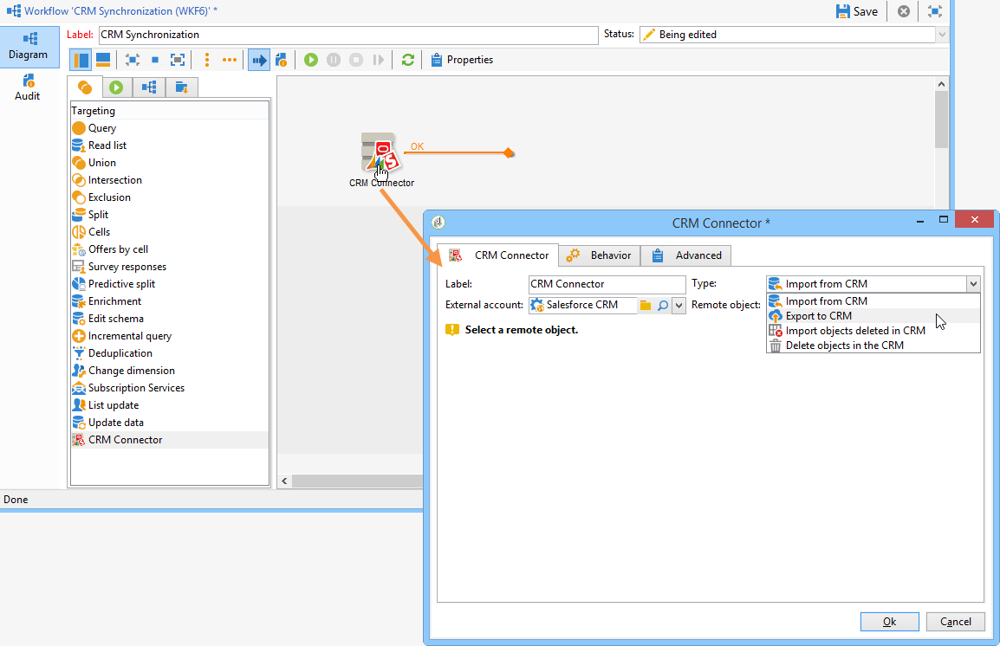

# Campaign 및 Salesforce.com 연결{#connect-to-sfdc}

이 페이지에서는 Campaign Classic을 **Salesforce**&#x200B;에 연결하는 방법을 배웁니다.

데이터 동기화는 전용 워크플로우 활동을 통해 수행됩니다. [자세히 알아보기](../../platform/using/crm-data-sync.md).

외부 계정을 사용하면 Salesforce 데이터를 Adobe Campaign으로 가져오고 내보낼 수 있습니다.
Salesforce용 CRM 커넥터를 구성하려면 아래 단계를 따르십시오.

1. Adobe Campaign 트리의 **[!UICONTROL Administration > Platform > External accounts]** 노드를 통해 새 외부 계정을 만듭니다.
1. **[!UICONTROL Salesforce.com]**&#x200B;을(를) 선택합니다.
1. 연결을 활성화하려면 설정을 입력하십시오.

   

   Adobe Campaign에서 작동하도록 Salesforce CRM 외부 계정을 구성하려면 다음 세부 정보를 제공해야 합니다.

   * **[!UICONTROL Account]**
Salesforce CRM에 로그인하는 데 사용되는 계정.

   * **[!UICONTROL Password]**
Salesforce CRM 로그인에 사용되는 암호입니다.

   * **[!UICONTROL Client identifier]**
클라이언트 식별자를 찾을 수 있는 위치를 확인하려면 이 [페이지](https://help.salesforce.com/articleView?id=000205876&type=1)를 참조하세요.

   * **[!UICONTROL Security token]**
보안 토큰을 찾을 위치를 확인하려면 이 [페이지](https://help.salesforce.com/articleView?id=000205876&type=1)를 참조하세요.

   * **[!UICONTROL API version]**
API 버전을 선택합니다.
1. 구성 도우미를 실행하여 사용 가능한 CRM 테이블을 생성합니다. 구성 도우미를 사용하여 테이블을 수집하고 일치하는 스키마를 생성할 수 있습니다.

   

   >[!NOTE]
   >
   >설정을 승인하려면 Adobe Campaign 콘솔에서 로그오프했다가 다시 로그온해야 합니다.

1. **[!UICONTROL Administration > Configuration > Data schemas]** 노드의 Adobe Campaign에서 생성된 스키마를 확인합니다.

   **Salesforce** 스키마의 예:

   

1. 스키마가 만들어지면 Salesforce에서 Adobe Campaign으로 열거형을 자동으로 동기화할 수 있습니다.

   이렇게 하려면 **[!UICONTROL Synchronizing enumerations...]** 링크를 클릭하고 Salesforce 열거형과 일치하는 Adobe Campaign 열거형을 선택합니다.

   

   >[!NOTE]
   >
   >Adobe Campaign 열거형의 모든 값을 CRM의 값으로 바꿀 수 있습니다. 이렇게 하려면 **[!UICONTROL Replace]** 열에서 **[!UICONTROL Yes]**&#x200B;을(를) 선택하십시오.

   목록을 가져오려면 **[!UICONTROL Next]**&#x200B;을(를) 클릭한 다음 **[!UICONTROL Start]**&#x200B;을(를) 클릭합니다.

1. **[!UICONTROL Administration > Platform > Enumerations]** 메뉴에서 가져온 값을 확인합니다.

   

   >[!NOTE]
   >
   > 여러 선택 열거형은 지원되지 않습니다.

이제 Campaign과 Salesforce.com이 연결되었습니다. 두 시스템 간에 데이터 동기화를 설정할 수 있습니다.

Adobe Campaign 데이터와 SFDC 간에 데이터를 동기화하려면 워크플로우를 만들고 **[!UICONTROL CRM connector]** 활동을 사용해야 합니다.

이 페이지[&#128279;](../../platform/using/crm-data-sync.md)에서 데이터 동기화 에 대해 자세히 알아보세요.
