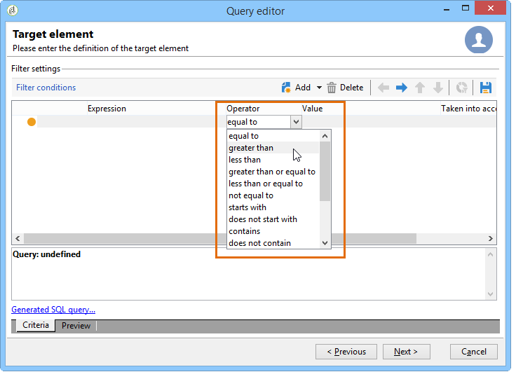

# 필터 조건 정의{#defining-filter-conditions}

## 연산자 선택 {#choosing-the-operator}

필터링 조건 내에서 연산자를 사용하여 두 값을 함께 연결해야 합니다.

다음은 사용 가능한 연산자 목록입니다.

<table> 
 <thead> 
  <tr> 
   <th> 연산자  </th> 
   <th> 목적  </th> 
   <th> 예  </th> 
  </tr> 
 </thead> 
 <tbody> 
  <tr> 
   <td> 같음  </td> 
   <td> 두 번째 값 열에 입력한 데이터와 동일한 결과를 반환합니다.  </td> 
   <td> <strong>성(@lastName)은 'Jones'와</strong>동일한 성명으로, 성을 가진 수신자만 반환합니다.  </td> 
  </tr> 
  <tr> 
   <td> 보다 큼  </td> 
   <td> 입력한 값보다 큰 값을 반환합니다.  </td> 
   <td> <strong>50보다 큰 연령(@age)</strong>, 즉 '50'보다 큰 모든 값을 반환합니다.'51', '52' 등  </td> 
  </tr> 
  <tr> 
   <td> 미만  </td> 
   <td> 입력한 값보다 작은 값을 반환합니다.  </td> 
   <td> <strong>'DaysAgo(100)'</strong>' 앞에 만든 날짜(@created)는 100일 전에 만든 모든 수신자를 반환합니다.  </td> 
  </tr> 
  <tr> 
   <td> 크거나 같음  </td> 
   <td> 입력한 값보다 크거나 같은 모든 값을 반환합니다.  </td> 
   <td> <strong>'30'보다 크거나 같은 연령(@age)</strong>은 30세 이상의 모든 수신자를 반환합니다.  </td> 
  </tr> 
  <tr> 
   <td> 작거나 같음  </td> 
   <td> 입력한 값보다 작거나 같은 모든 값을 반환합니다.  </td> 
   <td> <strong>연령(@age)이 '60'보다 작거나 같다면</strong>60세 이하의 모든 수신자가 반환됩니다.  </td> 
  </tr> 
  <tr> 
   <td> 같지 않음  </td> 
   <td> 입력한 값과 동일하지 않은 모든 값을 반환합니다.  </td> 
   <td> <strong>'영어'와 같은 언어(@language)</strong>.  </td> 
  </tr> 
  <tr> 
   <td> 다음으로 시작   </td> 
   <td> 입력한 값으로 시작하는 결과를 반환합니다.  </td> 
   <td> <strong>계정 번호(@account)는 '32010'으로 시작됩니다.</strong>  </td> 
  </tr> 
  <tr> 
   <td> 다음으로 시작하지 않음   </td> 
   <td> 입력한 값으로 시작하지 않은 결과를 반환합니다.  </td> 
   <td> <strong>계정 번호(@account)가 '20'으로 시작되지 않습니다</strong>.  </td> 
  </tr> 
  <tr> 
   <td> 포함  </td> 
   <td> 입력한 값 이상을 포함하는 결과를 반환합니다.  </td> 
   <td> <strong>전자 메일 도메인(@domain)에 'mail'이 들어</strong>있으므로 'mail'이 포함된 모든 도메인 이름을 반환합니다. 따라서 gmail.com 도메인도 반환됩니다.  </td> 
  </tr> 
  <tr> 
   <td> 포함하지 않음   </td> 
   <td> 입력한 값을 포함하지 않는 결과를 반환합니다.  </td> 
   <td> <strong>이메일 도메인(@domain)에 'vo'가 없습니다</strong>. 이 경우 'vo'가 포함된 도메인 이름은 반환되지 않습니다. 'voila.fr' 도메인 이름이 결과에 나타나지 않습니다.  </td> 
  </tr> 
  <tr> 
   <td> 좋아요  </td> 
   <td> 좋아요 기능은 포함 연산자와 매우 유사합니다. 값에 % 와일드카드 문자를 삽입할 수 있습니다.  </td> 
   <td> <strong>성(@lastName)을 'Jon%s'과(와)</strong>같이 지정합니다. 여기서, 이 거친 카드 캐릭터는 "조커"로 사용되는데, 만약 운영자가 'n'과 's' 사이에 없는 글자를 잊어버렸다면, "존스" 라고 불리는 이름을 찾는 데 사용됩니다.  </td> 
  </tr> 
  <tr> 
   <td> 좋아요 아님   </td> 
   <td> 은 [좋아요]와 유사합니다 . 입력한 값을 복구할 수 없습니다. 여기에서 입력한 값은 % 와일드카드 문자를 포함해야 합니다.  </td> 
   <td> <strong>성(@lastName)이 'Smi%h'와</strong>같지 않습니다. 여기에서 성이 'Smi%h'인 수신자는 반환되지 않습니다.  </td> 
  </tr> 
  <tr> 
   <td> 비어 있음   </td> 
   <td> 이 경우 두 번째 값 열에서 빈 값과 일치하는 결과를 찾습니다.  </td> 
   <td> <strong>Mobile(@mobilePhone)이 비어</strong> 있으면 모바일 번호가 없는 모든 수신자가 반환됩니다.  </td> 
  </tr> 
  <tr> 
   <td> 비어 있지 않음   </td> 
   <td> Is empty 연산자와 반대로 작동합니다 . 두 번째 값 열에 데이터를 입력할 필요는 없습니다.  </td> 
   <td> <strong>이메일(@email)이 비어</strong>있지 않습니다.  </td> 
  </tr> 
  <tr> 
   <td> 포함된 항목   </td> 
   <td> 표시된 값에 포함된 결과를 반환합니다. 이러한 값은 쉼표로 구분해야 합니다.  </td> 
   <td> <strong>생년월일(@birthDate)이 '12/10/1979,12/10/10</strong>/1984'에 포함되면 이 날짜 사이에 태어난 수신자가 반환됩니다.   </td> 
  </tr> 
  <tr> 
   <td> 포함하지 않음  </td> 
   <td> Is included in 연산자와 같이 작동합니다. 여기에서 입력한 값을 기준으로 받는 사람을 제외하려고 합니다.  </td> 
   <td> <strong>생년월일(@birthDate)은 '12/10/1979,12/10/1984'에 포함되지 않습니다</strong>. 이전 예제와 달리 이 날짜 내에서 태어난 수신자는 반환되지 않습니다.  </td> 
  </tr> 
 </tbody> 
</table>

## AND 사용 또는 제외 {#using-and--or--except}

여러 필터링 조건을 사용하는 쿼리의 경우 조건 사이에 링크를 정의해야 합니다. 다음과 같은 세 가지 링크가 있습니다.

* **[!UICONTROL And]** 두 가지 필터링 조건을 결합할 수 있습니다.
* **[!UICONTROL Or]** 대체 요소를 제공할 수 있습니다.
* **[!UICONTROL Except]** 예외를 정의할 수 있습니다.

(기본적으로 제공됨) **[!UICONTROL And]** 을 클릭하고 드롭다운 목록에서 선택합니다.

* **[!UICONTROL And]**:조건을 추가하고 오버필터링을 활성화합니다.
* **[!UICONTROL Or]**:조건을 추가하고 오버필터링을 활성화합니다.

   다음 예에서는 이메일 도메인에 &quot;orange.co.uk&quot;이 포함되어 있거나 게시물 코드가 &quot;NW&quot;로 시작하는 수신자를 찾을 수 있습니다.

   

* **[!UICONTROL Except]**:두 개의 필터가 있고 첫 번째 필터가 값을 반환하지 않으면 이 유형의 링크가 예외를 만듭니다.

   다음 예에서는 받는 사람의 성이 &quot;Smith&quot;인 경우를 제외하고 이메일 도메인에 &quot;orange.co.uk&quot;가 포함된 받는 사람을 반환하려고 합니다.

   

다음 예에서는 표시할 수 있는 필터를 보여 줍니다.스페인어를 사용하거나 휴대폰 번호를 사용하는 여성 또는 계정 번호가 없는 수신자이고 회사 이름이 &quot;N&quot;으로 시작하는 받는 사람

## 조건 우선 순위 지정 {#prioritizing-conditions}

이 섹션에서는 도구 모음의 파란색 화살표 덕분에 조건의 우선 순위를 지정하는 방법을 설명합니다.

* 오른쪽을 가리키는 화살표를 사용하여 필터에 괄호 수준을 추가할 수 있습니다.
* 왼쪽에 있는 화살표를 사용하면 필터에서 선택한 괄호 레벨을 삭제할 수 있습니다.

   

* 세로 화살표를 사용하면 조건을 이동하여 실행 순서를 변경할 수 있습니다.

이 예에서는 화살표를 사용하여 괄호 레벨을 삭제하는 방법을 보여 줍니다. 다음 필터링 조건에서 시작합니다. **[!UICONTROL City equal to London OR gender equal to male and mobile not indicated OR account # starts with "95" and company name starts with "A"]** Adobe

필터링 조건 위에 커서를 놓고 **[!UICONTROL Gender (@gender) equal to Male]** **[!UICONTROL Remove a parenthesis level]** 화살표를 클릭합니다.

그 **[!UICONTROL Gender (@gender) equal to Male]** 조건은 괄호 안에서 제거되었다. 그것은 &quot;런던과 동등한 도시&quot; 상태와 같은 수준으로 이동했습니다. 이러한 조건은 (**[!UICONTROL And]**) 함께 연결됩니다.

## 추출할 데이터 선택 {#selecting-data-to-extract}

사용 가능한 필드는 한 테이블마다 다릅니다. 모든 필드는 기본 노드에 저장됩니다( **[!UICONTROL Main element]** the 다음 예에서 사용 가능한 필드는 수신자 테이블에 있습니다. 필드는 항상 알파벳순으로 표시됩니다.

창 아래쪽에 선택한 필드의 세부 사항이 표시됩니다. 예를 들어 **[!UICONTROL Email domain]** 필드는 **[!UICONTROL Calculated SQL field]** a이고 확장자는 **[!UICONTROL (@domain)]**&#x200B;입니다.

>[!NOTE]
>
>도구를 사용하여 사용 가능한 필드를 **[!UICONTROL Search]** 찾습니다.

사용 가능한 필드를 두 번 클릭하여 출력 열에 추가합니다. 질의 끝에 선택한 각 필드가 **[!UICONTROL Data preview]** 창에 열을 만듭니다.

기본적으로 고급 필드는 표시되지 않습니다. 사용 가능한 필드의 오른쪽 **[!UICONTROL Display advanced fields]** 아래 모서리를 클릭하여 모든 항목을 표시합니다. 다시 클릭하여 이전 보기로 돌아갑니다.

예를 들어 수신자 테이블에서 고급 필드는 **부울 1**, **[!UICONTROL Boolean 2]****[!UICONTROL Boolean 3]**, **[!UICONTROL Foreign key of "Folder" link]**,등입니다.

다음 예는 수신자 테이블의 고급 필드를 보여줍니다.

다양한 필드 카테고리:

<table> 
 <thead> 
  <tr> 
   <th> 아이콘  </th> 
   <th> 설명  </th> 
   <th> 예  </th> 
  </tr> 
 </thead> 
 <tbody> 
  <tr> 
   <td>  </td> 
   <td> 단순 필드  </td> 
   <td> 이메일, 성별 등  </td> 
  </tr> 
  <tr> 
   <td>  </td> 
   <td> 기본 키. 이 SQL 필드는 테이블의 레코드를 식별하는 방법입니다.  </td> 
   <td> 식별자 수신자는 기본 키이고 식별자는 정의에 따라 다릅니다.  </td> 
  </tr> 
  <tr> 
   <td>  </td> 
   <td> 외래 키 다른 테이블에 대한 링크로 사용됩니다.  </td> 
   <td> 받는 사람 외래 키, 서비스 외래 키 등  </td> 
  </tr> 
  <tr> 
   <td>  </td> 
   <td> 계산된 필드. 이 유형의 필드는 데이터베이스의 값을 사용하여 요청에 따라 계산됩니다.  </td> 
   <td> 연령, 이메일 도메인 등  </td> 
  </tr> 
  <tr> 
   <td>  </td> 
   <td> 긴 텍스트가 포함된 필드  </td> 
   <td> 댓글, 전체 주소 등  </td> 
  </tr> 
  <tr> 
   <td>  </td> 
   <td> 인덱싱된 SQL 필드.   </td> 
   <td> 전체 이름, ISO 코드 등   </td> 
  </tr> 
 </tbody> 
</table>

테이블 및 컬렉션 요소에 대한 링크:

<table> 
 <thead> 
  <tr> 
   <th> 아이콘  </th> 
   <th> 설명  </th> 
   <th> 예  </th> 
  </tr> 
 </thead> 
 <tbody> 
  <tr> 
   <td>  </td> 
   <td> 특정 테이블에 대한 링크. 이것은 1-1 유형 협회와 같은 것이다. 소스 테이블이 발생하면 대상 테이블이 한 번만 발생할 수 있습니다. 예를 들어 한 국가에 한 명의 수신자만 연결할 수 있습니다.  </td> 
   <td> 폴더, 주, 국가 등   </td> 
  </tr> 
  <tr> 
   <td>  </td> 
   <td> 특정 테이블의 컬렉션 요소입니다. 이것은 1-N형 조합과 같은 것이다. 하나의 소스 테이블 항목은 대상 테이블의 여러 항목과 일치할 수 있지만, 대상 테이블의 한 항목은 소스 테이블의 한 번만 일치할 수 있습니다. 예를 들어 한 명의 수신자가 'n' 구독 서신에 가입할 수 있습니다.  </td> 
   <td> 구독, 목록, 제외 로그 등  </td> 
  </tr> 
 </tbody> 
</table>

>[!NOTE]
>
>* 사이드 아이콘 막대 위에 있는 **[!UICONTROL Add]** 단추를 사용하여 표현식을 편집할 출력 열을 추가합니다. 표현식 편집에 대한 자세한 내용은 표현식 [작성을 참조하십시오](#building-expressions).
>* 빨간색 &#39;x&#39;(삭제)를 클릭하여 출력 열을&#x200B;**삭제합니다**.
>* 화살표를 사용하여 출력 열의 순서를 변경합니다.
>* 이 **[!UICONTROL Distribution of values]** 기능은 선택한 필드의 값(예: 수신자 도시, 수신자 언어 등에 연결된 배포)을 배포하는 방법을 보여 줍니다.

## 계산된 필드 만들기 {#creating-calculated-fields}

필요한 경우 데이터 서식 지정 중에 열을 추가합니다. 계산된 필드는 데이터 미리 보기 섹션에 열을 추가합니다. 클릭 **[!UICONTROL Add a calculated field]**.

계산된 필드에는 네 가지 유형이 있습니다.

* **[!UICONTROL Fixed string]**:문자열을 추가할 수 있습니다.

   

* **[!UICONTROL String with JavaScript tags]**:계산된 필드의 값은 문자 문자열 및 JavaScript 지시문을 결합합니다.

   

* **[!UICONTROL JavaScript expression]**:계산된 필드의 값은 JavaScript 함수 평가의 결과입니다. 반환된 값을 입력할 수 있습니다(숫자, 날짜 등).

   

* **[!UICONTROL Enumerations]**:이 유형의 필드를 사용하면 새 열에 있는 출력 열 중 하나의 컨텐츠를 사용하거나 수정할 수 있습니다.

   열의 소스 값을 사용하여 대상 값을 지정할 수 있습니다. 이 대상 값은 새 출력 열에 표시됩니다.

   계산된 필드 유형을 추가하는 예를 **[!UICONTROL Enumerations]** 사용할 수 있습니다. [이 섹션을](../../workflow/using/adding-enumeration-type-calculated-field.md)참조하십시오.

   

   계산된 **[!UICONTROL Enumerations]** 유형 필드에는 4개의 조건이 포함될 수 있습니다.

   * **[!UICONTROL Keep the source value]** 소스 값을 변경하지 않고 대상에 복원합니다.
   * **[!UICONTROL Use the following value]** 정의되지 않은 소스 값에 대한 기본 대상 값을 입력할 수 있습니다.
   * **[!UICONTROL Generate a warning and continue]** 사용자에게 소스 값을 변경할 수 없음을 경고합니다.
   * **[!UICONTROL Generate an error and reject the line]** 행을 계산 및 가져올 수 없도록 합니다.

삽입된 필드의 세부 사항을 보려면 을 **[!UICONTROL Detail of calculated field]** 클릭합니다.

이 계산된 필드를 제거하려면 **[!UICONTROL Remove the calculated field]** 십자가를 클릭합니다.

## 표현식 작성 {#building-expressions}

표현식 편집 도구를 사용하면 표현식을 사용하여 집계를 계산하거나 함수를 생성하거나 공식을 편집할 수 있습니다.

다음 예는 기본 키에 대한 카운트를 실행하는 방법을 보여줍니다.

다음 단계를 적용합니다.

1. 창을 **[!UICONTROL Add]** 클릭합니다 **[!UICONTROL Data to extract]** . 창에서 **[!UICONTROL Formula type]** 공식을 선택하여 표현식을 입력합니다.

   사용할 수 있는 수식의 유형은 다음과 같습니다. **[!UICONTROL Field only]**&#x200B;아, **[!UICONTROL Aggregate]****[!UICONTROL Expression]**&#x200B;그래요

   및 **[!UICONTROL Process on an aggregate function]**&#x200B;을 선택합니다 **[!UICONTROL Count]**. 클릭 **[!UICONTROL Next]**.

   

1. 기본 키가 계산됩니다.

   

다음은 **[!UICONTROL Formula types]** 창에서 사용할 수 있는 선택 사항에 대한 자세한 보기입니다.

1. **[!UICONTROL Field only]** 창으로 돌아갈 수 **[!UICONTROL Field to select]** 있습니다.
1. **[!UICONTROL Aggregate (Process on an aggregate function)]**. 다음은 집계 사용의 몇 가지 예입니다.

   * **[!UICONTROL Count]** 기본 키 개수를 실행할 수 있습니다.
   * **[!UICONTROL Sum]** 고객이 1년 이상 구매한 모든 항목을 추가할 수 있습니다.
   * **[!UICONTROL Maximum value]** 가장 많은 &quot;n&quot; 제품을 구매한 고객을 찾을 수 있습니다.
   * **[!UICONTROL Minimum value]** 고객을 분류하고 최근에 오퍼에 가입한 고객을 찾을 수 있습니다.
   * **[!UICONTROL Average]**. 이 함수를 사용하면 수신자의 평균 연령을 계산할 수 있습니다.

      이 **[!UICONTROL Distinct]** 상자를 사용하면 열의 고유 값과 0이 아닌 값을 복구할 수 있습니다. 예를 들어 모든 받는 사람의 추적 로그를 복구할 수 있으며 이러한 추적 로그는 모두 동일한 받는 사람과 관계가 있으므로 값 1로 변경됩니다.

1. **[!UICONTROL Expression]** 창을 **[!UICONTROL Edit the expression]** 엽니다. 이렇게 하면 숫자가 너무 많은 전화 번호를 감지할 수 있으므로 입력 오류가 발생할 수 있습니다.

   

   사용 가능한 모든 함수 목록은 함수 [목록을 참조하십시오](#list-of-functions).

## 함수 목록 {#list-of-functions}

유형 공식을 선택하면 &quot;표현식 편집&quot; 창으로 이동합니다. **[!UICONTROL Expression]** 다양한 함수 카테고리가 사용 가능한 필드에 연결될 수 있습니다. **[!UICONTROL Aggregates]****[!UICONTROL String]**, **[!UICONTROL Date]**, **[!UICONTROL Numerical]**, **[!UICONTROL Currency]**, **[!UICONTROL Geomarketing]**, **[!UICONTROL Windowing function]** , **[!UICONTROL Others]**,,,

표현식 편집기는 다음과 같습니다.

데이터베이스 테이블에서 필드를 선택하고 고급 함수를 추가할 수 있습니다. 다음 기능을 사용할 수 있습니다.

**집계**

<table> 
 <tbody> 
  <tr> 
   <td> <strong>이름</strong>  </td> 
   <td> <strong>설명</strong>  </td> 
   <td> <strong>구문</strong>  </td> 
  </tr> 
  <tr> 
   <td> <strong>평균</strong>  </td> 
   <td> 숫자 유형 열의 평균을 반환합니다.  </td> 
   <td> Avg(&lt;value&gt;) </td> 
  </tr> 
  <tr> 
   <td> <strong>카운트</strong>  </td> 
   <td> 열의 null이 아닌 값을 계산합니다.  </td> 
   <td> Count(&lt;value&gt;) </td>  
  </tr> 
  <tr> 
   <td> <strong>모두 계산</strong>  </td> 
   <td> 반환된 값(모든 필드)을 카운트합니다.  </td> 
   <td> CountAll()  </td> 
  </tr> 
  <tr> 
   <td> <strong>Countdistinct</strong>  </td> 
   <td> 열의 널이 아닌 개별 값을 계산합니다.  </td> 
   <td> Countdistinct(&lt;value&gt;) </td> 
  </tr> 
  <tr> 
   <td> <strong>최대</strong>  </td> 
   <td> 숫자, 문자열 또는 날짜 유형 열의 최대값을 반환합니다.  </td> 
   <td> Max(&lt;value&gt;) </td>  
  </tr> 
  <tr> 
   <td> <strong>최소</strong>  </td> 
   <td> 숫자, 문자열 또는 날짜 유형 열의 최소 값을 반환합니다.  </td> 
   <td> Min(&lt;value&gt;) </td> 
  </tr> 
  <tr> 
   <td> <strong>StdDev</strong>  </td> 
   <td> 숫자, 문자열 또는 날짜 열의 표준 편차를 반환합니다.  </td> 
   <td> StdDev(&lt;value&gt;) </td> 
  </tr> 
  <tr> 
   <td> <strong>합계</strong>  </td> 
   <td> 숫자, 문자열 또는 날짜 유형 열의 값 합계를 반환합니다.  </td> 
   <td> Sum(&lt;value&gt;) </td> 
  </tr> 
 </tbody> 
</table>

**문자열**

<table> 
 <tbody> 
  <tr> 
   <td> <strong>이름</strong>  </td> 
   <td> <strong>설명</strong>  </td> 
   <td> <strong>구문</strong>  </td> 
  </tr> 
  <tr> 
   <td> <strong>AllNonNull2</strong>  </td> 
   <td> 모든 매개 변수가 null이 아니며 비어 있지 않은지 여부를 나타냅니다.  </td> 
   <td> AllNonNull2(&lt;문자열&gt;, &lt;문자열&gt;) </td> 
  </tr> 
  <tr> 
   <td> <strong>AllNonNull3</strong>  </td> 
   <td> 모든 매개 변수가 null이 아니며 비어 있지 않은지 여부를 나타냅니다.  </td> 
   <td> AllNonNull3(&lt;문자열&gt;, &lt;문자열&gt;, &lt;문자열&gt;) </td> 
  </tr> 
  <tr> 
   <td> <strong>Ascii</strong>  </td> 
   <td> 문자열에서 첫 번째 문자의 ASCII 값을 반환합니다.  </td> 
   <td> Ascii(&lt;문자열&gt;) </td> 
  </tr> 
  <tr> 
   <td> <strong>Char</strong>  </td> 
   <td> 'n' ASCII 코드에 해당하는 문자를 반환합니다.  </td> 
   <td> Char(&lt;number&gt;) </td>  
  </tr> 
  <tr> 
   <td> <strong>Charindex</strong>  </td> 
   <td> 문자열 1에서 문자열 2의 위치를 반환합니다.  </td> 
   <td> Charindex(&lt;문자열&gt;, &lt;문자열&gt;) </td> 
  </tr> 
  <tr> 
   <td> <strong>GetLine</strong>  </td> 
   <td> 문자열의 n번째(1-n) 행을 반환합니다.  </td> 
   <td> GetLine(&lt;문자열&gt;) </td> 
  </tr> 
  <tr> 
   <td> <strong>IfEquals</strong>  </td> 
   <td> 처음 두 매개 변수가 같은 경우 세 번째 매개 변수를 반환합니다. 그렇지 않으면 마지막 매개 변수를 반환합니다.  </td> 
   <td> IfEquals(&lt;문자열&gt;, &lt;문자열&gt;, &lt;문자열&gt;, &lt;문자열&gt;) </td> 
  </tr> 
  <tr> 
   <td> <strong>IsMemoNull</strong>  </td> 
   <td> 매개 변수로 전달된 메모가 null인지 여부를 나타냅니다.  </td> 
   <td> IsMemoNull(&lt;메모&gt;) </td> 
  </tr> 
  <tr> 
   <td> <strong>JuxtWords</strong>  </td> 
   <td> 매개 변수로 전달된 문자열을 연결합니다. 필요한 경우 문자열 사이에 공백을 추가합니다.  </td> 
   <td> JuxtWords(&lt;문자열&gt;, &lt;문자열&gt;) </td> 
  </tr> 
  <tr> 
   <td> <strong>JuxtWords3</strong>  </td> 
   <td> 매개 변수로 전달된 문자열을 연결합니다. 필요한 경우 문자열 사이에 공백을 추가합니다.  </td> 
   <td> JuxtWords3(&lt;문자열&gt;, &lt;문자열&gt;, &lt;문자열&gt;) </td>  
  </tr> 
  <tr> 
   <td> <strong>LPad</strong>  </td> 
   <td> 왼쪽에서 완료된 문자열을 반환합니다.  </td> 
   <td> LP 파섹 </td> 
  </tr> 
  <tr> 
   <td> <strong>왼쪽</strong>  </td> 
   <td> 문자열의 첫 번째 n자를 반환합니다.  </td> 
   <td> Left(&lt;string&gt;, &lt;number&gt;) </td> 
  </tr> 
  <tr> 
   <td> <strong>길이</strong>  </td> 
   <td> 문자열의 길이를 반환합니다.  </td> 
   <td> 길이(&lt;문자열&gt;) </td> 
  </tr> 
  <tr> 
   <td> <strong>하한</strong>  </td> 
   <td> 문자열을 소문자로 반환합니다.  </td> 
   <td> Lower(&lt;string&gt;) </td> 
  </tr> 
  <tr> 
   <td> <strong>Ltrim</strong>  </td> 
   <td> 문자열 왼쪽에 공백을 제거합니다.  </td> 
   <td> Ltrim(&lt;문자열&gt;) </td> 
  </tr> 
  <tr> 
   <td> <strong>Md5Digest</strong>  </td> 
   <td> 문자열의 MD5 키의 16진수 표현을 반환합니다.  </td> 
   <td> Md5Digest(&lt;문자열&gt;) </td> 
  </tr> 
  <tr> 
   <td> <strong>메모포함</strong>  </td> 
   <td> 메모에 매개 변수로 전달된 문자열이 포함되어 있는지 여부를 지정합니다.  </td> 
   <td> MemoContains(&lt;메모&gt;, &lt;문자열&gt;) </td> 
  </tr> 
  <tr> 
   <td> <strong>RPad</strong>  </td> 
   <td> 오른쪽의 완료된 문자열을 반환합니다.  </td> 
   <td> RPad(&lt;문자열&gt;, &lt;숫자&gt;, &lt;문자&gt;) </td> 
  </tr> 
  <tr> 
   <td> <strong>오른쪽</strong>  </td> 
   <td> 문자열의 마지막 n자를 반환합니다.  </td> 
   <td> 오른쪽(&lt;문자열&gt;)  </td> 
  </tr> 
  <tr> 
   <td> <strong>Rtrim</strong>  </td> 
   <td> 문자열 오른쪽에 공백을 제거합니다.  </td> 
   <td> Rtrim(&lt;문자열&gt;)  </td> 
  </tr> 
  <tr> 
   <td> <strong>스마트</strong>  </td> 
   <td> 각 단어의 첫 번째 문자로 된 문자열을 대문자로 반환합니다.  </td> 
   <td> Smart(&lt;문자열&gt;)  </td> 
  </tr> 
  <tr> 
   <td> <strong>하위 문자열</strong>  </td> 
   <td> 문자열 n1과 길이 n2에서 시작하는 하위 문자열을 추출합니다.  </td> 
   <td> 하위 문자열(&lt;문자열&gt;, &lt;오프셋&gt;, &lt;길이&gt;)  </td>  
  </tr> 
  <tr> 
   <td> <strong>ToString</strong>  </td> 
   <td> 숫자를 문자열로 변환합니다.  </td> 
   <td> ToString(&lt;number&gt;, &lt;number&gt;)  </td>  
  </tr> 
  <tr> 
   <td> <strong>상단</strong>  </td> 
   <td> 문자열을 대문자로 반환합니다.  </td> 
   <td> Upper(&lt;문자열&gt;)  </td>  
  </tr> 
  <tr> 
   <td> <strong>VirtualLink</strong>  </td> 
   <td> 다른 두 매개 변수가 동일한 경우 매개 변수로 전달된 링크의 외래 키를 반환합니다.  </td> 
   <td> VirtualLink(&lt;number&gt;, &lt;number&gt;, &lt;number&gt;)  </td>  
  </tr> 
  <tr> 
   <td> <strong>VirtualLinkStr</strong>  </td> 
   <td> 다른 두 매개 변수가 동일한 경우 매개 변수로 전달된 링크의 외래(텍스트) 키를 반환합니다.  </td> 
   <td> VirtualLinkStr(&lt;문자열&gt;, &lt;숫자&gt;, &lt;번호&gt;)  </td>  
  </tr> 
  <tr> 
   <td> <strong>dataLength</strong>  </td> 
   <td> 문자열 크기를 반환합니다.  </td> 
   <td> dataLength(&lt;문자열&gt;)  </td>  
  </tr> 
 </tbody> 
</table>

**날짜**

<table> 
 <tbody> 
  <tr> 
   <td> <strong>이름</strong>  </td> 
   <td> <strong>설명</strong>  </td> 
   <td> <strong>구문</strong>  </td> 
  </tr> 
  <tr> 
   <td> <strong>AddDays</strong>  </td> 
   <td> 날짜에 일 수 추가  </td> 
   <td> AddDays(&lt;date&gt;, &lt;number&gt;)  </td>  
  </tr> 
  <tr> 
   <td> <strong>시간 추가</strong>  </td> 
   <td> 날짜에 시간 추가  </td> 
   <td> AddHours(&lt;date&gt;, &lt;number&gt;)  </td>  
  </tr> 
  <tr> 
   <td> <strong>AddMinutes</strong>  </td> 
   <td> 날짜에 시간(분) 추가  </td> 
   <td> AddMinutes(&lt;date&gt;, &lt;number&gt;)  </td>  
  </tr> 
  <tr> 
   <td> <strong>월 추가</strong>  </td> 
   <td> 날짜에 월 수 추가  </td> 
   <td> AddMonths(&lt;date&gt;, &lt;number&gt;)  </td>  
  </tr> 
  <tr> 
   <td> <strong>AddSeconds</strong>  </td> 
   <td> 날짜에 시간(초) 추가  </td> 
   <td> AddSeconds(&lt;date&gt;, &lt;number&gt;)  </td>  
  </tr> 
  <tr> 
   <td> <strong>AddYears</strong>  </td> 
   <td> 날짜에 연도 추가  </td> 
   <td> AddYears(&lt;date&gt;, &lt;number&gt;)  </td>  
  </tr> 
  <tr> 
   <td> <strong>DateOnly</strong>  </td> 
   <td> 날짜만 반환(시간 00:00)*  </td> 
   <td> DateOnly(&lt;date&gt;)  </td>  
  </tr> 
  <tr> 
   <td> <strong>일</strong>  </td> 
   <td> 날짜의 날짜를 나타내는 숫자를 반환합니다.  </td> 
   <td> 일(&lt;날짜&gt;)  </td>  
  </tr> 
  <tr> 
   <td> <strong>일/년</strong>  </td> 
   <td> 날짜의 연도의 일 수를 반환합니다.  </td> 
   <td> DayOfYear(&lt;date&gt;)  </td>  
  </tr> 
  <tr> 
   <td> <strong>DaysAgo</strong>  </td> 
   <td> 현재 날짜 빼기 n일에 해당하는 날짜를 반환합니다.  </td> 
   <td> DaysAgo(&lt;number&gt;)  </td>  
  </tr> 
  <tr> 
   <td> <strong>DaysAgoInt</strong>  </td> 
   <td> 현재 날짜 빼기 n일에 해당하는 날짜(정수 yymmdd)를 반환합니다.  </td> 
   <td> DaysAgoInt(&lt;number&gt;)  </td>  
  </tr> 
  <tr> 
   <td> <strong>DaysDiff</strong>  </td> 
   <td> 두 날짜 사이의 일 수  </td> 
   <td> DaysDiff(&lt;종료 날짜&gt;, &lt;시작 날짜&gt;)  </td>  
  </tr> 
  <tr> 
   <td> <strong>DaysOld</strong>  </td> 
   <td> 날짜의 일수를 반환합니다.  </td> 
   <td> DaysOld(&lt;date&gt;)  </td>  
  </tr> 
  <tr> 
   <td> <strong>GetDate</strong>  </td> 
   <td> 서버의 현재 시스템 날짜를 반환합니다.  </td> 
   <td> GetDate()  </td> 
  </tr> 
  <tr> 
   <td> <strong>시간</strong>  </td> 
   <td> 날짜의 시간을 반환합니다.  </td> 
   <td> 시간(&lt;날짜&gt;)  </td>  
  </tr> 
  <tr> 
   <td> <strong>HoursDiff</strong>  </td> 
   <td> 두 날짜 사이의 시간 수를 반환합니다.  </td> 
   <td> HoursDiff(&lt;종료 날짜&gt;, &lt;시작 날짜&gt;)  </td>  
  </tr> 
  <tr> 
   <td> <strong>분</strong>  </td> 
   <td> 날짜의 분을 반환합니다.  </td> 
   <td> Minute(&lt;date&gt;)  </td>  
  </tr> 
  <tr> 
   <td> <strong>분 차이</strong>  </td> 
   <td> 두 날짜 사이의 분 수를 반환합니다.  </td> 
   <td> MinutesDiff(&lt;종료 날짜&gt;, &lt;시작 날짜&gt;)  </td>  
  </tr> 
  <tr> 
   <td> <strong>월</strong>  </td> 
   <td> 날짜의 월을 나타내는 숫자를 반환합니다.  </td> 
   <td> 월(&lt;날짜&gt;)  </td>  
  </tr> 
  <tr> 
   <td> <strong>MonthsAgo</strong>  </td> 
   <td> 현재 날짜 빼기 월 수를 뺀 날짜를 반환합니다.  </td> 
   <td> MonthsAgo(&lt;number&gt;)  </td>  
  </tr> 
  <tr> 
   <td> <strong>월 비교</strong>  </td> 
   <td> 두 날짜 사이의 월 수를 반환합니다.  </td> 
   <td> MonthsDiff(&lt;종료 날짜&gt;, &lt;시작 날짜&gt;)  </td>  
  </tr> 
  <tr> 
   <td> <strong>MonthsOld</strong>  </td> 
   <td> 날짜의 월 수를 반환합니다.  </td> 
   <td> MonthsOld(&lt;date&gt;)  </td>  
  </tr> 
  <tr> 
   <td> <strong>두 번째</strong>  </td> 
   <td> 날짜의 초 반환  </td> 
   <td> Second(&lt;date&gt;)  </td>  
  </tr> 
  <tr> 
   <td> <strong>초 차이</strong>  </td> 
   <td> 두 날짜 사이의 시간(초)을 반환합니다.  </td> 
   <td> SecondsDiff(&lt;종료 날짜&gt;, &lt;시작 날짜&gt;)  </td>  
  </tr> 
  <tr> 
   <td> <strong>하위 일 수</strong>  </td> 
   <td> 날짜로부터 일 수 빼기  </td> 
   <td> SubDays(&lt;date&gt;, &lt;number&gt;)  </td>  
  </tr> 
  <tr> 
   <td> <strong>하위 시간</strong>  </td> 
   <td> 날짜로부터 시간 빼기  </td> 
   <td> SubHours(&lt;date&gt;, &lt;number&gt;)  </td>  
  </tr> 
  <tr> 
   <td> <strong>SubMinutes</strong>  </td> 
   <td> 날짜에서 분 빼기  </td> 
   <td> SubMinutes(&lt;date&gt;, &lt;number&gt;)  </td>  
  </tr> 
  <tr> 
   <td> <strong>하위 월</strong>  </td> 
   <td> 날짜로부터 월 수 빼기  </td> 
   <td> SubMonths(&lt;date&gt;, &lt;number&gt;)  </td>  
  </tr> 
  <tr> 
   <td> <strong>SubSeconds</strong>  </td> 
   <td> 날짜에서 초 빼기  </td> 
   <td> SubSeconds(&lt;date&gt;, &lt;number&gt;)  </td>  
  </tr> 
  <tr> 
   <td> <strong>2년</strong>  </td> 
   <td> 날짜로부터 연도 빼기  </td> 
   <td> SubYears(&lt;date&gt;, &lt;number&gt;)  </td>  
  </tr> 
  <tr> 
   <td> <strong>종료 날짜</strong>  </td> 
   <td> 날짜 + 시간을 날짜로 변환합니다.  </td> 
   <td> ToDate(&lt;date + time&gt;)  </td>  
  </tr> 
  <tr> 
   <td> <strong>ToDateTime</strong>  </td> 
   <td> 문자열을 날짜 + 시간으로 변환합니다.  </td> 
   <td> ToDateTime(&lt;문자열&gt;)  </td>  
  </tr> 
  <tr> 
   <td> <strong>TruncDate</strong>  </td> 
   <td> 날짜+시간을 가장 근접한 초 단위로 반올림합니다.  </td> 
   <td> TruncDate(@lastModified, &lt;초 수&gt;)  </td> 
  </tr> 
  <tr> 
   <td> <strong>TruncDateTZ</strong>  </td> 
   <td> 날짜 + 시간을 주어진 정확한 시간(초)으로 반올림합니다.  </td> 
   <td> TruncDateTZ(&lt;date&gt;, &lt;초 수&gt;, &lt;시간대&gt;)  </td> 
  </tr> 
  <tr> 
   <td> <strong>TruncQuarter</strong>  </td> 
   <td> 날짜를 분기까지 반올림합니다.  </td> 
   <td> TruncQuarter(&lt;날짜&gt;)  </td>  
  </tr> 
  <tr> 
   <td> <strong>TruncTime</strong>  </td> 
   <td> 시간 부분을 가장 가까운 초까지 반올림합니다.  </td> 
   <td> TruncTim(e&lt;date&gt;, &lt;초 수&gt;)  </td>  
  </tr> 
  <tr> 
   <td> <strong>TruncWeek</strong>  </td> 
   <td> 날짜를 다음 주로 반올림합니다.  </td> 
   <td> TruncWeek(&lt;date&gt;)  </td>  
  </tr> 
  <tr> 
   <td> <strong>TruncYear</strong>  </td> 
   <td> 날짜 + 시간을 1월 1일로 반올림합니다.  </td> 
   <td> TruncYear(&lt;date&gt;)  </td>  
  </tr> 
  <tr> 
   <td> <strong>TruncWeek</strong>  </td> 
   <td> 날짜의 주 중 일을 나타내는 숫자를 반환합니다.  </td> 
   <td> WeekDay(&lt;date&gt;)  </td>  
  </tr> 
  <tr> 
   <td> <strong>연도</strong>  </td> 
   <td> 날짜의 연도를 나타내는 숫자를 반환합니다.  </td> 
   <td> 연도(&lt;날짜&gt;)  </td>  
  </tr> 
  <tr> 
   <td> <strong>연도 및 월</strong>  </td> 
   <td> 날짜의 년 및 월을 나타내는 숫자를 반환합니다.  </td> 
   <td> YearAndMonth(&lt;date&gt;)  </td>  
  </tr> 
  <tr> 
   <td> <strong>연도 비교</strong>  </td> 
   <td> 두 날짜 사이의 연도 수를 반환합니다.  </td> 
   <td> YearsDiff(&lt;종료 날짜&gt;, &lt;시작 날짜&gt;)  </td>  
  </tr> 
  <tr> 
   <td> <strong>YearsOld</strong>  </td> 
   <td> 날짜 연령을 반환합니다.  </td> 
   <td> YearOld(&lt;date&gt;)  </td>  
  </tr> 
 </tbody> 
</table>

>[!NOTE]
>
>Dateonly **함수는** 연산자의 시간대가 아니라 서버의 시간대를 고려합니다.

**숫자**

<table> 
 <tbody> 
  <tr> 
   <td> <strong>이름</strong>  </td> 
   <td> <strong>설명</strong>  </td> 
   <td> <strong>구문</strong>  </td> 
  </tr> 
  <tr> 
   <td> <strong>Abs</strong>  </td> 
   <td> 숫자의 절대값을 반환합니다.  </td> 
   <td> Abs(&lt;number&gt;)  </td>  
  </tr> 
  <tr> 
   <td> <strong>Ceil</strong>  </td> 
   <td> 숫자보다 크거나 같은 가장 낮은 정수를 반환합니다.  </td> 
   <td> Ceil(&lt;number&gt;)  </td>  
  </tr> 
  <tr> 
   <td> <strong>플로어</strong>  </td> 
   <td> 숫자보다 크거나 같은 최대 정수를 반환합니다.  </td> 
   <td> Floor(&lt;number&gt;)  </td>  
  </tr> 
  <tr> 
   <td> <strong>최고</strong>  </td> 
   <td> 두 숫자 중 큰 숫자를 반환합니다.  </td> 
   <td> Greest(&lt;number 1&gt;, &lt;number 2&gt;)  </td>  
  </tr> 
  <tr> 
   <td> <strong>최소</strong>  </td> 
   <td> 두 숫자 중 작은 수를 반환합니다.  </td> 
   <td> Least(&lt;number 1&gt;, &lt;number 2&gt;)  </td>  
  </tr> 
  <tr> 
   <td> <strong>Mod</strong>  </td> 
   <td> n1의 정수 나누기 n2의 나머지를 반환합니다.  </td> 
   <td> Mod(&lt;number 1&gt;, &lt;number 2&gt;)  </td>  
  </tr> 
  <tr> 
   <td> <strong>백분율</strong>  </td> 
   <td> 백분율로 표현된 두 수의 비율을 반환합니다.  </td> 
   <td> 퍼센트(&lt;number 1&gt;, &lt;number 2&gt;)  </td>  
  </tr> 
  <tr> 
   <td> <strong>임의</strong>  </td> 
   <td> 임의 값을 반환합니다.  </td> 
   <td> Random()  </td> 
  </tr> 
  <tr> 
   <td> <strong>라운드</strong>  </td> 
   <td> 숫자를 소수 n으로 반올림합니다.  </td> 
   <td> Round(&lt;number&gt;, &lt;소수 수&gt;)  </td>  
  </tr> 
  <tr> 
   <td> <strong>서명</strong>  </td> 
   <td> 숫자 기호를 반환합니다.  </td> 
   <td> Sign(&lt;number&gt;)  </td>  
  </tr> 
  <tr> 
   <td> <strong>ToDouble</strong>  </td> 
   <td> 정수를 부동 항목으로 변환  </td> 
   <td> ToDouble(&lt;number&gt;)  </td>  
  </tr> 
  <tr> 
   <td> <strong>ToInt64</strong>  </td> 
   <td> 부동을 64비트 정수로 변환합니다.  </td> 
   <td> ToInt64(&lt;number&gt;)  </td>  
  </tr> 
  <tr> 
   <td> <strong>ToInteger</strong>  </td> 
   <td> 부동 요소를 정수로 변환합니다.  </td> 
   <td> ToInteger(&lt;number&gt;)  </td>  
  </tr> 
  <tr> 
   <td> <strong>Trunc</strong>  </td> 
   <td> n1에서 n2까지의 십진수 자르기  </td> 
   <td> Trunc(&lt;n1&gt;, &lt;n2&gt;)  </td>  
  </tr> 
 </tbody> 
</table>

1. 통화

<table> 
 <tbody> 
  <tr> 
   <td> <strong>이름</strong>  </td> 
   <td> <strong>설명</strong>  </td> 
   <td> <strong>구문</strong>  </td> 
  </tr> 
  <tr> 
   <td> <strong>ConvertCurrency</strong>  </td> 
   <td> 출처 통화로 된 금액을 대상 통화로 금액 변환  </td> 
   <td> ConvertCurrency(&lt;amount&gt;, &lt;소스 통화&gt;, &lt;대상 통화&gt;, &lt;전환 날짜&gt;)  </td>  
  </tr> 
  <tr> 
   <td> <strong>FormatCurrency</strong>  </td> 
   <td> 선택한 통화 설정에 따라 표시되는 금액 서식 지정  </td> 
   <td> FormatCurrency(&lt;amount&gt;, &lt;currency&gt;)  </td>  
  </tr> 
 </tbody> 
</table>

**Geomarketing**

<table> 
 <tbody> 
  <tr> 
   <td> <strong>이름</strong>  </td> 
   <td> <strong>설명</strong>  </td> 
   <td> <strong>구문</strong>  </td> 
  </tr> 
  <tr> 
   <td> <strong>거리</strong>  </td> 
   <td> 경도와 위도로 정의된 두 점 사이의 거리를 도 단위로 반환합니다.  </td> 
   <td> 거리(&lt;경도 A&gt;, &lt;위도 A&gt;, &lt;경도 B&gt;, &lt;위도 B&gt;)  </td>  
  </tr> 
 </tbody> 
</table>

**기타**

<table> 
 <tbody> 
  <tr> 
   <td> <strong>이름</strong>  </td> 
   <td> <strong>설명</strong>  </td> 
   <td> <strong>구문</strong>  </td> 
  </tr> 
  <tr> 
   <td> <strong>사례</strong>  </td> 
   <td> 조건이 true이면 값 1을 반환합니다. 그렇지 않으면 값 2를 반환합니다.  </td> 
   <td> Case(When(&lt;condition&gt;, &lt;value 1&gt;), Else(&lt;value 2&gt;)))  </td> 
  </tr> 
  <tr> 
   <td> <strong>ClearBit</strong>  </td> 
   <td> 값에서 플래그를 삭제합니다.  </td> 
   <td> ClearBit(&lt;identifier&gt;, &lt;flag&gt;)  </td>  
  </tr> 
  <tr> 
   <td> <strong>Coalesce</strong>  </td> 
   <td> 값 1이 0이거나 null이면 값 2를 반환하고, 그렇지 않으면 값 1을 반환합니다.  </td> 
   <td> Coalesce(&lt;value 1&gt;, &lt;value 2&gt;)  </td>  
  </tr> 
  <tr> 
   <td> <strong>디코드</strong>  </td> 
   <td> 값 1이 값 2인 경우 값 3을 반환합니다. 값 4를 반환하지 않으면  </td> 
   <td> Decode(&lt;value 1&gt;, &lt;value 2&gt;, &lt;value 3&gt;, &lt;value 4&gt;)  </td>  
  </tr> 
  <tr> 
   <td> <strong>기타</strong>  </td> 
   <td> 값 1을 반환합니다(case 함수의 매개 변수로만 사용할 수 있음).  </td> 
   <td> Else(&lt;value 1&gt;, &lt;value 2&gt;)  </td>  
  </tr> 
  <tr> 
   <td> <strong>GetEmailDomain</strong>  </td> 
   <td> 전자 메일 주소에서 도메인 추출  </td> 
   <td> GetEmailDomain(&lt;value&gt;)  </td>  
  </tr> 
  <tr> 
   <td> <strong>GetMirrorURL</strong>  </td> 
   <td> 미러 페이지 서버의 URL을 검색합니다.  </td> 
   <td> GetMirrorURL(&lt;value&gt;)  </td>  
  </tr> 
  <tr> 
   <td> <strong>Iif</strong>  </td> 
   <td> 표현식이 true이면 값 1을 반환합니다. 그렇지 않으면 값 2를 반환합니다.  </td> 
   <td> Iif(&lt;condition&gt;, &lt;value 1&gt;, &lt;value 2&gt;)  </td>  
  </tr> 
  <tr> 
   <td> <strong>IsBitSet</strong>  </td> 
   <td> 플래그가  </td> 
   <td> IsBitSet(&lt;identifier&gt;, &lt;flag&gt;)  </td>  
  </tr> 
  <tr> 
   <td> <strong>IsEmptyString</strong>  </td> 
   <td> 문자열 1이 비어 있으면 값 2를 반환하고, 그렇지 않으면 값 3을 반환합니다.  </td> 
   <td> IsEmptyString(&lt;value 1&gt;, &lt;value 2&gt;, &lt;value 3&gt;)  </td>  
  </tr> 
  <tr> 
   <td> <strong>NoNull</strong>  </td> 
   <td> 인수가 NULL이면 빈 문자열을 반환합니다.  </td> 
   <td> NoNull(&lt;value&gt;)  </td>   
  </tr> 
  <tr> 
   <td> <strong>RowId</strong>  </td> 
   <td> 라인 번호를 반환합니다.  </td> 
   <td> RowId  </td> 
  </tr> 
  <tr> 
   <td> <strong>SetBit</strong>  </td> 
   <td> Formats the Flag in the value  </td> 
   <td> SetBit(&lt;identifier&gt;, &lt;flag&gt;)  </td>  
  </tr> 
  <tr> 
   <td> <strong>ToBoolean</strong>  </td> 
   <td> 숫자를 부울로 변환합니다.  </td> 
   <td> ToBoolean(&lt;number&gt;)  </td>   
  </tr> 
  <tr> 
   <td> <strong>언제</strong>  </td> 
   <td> 표현식이 true이면 값 1을 반환합니다. 그렇지 않으면 값 2를 반환합니다(case 함수의 매개 변수로만 사용할 수 있음).  </td> 
   <td> When(&lt;condition&gt;, &lt;value 1&gt;)  </td>  
  </tr> 
 </tbody> 
</table>

**윈도우 함수**

<table> 
 <tbody> 
  <tr> 
   <td> <strong>이름</strong>  </td> 
   <td> <strong>설명</strong>  </td> 
   <td> <strong>구문</strong>  </td> 
  </tr> 
  <tr> 
   <td> <strong>설명</strong>  </td> 
   <td> 내림차순 정렬 적용  </td> 
   <td> Desc(&lt;value 1&gt;)  </td>  
  </tr> 
  <tr> 
   <td> <strong>OrderBy</strong>  </td> 
   <td> 파티션 내의 결과 정렬  </td> 
   <td> OrderBy(&lt;value 1&gt;)  </td>  
  </tr> 
  <tr> 
   <td> <strong>PartitionBy</strong>  </td> 
   <td> 테이블의 쿼리 결과 분할  </td> 
   <td> PartitionBy(&lt;value 1&gt;)  </td>  
  </tr> 
  <tr> 
   <td> <strong>행 번호</strong>  </td> 
   <td> 테이블 분할 영역과 정렬 순서에 따라 라인 번호를 생성합니다.  </td> 
   <td> RowNum(PartitionBy(&lt;value 1&gt;), OrderBy(&lt;value 1&gt;))  </td> 
  </tr> 
 </tbody> 
</table>