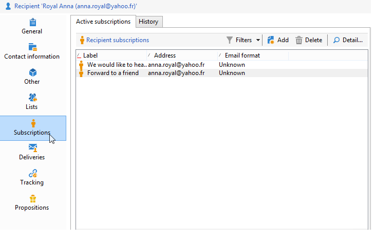
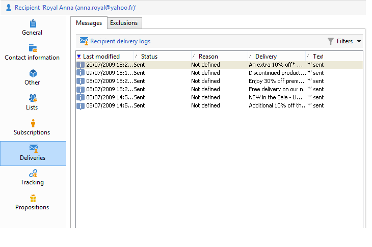
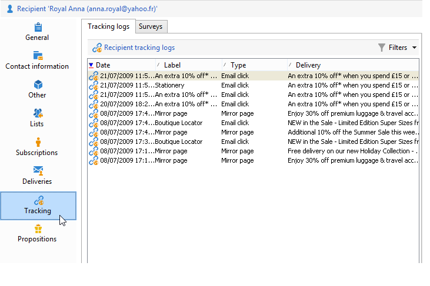

# 프로필 편집{#editing-a-profile}

프로필과 관련된 정보를 보려면 프로필 목록에서 해당 이름을 클릭합니다.

프로필 세부 사항이 새 탭에 표시됩니다.

프로파일에 대한 데이터는 탭으로 그룹화됩니다.

탭과 해당 컨텐츠는 구성 및 설치된 패키지에 따라 다릅니다.

>[!CAUTION]
>
>XML 스키마 및 프로필 테이블의 필드와 관련된 양식은 Adobe Campaign 트리의 **[!UICONTROL Administration > Configuration > Data schemas]** 노드를 통해 액세스합니다. 전문가 사용자만 이러한 스키마를 변경할 수 있습니다.
>
>자세한 내용은 [이 페이지를](../../configuration/using/about-schema-edition.md)참조하십시오.

## 일반 탭 {#general-tab}

이 화면에는 선택한 프로필에 대한 모든 일반 데이터가 포함되어 있습니다. 특히 성, 이름, 이메일 주소, 이메일 수신 형식 등이 포함되어 있습니다. 다음과 같습니다.

>[!NOTE]
>
>이 **[!UICONTROL No longer contact (by any channel)]** 옵션을 선택하면 프로필이 블랙리스트에 추가되었음을 의미합니다(예: 뉴스레터에서 가입 취소 링크를 클릭하는 등). 이러한 지표는 더 이상 모든 채널(이메일, DM 등)에서 게재로 타깃팅되지 않습니다. For more on this, refer to [this page](../../delivery/using/understanding-quarantine-management.md).

## 연락처 정보 탭 {#contact-information-tab}

이 화면에는 선택한 프로필의 DM 주소가 포함되어 있습니다. 다음과 같습니다.

이 화면에는 주소의 품질 색인과 주소에 포함된 오류 수가 표시됩니다. 이 정보는 이전 배달 중에 발견된 오류 수를 기준으로 메일 배달업자가 직접 사용하며 수동으로 수정할 수 없습니다.

## 기타 탭 {#other-tab}

이 화면에는 요구 사항에 따라 개인화할 수 있는 사용자 정의 필드가 포함되어 있습니다. 아래와 같이 필드 이름을 변경하고 형식을 정의할 **[!UICONTROL Field properties...]**&#x200B;수도 있습니다.

>[!NOTE]
>
>필드 속성과 필드 추가에 대한 자세한 내용은 [이 페이지를](../../configuration/using/new-field-wizard.md)참조하십시오.

## 목록 탭 {#lists-tab}

이 화면에는 선택한 프로파일이 속한 그룹이 표시됩니다. 아이콘을 **[!UICONTROL Add]** 클릭하여 목록에 프로필을 가입합니다. 아이콘을 **[!UICONTROL Detail]** 클릭하여 선택한 목록에 설명 및 프로필 목록을 표시합니다.

자세한 내용은 목록 [만들기 및 관리를 참조하십시오](../../platform/using/creating-and-managing-lists.md).

## 구독 탭 {#subscriptions-tab}

이 화면에는 프로파일이 가입한 정보 서비스가 포함되어 있습니다.

이 **[!UICONTROL Detail]** 단추는 선택한 구독의 속성을 표시합니다. 이 **[!UICONTROL Add]** 단추는 새 구독을 수동으로 추가하는 데 사용됩니다.

For more on this, refer to [this page](../../delivery/using/managing-subscriptions.md).

## 배달 탭 {#deliveries-tab}

이 화면에는 선택한 프로필에 대한 배달 로그가 표시됩니다. 또한 모든 채널을 통해 프로필에 전달된 배달 작업의 레이블, 날짜 및 상태를 표시할 수 있습니다.

## 추적 탭 {#tracking-tab}

이 화면에서는 선택한 프로필에 대한 추적 로그를 볼 수 있습니다. 이 정보는 게재 후 프로필 동작을 추적하는 데 사용됩니다.

이 탭에는 배달에서 추적된 모든 URL의 누적 합계가 표시됩니다.

목록은 구성할 수 있으며 일반적으로 다음을 포함합니다.클릭한 URL, 클릭한 날짜 및 시간, URL이 포함된 문서.

>[!NOTE]
>
>추적 기능에 대한 자세한 내용은 [이 페이지를](../../delivery/using/monitoring-a-delivery.md)참조하십시오.

