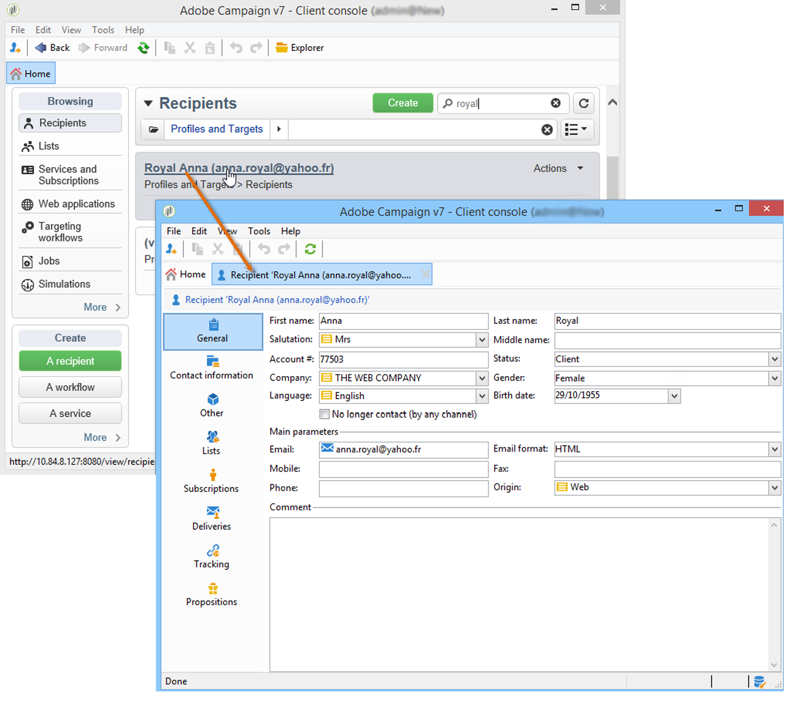
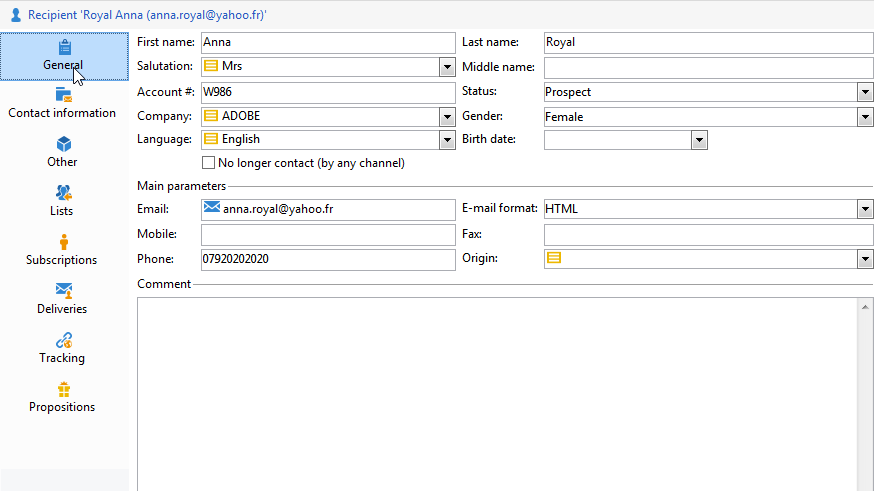
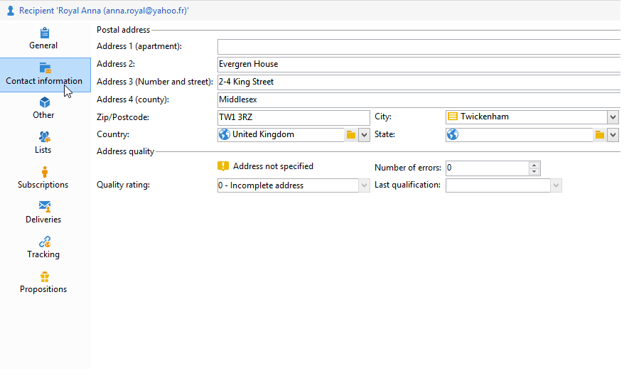
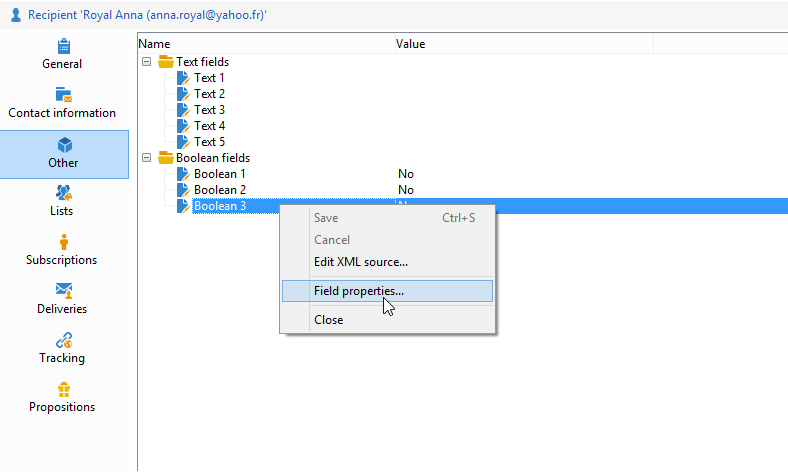
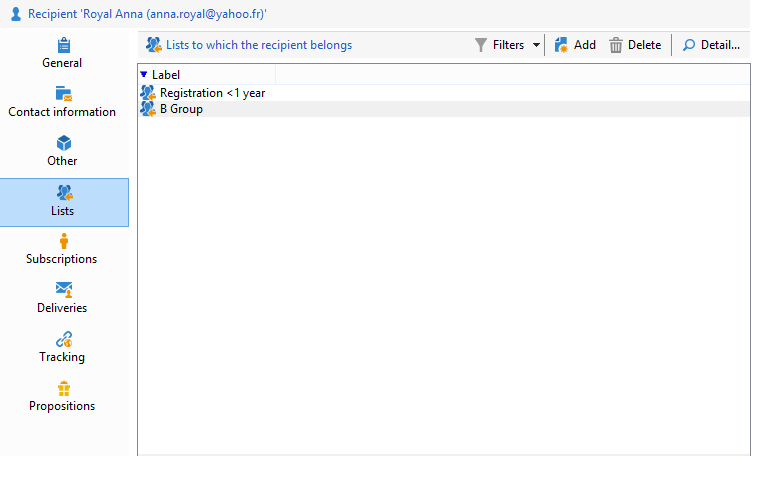
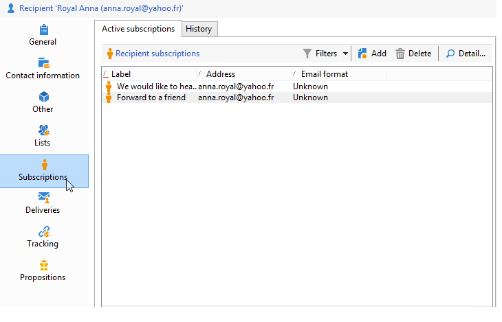
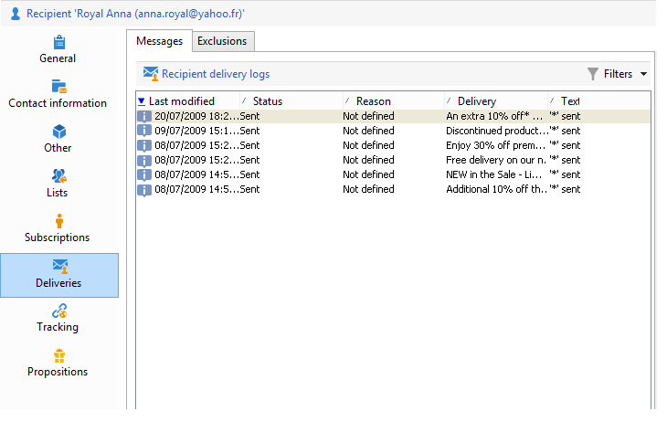
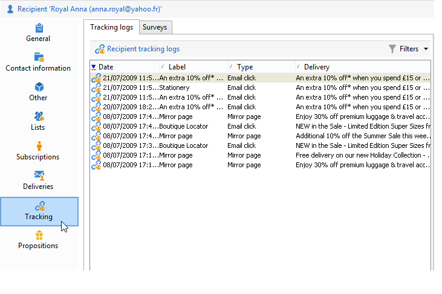

# 프로필 편집{#editing-a-profile}

프로필과 관련된 정보를 보려면 프로필 목록에서 해당 이름을 클릭합니다.

프로필 세부 사항이 새 탭에 표시됩니다.

프로필에 대한 데이터는 탭으로 그룹화됩니다.

탭과 해당 콘텐츠는 구성 및 설치된 패키지에 따라 다릅니다.

>[!CAUTION]
>
>프로필 테이블의 필드와 관련된 XML 스키마와 양식은 Adobe Campaign 트리의 **[!UICONTROL Administration > Configuration > Data schemas]** 노드를 통해 액세스됩니다. 전문가 사용자만 이러한 스키마를 변경할 수 있습니다.
>
>자세한 내용은 [이 페이지](../../configuration/using/about-schema-edition.md)를 참조하세요.

>[!NOTE]
>
>프로필을 편집하고 액세스하는 방법에 대한 자세한 내용은 [Campaign v8 설명서](https://experienceleague.adobe.com/en/docs/campaign/campaign-v8/audience/view-profiles){target=_blank}의 상세 설명서를 참조하십시오.

<!--
## General tab {#general-tab}

This screen contains all general data about the selected profile. In particular, it contains the last name, first name, email address, email reception format, etc. It looks like this:

>[!NOTE]
>
>When the **[!UICONTROL No longer contact (by any channel)]** option is selected, this means that the profile is on denylist, i.e. the profile has expressed a wish not to be contacted (for example, by clicking an unsubscription link in a newsletter). They will no longer be targeted by deliveries on any channel (email, direct mail, etc.). For more on this, refer to [this page](../../delivery/using/delivery-failures-quarantine.md).

## Contact information tab {#contact-information-tab}

This screen contains the direct mail address of the selected profile. It looks like this:

This screen shows the quality index of the address, as well as how many errors the address contains. This information is used directly by the mail carrier based on the number of errors found during previous deliveries, and is not modifiable manually.

## Other tab {#other-tab}

This screen contains user-defined fields that can be personalized based on requirements. You can also change the names of the fields and define their format, via **[!UICONTROL Field properties...]**, as shown below:

>[!NOTE]
>
>For more on field properties and on adding fields, refer to [this page](../../configuration/using/new-field-wizard.md).

## Lists tab {#lists-tab}

This screen displays the group(s) to which the selected profile belongs. Click **[!UICONTROL Add]** to subscribe the profile to a list. Click **[!UICONTROL Detail]** to display the description and the list of profiles in the selected list.

For more on this, refer to [Create and manage lists](../../platform/using/creating-and-managing-lists.md).

## Subscriptions tab {#subscriptions-tab}

This screen contains the information services to which the profile has subscribed.

The **[!UICONTROL Detail]** button displays the properties of the selected subscription. The **[!UICONTROL Add]** button is used to add a new subscription manually.

For more on this, refer to [this page](../../delivery/using/managing-subscriptions.md).

## Deliveries tab {#deliveries-tab}

This screen displays the delivery logs for the selected profile. You can also display the labels, dates, and status of the delivery actions addressed to the profile via all channels.

## Tracking tab {#tracking-tab}

This screen lets you view the tracking logs for the selected profile. This information is used to track profile behavior following deliveries.

This tab shows the cumulative total of all URLs tracked in deliveries.

The list is configurable, and usually contains: the URL clicked, date and time of click, and the document that contained the URL.

>[!NOTE]
>
>For more on tracking functionality, please refer to [this page](https://experienceleague.adobe.com/en/docs/campaign/campaign-v8/send/monitor/delivery-dashboard){target="_blank"}.

-->