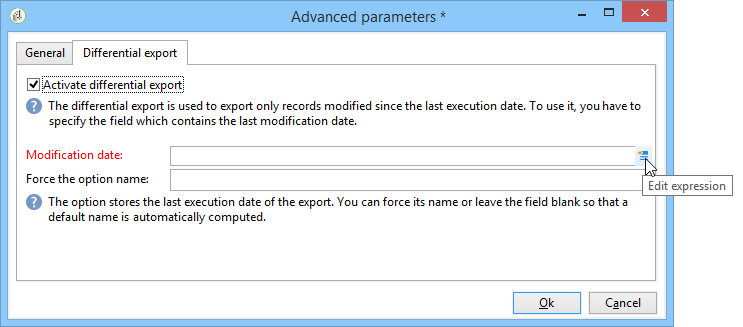

# 내보내기 작업 구성 {#executing-export-jobs}

내보내기 작업을 사용하면 데이터베이스에서 데이터에 액세스하고 데이터를 추출할 수 있습니다. 연락처, 클라이언트, 목록, 세그먼트 등

예를 들어 캠페인 추적 데이터(추적 내역 등)를 사용하는 데 유용할 수 있습니다. 스프레드시트에 넣을 수 있습니다. 출력 데이터는 txt, CSV, TAB 또는 XML 형식으로 지정할 수 있습니다.

내보내기 마법사를 사용하여 내보내기를 구성하고, 해당 옵션을 정의하고, 실행을 시작할 수 있습니다. 내보내기 유형(단순 또는 다중)과 연산자의 권한에 따라 컨텐츠가 달라집니다.

새 내보내기 작업을 만들면 내보내기 마법사가 표시됩니다( [가져오기 및 내보내기 작업 만들기](../../platform/using/creating-import-export-jobs.md).

## 1단계 - 내보내기 템플릿 선택 {#step-1---choosing-the-export-template}

내보내기 마법사를 시작할 때 먼저 템플릿을 선택해야 합니다. 예를 들어 최근에 등록한 수신자의 내보내기를 구성하려면 아래 단계를 수행하십시오.

1. 을(를) 선택합니다 **[!UICONTROL Profiles and Targets > Job > Generic imports and exports]** 폴더를 입력합니다.
1. 클릭 **새로 만들기** 을 클릭한 다음 **내보내기** 내보내기 템플릿을 만들려면 다음을 수행하십시오.

   

1. 오른쪽 화살표 클릭 **[!UICONTROL Export template]** 필드를 클릭하여 템플릿을 선택하거나 **[!UICONTROL Select link]** 트리를 찾아보려면

   기본 템플릿은 다음과 같습니다 **[!UICONTROL New text export]**. 이 템플릿은 수정해서는 안 되지만, 복제하여 새 템플릿을 구성할 수 있습니다. 기본적으로 내보내기 템플릿은 **[!UICONTROL Resources > Templates > Job templates]** 노드 아래에 있어야 합니다.

1. 내보낼 이름을 **[!UICONTROL Label]** 필드. 설명을 추가할 수 있습니다.
1. 내보내기 유형을 선택합니다. 다음과 같은 두 가지 유형의 내보내기가 있습니다. **[!UICONTROL Simple export]** 한 파일만 내보내려면 **[!UICONTROL Multiple export]** 하나 이상의 소스 문서에서 단일 실행으로 여러 파일을 내보냅니다.

## 2단계 - 내보낼 파일 유형 {#step-2---type-of-file-to-export}

내보낼 문서의 유형(내보낼 데이터의 스키마)을 선택합니다.

기본적으로 내보내기가 **[!UICONTROL Jobs]** 노드 데이터는 수신자 테이블에서 가져옵니다. 데이터 목록(에서)에서 내보내기를 시작할 때 **[!UICONTROL right click > Export]** 메뉴)를 채울 때 데이터가 속한 테이블이 **[!UICONTROL Document type]** 필드.

* 기본적으로 **[!UICONTROL Download the file generated on the server after the export]** 옵션이 선택되어 있습니다. 에서 **[!UICONTROL Local file]** 필드에서 만들 파일의 이름과 경로를 입력하거나 필드 오른쪽의 폴더를 클릭하여 로컬 디스크를 찾습니다. 서버 출력 파일의 액세스 경로와 이름을 입력하려면 이 옵션을 선택 취소할 수 있습니다.

   >[!NOTE]
   >
   >자동 가져오기 및 내보내기 작업은 항상 서버에서 수행됩니다.
   >
   >일부 데이터만 내보내려면 **[!UICONTROL Advanced parameters]** 그리고 해당 필드에 내보낼 라인 수를 입력합니다.

* 마지막 실행 이후 수정된 레코드만 내보내는 차등 내보내기를 만들 수 있습니다. 이렇게 하려면 **[!UICONTROL Advanced parameters]** 링크를 클릭한 다음 **[!UICONTROL Differential export]** 탭을 선택하고 **[!UICONTROL Activate differential export]**.

   

   마지막 수정 일자를 입력해야 합니다. 필드나 계산된 필드에서 검색할 수 있습니다.

## 3단계 - 출력 형식 정의 {#step-3---defining-the-output-format}

내보내기 파일의 출력 형식을 선택합니다. 다음 형식을 사용할 수 있습니다. 텍스트, 고정 열 텍스트, CSV 및 XML입니다.

* 대상 **[!UICONTROL Text]** 열(탭, 쉼표, 세미콜론 또는 사용자 지정)과 문자열(작은 따옴표나 큰 따옴표 또는 없음)을 구분하려면 구분 기호를 선택합니다.
* 대상 **[!UICONTROL text]** 및 **[!UICONTROL CSV]**, 옵션을 선택할 수 있습니다. **[!UICONTROL Use first lines as column titles]**.
* 날짜 형식과 숫자 형식을 나타냅니다. 이렇게 하려면 **[!UICONTROL Edit]** 관련 필드의 단추 및 편집기를 사용합니다.
* 열거된 값이 포함된 필드의 경우 **[!UICONTROL Export labels instead of internal values of enumerations]**. 예를 들어 폼에 제목을 저장할 수 있습니다 **1=Mr**, **2=Miss**, **3=부인.**. 이 옵션을 선택하면 **미스터**, **미스** 및 **부인** 을 내보냅니다.

## 4단계 - 데이터 선택 {#step-4---data-selection}

내보낼 필드를 선택합니다. 방법은 다음과 같습니다.

1. 에서 원하는 필드를 두 번 클릭합니다 **[!UICONTROL Available fields]** 목록에 추가하여 **[!UICONTROL Output columns]** 섹션을 참조하십시오.
1. 목록 오른쪽의 화살표를 사용하여 출력 파일의 필드 순서를 정의합니다.

   

1. 을(를) 클릭합니다. **[!UICONTROL Add]** 함수에 대한 호출 단추입니다. 자세한 내용은 [함수 목록](../../platform/using/defining-filter-conditions.md#list-of-functions).

## 5단계 - 열 정렬 {#step-5---sorting-columns}

열의 정렬 순서를 선택합니다.

## 6단계 - 조건 필터링 {#step-6---filter-conditions-}

모든 데이터를 내보내지 않도록 필터 조건을 추가할 수 있습니다. 이 필터링의 구성은 게재 마법사에서 수신자 타겟팅과 동일합니다. [이 페이지](../../delivery/using/steps-defining-the-target-population.md)를 참조하십시오.

## 7단계 - 데이터 형식 {#step-7---data-formatting}

출력 파일의 필드 순서 및 레이블을 수정하고 소스 데이터에 변환을 적용할 수 있습니다.

* 내보낼 열 순서를 변경하려면 원하는 열을 선택하고 표 오른쪽에 있는 파란색 화살표를 사용합니다.
* 필드의 레이블을 변경하려면 **[!UICONTROL Label]** 수정할 필드와 일치하는 열을 선택하고 새 레이블을 입력합니다. 키보드에서 Enter 키를 눌러 확인합니다.
* 필드의 컨텐츠에 케이스 변형을 적용하려면 **[!UICONTROL Transformation]** 열. 다음을 선택할 수 있습니다.

   * 소문자로 전환
   * 대소문자 전환
   * 대문자로 된 첫 번째 문자

   

* 클릭 **[!UICONTROL Add a calculated field]** 새 계산된 필드를 만들려면(예: 성 + 이름을 포함하는 열) 자세한 내용은 [계산된 필드](../../platform/using/executing-import-jobs.md#calculated-fields).

요소 컬렉션(예: 수신자의 구독, 수신자가 속한 목록 등)을 내보내는 경우, 내보낼 컬렉션의 요소 수를 지정해야 합니다.

## 8단계 - 데이터 미리 보기 {#step-8---data-preview}

클릭 **[!UICONTROL Start the preview of the data]** 내보내기 결과의 미리 보기입니다. 기본적으로 처음 200개 줄이 표시됩니다. 이 값을 변경하려면 오른쪽의 화살표를 클릭합니다 **[!UICONTROL Lines to display]** 필드.

마법사 하단의 탭을 클릭하여 열의 결과 미리 보기에서 XML의 결과로 전환합니다. 생성된 SQL 쿼리를 볼 수도 있습니다.

## 9단계 - 내보내기 시작 {#step-9---launching-the-export}

클릭 **[!UICONTROL Start]** 데이터 내보내기를 시작하려면 다음을 수행하십시오.

그런 다음 가져오기 작업의 실행을 모니터링할 수 있습니다( [작업 실행 모니터링](../../platform/using/monitoring-jobs-execution.md).
