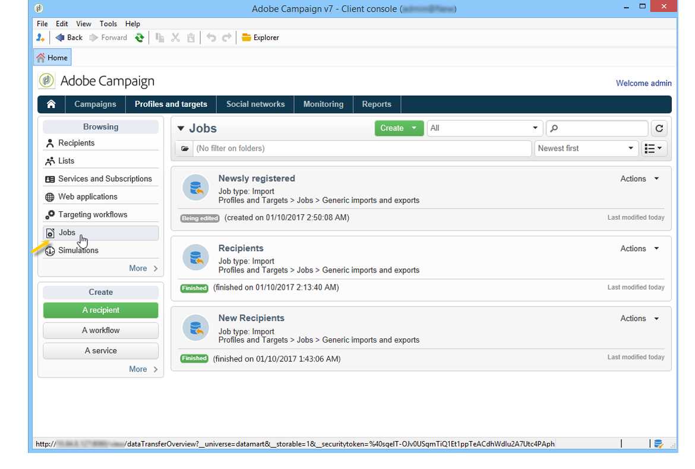

# 프로필 가져오기 및 내보내기{#exporting-and-importing-profiles}

[워크플로우를 사용](#use-workflows)하여 수신자 프로필을 Adobe Campaign 데이터베이스로 가져오거나 내보내거나 [일반 가져오기 또는 내보내기 작업](#create-jobs)을 설정할 수 있습니다.

 [비디오에서 이 기능 살펴보기](#import-profiles-video)

>[!NOTE]
>
>프로필을 가져오고 내보내는 방법을 알아보려면 Campaign v8 설명서를 참조하십시오.

<!--

## Use workflows{#use-workflows}

Exports and imports are configured in dedicated templates executed through workflows via import and export activities. They can be repeated automatically according to a schedule, for example to automate data exchange between several information systems. [Learn more](../../platform/using/import-export-workflows.md#best-practices-when-importing-data)

If necessary, you can create an occasional import or export job via the **[!UICONTROL Generic imports and exports]** feature described below.

## Create jobs{#create-jobs}

To configure and execute data imports and exports jobs, go to the **[!UICONTROL Profiles and targets]** tab and click the **[!UICONTROL Jobs]** link. [Learn more](../../platform/using/about-generic-imports-exports.md)

## Tutorial video {#import-profiles-video}

This video explains how to import profiles in Adobe Campaign, for an occasional import.

>[!VIDEO](https://video.tv.adobe.com/v/25608?quality=12)

Additional Campaign Classic how-to videos are available [here](https://experienceleague.adobe.com/docs/campaign-classic-learn/tutorials/overview.html?lang=ko).
-->