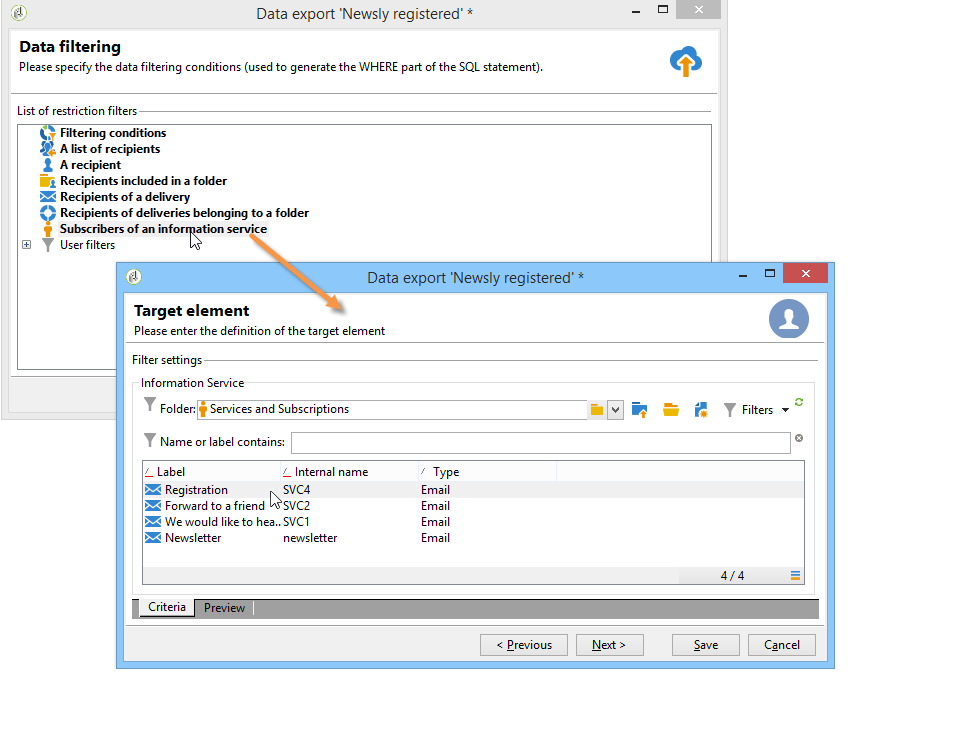

# 데이터 내보내기{#exporting-data}

## 내보내기 마법사 {#export-wizard}

내보내기 매개 변수는 마법사를 통해 기록됩니다. 범용 내보내기 모듈은 표준으로 사용할 수 있으며 데이터베이스에서 데이터를 액세스하고 추출할 수 있습니다.연락처, 클라이언트, 목록, 세그먼트 등 예를 들어 캠페인 추적 데이터(추적 내역 등)를 사용하는 데 유용합니다. 스프레드시트에 추가할 수 있습니다. 출력 데이터는 txt, CSV, TAB 또는 XML 형식으로 지정할 수 있습니다.

### 1단계 - 내보내기 템플릿 {#step-1---choosing-the-export-template} 선택

내보내기 마법사를 시작할 때 먼저 템플릿을 선택해야 합니다. 예를 들어 최근에 등록한 받는 사람의 내보내기를 구성하려면 아래 단계를 따르십시오.

1. **[!UICONTROL Profiles and Targets > Job > Generic imports and exports]** 폴더를 선택합니다.
1. **새로 만들기**&#x200B;를 클릭한 다음 **내보내기**&#x200B;를 클릭하여 내보내기 템플릿을 만듭니다.

   

1. **[!UICONTROL Export template]** 필드 오른쪽의 화살표를 클릭하여 템플릿을 선택하거나 **[!UICONTROL Select link]** 을 클릭하여 트리를 찾습니다.

   기본 템플릿은 **[!UICONTROL New text export]**&#x200B;입니다. 이 템플릿은 수정해서는 안 되지만, 복제하여 새 템플릿을 구성할 수 있습니다. 기본적으로 내보내기 템플릿은 **[!UICONTROL Resources > Templates > Job templates]** 노드에 저장됩니다.

1. **[!UICONTROL Label]** 필드에 내보낼 이름을 입력합니다. 설명을 추가할 수 있습니다.
1. 내보내기 유형을 선택합니다. 내보낼 수 있는 내보내기 유형은 다음과 같습니다.하나 이상의 소스 문서 유형에서 하나의 파일만 내보내려면 **[!UICONTROL Simple export]**, 단일 실행으로 여러 파일을 내보내려면 **[!UICONTROL Multiple export]**.

### 2단계 - 내보낼 파일 유형 {#step-2---type-of-file-to-export}

내보낼 문서 유형(내보낼 데이터의 스키마)을 선택합니다.

기본적으로 내보내기가 **[!UICONTROL Jobs]** 노드에서 실행되면 데이터가 수신자 테이블에서 옵니다. 데이터 목록(**[!UICONTROL right click > Export]** 메뉴에서)에서 내보내기를 시작하면 데이터가 속한 테이블이 **[!UICONTROL Document type]** 필드에 자동으로 채워집니다.

* 기본적으로 **[!UICONTROL Download the file generated on the server after the export]** 옵션이 선택되어 있습니다. **[!UICONTROL Local file]** 필드에서 만들 파일의 이름과 경로를 채우거나 필드 오른쪽의 폴더를 클릭하여 로컬 디스크를 찾습니다. 서버 출력 파일의 액세스 경로와 이름을 입력하려면 이 옵션을 선택 취소할 수 있습니다.

   >[!NOTE]
   >
   >자동 가져오기 및 내보내기 작업은 항상 서버에서 수행됩니다.
   >
   >일부 데이터만 내보내려면 **[!UICONTROL Advanced parameters]**&#x200B;을 클릭하고 적절한 필드에 내보낼 줄 수를 입력합니다.

* 차등 내보내기를 만들어 마지막 실행 이후 수정된 레코드만 내보낼 수 있습니다. 이렇게 하려면 **[!UICONTROL Advanced parameters]** 링크를 클릭하고 **[!UICONTROL Differential export]** 탭을 클릭한 다음 **[!UICONTROL Activate differential export]**&#x200B;를 선택합니다.

   

   마지막 수정 날짜를 입력해야 합니다. 필드 또는 계산에서 검색할 수 있습니다.

### 3단계 - 출력 형식 정의 {#step-3---defining-the-output-format}

내보내기 파일의 출력 형식을 선택합니다. 다음 형식을 사용할 수 있습니다.텍스트, 고정 열 텍스트, CSV 및 XML

* **[!UICONTROL Text]** 형식의 경우 구분 기호를 선택하여 열(탭, 쉼표, 세미콜론 또는 사용자 정의)과 문자열(작은 따옴표 또는 큰 따옴표 또는 없음)을 구분합니다.
* **[!UICONTROL text]** 및 **[!UICONTROL CSV]**&#x200B;의 경우 **[!UICONTROL Use first lines as column titles]** 옵션을 선택할 수 있습니다.
* 날짜 형식과 숫자 형식을 지정합니다. 이렇게 하려면 해당 필드의 **[!UICONTROL Edit]** 단추를 클릭하고 편집기를 사용합니다.
* 열거된 값이 포함된 필드의 경우 **[!UICONTROL Export labels instead of internal values of enumerations]**&#x200B;을 선택할 수 있습니다. 예를 들어 제목을 **1=Mr 형식으로 저장할 수 있습니다.**,  **2=미스**,  **3=부인.**. 이 옵션을 선택하면 **Mr**, **Miss** 및 **Mrs.**&#x200B;이 내보내집니다.

### 4단계 - 데이터 선택 {#step-4---data-selection}

내보낼 필드를 선택합니다. 방법은 다음과 같습니다.

1. **[!UICONTROL Output columns]** 섹션에 추가하려면 **[!UICONTROL Available fields]** 목록에서 원하는 필드를 두 번 클릭합니다.
1. 목록 오른쪽에 있는 화살표를 사용하여 출력 파일의 필드 순서를 정의합니다.

   

1. 함수를 호출하려면 **[!UICONTROL Add]** 단추를 클릭합니다. 자세한 내용은 [함수 목록](../../platform/using/defining-filter-conditions.md#list-of-functions)을 참조하십시오.

### 5단계 - 열 정렬 {#step-5---sorting-columns}

열의 정렬 순서를 선택합니다.

### 6단계 - 필터 조건 {#step-6---filter-conditions-}

모든 데이터를 내보내지 않도록 필터 조건을 추가할 수 있습니다. 이 필터링의 구성은 배달 마법사의 수신자 타깃팅과 동일합니다. [이 페이지](../../delivery/using/steps-defining-the-target-population.md)를 참조하십시오.

### 7단계 - 데이터 서식 {#step-7---data-formatting}

출력 파일의 필드 순서 및 레이블을 수정하고 소스 데이터에 변형을 적용할 수 있습니다.

* 내보낼 열의 순서를 변경하려면 해당 열을 선택하고 표 오른쪽에 있는 파란색 화살표를 사용합니다.
* 필드의 레이블을 변경하려면 수정할 필드와 일치하는 **[!UICONTROL Label]** 열의 셀을 클릭하고 새 레이블을 입력합니다. 키보드에서 Enter 키를 눌러 확인합니다.
* 필드의 내용에 대/소문자 변환을 적용하려면 **[!UICONTROL Transformation]** 열에서 선택합니다. 다음을 선택할 수 있습니다.

   * 소문자로 전환
   * 대문자 전환
   * 대문자 첫 번째 문자

   

* 새 계산된 필드를 만들려면 **[!UICONTROL Add a calculated field]** 을 클릭합니다(예: 성 + 이름을 포함하는 열). 자세한 내용은 [계산된 필드](../../platform/using/importing-data.md#calculated-fields)를 참조하십시오.

요소 컬렉션(예: 받는 사람의 구독, 해당 항목이 속한 목록 등)을 내보내는 경우 내보낼 컬렉션의 요소 수를 지정해야 합니다.

### 8단계 - 데이터 미리 보기 {#step-8---data-preview}

내보내기 결과를 미리 보려면 **[!UICONTROL Start the preview of the data]**&#x200B;을 클릭합니다. 기본적으로 처음 200개 라인이 표시됩니다. 이 값을 변경하려면 **[!UICONTROL Lines to display]** 필드 오른쪽에 있는 화살표를 클릭합니다.

마법사 아래쪽에 있는 탭을 클릭하여 결과 미리 보기에서 XML의 결과로 전환합니다. 생성된 SQL 쿼리를 볼 수도 있습니다.

### 9단계 - 내보내기 {#step-9---launching-the-export} 시작

**[!UICONTROL Start]**&#x200B;을 클릭하여 데이터 내보내기를 시작합니다.

## 워크플로 {#exporting-data-via-a-workflow}을(를) 통해 데이터 내보내기

워크플로우는 데이터를 변형하는 데 사용할 수 있는 데이터 관리 활동 중 일부를 사용한 후 내보내기 프로세스를 자동화하거나 정확한 데이터 세트를 내보내는 유용한 방법입니다.

워크플로우에서 데이터를 내보내는 방법에 대한 자세한 내용은 [이 섹션](../../workflow/using/how-to-use-workflow-data.md)을 참조하십시오.
