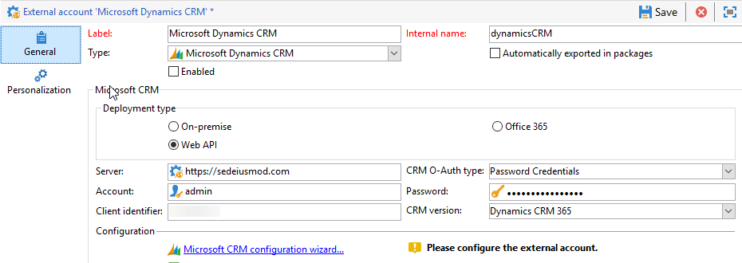

# 외부 계정{#external-accounts}

외부 계정은 Adobe Campaign 외부에 있는 서버에 대한 액세스를 구성하고 테스트할 수 있는 구성입니다. 이러한 외부 계정은 Campaign 워크플로우에서 데이터 액세스 및 관리에 사용할 수 있습니다.

다음 유형의 외부 계정을 설정할 수 있습니다.

* [외부 계정 라우팅](#routing-external-account)
* [FTP 외부 계정](#ftp-external-account)
* [외부 데이터베이스 외부 계정](#external-database-external-account)
* [웹 분석 외부 계정](#web-analytics-external-account)
* [Facebook 연결 외부 계정](#facebook-connect-external-account)
* [실행 인스턴스 외부 계정](#execution-instance-external-account)
* [Adobe Experience Cloud 외부 계정](#adobe-experience-cloud-external-account)
* [SFTP 외부 계정](#sftp-external-account)
* [Adobe Experience Manager 외부 계정](#adobe-experience-manager-external-account)
* [Amazon Simple Storage Service (S3) 외부 계정](#amazon-simple-storage-service--s3--external-account)
* [Azure 외부 계정](#azure-external-account)
* [Hadoop 외부 계정](#hadoop-external-account)
* [Microsoft Dynamics CRM 외부 계정](#microsoft-dynamics-crm-external-account)
* [Oracle on-demand 외부 계정](#oracle-on-demand-external-account)
* [Salesforce CRM 외부 계정](#salesforce-crm-external-account)

## 외부 계정 만들기 {#creating-an-external-account}

Adobe Campaign에는 미리 정의된 외부 계정 집합이 포함되어 있습니다. 파일 전송에 사용되는 FTP 서버와 같은 외부 시스템과의 연결을 설정하기 위해 자체적인 외부 계정을 만들 수 있습니다.

외부 계정은 기술 워크플로우 또는 캠페인 워크플로우와 같은 기술 프로세스에서 사용됩니다. 워크플로우 또는 다른 애플리케이션(Adobe Target, Experience Manager 등)과의 데이터 교환에서 파일 전송을 설정할 때는 외부 계정을 선택해야 합니다.

1. 메뉴에서 **[!UICONTROL Explorer]**&#x200B;메뉴를 **[!UICONTROL Administration]** 펼쳐라.
1. 메뉴를 **[!UICONTROL Platform]** 펼쳐서 클릭하십시오 **[!UICONTROL External accounts]**.

   

1. **[!UICONTROL New]** 버튼을 클릭합니다.

   

1. 및 **[!UICONTROL Label]** 을 입력합니다 **[!UICONTROL Internal Name]**. 워크플로우에서 외부 계정을 선택할 때 둘 다 사용됩니다.
1. 연결을 활성화할지 **[!UICONTROL Enabled]** 확인합니다.
1. 만들 외부 계정 **[!UICONTROL Type]** 을 선택합니다.
1. 선택한 외부 계정 유형에 따라 자격 증명을 지정하여 계정에 대한 액세스 권한을 구성합니다.

   필요한 정보는 일반적으로 연결 중인 서버 공급자가 제공합니다.

1. **[!UICONTROL Save]**&#x200B;을(를) 클릭합니다.

외부 계정이 만들어지고 외부 계정 목록에 추가됩니다. 이제 워크플로우 활동 및 게재 속성에서 데이터/파일 전송 또는 라우팅 구성에 사용할 수 있습니다.

## 바운스 메일 외부 계정 {#bounce-mails-external-account}

바운스 **메일** 외부 계정은 이메일 서비스에 연결하는 데 사용할 외부 POP3 계정을 지정합니다. For more on this external account, refer to this [page](../../workflow/using/inbound-emails.md).

POP3 액세스를 위해 구성된 모든 서버를 사용하여 회신 메일을 받을 수 있습니다.


외부 계정을 **[!UICONTROL Bounce mails (defaultPopAccount)]** 구성하려면:

* **[!UICONTROL Server]**

   POP3 서버의 URL.

* **[!UICONTROL Port]**

   POP3 연결 포트 번호. 기본 포트는 110입니다.

* **[!UICONTROL Account]**

   사용자의 이름입니다.

* **[!UICONTROL Password]**

   사용자 계정 암호.

* **[!UICONTROL Encryption]**

   선택한 암호화 유형 **[!UICONTROL By default]**, **[!UICONTROL POP3 + STARTTLS]****[!UICONTROL POP3]** 또는 **[!UICONTROL POP3S]**&#x200B;중

## 외부 계정 라우팅 {#routing-external-account}

외부 계정을 사용하면 설치된 패키지에 따라 Adobe Campaign에서 사용할 수 있는 각 채널을 구성할 수 있습니다. **[!UICONTROL Routing]**


다음 채널을 구성할 수 있습니다.

* [이메일](../../installation/using/deploying-an-instance.md#email-channel-parameters)
* [모바일(SMS)](../../delivery/using/sms-channel.md#creating-an-smpp-external-account)
* [전화](../../delivery/using/steps-about-delivery-creation-steps.md#other-channels)
* [DM](../../delivery/using/about-direct-mail-channel.md)
* [에이전시](../../delivery/using/steps-about-delivery-creation-steps.md#other-channels)
* [Facebook](../../social/using/publishing-on-facebook-walls.md#delegating-write-access-to-adobe-campaign)
* [Twitter](../../social/using/configuring-publishing-on-twitter.md)
* [iOS 채널](../../delivery/using/configuring-the-mobile-application.md)
* [Android 채널](../../delivery/using/configuring-the-mobile-application-android.md)

## FTP 외부 계정 {#ftp-external-account}

FTP 외부 계정을 사용하면 Adobe Campaign 외부의 서버에 대한 액세스를 구성하고 테스트할 수 있습니다. 파일 전송에 사용되는 FTP 서버 898과 같은 외부 시스템과의 연결을 설정하려면 자체 외부 계정을 만들 수 있습니다. 자세한 정보는 이 [페이지](../../workflow/using/file-transfer.md)를 참조하십시오.

이렇게 하려면 FTP 서버에 대한 연결을 설정하는 데 사용되는 주소와 자격 증명을 이 외부 계정에 지정합니다


* **[!UICONTROL Server]**

   FTP 서버의 이름입니다.

* **[!UICONTROL Port]**

   FTP 연결 포트 번호. 기본 포트는 21입니다.

* **[!UICONTROL Account]**

   사용자의 이름입니다.

* **[!UICONTROL Password]**

   사용자 계정 암호.

* **[!UICONTROL Encryption]**

   또는 간에 선택한 암호화 **[!UICONTROL None]** 유형 **[!UICONTROL SSL]**.

이러한 자격 증명을 찾을 위치를 알려면 이 [페이지를 참조하십시오](https://help.dreamhost.com/hc/en-us/articles/115000675027-FTP-overview-and-credentials).

## 외부 데이터베이스 외부 계정 {#external-database-external-account}

Adobe Campaign은 외부 응용 프로그램과 통신하고 데이터베이스 엔진에 연결할 수 있는 여러 개의 커넥터를 제공합니다.


다음 연결 유형을 구성할 수 있습니다.

* Azure Synapse. For more information, refer to this [page](../../platform/using/specific-configuration-database.md#configure-access-to-azure-synapse).
* Oracle. For more information, refer to this [page](../../platform/using/specific-configuration-database.md#configure-access-to-oracle).
* 네테자 For more information, refer to this [page](../../platform/using/specific-configuration-database.md#configure-access-to-netezza).
* SAP HANA. For more information, refer to this [page](../../platform/using/specific-configuration-database.md#configure-access-to-sap-hana).
* InfiniDB
* Microsoft SQL Server
* AsterData
* PostgreSQL
* Teradata
* DB2
* Amazon 적색
* ODBC(Sybase ASE, Sybase IQ)
* 원격 데이터베이스에 대한 HTTP 릴레이

### Snowflake 외부 계정 {#snowflake-external-account}

Snowflake **외부** 계정을 사용하면 캠페인 인스턴스를 Snowflake 외부 데이터베이스에 연결할 수 있습니다. Snowflake을 사용하여 Campaign Classic을 구성하는 방법에 대한 자세한 내용은 이 [페이지를 참조하십시오](../../platform/using/specific-configuration-database.md#configure-access-to-snowflake).

이 외부 계정이 Adobe Campaign에서 작동하도록 구성하려면 다음 세부 정보를 제공해야 합니다.

* **[!UICONTROL Server]**

       Snowflake 서버의 URL.
   
* **[!UICONTROL Account]**

       사용자의 이름입니다.
   
* **[!UICONTROL Password]**

       사용자 계정 암호.
   
* **[!UICONTROL Database]**

       데이터베이스의 이름입니다.
   


### Teradata 외부 계정 {#teradata-external-account}

Teradata **외부** 계정을 사용하면 캠페인 인스턴스를 Teradata 외부 데이터베이스에 연결할 수 있습니다. Teradata로 Campaign Classic을 구성하는 방법에 대한 자세한 내용은 이 [페이지](https://helpx.adobe.com/kr/campaign/kb/campaign_fda_teradata.html) 또는 이 [섹션을 참조하십시오](../../platform/using/specific-configuration-database.md#configure-access-to-teradata).


이 외부 계정이 Adobe Campaign에서 작동하도록 구성하려면 다음 세부 정보를 제공해야 합니다.

* **[!UICONTROL Type]**

   유형을 **[!UICONTROL Teradata]** 선택합니다.

* **[!UICONTROL Server]**

   Teradata 서버의 URL 또는 이름입니다.

* **[!UICONTROL Account]**

   Teradata 데이터베이스에 액세스하는 데 사용되는 계정의 이름입니다.

* **[!UICONTROL Password]**

   Teradata 데이터베이스에 연결하는 데 사용되는 암호입니다.

* **[!UICONTROL Database]**

   이 필드는 비워 둘 수 있습니다.

* **[!UICONTROL Options]**

   메타데이터를 통과하는 옵션입니다.

* **[!UICONTROL Timezone]**

   Teradata에 설정된 표준 시간대입니다.


여러 Adobe Campaign 사용자가 동일한 FDA Teradata 외부 계정에 연결할 때 이 **[!UICONTROL Query banding]** 탭에서는 세션에서 쿼리 밴드(예: 키/값 쌍 집합)를 설정할 수 있습니다.

Campaign 사용자가 Teradata 데이터베이스에 대해 쿼리를 수행할 때마다 Adobe Campaign은 이 사용자와 연관된 키 목록으로 구성된 메타 데이터를 전송합니다. 그런 다음 이 데이터를 메타데이터 관리자가 감사 목적으로 사용하거나 액세스 권한을 관리할 수 있습니다.

이 기능 **[!UICONTROL Active]** 을 활성화하려면 확인란을 선택합니다.

이 **[!UICONTROL Default]** 필드에서는 사용자에게 연관된 쿼리 밴드가 없는 경우 사용할 기본 쿼리 밴드를 입력할 수 있습니다. 이 필드를 비워 두면 쿼리 밴드가 없는 사용자가 Teradata를 사용할 수 없습니다.

이 **[!UICONTROL Users]** 필드에서는 각 사용자에 대한 쿼리 밴드를 지정할 수 있습니다. 필요한 만큼 키/값 쌍을 추가할 수 있습니다(예: priority=1;workload=high). 사용자에게 지정된 쿼리 범위가 없으면 필드가 **[!UICONTROL Default]** 적용됩니다.

For more information on **[!UICONTROL Query banding]**, refer to the [Teradata documentation](https://docs.teradata.com/reader/cY5B~oeEUFWjgN2kBnH3Vw/a5G1iz~ve68yTMa24kVjVw).

## 웹 분석 외부 계정 {#web-analytics-external-account}

외부 계정을 사용하면 세그먼트 형태로 Adobe Analytics의 데이터를 Adobe Campaign으로 전달할 수 있습니다. **[!UICONTROL Web Analytics (Adobe Analytics - Data connector)]** 반대로, 이 엔진은 Adobe Campaign이 Adobe Analytics - 데이터 커넥터로 제공하는 이메일 캠페인의 지표와 속성을 전송합니다.


이 외부 계정의 경우 추적된 URL에 대한 계산 공식은 농축되어야 하며 두 솔루션 간의 연결은 승인되어야 합니다. 자세한 정보는 이 [페이지](../../platform/using/adobe-analytics-data-connector.md#step-2--create-the-external-account-in-campaign)를 참조하십시오.

## Facebook 연결 외부 계정 {#facebook-connect-external-account}

외부 계정을 사용하면 Facebook 애플리케이션에 개인화된 컨텐츠를 표시할 수 있으므로 이 소셜 네트워크를 통해 잠재 고객을 더 쉽게 확보할 수 있습니다. **[!UICONTROL Facebook Connect]**

각 Facebook 애플리케이션에 대해 **[!UICONTROL Facebook Connect]** 유형 외부 계정을 만들어야 합니다. For more on this, refer to [page](../../social/using/creating-a-facebook-application.md#configuring-external-accounts).


* **[!UICONTROL Hosting mode]**

   응용 프로그램의 호스팅 모드 **[!UICONTROL hosted by a partner]** 를 **[!UICONTROL hosted by this instance]**&#x200B;사용합니다.

* **[!UICONTROL Application ID]**

   Facebook 애플리케이션의 앱 ID.

* **[!UICONTROL Application secret]**

   Facebook 애플리케이션의 앱 암호

이 인스턴스 모드에서 호스팅된 URL을 선택한 경우 Facebook의 **Facebook 웹 게임(https)** 필드에 붙여 넣어야 합니다

이러한 자격 증명을 찾을 위치를 알려면 이 [페이지를 참조하십시오](https://developers.facebook.com/docs/facebook-login/access-tokens).

## 실행 인스턴스 외부 계정 {#execution-instance-external-account}

상세 분류 아키텍처가 있는 경우 제어 인스턴스에 연결된 실행 인스턴스를 지정하고 연결해야 합니다. 트랜잭션 메시지 템플릿이 실행 인스턴스에 배포됩니다.


* **[!UICONTROL URL]**

   실행 인스턴스가 설치된 서버의 URL.

* **[!UICONTROL Account]**

   계정의 이름입니다. 연산자 폴더에 정의된 메시지 센터 에이전트와 일치해야 합니다.

* **[!UICONTROL Password]**

   연산자 폴더에 정의된 계정의 암호입니다.

For more information on this configuration, refer to this [page](../../message-center/using/creating-a-shared-connection.md#control-instance).

## Adobe Experience Cloud external account {#adobe-experience-cloud-external-account}

Adobe ID을 사용하여 Adobe Campaign 콘솔에 연결하려면 **[!UICONTROL Adobe Experience Cloud (MAC)]** 외부 계정을 구성해야 합니다.


* **[!UICONTROL IMS server]**

   IMS 서버의 URL. 스테이지와 프로덕션 인스턴스 모두 동일한 IMS 프로덕션 끝점을 가리키는지 확인합니다.

* **[!UICONTROL IMS scope]**

   여기에 정의된 범위는 IMS에서 제공하는 범위 중 일부여야 합니다.

* **[!UICONTROL IMS client identifier]**

   IMS 클라이언트의 ID입니다.

* **[!UICONTROL IMS client secret]**

   IMS 클라이언트 암호 자격 증명.

* **[!UICONTROL Callback server]**

   Adobe Campaign 인스턴스의 URL에 액세스합니다.

* **[!UICONTROL IMS organization ID]**

   IMS 조직의 ID. 조직 ID를 찾으려면 이 [페이지](https://docs.adobe.com/content/help/en/core-services/interface/manage-users-and-products/faq.html) (**IMS 조직 ID는 어디에서 찾을 수 있습니까?**)를 참조하십시오.

* **[!UICONTROL Association mask]**

   Enterprise Dashboard의 구성 이름을 Adobe Campaign의 그룹과 동기화할 수 있는 구문입니다.

* **[!UICONTROL Server]**

   Adobe Experience Cloud 인스턴스의 URL.

* **[!UICONTROL Tenant]**

   Adobe Experience Cloud 테넌트의 이름입니다.

For more information on this configuration, refer to this [page](../../integrations/using/configuring-ims.md).

## SFTP 외부 계정 {#sftp-external-account}

SFTP 외부 계정을 사용하면 Adobe Campaign 외부의 서버에 대한 액세스를 구성하고 테스트할 수 있습니다. 파일 전송에 사용되는 SFTP와 같은 외부 시스템과의 연결을 설정하려면 자체 외부 계정을 만들 수 있습니다. 자세한 정보는 이 [페이지](../../workflow/using/file-transfer.md)를 참조하십시오.


* **[!UICONTROL Server]**

   SFTP 서버의 URL.

* **[!UICONTROL Port]**

   FTP 연결 포트 번호. 기본 포트는 22입니다.

* **[!UICONTROL Account]**

   SFTP 서버에 연결하는 데 사용되는 계정 이름입니다.

* **[!UICONTROL Password]**

   SFTP 서버에 연결하는 데 사용되는 암호입니다.

## Adobe Experience Manager 외부 계정 {#adobe-experience-manager-external-account}

외부 계정을 사용하면 Adobe Experience Manager에서 직접 양식을 비롯한 이메일 게재 컨텐츠를 관리할 수 있습니다. **[!UICONTROL AEM (AEM instance)]**


* **[!UICONTROL Server]**

   Adobe Experience Manager 서버의 URL.

* **[!UICONTROL Port]**

   Adobe Experience Manager 작성 인스턴스에 연결하는 데 사용되는 계정 이름입니다.

* **[!UICONTROL Password]**

   Adobe Experience Manager 작성 인스턴스에 연결하는 데 사용되는 암호입니다.

자세한 정보는 이 [섹션](../../integrations/using/about-adobe-experience-manager.md)을 참조하십시오.

## Amazon Simple Storage Service (S3) 외부 계정 {#amazon-simple-storage-service--s3--external-account}

Amazon Simple Storage Service (S3) 커넥터를 사용하여 데이터를 Adobe Campaign으로 가져오거나 내보낼 수 있습니다. 워크플로우 활동에서 설정할 수 있습니다. 자세한 정보는 이 [페이지](../../workflow/using/file-transfer.md)를 참조하십시오.


이 새 외부 계정을 설정할 때 다음 세부 사항을 제공해야 합니다.

* **[!UICONTROL AWS S3 Account Server]**

   서버의 URL을 입력해야 합니다.

   ```
   <S3bucket name>.s3.amazonaws.com/<s3object path>
   ```

* **[!UICONTROL AWS access key ID]**

   AWS 액세스 키 ID를 어디에서 찾을 것인지 알아보려면 이 [페이지를 참조하십시오](https://docs.aws.amazon.com/general/latest/gr/aws-sec-cred-types.html#access-keys-and-secret-access-keys) .

* **[!UICONTROL Secret access key to AWS]**

   AWS에 대한 비밀 액세스 키를 찾을 위치를 알려면 이 [페이지를 참조하십시오](https://aws.amazon.com/fr/blogs/security/wheres-my-secret-access-key/).

* **[!UICONTROL AWS Region]**

   AWS 리전에 대한 자세한 내용은 이 [페이지를 참조하십시오](https://aws.amazon.com/about-aws/global-infrastructure/regions_az/).

* 이 확인란을 **[!UICONTROL Use server side encryption]** 사용하면 파일을 S3 암호화 모드로 저장할 수 있습니다.

액세스 키 ID와 비밀 액세스 키를 찾는 방법에 대해 알아보려면 Amazon 웹 서비스 [설명서를 참조하십시오](https://docs.aws.amazon.com/general/latest/gr/aws-sec-cred-types.html#access-keys-and-secret-access-keys) .

## Azure 외부 계정 {#azure-external-account}

이 연결이 활성 상태인 경우 **[!UICONTROL Azure]** 외부 계정은 공유 외부 데이터베이스에 연결할 수 있도록 합니다. 이 연결은 Adobe Campaign을 통해 액세스할 수 있습니다.


* **[!UICONTROL Server]**

   Azure 서버의 URL.

* **[!UICONTROL Encryption]**

   또는 간에 선택한 암호화 **[!UICONTROL None]** 유형 **[!UICONTROL SSL]**.

* **[!UICONTROL Access key]**

   액세스 키를 찾을 위치를 알려면 이 [페이지](https://docs.microsoft.com/en-us/azure/storage/common/storage-account-manage) (액세스 키 **보기 및 복사)를 참조하십시오**.

## Hadoop 외부 계정 {#hadoop-external-account}

이 연결이 활성 상태인 경우 **[!UICONTROL Hadoop]** 외부 계정은 공유 외부 데이터베이스에 연결할 수 있도록 합니다. 이 연결은 Adobe Campaign을 통해 액세스할 수 있습니다. For more information on how to configure access to Hadoop, refer to this [section](../../platform/using/specific-configuration-database.md#configure-access-to-hadoop).


* **[!UICONTROL Server]**

   Hadoop 서버의 URL입니다.

* **[!UICONTROL User account name]**

   Hadoop에 액세스하는 데 사용된 계정의 이름입니다.

## Microsoft Dynamics CRM 외부 계정 {#microsoft-dynamics-crm-external-account}

외부 계정을 사용하여 Microsoft Dynamics 데이터를 Adobe Campaign으로 가져오고 내보낼 수 있습니다. **[!UICONTROL Microsoft Dynamics CRM]**

Microsoft Dynamics 커넥터가 Adobe Campaign에서 작동하도록 구성하는 경우 배포 유형에 따라 다릅니다.
배포 유형 **[!UICONTROL On-premise]** 과 **[!UICONTROL Office 365]** 함께 다음 세부 정보를 제공해야 합니다.


* **[!UICONTROL Account]**

   Microsoft CRM에 로그인하는 데 사용되는 계정입니다.

* **[!UICONTROL Server]**

   Microsoft CRM 서버의 URL입니다.

* **[!UICONTROL Password]**

   Microsoft CRM에 로그인하는 데 사용되는 암호입니다.

* **[!UICONTROL Company name]** 온-프레미스 및 Office 365 배포용

   회사 이름입니다.

* **[!UICONTROL Organization name]** 온프레미스 배포용

   조직의 이름입니다.
Microsoft Dynamics의 개발자 리소스 대시보드에 있는 조직 **[!UICONTROL Unique Name]** 이름입니다.

* **[!UICONTROL CRM version]** 온프레미스

   또는 사이에 있는 CRM 버전 **[!UICONTROL Dynamics CRM 2007]****[!UICONTROL Dynamics CRM 2015]** 의 **[!UICONTROL Dynamics CRM 2016]** CRM

배포 **[!UICONTROL Web API]** 유형 및 **[!UICONTROL Password credentials]** 인증을 사용하여 다음 세부 정보를 제공해야 합니다.



* **[!UICONTROL Account]**

   Microsoft CRM에 로그인하는 데 사용되는 계정입니다.

* **[!UICONTROL Server]**

   Microsoft CRM 서버의 URL입니다.

* **[!UICONTROL Client identifier]**

   카테고리, **[!UICONTROL Update your code]** **[!UICONTROL Client ID]** 필드의 Microsoft Azure 관리 포털에서 찾을 수 있는 클라이언트 ID.

* **[!UICONTROL CRM version]**

   또는 사이에 있는 CRM 버전 **[!UICONTROL Dynamics CRM 2007]****[!UICONTROL Dynamics CRM 2015]** 의 **[!UICONTROL Dynamics CRM 2016]** CRM

배포 **[!UICONTROL Web API]** 유형 및 **[!UICONTROL Certificate]** 인증을 사용하여 다음 세부 정보를 제공해야 합니다.


* **[!UICONTROL Server]**

   Microsoft CRM 서버의 URL입니다.

* **[!UICONTROL Private Key (Base64 encoded)]**

   Base64로 인코딩된 개인 키

* **[!UICONTROL Custom Key identifier]**

* **[!UICONTROL Key ID]**

* **[!UICONTROL Client identifier]**

   카테고리, **[!UICONTROL Update your code]** **[!UICONTROL Client ID]** 필드의 Microsoft Azure 관리 포털에서 찾을 수 있는 클라이언트 ID.

* **[!UICONTROL CRM version]**

   또는 사이에 있는 CRM 버전 **[!UICONTROL Dynamics CRM 2007]****[!UICONTROL Dynamics CRM 2015]** 의 **[!UICONTROL Dynamics CRM 2016]** CRM

For more information on this configuration, refer to this [page](../../platform/using/crm-connectors.md#example-for-microsoft-dynamics).

## Oracle on-demand 외부 계정 {#oracle-on-demand-external-account}

외부 계정을 사용하여 Oracle 데이터를 Adobe Campaign으로 가져오고 내보낼 수 있습니다. **[!UICONTROL Oracle on demand]**


Oracle on-demand 외부 계정이 Adobe Campaign과 연동되도록 구성하려면 다음 세부 정보를 제공해야 합니다.

* **[!UICONTROL Account]**

   Oracle CRM on Demand에 로그인하는 데 사용되는 계정입니다.

* **[!UICONTROL Server]**

   Oracle CRM on demand 서버의 URL.

* **[!UICONTROL Password]**

   Oracle CRM on Demand에 로그인하는 데 사용되는 비밀번호입니다.

For more information on this configuration, refer to this [page](../../platform/using/crm-connectors.md#example-for-oracle-on-demand).

## Salesforce CRM 외부 계정 {#salesforce-crm-external-account}

외부 계정을 사용하면 Salesforce 데이터를 Adobe Campaign으로 가져오고 내보낼 수 있습니다. **[!UICONTROL Salesforce CRM]**


Salesforce CRM 외부 계정이 Adobe Campaign과 연동되도록 구성하려면 다음 세부 정보를 제공해야 합니다.

* **[!UICONTROL Account]**

   Salesforce CRM에 로그인하는 데 사용되는 계정입니다.

* **[!UICONTROL Password]**

   Salesforce CRM에 로그인하는 데 사용되는 암호입니다.

* **[!UICONTROL Client identifier]**

   클라이언트 식별자를 찾을 위치를 알려면 이 [페이지를 참조하십시오](https://help.salesforce.com/articleView?id=000205876&amp;type=1).

* **[!UICONTROL Security token]**

   보안 토큰을 찾을 위치를 알려면 이 [페이지를 참조하십시오](https://help.salesforce.com/articleView?id=000205876&amp;type=1).

* **[!UICONTROL API version]**

   또는 사이에 있는 API의 버전 **[!UICONTROL Version 37]****[!UICONTROL Version 21]****[!UICONTROL Version 15]**.

이 외부 계정의 경우 구성 마법사를 사용하여 Salesforce CRM을 구성해야 합니다.

For more information on this configuration, refer to this [page](../../platform/using/crm-connectors.md#example-for-salesforce-com).
