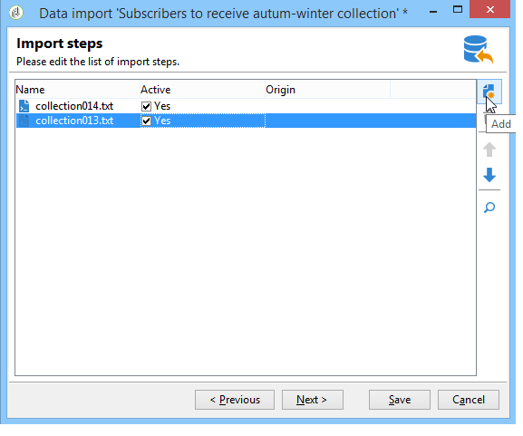
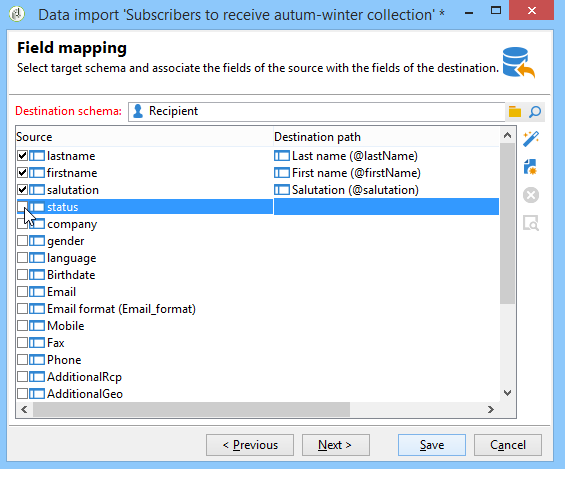

# 데이터 가져오기{#importing-data}

Adobe Campaign을 사용하면 하나 이상의 파일에서 텍스트, CSV, TAB 또는 XML 형식으로 데이터를 데이터베이스로 가져올 수 있습니다. 이러한 파일은 테이블(기본 또는 링크)과 연결되며 소스 파일의 각 필드는 데이터베이스의 필드와 연결됩니다. 가져오기 구성을 다시 사용하기 위해 저장할 수 있으므로 복제 작업을 자동화하는 가져오기 작업을 예약할 수 있습니다.

>[!NOTE]
>
>함수를 사용하여 데이터베이스 데이터와 매핑하지 않고 데이터를 가져올 수 **[!UICONTROL Import a list]** 있습니다.
> 
>그런 다음 **[!UICONTROL Read list]** 개체를 통한 워크플로우에서만 데이터를 사용할 수 있습니다. For more on this, refer to [this page](../../workflow/using/read-list.md).
>
>자세한 내용은 프로필 [가져오기](https://docs.adobe.com/content/help/en/campaign-learn/campaign-classic-tutorials/getting-started/importing-profiles.html) 비디오를 참조하십시오.

## 가져올 데이터 구조 {#structure-of-the-data-to-import}

소스 파일에서 각 줄은 레코드와 일치합니다. 레코드의 데이터는 구분 기호(공백, 탭, 문자 등)로 구분됩니다. 즉, 데이터는 열 형태로 검색되고 각 열은 데이터베이스의 필드와 연결됩니다.

## 가져오기 마법사 {#import-wizard}

가져오기 마법사를 사용하면 가져오기를 구성하고, 해당 옵션(데이터 변형 등)을 정의하고, 실행을 시작할 수 있습니다. 가져오기 유형(단순 또는 다중)과 연산자의 권한에 따라 컨텐츠가 달라지는 일련의 화면입니다.

>[!NOTE]
>
>IIS 웹 서버를 사용하는 경우 대용량 파일(>28MB)을 업로드하는 데 구성이 필요할 수 있습니다.
>
>For more information, refer to [this section](../../installation/using/integration-into-a-web-server-for-windows.md#changing-the-upload-file-size-limit).

### 1단계 - 가져오기 템플릿 선택 {#step-1---choosing-the-import-template}

가져오기 마법사를 시작할 때 먼저 템플릿을 선택해야 합니다. 예를 들어 뉴스레터를 받은 수신자의 가져오기를 구성하려면 아래 단계를 따르십시오.

1. 폴더를 **[!UICONTROL Profiles and Targets > Job > Generic imports and exports]** 선택합니다.
1. 새로 **만들기를** 클릭한 다음 **가져오기를** 클릭하여 가져오기 템플릿을 만듭니다.

   

1. 필드 오른쪽의 화살표를 클릭하여 템플릿을 선택하거나 을 클릭하여 트리를 **[!UICONTROL Import template]** **[!UICONTROL Select link]** 찾습니다.

   기본 템플릿은 **[!UICONTROL New text import]**&#x200B;입니다. 이 템플릿은 수정할 수 없지만, 필요에 따라 새 템플릿을 구성하기 위해 복제할 수 있습니다. 기본적으로 가져오기 템플릿은 **[!UICONTROL Profiles and targets > Templates > Job templates]** 노드에 저장됩니다.

1. 필드에 이 가져오기의 이름을 **[!UICONTROL Label]** 입력합니다. 설명을 추가할 수 있습니다.
1. 해당 필드에서 가져오기 유형을 선택합니다. 다음과 같은 두 가지 유형의 가져오기가 가능합니다.한 **[!UICONTROL Simple import]** 파일만 가져오고 여러 파일을 한 번에 가져올 **[!UICONTROL Multiple import]** 수 있습니다.

   여러 가져오기의 경우 가져오기 마법사의 첫 번째 **[!UICONTROL Multiple import]** 화면에 있는 **[!UICONTROL Import type]** 드롭다운 목록에서 선택합니다.

   

1. 을 클릭하여 가져올 필드를 **[!UICONTROL Add]**&#x200B;지정합니다.

   

   파일이 추가될 때마다 **[!UICONTROL File to import]** 마법사의 화면이 표시됩니다. 섹션 [2단계 - 소스 파일 선택을](#step-2---source-file-selection) 참조하고 마법사의 단계에 따라 간단한 가져오기 옵션을 정의합니다.

   >[!NOTE]
   >
   >다중 가져오기는 특정 요구 사항만 충족해야 하며 권장되지 않습니다.

#### 고급 매개 변수 {#advanced-parameters}

이 **[!UICONTROL Advanced parameters]** 링크를 통해 다음 옵션에 액세스할 수 있습니다.

* **[!UICONTROL General]** tab

   * **[!UICONTROL Stop execution if there are too many rejects]**

      이 옵션은 기본적으로 선택되어 있습니다. 거부 수에 관계없이 가져오기를 계속 수행하려는 경우 선택 취소할 수 있습니다. 기본적으로 처음 100개 줄이 거부되면 실행이 중지됩니다.

   * **[!UICONTROL Trace mode]**

      각 라인에 대한 가져오기 실행을 추적하려면 이 옵션을 선택합니다.

   * **[!UICONTROL Start the job in a detached process]**

      이 옵션은 기본적으로 선택되어 있습니다. 이 기능을 사용하면 데이터베이스의 진행 중인 다른 작업에 영향을 주지 않도록 가져오기 실행을 분리할 수 있습니다.

   * **[!UICONTROL Do not update enumerations]**

      데이터베이스에 열거된 값 목록을 풍성하게 만들지 않으려면 이 옵션을 선택합니다. 열거형 [관리를 참조하십시오](../../platform/using/managing-enumerations.md).

* **[!UICONTROL Variables]** tab

   쿼리 편집기 및 계산된 필드에서 액세스할 수 있는 작업과 연관된 변수를 정의할 수 있습니다. 변수를 만들려면 을 클릭하고 변수 편집기를 **[!UICONTROL Add]** 사용합니다.

   >[!CAUTION]
   >
   >이 **[!UICONTROL Variables]** 탭은 워크플로우 유형 프로그래밍에만 사용되며 전문가 사용자만이 구성해야 합니다.

### 2단계 - 소스 파일 선택 {#step-2---source-file-selection}

소스 파일은 텍스트 형식(txt, csv, tab, fixed columns) 또는 xml일 수 있습니다.

기본적으로 **[!UICONTROL Upload file on the server]** 선택되어 있습니다. 필드 오른쪽에 있는 폴더를 클릭하여 로컬 디스크를 찾고 가져올 파일을 선택합니다. **[!UICONTROL Local file]** 이 옵션을 선택 해제하면 액세스 경로와 가져올 파일의 이름을 서버에 입력할 수 있습니다.

파일이 지정되면 창의 하단 섹션에서 을 클릭하여 해당 데이터를 볼 수 **[!UICONTROL Auto-detect format]**&#x200B;있습니다. 이 미리 보기에는 소스 파일의 처음 200줄이 표시됩니다.

이 보기에서 제공된 옵션을 사용하여 가져오기를 구성합니다. 이러한 옵션을 통해 정의된 매개 변수가 미리 보기로 전송됩니다. 다음 옵션을 사용할 수 있습니다.

* **[!UICONTROL Click here to change the file format...]** 파일 형식을 확인하고 구성을 세밀하게 조정할 수 있습니다.
* **[!UICONTROL Update on server...]** 로컬 파일을 서버로 전송할 수 있습니다. 이 옵션은 **[!UICONTROL Upload file on the server]** 선택한 경우에만 사용할 수 있습니다.
* **[!UICONTROL Download]** 는 파일이 서버에 업로드된 경우에만 사용할 수 있습니다.
* **[!UICONTROL Auto-detect format]** 는 데이터 소스의 형식을 다시 초기화하는 데 사용됩니다. 이 옵션을 사용하면 **[!UICONTROL Click here to change the file format...]** 옵션을 통해 형식이 지정된 데이터에 원본 형식을 다시 적용할 수 있습니다.
* 이 **[!UICONTROL Advanced parameters]** 링크를 사용하면 소스 데이터를 필터링하고 고급 옵션에 액세스할 수 있습니다. 이 화면에서 파일의 일부만 가져오도록 선택할 수 있습니다. 필터를 정의할 수도 있습니다. 예를 들어, 해당 라인의 값에 따라 &#39;Prospect&#39; 또는 &#39;Customer&#39; 유형 사용자만 가져올 수 있습니다. 이러한 옵션은 전문 JavaScript 사용자만 사용해야 합니다.

#### 파일 형식 변경 {#changing-the-file-format}

이 **[!UICONTROL Click here to change the file format...]** 옵션을 사용하면 소스 파일의 데이터 형식을 지정하고, 특히 각 필드에 대한 열 구분 기호와 데이터 유형을 지정할 수 있습니다. 이 구성은 다음 창을 통해 수행됩니다.

이 단계에서는 파일 필드의 값을 읽는 방법을 설명할 수 있습니다. 예를 들어 날짜의 경우 날짜 또는 날짜 + 시간 데이터를 형식(dd/mm/yyyy, mm/dd/yy 등)과 연결할 수 있습니다. 입력 데이터가 예상 형식과 일치하지 않으면 가져오는 동안 거부가 발생합니다.

창의 아래쪽에 있는 미리 보기 영역에서 구성 결과를 볼 수 있습니다.

서식을 **[!UICONTROL OK]** 저장하려면 을 클릭하고 다음 단계를 클릭하여 **[!UICONTROL Next]** 표시합니다.

### 3단계 - 필드 매핑 {#step-3---field-mapping}

그런 다음 대상 스키마를 선택하고 각 열의 데이터를 데이터베이스의 필드에 매핑해야 합니다.

* 이 **[!UICONTROL Destination schema]** 필드를 사용하면 데이터를 가져올 스키마를 선택할 수 있습니다. 이 정보는 필수입니다. 기존 스키마 중 하나를 선택하려면 **[!UICONTROL Select link]** 아이콘을 클릭합니다. 아이콘을 **[!UICONTROL Edit link]** 클릭하여 선택한 테이블의 컨텐츠를 표시합니다.
* 중앙 테이블은 소스 파일에 정의된 모든 필드를 보여줍니다. 대상 파일을 해당 필드와 연결하려면 가져올 필드를 선택합니다. 이러한 필드는 수동으로 또는 자동으로 매핑할 수 있습니다.

   필드를 수동으로 매핑하려면 확인란을 클릭하여 소스 필드를 선택하고 두 번째 열을 클릭하여 선택한 필드에 해당하는 셀을 활성화합니다. 그런 다음 **[!UICONTROL Edit expression]** 아이콘을 클릭하여 현재 표의 모든 필드를 표시합니다. 대상 필드를 선택하고 을 클릭하여 **[!UICONTROL OK]** 매핑의 유효성을 확인합니다.

   소스 필드와 대상 필드를 자동으로 연결하려면 필드 목록 오른쪽에 있는 **[!UICONTROL Guess the destination fields]** 아이콘을 클릭합니다. 필요한 경우 제안된 필드를 수정할 수 있습니다.

   >[!CAUTION]
   >
   >다음 단계로 진행하기 전에 이 작업의 결과를 항상 확인해야 합니다.

* 가져온 필드에 변형을 적용할 수 있습니다. 이렇게 하려면 해당 필드와 관련된 **[!UICONTROL Transformation]** 열의 셀을 클릭하고 적용할 변형을 선택합니다.

   

   >[!CAUTION]
   >
   >가져오면 변환이 적용됩니다. 그러나 위의 예에서 @lastname 필드의 제한 사항이 정의된 경우 이러한 제한 조건이 우선합니다.

* 중앙 테이블 오른쪽에 있는 해당 아이콘을 사용하여 계산된 필드를 추가할 수 있습니다. 계산된 필드를 사용하여 복잡한 변형을 수행하거나, 가상 열을 추가하거나, 여러 열의 데이터를 병합할 수 있습니다. 다양한 가능성에 대한 자세한 내용은 다음 섹션을 참조하십시오.

#### 계산된 필드 {#calculated-fields}

계산된 필드는 소스 파일에 추가되고 다른 열에서 계산된 새 열입니다. 그런 다음 계산된 필드를 Adobe Campaign 데이터베이스의 필드와 연결할 수 있습니다. 하지만 계산된 필드에는 조정 작업을 수행할 수 없습니다.

계산된 필드에는 네 가지 유형이 있습니다.

* **[!UICONTROL Fixed string]**:계산된 필드의 값은 소스 파일의 모든 행에 대해 동일합니다. 삽입되거나 업데이트된 레코드의 필드 값을 설정할 수 있습니다. 예를 들어 가져온 모든 레코드에 대해 마커를 &quot;yes&quot;로 설정할 수 있습니다.
* **[!UICONTROL String with JavaScript tags]**:계산된 필드의 값은 JavaScript 명령을 포함하는 문자열입니다.
* **[!UICONTROL JavaScript expression]**:계산된 필드의 값은 JavaScript 함수 평가의 결과입니다. 반환된 값은 숫자, 날짜 등이 될 수 있습니다.
* **[!UICONTROL Enumeration]**:필드의 값은 소스 파일에 포함된 값에 따라 달라집니다. 편집기에서는 다음 예와 같이 소스 열을 지정하고 열거형 값 목록을 입력할 수 있습니다.

   

   이 **[!UICONTROL Preview]** 탭에서는 정의된 구성의 결과를 볼 수 있습니다. 여기에서 열이 추가되었습니다 **[!UICONTROL Subscription]** . 값은 상태 **필드에서 계산됩니다** .

   

### 4단계 - 조정 {#step-4---reconciliation}

가져오기 마법사의 조정 단계에서는 파일의 데이터를 데이터베이스의 기존 데이터와 조정하는 모드를 정의하고 파일 데이터와 데이터베이스 데이터 간의 우선순위 규칙을 설정할 수 있습니다. 구성 창은 다음과 같습니다.

화면의 중앙 섹션에는 데이터를 가져올 Adobe Campaign 데이터베이스의 필드와 필드가 있는 트리가 있습니다.

각 노드(테이블 또는 필드)에 대해 특수 옵션을 사용할 수 있습니다. 목록에서 해당 노드를 클릭하면 해당 매개 변수와 간단한 설명이 아래에 표시됩니다. 각 요소에 대해 정의된 동작이 해당 **[!UICONTROL Behavior]** 열에 표시됩니다.

#### 작업 유형 {#types-of-operation}

가져오기가 관련된 각 테이블에 대해 작업 유형을 정의해야 합니다. 데이터베이스의 기본 요소에 대해 다음 작업을 사용할 수 있습니다.

* **[!UICONTROL Update or insertion]**:데이터베이스에 있는 경우 레코드를 업데이트하고, 없는 경우 만듭니다.
* **[!UICONTROL Insertion]**:레코드를 데이터베이스에 삽입합니다.
* **[!UICONTROL Update]**:기존 레코드만 업데이트합니다(다른 레코드 무시).
* **[!UICONTROL Reconciliation only]**:데이터베이스에서 레코드를 찾지만 업데이트를 수행하지 않습니다. 예를 들어 폴더의 데이터를 업데이트하지 않고 파일의 열에 따라 가져올 수신자의 폴더를 연결할 수 있습니다.
* **[!UICONTROL Deletion]**:데이터베이스의 레코드를 제거할 수 있습니다.

가져오기로 인해 관련된 테이블의 각 필드에 대해 다음 옵션을 사용할 수 있습니다.

* **[!UICONTROL Update (empty) if source value is empty]**:업데이트 시 소스 파일에서 필드가 비어 있으면 필드의 값이 데이터베이스 값을 제거합니다. 그렇지 않으면 데이터베이스 필드가 유지됩니다.
* **[!UICONTROL Update only if destination is empty]**:데이터베이스 필드가 비어 있지 않으면 소스 파일의 값이 데이터베이스 필드의 값을 덮어쓰지 않습니다. 이 경우 소스 파일의 값이 사용됩니다.
* **[!UICONTROL Update the field only when the record is inserted]**:업데이트 또는 삽입 작업 중에 새 소스 파일 레코드만 가져옵니다.

>[!NOTE]
>
>데이터 중복 제거 없이 삽입하는 경우를 제외하고 조정 키의 정의는 항상 **필수입니다**.

#### 조정 키 {#reconciliation-keys}

중복 제거를 관리하려면 하나 이상의 조정 키를 채워야 합니다.

조정 키는 레코드를 식별하는 데 사용되는 필드 세트입니다. 예를 들어 받는 사람을 가져오기 위해 조정 키는 계정 번호, &quot;이메일&quot; 필드 또는 &quot;성, 이름, 회사&quot; 필드 등이 될 수 있습니다.

이 경우 파일 줄이 데이터베이스의 기존 수신자와 일치하는지 확인하기 위해 가져오기 엔진은 파일의 값을 키의 모든 필드에 대한 데이터베이스 값과 비교합니다. 레코드를 기준으로 필드를 지정할 때 소스 데이터와 대상 데이터 간의 세부적인 비교를 수행하여 가져온 후 데이터의 무결성을 보장합니다. 같은 테이블에 대해 두 번째 조정 키를 입력할 수 있습니다.첫 번째 키가 비어 있는 줄에 사용됩니다.

가져오는 동안 수정할 수 있는 필드를 선택하지 마십시오.이 경우 엔진은 추가 레코드를 만들 수 있습니다.

>[!NOTE]
>
>받는 사람 가져오기의 경우 선택한 폴더의 식별자가 키에 암시적으로 추가됩니다.
>
>따라서 선택한 폴더가 없는 한 이 폴더에서만 조정이 수행됩니다.

#### 중복 제거 {#deduplication}

>[!NOTE]
>
>&#39;double&#39;은 가져올 파일에 두 번 이상 존재하는 항목입니다.
>
>&#39;duplicate&#39;는 가져올 파일과 데이터베이스에 모두 있는 항목입니다.

이 **[!UICONTROL Management of doubles]** 필드를 사용하면 데이터 중복 제거를 구성할 수 있습니다. 데이터 중복 제거와 관련하여 소스 파일 **(또는 여러 파일을 가져오는 경우 소스 파일)** 에 여러 번 나타나는 레코드(예: 조정 키 필드가 동일한 행)가 기록됩니다.

* 중복 관리가 **[!UICONTROL Update]** 모드(기본 모드)에서는 중복 제거를 수행하지 않습니다. 따라서 마지막 레코드에는 우선 순위가 있습니다(이전 레코드의 데이터를 업데이트하기 때문에). 이 모드에서는 중복 수를 계산할 수 없습니다.
* 중복 관리를 **[!UICONTROL Ignore]** 모드에서 수행하거나 **[!UICONTROL Reject entity]** 가져오기에서 중복을 제외합니다. 이 경우 레코드를 가져오지 않습니다.
* 모드에서는 요소를 가져올 수 없으며 가져오기 로그에 오류가 생성됩니다. **[!UICONTROL Reject entity]**
* 모드에서는 요소를 가져올 수 없지만 오류 추적은 유지되지 않습니다. **[!UICONTROL Ignore]** 이 모드를 사용하면 성능을 최적화할 수 있습니다.

>[!CAUTION]
>
>데이터 중복 제거는 메모리에서만 수행됩니다. 따라서 데이터 중복 제거가 있는 가져오기의 크기는 제한됩니다. 제한은 여러 매개 변수(애플리케이션 서버의 용량, 작업, 키의 필드 수 등)에 따라 다릅니다. 데이터 중복 제거의 최대 크기는 1,000,000개 라인입니다.

데이터 중복 제거는 소스 파일과 데이터베이스에 모두 있는 레코드와 관련이 있습니다. 업데이트 전용(예: **[!UICONTROL Update and insertion]** 또는 **[!UICONTROL Update]**) 작업에 대한 문제입니다. 이 **[!UICONTROL Duplicate management]** 옵션을 사용하면 소스 파일과 데이터베이스 모두에 있는 레코드를 업데이트하거나 무시할 수 있습니다. 이 **[!UICONTROL Update or insert based on origin]** 옵션은 옵션 모듈에 속하며 표준 컨텍스트에서 사용할 수 없습니다.

이 옵션은 위에서 설명한 **[!UICONTROL Reject]** 대로 **[!UICONTROL Ignore]** 작동합니다.

#### 오류가 발생한 경우 동작 {#behavior-in-the-event-of-an-error}

대부분의 데이터 전송 작업은 다양한 유형의 오류(일관되지 않은 줄 형식, 잘못된 이메일 주소 등)를 생성합니다. 가져오기 엔진에서 생성된 모든 오류 및 모든 경고는 저장 및 가져오기 인스턴스에 연결됩니다.

이러한 거부 세부 사항은 **[!UICONTROL Rejects]** 탭을 통해 볼 수 있습니다.

두 가지 유형의 거부가 있습니다(유형은 **[!UICONTROL Connector]** 열에 표시됨).

* 텍스트 커넥터의 거부 문제는 파일 라인이 처리되는 동안 발생하는 오류(계산된 필드, 데이터 분석 등)와 관련이 있습니다. 이 경우 오류가 발생하면 전체 줄이 항상 거부됩니다.
* 데이터베이스 커넥터는 데이터 조정 또는 데이터베이스에 쓰는 동안 발생하는 오류에 대해 거부합니다. 여러 테이블로 가져오는 경우, 거부자는 레코드의 일부에만 영향을 줄 수 있습니다(예: 받는 사람 및 관련 이벤트 가져오기의 경우, 오류가 발생하면 수신자를 거부하지 않고 이벤트 업데이트를 방지할 수 있습니다).

데이터 조정 페이지에서 원하는 오류 관리 유형 필드를 필드 및 테이블별로 정의할 수 있습니다.

* **[!UICONTROL Ignore and log a warning]**:오류가 발생한 필드를 제외한 모든 필드를 데이터베이스로 가져옵니다.
* **[!UICONTROL Reject parent element]**:오류가 발생한 필드뿐만 아니라 레코드의 전체 줄이 거부됩니다.
* **[!UICONTROL Reject all elements]**:가져오기가 중지되고 레코드의 모든 요소가 거부됩니다.

   

가져오기 인스턴스의 거부 화면에 있는 트리는 거부된 필드와 오류가 발생한 위치를 나타냅니다.

다음 **[!UICONTROL Export rejects]** 아이콘을 통해 이러한 레코드가 포함된 파일을 생성할 수 있습니다.

### 5단계 - 수신자를 가져올 때의 추가 단계 {#step-5---additional-step-when-importing-recipients}

가져오기 마법사의 다음 단계에서는 데이터를 가져올 폴더를 선택하거나 만들고 가져온 수신자를 새 목록 또는 기존 목록으로 자동 매핑하고 수신자를 서비스에 가입할 수 있습니다.

>[!NOTE]
>
>이 단계는 수신자만 가져올 때와 기본 Adobe Campaign 수신자 테이블(**nms:recipient**)을 사용할 때 나타납니다.

* 링크를 클릭하여 수신자를 연결하거나 가입할 폴더, 목록 또는 서비스를 선택합니다. **[!UICONTROL Edit]**

   1. 폴더로 가져오기

      섹션의 **[!UICONTROL Edit...]** 링크를 사용하면 수신자를 가져올 폴더를 선택하거나 만들 수 **[!UICONTROL Import into a folder]** 있습니다. 기본적으로 파티션이 정의되지 않은 경우 데이터를 연산자의 기본 폴더로 가져옵니다.

      >[!NOTE]
      >
      >연산자의 기본 폴더는 연산자가 쓰기 액세스 권한을 갖는 첫 번째 폴더입니다. 폴더 [액세스 관리를](../../platform/using/access-management.md#folder-access-management)참조하십시오.

      가져오기 폴더를 선택하려면 필드 오른쪽에 있는 화살표를 클릭하고 **[!UICONTROL Folder]** 해당 폴더를 선택합니다. 아이콘을 사용하여 새 창에 트리를 표시하거나 새 폴더를 만들 수도 있습니다. **[!UICONTROL Select link]**

      

      새 폴더를 만들려면 폴더를 추가할 노드를 선택하고 마우스 오른쪽 단추를 클릭합니다. 을 **[!UICONTROL Create a new 'Recipients' folder]**&#x200B;선택합니다.

      

      폴더가 현재 노드 아래에 추가됩니다. 새 폴더의 이름을 입력하고 Enter 키를 눌러 확인한 다음 을 클릭합니다 **[!UICONTROL OK]**.

      

   1. 목록에 연결

      섹션의 **[!UICONTROL Edit...]** 링크를 사용하면 수신자를 가져올 목록을 선택하거나 만들 수 **[!UICONTROL Add recipients to a list]** 있습니다.

      

      아이콘을 **[!UICONTROL Select link]**&#x200B;클릭한 다음 이 수신자의 새 목록을 만들 수 **[!UICONTROL Create]**&#x200B;있습니다. 목록 만들기 및 관리는 목록 만들기 및 [관리에](../../platform/using/creating-and-managing-lists.md)표시됩니다.

      

      목록에 이미 있는 수신자에 수신자를 추가하거나 새 수신자와 함께 목록을 다시 만들 수 있습니다. 이 경우 목록에 이미 수신자가 포함되어 있으면 해당 수신자는 삭제되고 가져온 수신자로 대체됩니다.

   1. 서비스 가입

      가져온 받는 사람을 모두 정보 서비스에 가입하려면 해당 **[!UICONTROL Edit...]** 섹션의 **[!UICONTROL Subscribe recipients to a service]** 링크를 클릭하여 받는 사람이 가입할 정보 서비스를 선택하거나 만듭니다. 다음 **[!UICONTROL Send a confirmation message]** 옵션을 선택할 수 있습니다.이 메시지의 컨텐트는 구독 서비스와 관련된 배달 템플릿에서 정의됩니다.

      

      아이콘을 클릭한 **[!UICONTROL Select link]** 다음 아이콘을 클릭하여 이러한 수신자에 대한 새 서비스를 만들 수 **[!UICONTROL Create]** 있습니다. 정보 서비스 관리는 [이 섹션에](../../delivery/using/managing-subscriptions.md)나와 있습니다.

* 이 **[!UICONTROL Origin]** 필드를 사용하여 수신자의 프로필에 수신자의 원본에 대한 정보를 추가합니다. 이 정보는 여러 가져오기의 프레임워크 내에서 특히 유용합니다.

이 **[!UICONTROL Next]** 단계의 유효성을 확인하고 다음 단계를 표시하려면 을(를) 클릭합니다.

### 6단계 - 가져오기 시작 {#step-6---launching-the-import}

마법사의 마지막 단계에서는 데이터 가져오기를 시작할 수 있습니다. 이렇게 하려면 **[!UICONTROL Start]** 단추를 클릭합니다.

### 작업 상태 {#job-statuses}

작업 상태는 작업의 현재 상태를 나타냅니다. 각 상태는 특수 아이콘과 레이블로 표시됩니다. 이 정보는 작업 목록에 표시됩니다. 상태 및 아이콘은 다음과 같습니다.

* **편집 진행 중**

   작업을 만드는 중입니다.

* **실행 중**

   작업이 실행 중입니다.

* **취소**

   다음 **[!UICONTROL Cancel]** 단추를 클릭합니다.진행 중인 작업이 취소되었습니다.

* **취소 진행 중**

   취소 명령이 고려되었으며 작업이 취소되고 있습니다.

* **일시 중지 진행 중**

   다음을 **[!UICONTROL Pause]**&#x200B;클릭합니다.작업이 일시 중단됩니다.

* **일시 중지됨**

   다음을 **[!UICONTROL Pause]**&#x200B;클릭합니다.작업이 일시 중단되었습니다. 을 클릭하여 다시 시작할 수 **[!UICONTROL Start]**&#x200B;있습니다.

* **완료**

   작업 실행이 완료되었습니다.

* **오류 발생 시 완료**

   기술 오류로 인해 작업이 실행되지 않았습니다.

* **서버 종료 진행 중**

   Adobe Campaign 서버가 종료되어 진행 중인 작업이 중단됩니다.

## 일반 가져오기 샘플 {#generic-import-samples}

### 예:수신자 목록에서 가져오기 {#example--import-from-a-list-of-recipients}

목록 개요에서 받는 사람 목록을 만들고 제공하려면 다음 단계를 적용합니다.

1. 목록 만들기

   * Adobe Campaign 홈 페이지의 **[!UICONTROL Lists]** **[!UICONTROL Profiles and targets]** 메뉴에서 링크를 클릭합니다.
   * 을 **[!UICONTROL Create]** 클릭한 다음 **[!UICONTROL Import a list]** 단추를 클릭합니다.

1. 가져올 파일 선택

   필드 오른쪽의 폴더를 클릭하고 가져올 목록이 들어 있는 파일을 선택합니다. **[!UICONTROL Local file]**

   

1. 목록 이름 및 저장소

   목록의 이름을 입력하고 저장할 디렉토리를 선택합니다.

   

1. 가져오기 시작

   을 **[!UICONTROL Next]** 클릭한 다음 목록 가져오기를 **[!UICONTROL Start]** 시작합니다.

   

### 예:텍스트 파일에서 새 레코드 가져오기 {#example--import-new-records-from-a-text-file-}

텍스트 파일에 저장된 새 수신자 프로필을 Adobe Campaign 데이터베이스로 가져오려면 다음 단계를 수행하십시오.

1. 템플릿 선택

   * Adobe Campaign 홈 페이지에서 링크를 클릭한 다음 **[!UICONTROL Profiles and targets]** 링크를 클릭합니다 **[!UICONTROL Jobs]**. 작업 목록 위에서 을 클릭합니다 **[!UICONTROL New import]**.
   * 기본적으로 템플릿을 선택된 상태로 유지합니다 **[!UICONTROL New text import]** .
   * 레이블과 설명을 변경합니다.
   * 을 **[!UICONTROL Simple import]**&#x200B;선택합니다.
   * 기본 작업 폴더를 유지합니다.
   * 을 **[!UICONTROL Advanced parameters]** 클릭하고 **[!UICONTROL Tracking mode]** 옵션을 선택하여 실행하는 동안 가져오기 세부 사항을 봅니다.

1. 가져올 파일 선택

   필드 오른쪽에 있는 폴더를 클릭하고 가져올 파일을 **[!UICONTROL Local file]** 선택합니다.

   

1. 필드 연결

   소스 및 대상 스키마를 자동으로 매핑하려면 **[!UICONTROL Guess the destination fields]** 아이콘을 클릭합니다. 을 클릭하기 전에 이 창의 정보를 확인하십시오 **[!UICONTROL Next]**.

   

1. 조정

   * 수신자( **nms:recipient)** 테이블로 이동합니다.
   * 작업을 **[!UICONTROL Insertion]** 선택하고 다른 필드에 기본값을 그대로 둡니다.

      

1. 받는 사람 가져오기

   * 필요한 경우 가져올 레코드에 대한 폴더를 지정합니다.

      

1. 가져오기 시작

   * 클릭 **[!UICONTROL Start]**.

      편집기의 중앙 영역에서 가져오기 작업이 성공했는지 확인하고 처리된 레코드 수를 볼 수 있습니다.

      

      이 **[!UICONTROL Tracking]** 모드를 사용하면 소스 파일의 각 레코드에 대한 가져오기 세부 정보를 추적할 수 있습니다. 이렇게 하려면 홈 페이지에서 **[!UICONTROL Profiles and Targets]** 관련 가져오기를 **[!UICONTROL Processes]**&#x200B;선택하고 **[!UICONTROL General]**&#x200B;탭과 **[!UICONTROL Journal]** 탭을 **[!UICONTROL Rejects]** 조회합니다.

      * 가져오기 진행 상태 확인

         

      * 각 레코드에 대한 프로세스 보기

         

### 예:수신자 업데이트 및 삽입 {#example--update-and-insert-recipients}

데이터베이스의 기존 레코드를 업데이트하고 텍스트 파일에서 새 레코드를 생성하려고 합니다. 다음은 절차의 예입니다.

1. 템플릿 선택

   위의 예 2에 설명된 단계를 반복합니다.

1. 가져올 파일

   가져올 파일을 선택합니다.

   이 예제에서는 파일의 첫 번째 행에 대한 개요를 통해 파일이 세 개의 레코드 및 레코드 생성에 대한 업데이트를 포함하고 있음을 보여 줍니다.

   

1. 필드 연결

   위의 예 2에서 절차를 적용합니다.

1. 조정

   * 기본적으로 선택된 상태로 **[!UICONTROL Update or insert]** 유지됩니다.
   * 데이터베이스의 기존 레코드가 텍스트 파일의 데이터로 수정되도록 옵션을 **[!UICONTROL Management of duplicates]****[!UICONTROL Update]** 모드로 유지합니다.
   * 필드를 **[!UICONTROL Birth date]**&#x200B;선택하고 **[!UICONTROL Name]** 조정 **[!UICONTROL Company]** 키를 지정합니다.

      

1. 가져오기 시작

   * 클릭 **[!UICONTROL Start]**.

      추적 창에서 가져오기가 성공했는지 확인하고 처리된 레코드 수를 볼 수 있습니다.

      

   * 받는 사람 테이블을 확인하여 이 작업으로 레코드가 수정되었는지 확인합니다.

      

### 예:외부 파일의 값을 보강합니다. {#example--enrich-the-values-with-those-of-an-external-file}

데이터베이스 테이블의 특정 필드를 텍스트 파일에서 수정하여 데이터베이스에 포함된 값에 우선 순위를 지정합니다.

이 예제에서는 텍스트 파일의 특정 필드에 값이 있는 반면 데이터베이스의 해당 필드는 비어 있는 것을 확인할 수 있습니다. 다른 필드에는 데이터베이스에 포함된 값과 다른 값이 들어 있습니다.

* 가져올 텍스트 파일의 컨텐츠입니다.

   

* 가져오기 전 데이터베이스 상태

   

다음 단계를 적용합니다.

1. 템플릿 선택

   위의 예 2에서 절차를 적용합니다.

1. 가져올 파일

   가져올 파일을 선택합니다.

1. 필드 연결

   위의 예 2에서 절차를 적용합니다.

   파일의 첫 번째 줄의 미리 보기에서는 파일에 특정 레코드에 대한 업데이트가 포함되어 있음을 확인할 수 있습니다.

1. 조정

   * 테이블로 이동하여 **[!UICONTROL Update]** 작업을 선택합니다.
   * 필드의 옵션을 **[!UICONTROL Reject entity]** 선택합니다 **[!UICONTROL Management of doubles]** .
   * 데이터베이스의 기존 레코드가 텍스트 파일의 데이터로 수정되도록 옵션을 **[!UICONTROL Management of duplicates]****[!UICONTROL Update]** 모드로 유지합니다.
   * 노드에 커서를 놓고 **[!UICONTROL Last name (@lastName)]** **[!UICONTROL Update only if destination is empty]** 옵션을 선택합니다.
   * 노드에 대해 이 작업을 **[!UICONTROL Company (@company)]** 반복합니다.
   * 필드에 조정 키를 **[!UICONTROL Birth date]**&#x200B;지정하고 **[!UICONTROL E-mail]** 을 **[!UICONTROL First name]**&#x200B;지정합니다.

      

1. 가져오기 시작

   클릭 **[!UICONTROL Start]**.

   받는 사람 테이블을 확인하여 가져오기에 의해 레코드가 수정되었는지 확인합니다.

   

   비어 있던 값만 텍스트 파일의 값으로 대체되었지만 데이터베이스의 기존 값을 가져오기 파일의 값으로 덮어쓰지 않았습니다.

### 예:외부 파일의 값을 업데이트하여 강화 {#example--update-and-enrich-the-values-from-those-in-an-external-file}

텍스트 파일에서 데이터베이스 테이블의 특정 필드를 수정하여 텍스트 파일에 포함된 값에 우선 순위를 두고자 합니다.

이 예에서는 텍스트 파일의 특정 필드에 빈 값이 있는 반면 데이터베이스의 해당 필드는 비어 있지 않은 것을 확인할 수 있습니다. 다른 필드에는 데이터베이스의 값과 다른 값이 들어 있습니다.

* 가져올 텍스트 파일의 컨텐츠입니다.

   

* 가져오기 전 데이터베이스 상태

   

1. 템플릿 선택

   위의 예 2에서 절차를 적용합니다.

1. 가져올 파일

   가져올 파일을 선택합니다.

   파일의 첫 번째 줄의 미리 보기에서는 파일에 특정 레코드에 대한 빈 필드와 업데이트가 포함되어 있음을 확인할 수 있습니다.

1. 필드 연결

   위의 예 2에서 절차를 적용합니다.

1. 조정

   * 테이블로 이동하여 **[!UICONTROL Update]**&#x200B;선택합니다.
   * 필드의 옵션을 **[!UICONTROL Reject entity]** 선택합니다 **[!UICONTROL Management of doubles]** .
   * 데이터베이스의 기존 레코드를 텍스트 파일의 데이터로 수정하기 위한 옵션을 **[!UICONTROL Management of duplicates]** 모드로 **[!UICONTROL Update]** 둡니다.
   * 노드에 커서를 놓고 **[!UICONTROL Account number (@account)]** 옵션을 선택합니다 **[!UICONTROL Take empty values into account]**.
   * 필드를 **[!UICONTROL Birth date]**&#x200B;선택하고 **[!UICONTROL E-mail]** 조정 **[!UICONTROL First name]** 키를 지정합니다.

      

1. 가져오기 시작

   * 클릭 **[!UICONTROL Start]**.
   * 받는 사람 테이블을 확인하여 작업이 레코드를 수정했는지 확인합니다.

      

      비어 있던 텍스트 파일의 값이 데이터베이스의 값을 덮어씁니다. 데이터베이스의 기존 값이 4단계에서 중복으로 선택된 **[!UICONTROL Update]** 옵션과 함께 가져오기 파일의 값으로 업데이트되었습니다.

## 워크플로우에서 데이터 가져오기 {#importing-data-from-a-workflow}

워크플로우는 일부 가져오기 프로세스를 자동화하는 유용한 방법입니다. 로컬 파일 또는 SFTP에서 데이터를 가져오더라도 워크플로우를 사용하여 데이터 관리 절차를 표준화할 수 있습니다.

워크플로우에서 데이터를 가져오는 방법에 대한 자세한 내용은 [이 섹션을](../../workflow/using/importing-data.md)참조하십시오.
