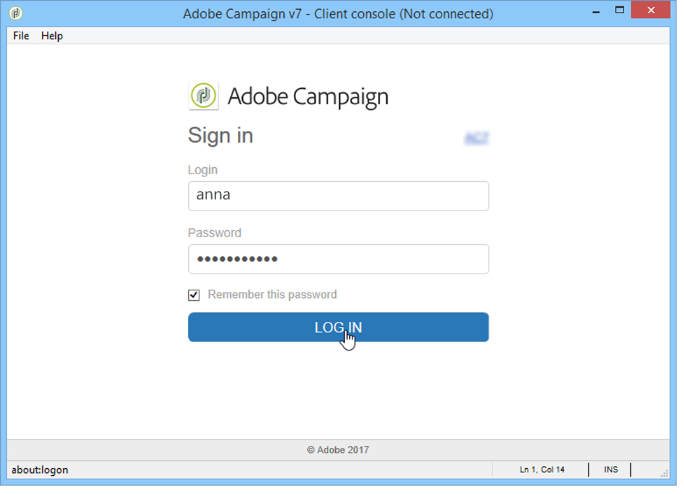

# Adobe Campaign 시작{#launching-adobe-campaign}

## Adobe Campaign 시작 {#starting-adobe-campaign}

을 선택하여 Adobe Campaign을 시작할 수 **[!UICONTROL Start / All Programs / Adobe Campaign v.X / Adobe Campaign client console]**&#x200B;있습니다.

클라이언트 콘솔 연결 창에서 기존 데이터베이스를 선택하거나 구성하고 사용자 이름과 암호를 사용하여 데이터베이스에 연결할 수 있습니다.

## Adobe Campaign에 연결 {#connecting-to-adobe-campaign}

Adobe ID 파섹 For more on this, refer to [this page](../../integrations/using/about-adobe-id.md).

전용 로그인/암호와 연결할 수도 있습니다.

1. 필드에 연산자 계정 식별자를 **[!UICONTROL login]** 입력합니다.

   식별자는 Adobe Campaign 플랫폼 관리자가 제공합니다.

1. 필드에 암호를 **[!UICONTROL Password]** 입력합니다.

   데이터베이스에 처음 액세스할 때 암호는 관리자가 사용자에게 부여하는 암호입니다. 인터넷에 연결되면 **[!UICONTROL Tools > Change password...]** 메뉴를 통해 암호를 변경할 수 있습니다. 연산자 및 연결에 대한 자세한 내용은 액세스 [관리에서](../../platform/using/access-management.md)확인할 수 있습니다.

1. 을 **[!UICONTROL Log in]** 클릭하여 확인합니다.

이제 Adobe Campaign 작업 [영역에](../../platform/using/adobe-campaign-workspace.md)액세스할 수 있습니다.

## 연결 설정 {#setting-up-connections}

입력 영역 위의 링크를 통해 서버 연결 설정에 액세스할 수 있습니다.

창에서 **[!UICONTROL Connections]** 을 클릭합니다 **[!UICONTROL Add > Connection]**.

그런 다음 연결 설정을 정의해야 합니다. 이렇게 하려면:

* 데이터베이스 연결에 **[!UICONTROL Label]** 이름을 지정할 을 입력합니다.
* 응용 프로그램 서버의 주소를 **[!UICONTROL URL]** 필드에 추가합니다. 연결 URL을 모르는 경우 관리자에게 문의하십시오.
* Adobe ID를 사용하여 콘솔에 연결할 연산자가 있는지 **[!UICONTROL Connect with an Adobe ID]** 확인합니다. For more on this, refer to [this page](../../integrations/using/about-adobe-id.md).
* 을 **[!UICONTROL OK]** 클릭하여 유효성을 확인합니다.

>[!NOTE]
>
>이 **[!UICONTROL Add]** 단추를 사용하면 모든 연결을 구성할 **[!UICONTROL folders]** 수 있습니다. 각 연결을 하나의 폴더로 드래그하여 놓으면 됩니다.

## 연산자 및 권한 {#operators-and-permissions}

소프트웨어에 대한 액세스 권한과 해당 권한이 있는 연산자의 식별자 및 암호는 Adobe Campaign 트리의 **[!UICONTROL Administration > Access management > Operators]** 노드에 있는 Adobe Campaign 시스템 관리자가 정의합니다.

이 기능은 액세스 [관리](../../platform/using/access-management.md) 섹션에 자세히 설명되어 있습니다.

## Adobe Campaign에서 연결 끊기 {#disconnecting-from-adobe-campaign}

Adobe Campaign과 연결을 끊으려면 아이콘 막대의 첫 번째 아이콘을 사용합니다.

>[!NOTE]
>
>먼저 로그오프하지 않고 응용 프로그램을 닫을 수도 있습니다.

## 캠페인 버전 가져오기 {#getting-your-campaign-version}

이 **[!UICONTROL Help > About...]** 메뉴에서는 다음 정보에 액세스할 수 있습니다.

* **버전** 번호,
* **빌드** 번호,
* adobe Campaign 지원에 문의하는 링크입니다.

   >[!CAUTION]
   >
   >Adobe 지원 팀에 문의할 때마다 버전 번호와 Campaign 클라이언트 콘솔 및 애플리케이션 서버의 빌드 번호를 제공해야 합니다.

