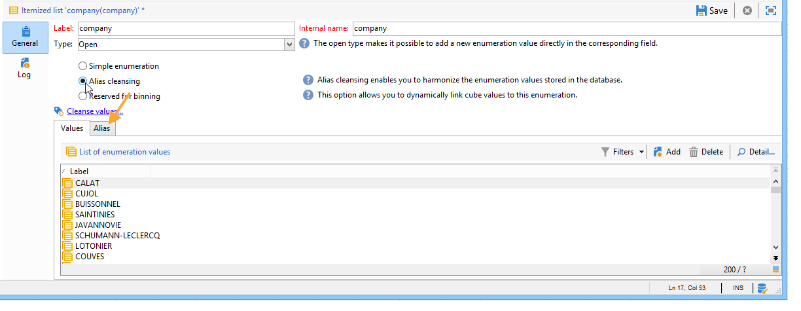

# 열거형 관리{#managing-enumerations}

## 열거형 정보 {#about-enumerations}

열거형(&#39;항목별 목록&#39;이라고도 함)은 특정 필드를 채우도록 시스템에서 제안하는 값의 목록입니다. 열거형을 사용하면 이러한 필드의 값을 표준화할 수 있고 데이터 입력 또는 쿼리 내에서 사용할 수 있습니다.

값 목록은 필드에 입력할 값을 선택할 수 있는 드롭다운 목록으로 나타납니다. 또한 드롭다운 목록을 사용하면 연산자가 처음 몇 개의 문자를 입력하고 애플리케이션이 나머지 문자를 채우는 예측 입력을 사용할 수 있습니다.

일부 콘솔 필드가 이 유형의 열거형으로 정의되었습니다. 해당 필드에 직접 입력하여 값을 추가할 수 있는 경우 열거형을 &quot;open&quot;이라고 합니다.

## 값 액세스 {#access-to-values}

이 유형의 필드에 대한 값이 정의되고 이 필드의 전체 관리(값 추가/삭제)가 트리의 **[!UICONTROL Administration > Platform > Enumerations]** 노드를 통해 수행됩니다.

* 상단 섹션에서는 항목별 목록이 정의된 필드 목록을 제공합니다.
* 아래 섹션에는 제안된 값이 나열됩니다. 이러한 값은 이 필드를 사용하는 편집기에서 반복됩니다.

   

   새 열거형 값을 만들려면 을 **[!UICONTROL Add]**&#x200B;클릭합니다.

   

   이 **[!UICONTROL Open]** 옵션을 선택하면 사용자는 해당 필드에 직접 새 항목별 목록 값을 추가할 수 있습니다. 확인 메시지를 통해 이 값을 만들 수 있습니다.

   

* 이 **[!UICONTROL Closed]** 옵션을 선택하면 사용자는 새 값을 만들 수 없지만 사용 가능한 값들 중에서 선택하기만 하면 됩니다.

## 데이터 표준화 {#standardizing-data}

### 별칭 정리 정보 {#about-alias-cleansing}

항목별 목록 필드에 열거형 값 이외의 값을 입력할 수 있습니다. 이러한 항목은 그대로 저장되거나 깨끗해질 수 있습니다.

>[!CAUTION]
>
>데이터 청소는 데이터베이스의 데이터에 영향을 주는 중요한 프로세스입니다. Adobe Campaign은 대량 데이터 업데이트를 실행하므로 일부 값이 삭제될 수 있습니다. 따라서 이 작업은 전문가 사용자용으로 예약되어 있습니다.

입력한 값은 다음 중 하나입니다.

* 항목별 목록 값에 추가되었습니다.이 경우 옵션을 선택해야 **[!UICONTROL Open]** 합니다.
* 또는 해당 별칭으로 자동 대체됩니다.이 경우 이 경우를 항목별 목록의 **[!UICONTROL Alias]** 탭에서 정의해야 합니다.
* 또는 별칭 목록에 저장됩니다.별칭이 나중에 할당됩니다.

   >[!NOTE]
   >
   >데이터 정리 기능을 사용해야 하는 경우 항목별 목록에서 **[!UICONTROL Alias cleansing]** 옵션을 선택합니다.

### 별칭 사용 {#using-aliases}

이 옵션을 **[!UICONTROL Alias cleansing]** 사용하면 선택한 항목별 목록에 대해 별칭을 사용할 수 있습니다. 이 옵션을 선택하면 창의 아래쪽에 **[!UICONTROL Alias]** 탭이 표시됩니다.

#### 별칭 만들기 {#creating-an-alias}

별칭을 만들려면 을 클릭합니다 **[!UICONTROL Add]**.

변환할 별칭과 적용할 값을 입력하고 **[!UICONTROL Ok]**&#x200B;클릭합니다.

이 작업을 확인하기 전에 매개 변수를 확인하십시오.

>[!CAUTION]
>
>이 단계가 확인되면 이전에 입력한 값은 복구할 수 없습니다.교체되었습니다.

따라서 사용자가 &quot;회사&quot; 필드( **Adobe** Campaign 콘솔 또는 양식)에 NEILSEN 값을 입력하면 NIELSEN Ltd 값으로 자동으로 **대체됩니다**. 값 대체는 별칭 **정리** 워크플로우에 의해 수행됩니다. 데이터 [정리](#running-data-cleansing)실행을 참조하십시오.

#### 값을 별칭으로 변환 {#converting-values-into-aliases}

열거형 값을 별칭으로 변환하려면 값 목록을 마우스 오른쪽 단추로 클릭하고 **[!UICONTROL Convert values into aliases...]**&#x200B;선택합니다.

변환할 값을 선택하고 클릭합니다 **[!UICONTROL Next]**.

을 **[!UICONTROL Start]** 클릭하여 변환을 실행합니다.

실행이 완료되면 별칭이 별칭 목록에 추가됩니다.

#### 별칭 히트 검색 {#retrieving-alias-hits}

사용자가 입력한 값을 별칭으로 변환할 수 있습니다. 실제로 사용자가 항목별 목록에 포함되지 않은 값을 입력하면 이 값은 **[!UICONTROL Alias]** 탭에 저장됩니다.

별칭 **정리** 기술 워크플로우는 매일 밤 이러한 값을 복구하여 항목별 목록을 업데이트합니다. 데이터 정리 [실행을 참조하십시오.](#running-data-cleansing)

필요한 경우 이 값을 입력한 횟수를 열에 표시할 수 **[!UICONTROL Hits]** 있습니다. 이 값을 계산하면 시간과 메모리가 모두 소모될 수 있습니다. 자세한 내용은 입력 발생 [계산을](#calculating-entry-occurrences)참조하십시오.

### 데이터 정리 실행 {#running-data-cleansing}

데이터 청소는 **[!UICONTROL Alias cleansing]** 기술 워크플로우에 의해 수행됩니다. 열거형에 대해 정의된 구성이 실행 중에 적용됩니다. 별칭 [정리 워크플로우를](#alias-cleansing-workflow)참조하십시오.

지우기는 **[!UICONTROL Cleanse values...]** 링크를 통해 트리거될 수 있습니다.

이 **[!UICONTROL Advanced parameters...]** 링크를 사용하면 수집된 값을 고려하기 시작하는 날짜를 설정할 수 있습니다.

데이터 정리를 실행하려면 **[!UICONTROL Start]** 단추를 클릭합니다.

#### 응모 발생 계산 {#calculating-entry-occurrences}

항목별 목록의 **[!UICONTROL Alias]** 하위 탭에는 입력한 모든 값 중 별칭이 발생한 횟수를 표시할 수 있습니다. 이 정보는 예상 정보로 **[!UICONTROL Hits]** 열에 표시됩니다.

>[!CAUTION]
>
>별칭 항목 발생 수를 계산하는 데 시간이 오래 걸릴 수 있습니다. 따라서 이 기능을 사용할 때는 주의해야 합니다.

링크를 통해 히트 계산을 수동으로 실행할 수 **[!UICONTROL Cleanse values...]** 있습니다. 이렇게 하려면 **[!UICONTROL Advanced parameters...]** 링크를 클릭하고 원하는 옵션을 선택합니다.

* **[!UICONTROL Update the number of alias hits]**:이렇게 하면 입력한 날짜를 기준으로 이미 계산된 히트를 업데이트할 수 있습니다.
* **[!UICONTROL Recalculate the number of alias hits from the start]**:전체 Adobe Campaign 플랫폼에서 계산을 실행할 수 있습니다.

예를 들어 주당 한 번씩 특정 기간 동안 계산이 자동으로 실행되도록 전용 워크플로우를 만들 수도 있습니다.

이렇게 하려면 **[!UICONTROL Alias cleansing]** 워크플로우의 사본을 만들고 스케줄러를 변경하고 **[!UICONTROL Enumeration value cleansing]** 활동에서 다음 설정을 사용합니다.

* **-update** 별칭 히트 수를 업데이트하는 히트
* **-updateHits:full** - 모든 별칭 히트를 재계산하는 데 사용됩니다.

#### 별칭 정리 워크플로우 {#alias-cleansing-workflow}

별칭 **정리** 워크플로우는 열거형 값 정리를 실행합니다. 기본적으로 매일 실행됩니다.

노드를 통해 액세스할 수 **[!UICONTROL Administration > Production > Technical workflows]** 있습니다.

