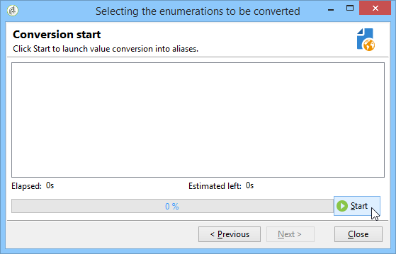

# 열거형 관리{#managing-enumerations}

열거형(&#39;항목별 목록&#39;이라고도 함)은 특정 필드를 채우기 위해 시스템에서 제안하는 값 목록입니다. 열거형을 사용하면 이러한 필드의 값을 표준화하고 데이터 입력 또는 쿼리 내에서 사용할 수 있습니다.

값 목록이 드롭다운 목록으로 나타납니다. 이 목록에서 필드에 입력할 값을 선택할 수 있습니다. 또한 드롭다운 목록을 사용하면 연산자가 첫 번째 몇 개의 문자를 입력하고 나머지 문자를 애플리케이션에서 채우는 예측 입력을 사용할 수 있습니다.

일부 콘솔 필드가 이 형식의 열거형으로 정의되어 있습니다. 해당 필드에 직접 입력하여 값을 추가할 수 있는 경우 열거형을 &quot;open&quot;이라고 합니다.

## 값에 대한 액세스 {#access-to-values}

이 유형의 필드에 대한 값이 정의되며, 이러한 필드의 전체 관리(값 추가/삭제)는 **[!UICONTROL Administration > Platform > Enumerations]** 노드 아래에 있어야 합니다.

* 상단 섹션에는 항목 목록이 정의된 필드 목록이 제공됩니다.
* 아래 섹션에는 제안된 값이 나열됩니다. 이러한 값은 이 필드를 사용하는 편집기에서 반복됩니다.

   

   새 열거형 값을 만들려면 **[!UICONTROL Add]**.

   

   만약 **[!UICONTROL Open]** 옵션을 선택하면 사용자가 해당 필드에 직접 새 항목 목록 값을 추가할 수 있습니다. 확인 메시지를 통해 이 값을 만들 수 있습니다.

   

* 만약 **[!UICONTROL Closed]** 옵션을 선택하면 사용자가 새 값을 만들 수 없지만 사용 가능한 값 중에서 선택할 수 있습니다.

## 데이터 표준화 {#standardizing-data}

### 별칭 정리 정보 {#about-alias-cleansing}

항목별 목록 필드에 열거형 값 이외의 값을 입력할 수 있습니다. 이러한 데이터는 그대로 저장되거나 깨끗해질 수 있습니다.

>[!CAUTION]
>
>데이터 청소는 데이터베이스의 데이터에 영향을 주는 중요한 프로세스입니다. Adobe Campaign은 대량 데이터 업데이트를 수행하므로 일부 값이 삭제될 수 있습니다. 따라서 이 작업은 전문가 사용자를 위해 예약되어 있습니다.

입력한 값이 다음 중 하나입니다.

* 항목화된 목록 값에 추가됩니다. 이 경우 **[!UICONTROL Open]** 옵션을 선택해야 합니다.
* 또는 해당 별칭으로 자동 대체됩니다. 이 경우 다음과 같이 이 사례를 정의해야 합니다 **[!UICONTROL Alias]** 항목 목록 탭,
* 또는 는 별칭 목록에 저장됩니다. 나중에 별칭을 할당할 수 있습니다.

   >[!NOTE]
   >
   >데이터 정리 기능을 사용해야 하는 경우 **[!UICONTROL Alias cleansing]** 옵션을 선택합니다.

### 별칭 사용 {#using-aliases}

옵션 **[!UICONTROL Alias cleansing]** 을 사용하면 선택한 항목별 목록에 별칭을 사용할 수 있습니다. 이 옵션을 선택하면 **[!UICONTROL Alias]** 창의 아래쪽에 탭이 표시됩니다.

#### 별칭 만들기 {#creating-an-alias}

별칭을 만들려면 **[!UICONTROL Add]**.

변환할 별칭과 적용할 값을 입력하고 **[!UICONTROL Ok]**.

이 작업을 확인하기 전에 매개 변수를 확인하십시오.

>[!CAUTION]
>
>이 단계가 확인되면 이전에 입력한 값을 복구할 수 없습니다. 교체되었습니다.

따라서 사용자가 값을 입력할 때 **닐센** 회사 필드(Adobe Campaign 콘솔 또는 양식)에서는 자동으로 값으로 대체됩니다 **NIELSEN Ltd**. 값은 **별칭 정리** 워크플로우. 을(를) 참조하십시오. [데이터 정리 실행](#running-data-cleansing).

#### 값을 별칭으로 변환 {#converting-values-into-aliases}

열거형 값을 별칭으로 변환하려면 값 목록을 마우스 오른쪽 단추로 클릭하고 **[!UICONTROL Convert values into aliases...]**.

변환할 값을 선택하고 **[!UICONTROL Next]**.

클릭 **[!UICONTROL Start]** 변환 실행

실행이 완료되면 별칭이 별칭 목록에 추가됩니다.

#### 별칭 히트 검색 {#retrieving-alias-hits}

사용자가 입력한 값을 별칭으로 변환할 수 있습니다. 따라서 사용자가 항목별 목록에 포함되지 않은 값을 입력하면 값이 **[!UICONTROL Alias]** 탭.

다음 **별칭 정리** 기술 워크플로우는 항목별 목록을 업데이트하기 위해 매일 밤 이러한 값을 복구합니다. 을(를) 참조하십시오. [데이터 정리 실행](#running-data-cleansing)

필요한 경우 **[!UICONTROL Hits]** 열에는 이 값이 입력된 횟수를 표시할 수 있습니다. 이 값을 계산하면 시간과 메모리가 모두 소모될 수 있습니다. 자세한 내용은 [항목 발생 계산](#calculating-entry-occurrences).

### 데이터 정리 실행 {#running-data-cleansing}

데이터 정리는 **[!UICONTROL Alias cleansing]** 기술 워크플로우입니다. 열거형에 대해 정의된 구성은 실행 중에 적용됩니다. 을(를) 참조하십시오. [별칭 정리 워크플로우](#alias-cleansing-workflow).

클렌징은 **[!UICONTROL Cleanse values...]** 링크를 클릭합니다.

다음 **[!UICONTROL Advanced parameters...]** 링크를 사용하면 수집된 값을 고려하는 시작일을 설정할 수 있습니다.

을(를) 클릭합니다. **[!UICONTROL Start]** 데이터 정리 실행 단추.

#### 항목 발생 계산 {#calculating-entry-occurrences}

다음 **[!UICONTROL Alias]** 항목별 목록의 하위 탭에는 입력한 모든 값 중에서 별칭 발생 횟수가 표시될 수 있습니다. 이 정보는 추정치이며 **[!UICONTROL Hits]** 열.

>[!CAUTION]
>
>별칭 항목 발생 수를 계산하는 데 시간이 오래 걸릴 수 있습니다. 따라서 이 기능을 사용할 때는 주의해야 합니다.

를 통해 수동으로 히트 계산을 실행할 수 있습니다 **[!UICONTROL Cleanse values...]** 링크를 클릭합니다. 이렇게 하려면 **[!UICONTROL Advanced parameters...]** 를 클릭하고 원하는 옵션을 선택합니다.

* **[!UICONTROL Update the number of alias hits]**: 이렇게 하면 입력한 날짜를 기준으로 이미 계산된 히트를 업데이트할 수 있습니다.
* **[!UICONTROL Recalculate the number of alias hits from the start]**: 전체 Adobe Campaign 플랫폼에서 계산을 실행할 수 있습니다.

예를 들어 일주일에 한 번, 지정한 기간 동안 계산이 자동으로 실행되도록 전용 워크플로우를 만들 수도 있습니다.

이렇게 하려면 복사본을 만듭니다 **[!UICONTROL Alias cleansing]** 워크플로우에서 스케줄러를 변경하고, **[!UICONTROL Enumeration value cleansing]** 활동:

* **-updateHits** 별칭 히트 수를 업데이트하려면
* **-updateHits:full** 모든 별칭 히트를 재계산하려면

#### 별칭 정리 워크플로우 {#alias-cleansing-workflow}

다음 **별칭 정리** 워크플로우는 열거형 값 정리를 실행합니다. 기본적으로 매일 실행됩니다.

는 를 통해 액세스할 수 있습니다 **[!UICONTROL Administration > Production > Technical workflows]** 노드 아래에 있어야 합니다.

