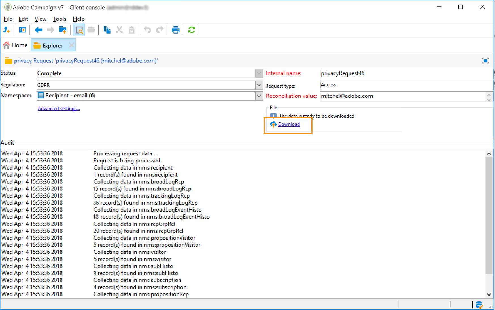

# 개인 정보 요청 관리 {#privacy-requests}

개인 정보 관리에 대한 일반 프레젠테이션은 [이 섹션](../../platform/using/privacy-management.md)을 참조하십시오.

이 정보는 GDPR, CPA, PDPA 및 LGPD에 적용됩니다. 이러한 규정에 대한 자세한 내용은 [이 섹션](../../platform/using/privacy-management.md#privacy-management-regulations)을 참조하십시오.

CPA에만 해당되는 개인 정보 판매 옵트아웃은 [이 섹션](#sale-of-personal-information-ccpa)에 설명되어 있습니다.

>[!IMPORTANT]
>
>이 문서에 설명된 설치 절차는 Campaign Classic 18.4(빌드 8931+)부터 해당됩니다. 이전 버전에서 실행 중인 경우 이 [기술 노트](https://helpx.adobe.com/kr/campaign/kb/how-to-install-gdpr-package-on-legacy-versions.html)를 참조하십시오.

## 개인 정보 요청 정보 {#about-privacy-requests}

Adobe Campaign을 사용하면 개인 정보 보호 준비를 용이하게 하기 위해 액세스 및 삭제 요청을 처리할 수 있습니다. **액세스 권한** 및 **잊혀질 권리(삭제 요청)**&#x200B;는 [이 섹션](../../platform/using/privacy-management.md#right-access-forgotten)에 설명되어 있습니다.

액세스 및 삭제 요청을 만드는 방법뿐만 아니라 Adobe Campaign에서 요청을 처리하는 방법을 살펴보겠습니다.

### 원칙 {#principles}

Adobe Campaign은 데이터 관리자에게 개인정보 보호 액세스 및 삭제 요청을 수행하는 두 가지 방법을 제공합니다.

* **Adobe Campaign 인터페이스**&#x200B;를 통해:각 개인 정보 보호 요청에 대해 데이터 관리자는 Adobe Campaign에서 새로운 개인 정보 보호 요청을 만듭니다. [이 섹션](#create-privacy-request-ui)을 참조하십시오.
* **API**&#x200B;을 통해:Adobe Campaign은 SOAP를 사용하여 개인 정보 보호 요청의 자동 프로세스를 허용하는 API를 제공합니다. [이 섹션](#automatic-privacy-request-api)을 참조하십시오.

>[!NOTE]
>
>개인 데이터 및 데이터를 관리하는 다른 엔터티(데이터 컨트롤러, 데이터 프로세서 및 데이터 주체)에 대한 자세한 내용은 [개인 데이터 및 가상 사용자를 참조하십시오](../../platform/using/privacy-and-recommendations.md#personal-data).

### 사전 요구 사항 {#prerequesites}

Adobe Campaign은 저장된 데이터에 대한 개인 정보 요청을 만들고 처리할 수 있는 데이터 컨트롤러 도구를 제공합니다. 하지만 데이터 주체(이메일, 고객 지원 센터 또는 웹 포털)와의 관계를 처리하는 것은 데이터 컨트롤러의 책임입니다.

따라서 요청을 하는 데이터 주체의 ID를 확인하고 요청자에게 반환되는 데이터가 데이터 주체의 정보임을 확인하는 것은 데이터 컨트롤러로서의 책임입니다.

### 개인 정보 패키지 {#install-privacy-package} 설치

이 기능을 사용하려면 **[!UICONTROL Tools]** > **[!UICONTROL Advanced]** > **[!UICONTROL Import package]** > **[!UICONTROL Adobe Campaign Package]** 메뉴를 통해 **[!UICONTROL Privacy Data Protection Regulation]** 패키지를 설치해야 합니다. 패키지 설치 방법에 대한 자세한 내용은 [자세한 설명서](../../installation/using/installing-campaign-standard-packages.md)를 참조하십시오.

[개인 정보]에만 해당하는 2개의 새 폴더가 **[!UICONTROL Administration]** > **[!UICONTROL Platform]** 아래에 만들어집니다.

* **[!UICONTROL Privacy Requests]**:여기에서 개인 정보 보호 요청을 만들고 이들의 진행 상황을 추적할 수 있습니다.
* **[!UICONTROL Namespaces]**:여기에서 Adobe Campaign 데이터베이스의 데이터 제목을 식별하는 데 사용할 필드를 정의합니다.


**[!UICONTROL Administration]** > **[!UICONTROL Production]** > **[!UICONTROL Technical workflows]**&#x200B;에서 개인 정보 요청을 처리하기 위해 매일 3개의 기술 워크플로우가 실행됩니다.


* **[!UICONTROL Collect privacy requests]**:이 워크플로우는 Adobe Campaign에 저장된 수신자의 데이터를 생성하여 개인 정보 요청의 화면에서 다운로드할 수 있도록 합니다.
* **[!UICONTROL Delete privacy requests data]**:이 워크플로우에서는 Adobe Campaign에 저장된 수신자 데이터를 삭제합니다.
* **[!UICONTROL Privacy request cleanup]**:이 워크플로우에서는 90일 이전의 액세스 요청 파일을 삭제합니다.

**[!UICONTROL Administration]** > **[!UICONTROL Access Management]** > **[!UICONTROL Named rights]**&#x200B;에서 오른쪽 이름의 **[!UICONTROL Privacy Data Right]**&#x200B;이 추가되었습니다. 데이터 관리자가 개인 정보 보호 도구를 사용하려면 이 명명된 권한이 필요합니다. 이를 통해 새로운 요청을 만들고 진행 상황을 추적하며 API를 사용하는 등의 작업을 할 수 있습니다.


### 네임스페이스 {#namesspaces}

개인 정보 보호 요청을 만들기 전에 사용할 네임스페이스를 정의해야 합니다. 이 키는 Adobe Campaign 데이터베이스에서 데이터 제목을 식별하는 데 사용됩니다.

바로 사용할 수 있는 네임스페이스 3개가 있습니다.이메일, 전화 및 휴대폰 등 다른 네임스페이스(예: 수신자 사용자 정의 필드)가 필요한 경우 **[!UICONTROL Administration]** > **[!UICONTROL Platform]** > **[!UICONTROL Namespaces]**&#x200B;에서 새 네임스페이스를 만들 수 있습니다.

## 개인 정보 보호 요청 만들기 {#create-privacy-request-ui}

**Adobe Campaign 인터페이스**&#x200B;에서는 개인 정보 요청을 만들고 진행 상황을 추적할 수 있습니다. 새로운 개인 정보 보호 요청을 만들려면 다음 지침을 따르십시오.

1. **[!UICONTROL Administration]** > **[!UICONTROL Platform]** > **[!UICONTROL Privacy Requests]** 아래의 개인 정보 요청 폴더에 액세스합니다.

   

1. 이 화면에서는 모든 현재 개인 정보 요청, 상태 및 로그를 볼 수 있습니다. **[!UICONTROL New]**&#x200B;을 클릭하여 개인 정보 요청을 만듭니다.

   

1. **[!UICONTROL Regulation]**(GDPR, CCPA, PDPA 또는 LGPD), **[!UICONTROL Request type]**(액세스 또는 삭제)을 선택하고 **[!UICONTROL Namespace]**&#x200B;를 선택하고 **[!UICONTROL Reconciliation value]**&#x200B;을 입력합니다. 이메일을 네임스페이스로 사용하는 경우 데이터 주체의 이메일을 입력합니다.

   

개인 정보 기술 워크플로우는 매일 한 번 실행되며 각각의 새로운 요청을 처리합니다.

* 요청 삭제:adobe campaign에 저장된 수신자 데이터가 지워집니다.
* 액세스 요청:adobe campaign에 저장된 수신자의 데이터가 생성되고 요청 화면의 왼쪽에 XML 파일로 사용할 수 있습니다.



### {#list-of-tables} 테이블 목록

Adobe Campaign은 삭제 또는 액세스 개인 정보 요청을 수행할 때 수신자 테이블(고유 유형)에 대한 링크가 있는 모든 테이블에서 **[!UICONTROL Reconciliation value]**&#x200B;을 기준으로 모든 데이터 주체의 데이터를 검색합니다.

개인정보 보호 요청을 수행할 때 고려해야 하는 기본 테이블 목록은 다음과 같습니다.

* 받는 사람(받는 사람)
* 받는 사람 배달 로그(broadLogRcp)
* 수신자 추적 로그(trackingLogRcp)
* 보관된 이벤트 배달 로그(broadLogEventHisto)
* 수신자 목록 컨텐츠(rcpGrpRel)
* 방문자 제안(progementVisitor)
* 방문자(방문자)
* 구독 내역(하위 내역)
* 구독(구독)
* 수신자 제안(provisionRcp)

수신자 테이블(자체 유형)에 대한 링크가 있는 사용자 정의 테이블을 생성한 경우 이러한 테이블도 고려됩니다. 예를 들어, 수신자 테이블에 연결된 트랜잭션 테이블과 트랜잭션 상세 정보 테이블이 트랜잭션 테이블에 연결된 경우 두 테이블 모두 고려됩니다.

>[!IMPORTANT]
>
>프로필 삭제 워크플로우를 사용하여 개인 정보 일괄 처리를 요청하는 경우 다음 설명을 고려하십시오.
>* 워크플로우를 통한 프로필 삭제는 하위 테이블을 처리하지 않습니다.
>* 모든 하위 테이블의 삭제를 처리해야 합니다.
>* Adobe에서는 개인 정보 액세스 테이블에서 삭제할 행을 추가하고 **[!UICONTROL Delete privacy requests data]** 워크플로우가 삭제를 수행하도록 하는 ETL 작업 과정을 만드는 것이 좋습니다. 성능상의 이유로 삭제할 프로필은 하루에 200개로 제한하는 것이 좋습니다.


### 개인 정보 보호 요청 상태 {#privacy-request-statuses}

개인정보 보호 요청에 대한 다양한 상태는 다음과 같습니다.

* **[!UICONTROL New]** / **[!UICONTROL Retry pending]**: 진행 중이며 워크플로우는 아직 요청을 처리하지 않았습니다.
* **[!UICONTROL Processing]** / **[!UICONTROL Retry in progress]**: 워크플로우가 요청을 처리하고 있습니다.
* **[!UICONTROL Delete pending]**: 워크플로우는 삭제하려는 모든 수신자 데이터를 식별했습니다.
* **[!UICONTROL Delete in progress]**: 워크플로우가 삭제를 처리하고 있습니다.
* **[!UICONTROL Delete Confirmation Pending]** (2단계 프로세스 모드에서 요청 삭제):워크플로에서 액세스 요청을 처리했습니다. 삭제를 수행하도록 수동 확인을 요청합니다. 이 버튼은 15일간 사용할 수 있습니다.
* **[!UICONTROL Complete]**: 요청 처리가 오류 없이 끝났습니다.
* **[!UICONTROL Error]**: 워크플로우에서 오류가 발생했습니다. 이유는 **[!UICONTROL Request status]** 열의 개인 정보 요청 목록에 표시됩니다. 예를 들어 **[!UICONTROL Error data not found]**&#x200B;은(는) 데이터 주체의 **[!UICONTROL Reconciliation value]**&#x200B;와(과) 일치하는 수신자 데이터가 데이터베이스에 없음을 의미합니다.

### 2단계 프로세스 {#two-step-process}

기본적으로 **2단계 프로세스**&#x200B;가 활성화됩니다. 이 모드를 사용하여 새 삭제 요청을 만들 때 Adobe Campaign은 항상 먼저 액세스 요청을 수행합니다. 삭제를 확인하기 전에 데이터를 확인할 수 있습니다.

이 모드는 개인 정보 요청 에디션 화면에서 변경할 수 있습니다. **[!UICONTROL Advanced settings]**&#x200B;을(를) 클릭합니다.


2단계 모드가 활성화되면 새 삭제 요청의 상태가 **[!UICONTROL Confirm Delete Pending]**&#x200B;으로 변경됩니다. 개인 정보 요청 화면에서 생성된 XML 파일을 다운로드하고 데이터를 확인합니다. 데이터 삭제를 확인하려면 **[!UICONTROL Confirm delete data]** 단추를 클릭합니다.


### JSSP URL {#jspp-url}

액세스 요청을 처리할 때 Adobe Campaign은 데이터베이스에서 받는 사람의 데이터를 검색하고 이를 로컬 컴퓨터에 저장된 XML 파일로 내보내는 JSSP를 생성합니다. JSSP URL은 다음과 같이 정의됩니다.

```
"$(serverUrl)+'/nms/gdpr.jssp?id='+@id"
```

@id은 개인 정보 요청 ID입니다.

이 URL은 **[!UICONTROL Privacy Requests (gdprRequest)]** 스키마의 **[!UICONTROL "File location" (@urlFile)]** 필드에 저장됩니다.

이 정보는 90일간 데이터베이스에서 사용할 수 있습니다. 요청을 기술 워크플로우로 정리하면 해당 정보가 데이터베이스에서 제거되고 URL이 더 이상 사용되지 않습니다. 웹 페이지에서 데이터를 다운로드하기 전에 URL이 여전히 유효한지 확인하십시오.

데이터 주체의 데이터 파일의 예는 다음과 같습니다.


데이터 관리자는 해당 JSSP URL을 포함하는 웹 애플리케이션을 쉽게 만들어 데이터 주체의 데이터 파일을 웹 페이지에서 사용할 수 있도록 만들 수 있습니다.


다음은 웹 응용 프로그램 **[!UICONTROL Page]** 활동의 예로 사용할 수 있는 코드 조각입니다.


```
<!DOCTYPE html PUBLIC "-//W3C//DTD XHTML 1.0 Transitional//EN" "http://www.w3.org/TR/xhtml1/DTD/xhtml1-transitional.dtd"> <html xmlns="http://www.w3.org/1999/xhtml"> <head> <meta http-equiv="Content-Language" content="en"> <meta http-equiv="Content-Type" content="text/html; charset=utf-8" /> <link rel="stylesheet" type="text/css" href="/nl/webForms/landingPage.css"/> <title>Clickthrough</title> <style type="text/css" media="all"> /* override formulary area */ .formulary { top: 200px; position: absolute; left: 0; } </style> </head> <body style="" class="">
<center>
<div id="wrap">
<div id="header">
<div class="header-title center-title">DOWNLOAD GDPR DATA</div>
<div class="formulary center-formulary"><form>
<div class="button large-button"><a href=[SERVER_URL]/nms/gdpr.jssp?id=13000" data-nl-type="externalLink">CLICK TO DOWNLOAD</a></div>
</form></div>
</div>
<div id="content">
<div class="row">
<div class="info">
<div class="desc">
<div class="title">EFFICIENCY</div>
<div class="desc">Our service is guaranteed to improve your efficiency. Increase performance and use our high-technology service to implement even the most ambitious of projects.</div>
</div>
</div>
</div>
</div>
<div id="footer">
<div style="text-align: center;">
<div style="float: left;"><a href="#">Contact us</a></div>
<div style="float: right;">&copy; Copyrights</div>
<div><a href="#"></a> <a href="#"></a> <a href="#"></a> <a href="#"></a></div>
</div>
</div>
</div>
</center>
</body> </html>
```

데이터 주체의 데이터 파일에 대한 액세스가 제한되어 있으므로 웹 페이지의 익명 액세스를 비활성화해야 합니다. 오른쪽 이름의 **[!UICONTROL Privacy Data Right]** 연산자만 페이지에 로그온하여 데이터를 다운로드할 수 있습니다.

## 자동 개인 정보 요청 프로세스 {#automatic-privacy-request-api}

Adobe Campaign은 자동 개인 정보 보호 요청 프로세스를 설정할 수 있는 **API**&#x200B;를 제공합니다.

API를 사용하는 경우 일반 개인 정보 프로세스는 인터페이스](#create-privacy-request-ui)을 사용하는 [과 동일합니다. 유일한 차이는 개인 정보 보호 요청의 생성입니다. Adobe Campaign에서 요청을 만드는 대신 요청 정보가 포함된 POST이 Campaign으로 전송됩니다. 모든 요청에 대해 새 항목이 **[!UICONTROL Privacy Requests]** 화면에 추가됩니다. 그러면 개인 정보 기술 워크플로우에서 인터페이스를 사용하여 추가된 요청과 동일한 방식으로 요청을 처리합니다.

API를 사용하여 개인 정보 요청을 제출하는 경우 반환된 데이터를 테스트하려면 **2단계 프로세스**&#x200B;를 첫 번째 삭제 요청에 대해 활성화한 상태로 두는 것이 좋습니다. 테스트가 완료되면 요청 삭제 프로세스가 자동으로 실행되도록 2단계 프로세스를 비활성화할 수 있습니다.

**[!UICONTROL CreateRequestByName]** JS API는 다음과 같이 정의됩니다.

>[!NOTE]
>
>**gdprRequest** API를 사용하더라도 계속 사용할 수 있지만 새로운 **privacyRequest** API를 사용하는 것이 좋습니다.

>[!IMPORTANT]
>
>API를 사용하려면 오른쪽의 **[!UICONTROL Privacy Data Right]**&#x200B;이(가) 필요합니다.

```
<method library="nms:gdpr.js" name="CreateRequestByName" static="true">
 <help>Create a new GDPR Request using namespace internal name</help>
 <parameters>
  <param name="namespaceName" type="string" desc="Namespace internal name"/>
  <param name="reconciliationValue" type="string" desc="Reconciliation value"/>
  <param name="type" type="long" desc="Reconciliation value"/>
  <param name="confirmDeletePending" type="boolean" desc="Request confirm before deleting data"/>
  <param name="regulation" type="long" desc="regulation of newly created request"/>
  <param name="id" type="long" inout="out" desc="ID of newly created request"/>
 </parameters>
</method>
```

>[!NOTE]
>
>&#39;규정&#39; 필드는 Campaign Classic 20.2(빌드 9178+)를 사용하는 경우에만 사용할 수 있습니다.
>
>20.2로 마이그레이션하고 있고 이미 API를 사용하고 있는 경우 위에 표시된 &#39;규정&#39; 필드를 추가해야 합니다. 이전 빌드를 사용하는 경우 &#39;규정&#39; 필드 없이 API를 계속 사용할 수 있습니다.

### 외부에서 API 호출 {#invoking-api-externally}

다음은 외부에서 API를 호출할 수 있는 방법의 예입니다(API를 통한 인증 및 개인 정보 API에 대한 세부 사항). 개인 정보 API에 대한 자세한 내용은 [API 설명서](https://docs.adobe.com/content/help/en/campaign-classic/technicalresources/api/s-nms-privacyRequest.html)를 참조하십시오. 또한 [웹 서비스 호출 설명서](../../configuration/using/web-service-calls.md)를 참조할 수 있습니다.

우선 API를 통해 인증을 수행해야 합니다.

1. 다음 URL을 통해 **xtk:session** WSDL을 다운로드합니다.**`<server url>`/nl/jsp/schemawsdl.jsp?schema=xtk:session**.

1. &quot;Logon&quot; 메서드를 사용하여 사용자 이름과 암호를 요청의 매개 변수로 전달합니다. 세션 토큰이 포함된 응답을 받게 됩니다. 다음은 SoapUI 사용 예입니다.

   

1. 반환된 세션 토큰을 모든 하위 시퀀스 API 호출에 대한 인증으로 사용하십시오. 24시간 후에 만료됩니다.

그런 다음 개인 정보 API를 호출합니다.

1. 이 URL에서 WSDL을 다운로드합니다.**`<server url>`/nl/jsp/schemawsdl.jsp?schema=nms:privacyRequest**

1. **[!UICONTROL CreateRequestByName]**&#x200B;을(를) 사용하여 특정 개인 정보 보호 요청을 만듭니다.

   다음은 **[!UICONTROL CreateRequestByName]**&#x200B;을 사용하는 예입니다. 위에서 제공한 세션 토큰을 인증으로 사용하는 방법을 참고하십시오. 응답은 만든 요청의 ID입니다.

   

   위의 단계를 수행하는 데 도움이 되도록 다음 사항을 고려하십시오.

   * **nms:gdprRequest** 스키마의 **queryDef**&#x200B;을 사용하여 액세스 요청의 상태를 확인할 수 있습니다.
   * **nms:gdprRequestData** 스키마의 **queryDef**&#x200B;을 사용하여 액세스 요청의 결과를 가져올 수 있습니다.
   * **&quot;$(serverUrl)&#39;/nms/gdpr.jssp?id=&#39;@id&quot;**&#x200B;에서 XML 파일을 다운로드할 수 있으려면 화이트리스트 등록 IP에서 로그인하고 액세스해야 합니다. 이렇게 하려면 JSSP에서 생성한 파일에 액세스할 수 있도록 웹 응용 프로그램을 만듭니다.

### JS {#invoking-api-from-js}에서 API 호출

다음은 Campaign Classic 내의 JS에서 API를 호출할 수 있는 방법의 예입니다.

>[!NOTE]
>
>&#39;규정&#39; 필드는 Campaign Classic 20.2(빌드 9178+)를 사용하는 경우에만 사용할 수 있습니다.
>
>20.2로 마이그레이션하는 중이며 이미 API를 사용하고 있는 경우 &#39;규정&#39; 필드를 추가해야 합니다. 이전 빌드를 사용하는 경우 &#39;규정&#39; 필드 없이 API를 계속 사용할 수 있습니다.

* 이전 빌드(GDPR 패키지 포함)를 사용하는 **인 경우 아래와 같이 &#39;규정&#39; 필드 없이 API를 계속 사용할 수 있습니다.**

   ```
   loadLibrary("nms:gdpr.js");
   /**************************** 
   This code calls an API to create new Privay request on the DB.
   It requires 4 parameters below.
   Feel free to change parameter values.
   ****************************/
   // 1. Namespace internal name
   var namespaceName = "defaultNamespace1";
   // 2. Reconciliation value for privacy request
   var reconciliationValue = "example@adobe.com";
   // 3. Privacy request type
   // GDPR_REQUEST_TYPE_ACCESS = 1;
   // GDPR_REQUEST_TYPE_DELETE = 2;
   var requestType = GDPR_REQUEST_TYPE_ACCESS;
   // 4. Confirm deleting data required.
   // value : true or false
   var ConfirmDeletePending = true;
   // BEGIN
   var requestId = nms.privacyRequest.CreateRequestByName(namespaceName, reconciliationValue, requestType, ConfirmDeletePending);
   // User can use a simple queryDef with requestID as a parameter to check request status.
   ```

* **20.2**&#x200B;로 마이그레이션하는 중이며 API를 이미 사용하고 있는 경우 아래와 같이 &#39;규정&#39; 필드를 추가해야 합니다.

   ```
   loadLibrary("nms:gdpr.js");
   /**************************** 
   This code calls an API to create new Privay request on the DB.
   It requires 5 parameters below.
   Feel free to change parameter values.
   ****************************/
   // 1. Namespace internal name
   var namespaceName = "defaultNamespace1";
   // 2. Reconciliation value for privacy request
   var reconciliationValue = "example@adobe.com";
   // 3. Privacy request type
   // PRIVACY_REQUEST_TYPE_ACCESS = 1;
   // PRIVACY_REQUEST_TYPE_DELETE = 2;
   var requestType = PRIVACY_REQUEST_TYPE_ACCESS;
   // 4. Confirm deleting data required.
   // value : true or false
   var ConfirmDeletePending = true;
   // 5. Specify which regulation applies to newly created request. This is mandatory parameter.
   // GDPR = 1
   // CCPA = 2
   // PDPA = 3
   // LGPD = 4
   var regulation = 1;
   // BEGIN
   var requestId = nms.privacyRequest.CreateRequestByName(namespaceName, reconciliationValue, requestType, ConfirmDeletePending, regulation);
   // User can use a simple queryDef with requestID as a parameter to check request status.
   ```

* Campaign Classic 20.2(빌드 9178+) 또는 **이상을 사용하는**&#x200B;인 경우 &#39;규정&#39; 필드는 아래와 같이 선택 사항입니다.

   ```
   loadLibrary("nms:gdpr.js");
   /**************************** 
   This code calls an API to create new Privay request on the DB.
   It requires 5 parameters below.
   Feel free to change parameter values 
   ****************************/
   // 1. Namespace internal name
   var namespaceName = "defaultNamespace1";
   // 2. Reconciliation value for privacy request
   var reconciliationValue = "example@adobe.com";
   // 3. Privacy request type
   // PRIVACY_REQUEST_TYPE_ACCESS = 1;
   // PRIVACY_REQUEST_TYPE_DELETE = 2;
   var requestType = PRIVACY_REQUEST_TYPE_ACCESS;
   // 4. Confirm deleting data required.
   // value : true or false
   var ConfirmDeletePending = true;
   // 5. Specify which regulation applies to newly created request. This is optional parameter.
   // GDPR = 1
   // CCPA = 2
   // PDPA = 3
   // LGPD = 4
   var regulation = 1;
   // BEGIN
   var requestId = nms.privacyRequest.CreateRequestByName(namespaceName, reconciliationValue, requestType, ConfirmDeletePending, regulation);
   // User can use a simple queryDef with requestID as a parameter to check request status.
   ```

## 개인 정보 판매 옵트아웃 (CCPA) {#sale-of-personal-information-ccpa}

**CCPA**(California Consumer Privacy Act)는 캘리포니아 거주자들에게 개인 정보에 대한 새로운 권리를 제공하고 캘리포니아에서 비즈니스를 수행하는 특정 엔터티에 데이터 보호 책임을 부과합니다.

액세스 및 삭제 요청의 구성 및 사용은 GDPR과 CCPA와 공통됩니다. 이 섹션에서는 CCPA에만 해당되는 개인 데이터 판매에 대한 옵트아웃을 제공합니다.

Adobe Campaign에서 제공하는 [동의 관리](../../platform/using/privacy-management.md#consent-management) 도구 이외에, 사용자가 개인 정보 판매를 옵트아웃했는지 여부를 추적할 수 있습니다.

소비자는 시스템을 통해 자신의 개인 정보가 제3자에게 판매되는 것을 허용하지 않기로 합니다. Adobe Campaign에서 이 정보를 저장하고 추적할 수 있습니다.

이를 수행하려면 프로필 테이블을 확장하고 **[!UICONTROL Opt-Out for CCPA]** 필드를 추가해야 합니다.

>[!IMPORTANT]
>
>데이터 주체의 요청을 받고 CCPA에 대한 요청 날짜를 추적하는 것은 데이터 컨트롤러로서의 책임입니다. 기술 제공업체에서는 수신 거부 방법만 제공합니다. 데이터 컨트롤러로서의 역할에 대한 자세한 내용은 [개인 데이터 및 가상 사용자를 참조하십시오](../../platform/using/privacy-and-recommendations.md#personal-data).

### 필수 조건 {#ccpa-prerequisite}

이 정보를 활용하려면 Adobe Campaign Classic에서 이 필드를 만들어야 합니다. 이를 위해 **[!UICONTROL Recipient]** 테이블에 부울 필드를 추가합니다. 새 필드를 만들면 Campaign API에서 자동으로 지원됩니다.

사용자 지정 수신자 테이블을 사용하는 경우 이 작업을 수행해야 합니다.

새 필드를 만드는 방법에 대한 자세한 내용은 [스키마 에디션 설명서](../../configuration/using/about-schema-edition.md)를 참조하십시오.

>[!IMPORTANT]
>
>스키마 수정은 전문가 사용자만 수행해야 하는 중요한 작업입니다.

1. **[!UICONTROL Tools]** > **[!UICONTROL Advanced]** > **[!UICONTROL Add new fields]**&#x200B;로 이동하고 **[!UICONTROL Recipients]**&#x200B;을 **[!UICONTROL Document type]**&#x200B;로 선택하고 **[!UICONTROL Next]**&#x200B;를 클릭합니다. 테이블에 필드를 추가하는 방법에 대한 자세한 내용은 [이 섹션](../../configuration/using/new-field-wizard.md)을 참조하십시오.

   

1. **[!UICONTROL Field type]**&#x200B;에 대해 **[!UICONTROL SQL field]**&#x200B;을 선택합니다. 레이블에 **[!UICONTROL Opt-Out for CCPA]**&#x200B;을(를) 사용합니다. **[!UICONTROL 8-bit integer (boolean)]** 유형을 선택하고 다음 고유 **[!UICONTROL Relative path]**&#x200B;을 정의합니다.@OPTOUTCCPA. **[!UICONTROL Finish]**&#x200B;을(를) 클릭합니다.

   

   이렇게 하면 **[!UICONTROL Recipient (cus)]** 스키마가 확장되거나 생성됩니다. 필드를 올바르게 추가했는지 확인하려면 클릭합니다.

   

1. 탐색기의 **[!UICONTROL Configuration]** > **[!UICONTROL Input forms]** 노드를 클릭합니다. **[!UICONTROL Recipient (nms)]**&#x200B;의 &quot;일반 패키지&quot;에서 `<input>` 요소를 추가하고 2단계에서 정의한 상대 경로인 xpath 값에 사용합니다. 양식 식별에 대한 자세한 내용은 [이 섹션](../../configuration/using/identifying-a-form.md)을 참조하십시오.

   ```
   <input  colspan="2" type="checkbox" xpath="@OPTOUTCCPA"/>
   ```

   

1. 연결 끊기 및 다시 연결 다음 섹션에 설명된 절차에 따라 필드를 수신자의 세부 정보에 사용할 수 있는지 확인합니다.

### 사용 {#usage}

필드의 값을 채우고 데이터 판매에 관한 CCPA 지침 및 규칙을 따르는 것은 데이터 컨트롤러의 책임입니다.

값을 채우려면 다음과 같은 몇 가지 방법을 사용할 수 있습니다.

* 수신자의 세부 사항을 편집하여 캠페인 인터페이스 사용
* API 사용
* 데이터 가져오기 작업 과정을 통해

그런 다음 옵트아웃한 프로필의 개인 정보를 제3자에게 판매해서는 안 됩니다.

1. 옵트아웃 상태를 변경하려면 **[!UICONTROL Profiles and Target]** > **[!UICONTROL Recipients]**&#x200B;으로 이동하여 수신자를 선택합니다. **[!UICONTROL General]** 탭에는 이전 섹션에 구성된 필드가 표시됩니다.

   

1. 받는 사람 목록을 구성하여 상위 출력 열을 표시합니다. 목록 구성 방법을 알아보려면 [자세한 설명서](../../platform/using/adobe-campaign-workspace.md#configuring-lists)를 참조하십시오.

   

1. 이 열을 클릭하여 옵트아웃 정보에 따라 수신자를 정렬할 수 있습니다. 옵트아웃한 수신자만 표시하는 필터를 만들 수도 있습니다. 필터 만들기에 대한 자세한 내용은 [이 섹션](../../platform/using/creating-filters.md)을 참조하십시오.

   
