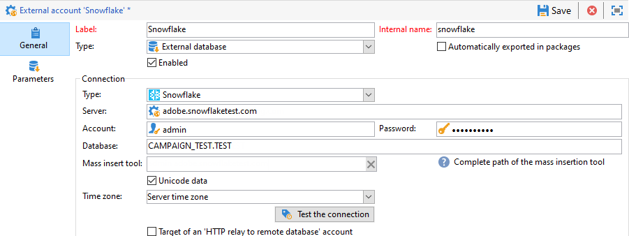

# 데이터베이스 유형별 특정 구성 {#specific-configurations-by-database-type}

Adobe Campaign에서 액세스할 수 있게 하려는 외부 데이터베이스에 따라 특정 구성을 수행해야 합니다. 이러한 구성은 기본적으로 드라이버를 설치하고 Adobe Campaign 서버의 각 RDBMS에 속하는 환경 변수를 선언하는 것과 관련되어 있습니다.

일반적으로 Adobe Campaign 서버의 외부 데이터베이스에 해당 클라이언트 레이어를 설치해야 합니다.

>[!NOTE]
>
>호환 버전은 캠페인 호환성 [매트릭스에 나와 있습니다](https://helpx.adobe.com/campaign/kb/compatibility-matrix.html#FederatedDataAccessFDA).

<!--
## Configure access to Azure Synapse {#configure-access-to-azure-synapse}

### Azure Synapse on CentOS {#azure-centos}

1. Download mysql57-community-release.noarch.rpm. You can find it in this [page](https://dev.mysql.com/downloads/repo/yum).

1. Install the client library:

    ```
    $ yum install mysql57-community-release-el7-9.noarch.rpm
    $ yum install mysql-community-libs
    ```

1. You now need to configure the external account. In Campaign Classic, unfold the **[!UICONTROL Platform]** menu and click **[!UICONTROL External accounts]**.

1. Select the out-of-the box **[!UICONTROL Azure Synapse]** external account.

1. To configure the **[!UICONTROL Azure Synapse]** external account:

    * **[!UICONTROL Server]**
  
      URL of the Azure Synapse server.

    * **[!UICONTROL Account]**

      Name of the user.

    * **[!UICONTROL Password]**

      User account password.

    * **[!UICONTROL Database]**

      Name of your database

    >[!NOTE]
    >
    >Make sure the **[!UICONTROL Time zone]** and **[!UICONTROL Unicode data]** are set according to your database.

### Azure Synapse on Debian {#azure-debian}

1. Download mysql-apt-config.deb. You can find it in this [page](https://dev.mysql.com/doc/mysql-apt-repo-quick-guide/en).

1. Install the client library:

    ```
    $ dpkg -i mysql-apt-config_*_all.deb # choose mysql-5.7 in the configuration menu
    $ apt update
    $ apt install libmysqlclient20
    ```

1. You now need to configure the external account. In Campaign Classic, unfold the **[!UICONTROL Platform]** menu and click **[!UICONTROL External accounts]**.

1. Select the out-of-the box **[!UICONTROL Azure Synapse]** external account.

1. To configure the **[!UICONTROL Azure Synapse]** external account:

    * **[!UICONTROL Server]**
  
      URL of the Azure Synapse server.

    * **[!UICONTROL Account]**

      Name of the user.

    * **[!UICONTROL Password]**

      User account password.

    * **[!UICONTROL Database]**

      Name of your database

    >[!NOTE]
    >
    >Make sure the **[!UICONTROL Time zone]** and **[!UICONTROL Unicode data]** are set according to your database.

### Azure Synapse on Windows {#azure-windows}

1. Download the C connector. You can find it in this [page](https://dev.mysql.com/downloads/connector/c).

1. Make sure the directory that contains libmysqlclient.dll is added to the PATH environment variable that nlserver will use.

1. You now need to configure the external account. In Campaign Classic, unfold the **[!UICONTROL Platform]** menu and click **[!UICONTROL External accounts]**.

1. You now need to configure the external account. In Campaign Classic, unfold the **[!UICONTROL Platform]** menu and click **[!UICONTROL External accounts]**.

1. Select the out-of-the box **[!UICONTROL Azure Synapse]** external account.

1. To configure the **[!UICONTROL Azure Synapse]** external account:

    * **[!UICONTROL Server]**
  
      URL of the Azure Synapse server.

    * **[!UICONTROL Account]**

      Name of the user.

    * **[!UICONTROL Password]**

      User account password.

    * **[!UICONTROL Database]**

      Name of your database

    >[!NOTE]
    >
    >Make sure the **[!UICONTROL Time zone]** and **[!UICONTROL Unicode data]** are set according to your database.

-->

## Snowflake 액세스 구성 {#configure-access-to-snowflake}

>[!NOTE]
>
>Snowflake 커넥터는 호스팅 및 온-프레미스 배포에 사용할 수 있습니다. 자세한 내용은 이 [페이지를](https://helpx.adobe.com/campaign/kb/acc-on-prem-vs-hosted.html)참조하십시오.


### CentOS의 Snowflake {#snowflake-centos}

1. Snowflake용 ODBC 드라이버를 다운로드합니다. Snowflake의 운전자들은 [여기](https://sfc-repo.snowflakecomputing.com/odbc/linux/latest/snowflake-odbc-2.20.2.x86_64.rpm)있습니다.

1. 그런 다음 다음 명령을 사용하여 CentOs에 ODBC 드라이버를 설치해야 합니다.

   ```
   rpm -Uvh unixodbc
   rpm -Uvh snowflake-odbc-2.20.2.x86_64.rpm
   ```

1. ODBC 드라이버를 다운로드하고 설치한 후 Campaign Classic을 다시 시작해야 합니다. 이렇게 하려면 다음 명령을 실행합니다.

   ```
   /etc/init.d/nlserver6 stop
   /etc/init.d/nlserver6 start
   ```
1. Campaign Classic에서 Snowflake 외부 계정을 구성합니다. 메뉴에서 **[!UICONTROL Explorer]**&#x200B;메뉴를 **[!UICONTROL Administration]** 펼쳐라.

1. 메뉴를 펼치고 **[!UICONTROL Platform]** 클릭합니다 **[!UICONTROL External accounts]**.

1. 즉시 사용 가능한 **[!UICONTROL Snowflake]** 외부 계정을 선택합니다.

1. 외부 계정을 구성하려면 다음을 **[!UICONTROL Snowflake]** 수행하십시오.

   * **[!UICONTROL Server]**

      Snowflake 서버의 URL.

   * **[!UICONTROL Account]**

      사용자의 이름입니다.

   * **[!UICONTROL Password]**

      사용자 계정 암호.

   * **[!UICONTROL Database]**

      데이터베이스의 이름입니다.
   

1. 탭을 **[!UICONTROL Parameters]** 클릭한 다음 **[!UICONTROL Deploy function]** 단추를 클릭하여 함수를 만듭니다.

   

커넥터는 다음 옵션을 지원합니다.

| 옵션 | 값 | 설명 |
|---|---|---|
| 작업 스키마 |  | 작업 테이블에 사용할 데이터베이스 스키마 |
| warehouse |  | 사용할 기본 웨어하우스의 이름입니다. 이 값은 사용자의 기본값을 덮어씁니다. |
| 시간대 이름 |  | 기본적으로 비어 있으면 Campaign Classic 앱 서버의 시스템 시간대가 사용됩니다. 이 옵션을 사용하여 TIMEZONE 세션 매개 변수를 강제 적용할 수 있습니다. <br>자세한 내용은 이 [페이지를](https://docs.snowflake.net/manuals/sql-reference/parameters.html#timezone)참조하십시오. |
| WeekStart | 0, 1-7 | 기본적으로 0으로 설정됩니다. (WEEK_START 세션 매개 변수) <br>자세한 내용은 이 [페이지를](https://docs.snowflake.net/manuals/sql-reference/parameters.html#week-start)참조하십시오. |
| UseCachedResult | TRUE/FALSE | 기본적으로 TRUE로 설정됩니다. 이 옵션을 사용하여 Snowflake 캐시된 결과(USE_CACHED_RESULTS 세션 매개 변수) <br>를 비활성화할 수 있습니다. 자세한 내용은 이 [페이지를](https://docs.snowflake.net/manuals/user-guide/querying-persisted-results.html)참조하십시오. |

### 데비안의 눈송이 {#snowflake-debian}

1. Snowflake용 ODBC 드라이버를 다운로드합니다. Snowflake의 운전자들은 [여기](https://sfc-repo.snowflakecomputing.com/odbc/linux/latest/index.html)있습니다.

1. 그런 다음 다음 다음 명령을 사용하여 Debian에 ODBC 드라이버를 설치해야 합니다.

   ```
   apt-get install unixodbc
   apt-get install snowflake-odbc-x.xx.x.x86_64.deb
   ```

1. ODBC 드라이버를 다운로드하고 설치한 후 Campaign Classic을 다시 시작해야 합니다. 이렇게 하려면 다음 명령을 실행합니다.

   ```
   systemctl stop nlserver.service
   systemctl start nlserver.service
   ```

1. Campaign Classic에서 Snowflake 외부 계정을 구성합니다. 메뉴에서 **[!UICONTROL Explorer]**&#x200B;메뉴를 **[!UICONTROL Administration]** 펼쳐라.

1. 메뉴를 펼치고 **[!UICONTROL Platform]** 클릭합니다 **[!UICONTROL External accounts]**.

1. 즉시 사용 가능한 **[!UICONTROL Snowflake]** 외부 계정을 선택합니다.

1. 외부 계정을 구성하려면 다음을 **[!UICONTROL Snowflake]** 수행하십시오.

   * **[!UICONTROL Server]**

      Snowflake 서버의 URL.

   * **[!UICONTROL Account]**

      사용자의 이름입니다.

   * **[!UICONTROL Password]**

      사용자 계정 암호.

   * **[!UICONTROL Database]**

      데이터베이스 이름
   

1. 탭을 **[!UICONTROL Parameters]** 클릭한 다음 **[!UICONTROL Deploy function]** 단추를 클릭하여 함수를 만듭니다.

   

커넥터는 다음 옵션을 지원합니다.

| 옵션 | 값 | 설명 |
|---|---|---|
| 작업 스키마 |   | 작업 테이블에 사용할 데이터베이스 스키마 |
| warehouse |   | 사용할 기본 웨어하우스의 이름입니다. 이 값은 사용자의 기본값을 덮어씁니다. |
| 시간대 이름 |   | 기본적으로 비어 있으면 Campaign Classic 앱 서버의 시스템 시간대가 사용됩니다. 이 옵션을 사용하여 TIMEZONE 세션 매개 변수를 강제 적용할 수 있습니다. <br>자세한 내용은 이 [페이지를](https://docs.snowflake.net/manuals/sql-reference/parameters.html#timezone)참조하십시오. |
| WeekStart | 0, 1-7 | 기본적으로 0으로 설정됩니다. (WEEK_START 세션 매개 변수) <br>자세한 내용은 이 [페이지를](https://docs.snowflake.net/manuals/sql-reference/parameters.html#week-start)참조하십시오. |
| UseCachedResult | TRUE/FALSE | 기본적으로 TRUE로 설정됩니다. 이 옵션을 사용하여 Snowflake 캐시된 결과(USE_CACHED_RESULTS 세션 매개 변수) <br>를 비활성화할 수 있습니다. 자세한 내용은 이 [페이지를](https://docs.snowflake.net/manuals/user-guide/querying-persisted-results.html)참조하십시오. |

### Windows 기반의 Snowflake {#snowflake-windows}

1. Windows용 [ODBC 드라이버를 다운로드합니다](https://docs.snowflake.net/manuals/user-guide/odbc-download.html). 드라이버를 설치하려면 관리자 수준 권한이 필요합니다. 자세한 내용은 이 [페이지를 참조하십시오.](https://docs.snowflake.net/manuals/user-guide/admin-user-management.html)

1. ODBC 드라이버를 구성합니다. 자세한 내용은 이 [페이지를 참조하십시오.](https://docs.snowflake.net/manuals/user-guide/odbc-windows.html#step-2-configure-the-odbc-driver)

1. ODBC 드라이버가 설치 및 구성되면 Campaign Classic에서 Snowflake 외부 계정을 구성해야 합니다. 메뉴에서 **[!UICONTROL Explorer]**&#x200B;메뉴를 **[!UICONTROL Administration]** 펼쳐라.

1. 메뉴를 펼치고 **[!UICONTROL Platform]** 클릭합니다 **[!UICONTROL External accounts]**.

1. 즉시 사용 가능한 **[!UICONTROL Snowflake]** 외부 계정을 선택합니다.

1. 외부 계정을 구성하려면 다음을 **[!UICONTROL Snowflake]** 수행하십시오.

   * **[!UICONTROL Server]**

      Snowflake 서버의 URL.

   * **[!UICONTROL Account]**

      사용자의 이름입니다.

   * **[!UICONTROL Password]**

      사용자 계정 암호.

   * **[!UICONTROL Database]**

      데이터베이스 이름
   

1. 탭을 **[!UICONTROL Parameters]** 클릭한 다음 **[!UICONTROL Deploy function]** 단추를 클릭하여 함수를 만듭니다.

   

커넥터는 다음 옵션을 지원합니다.

| 옵션 | 값 | 설명 |
|---|---|---|
| 작업 스키마 |   | 작업 테이블에 사용할 데이터베이스 스키마 |
| warehouse |   | 사용할 기본 웨어하우스의 이름입니다. 이 값은 사용자의 기본값을 덮어씁니다. |
| 시간대 이름 |   | 기본적으로 비어 있으면 Campaign Classic 앱 서버의 시스템 시간대가 사용됩니다. 이 옵션을 사용하여 TIMEZONE 세션 매개 변수를 강제 적용할 수 있습니다. <br>자세한 내용은 이 [페이지를](https://docs.snowflake.net/manuals/sql-reference/parameters.html#timezone)참조하십시오. |
| WeekStart | 0, 1-7 | 기본적으로 0으로 설정됩니다. (WEEK_START 세션 매개 변수) <br>자세한 내용은 이 [페이지를](https://docs.snowflake.net/manuals/sql-reference/parameters.html#week-start)참조하십시오. |
| UseCachedResult | TRUE/FALSE | 기본적으로 TRUE로 설정됩니다. 이 옵션을 사용하여 Snowflake 캐시된 결과(USE_CACHED_RESULTS 세션 매개 변수) <br>를 비활성화할 수 있습니다. 자세한 내용은 이 [페이지를](https://docs.snowflake.net/manuals/user-guide/querying-persisted-results.html)참조하십시오. |

## Hadoop 3.0에 대한 액세스 구성 {#configure-access-to-hadoop-3}

FDA에서 Hadoop 외부 데이터베이스에 연결하려면 Adobe Campaign 서버에서 다음 구성이 필요합니다. 이 구성은 Windows 및 Linux에서 모두 사용할 수 있습니다.

1. OS 버전에 따라 Hadoop용 ODBC 드라이버를 다운로드합니다. 드라이버는 이 [페이지에서](https://www.cloudera.com/downloads.html)찾을 수 있습니다.

1. 그런 다음 ODBC 드라이버를 설치하고 하이브 연결에 대한 DSN을 만들어야 합니다. 지침은 [여기에서 찾을 수 있습니다.](https://docs.cloudera.com/documentation/other/connectors/hive-odbc/2-6-5/Cloudera-ODBC-Driver-for-Apache-Hive-Install-Guide.pdf)

1. ODBC 드라이버를 다운로드하고 설치한 후 Campaign Classic을 다시 시작해야 합니다. 이렇게 하려면 다음 명령을 실행합니다.

   ```
   systemctl stop nlserver.service
   systemctl start nlserver.service
   ```

1. Campaign Classic에서 Campaign Classic에서 Hadoop 외부 계정을 구성합니다. 메뉴에서 **[!UICONTROL Explorer]**&#x200B;메뉴를 **[!UICONTROL Administration]** 펼쳐라.

1. 메뉴를 펼치고 **[!UICONTROL Platform]** 클릭합니다 **[!UICONTROL External accounts]**.

1. 을 **[!UICONTROL Create]** 클릭하고 계정 **[!UICONTROL External database]** 유형으로 선택합니다.

1. 외부 계정을 구성하려면 다음을 **[!UICONTROL  Hadoop]** 수행하십시오.

   * **[!UICONTROL Type]**

      ODBC(Sybase ASE, Sybase IQ)

   * **[!UICONTROL Server]**

      DNS의 이름입니다.

   * **[!UICONTROL Account]**

      사용자의 이름입니다.

   * **[!UICONTROL Password]**

      사용자 계정 암호.

   * **[!UICONTROL Database]**

      DSN 파섹 DSN에 지정된 경우 비워 둘 수 있습니다.

   * **[!UICONTROL Time zone]**

      서버 표준 시간대
   

커넥터는 다음과 같은 ODBC 옵션을 지원합니다.

| 이름 | 값 |
|---|---|
| ODBCMgr | iODBC |
| warehouse | 1/2/4 |

커넥터는 다음 하이브 옵션도 지원합니다.

| 이름 | 값 | 설명 |
|---|---|---|
| bulkKey | Azure Blob 또는 DataLake 액세스 키 | wasb:// 또는 wasbs:// 벌크 로더의 경우(예: 벌크 로드 도구가 wasb:// 또는 wasbs://로 시작하는 경우). <br>벌크 로드를 위한 Blob 또는 DataLake 버킷의 액세스 키입니다. |
| hdfsPort | 기본적으로 8020으로 <br>설정된 포트 번호 | HDFS 벌크 로드의 경우(예: 벌크 로드 도구가 webhdfs:// 또는 webhdfss://로 시작하는 경우) |
| 버킷 수 | 20 | 클러스터형 테이블을 만들 때의 버킷 수입니다. |
| fileFormat | 쪽모이 세공 | 작업 표의 기본 파일 형식입니다. |

## Hadoop 2.1에 대한 액세스 구성 {#configure-access-to-hadoop}

FDA에서 Hadoop 외부 데이터베이스를 구성하는 방법에 대한 자세한 내용은 이 [문서를](https://helpx.adobe.com/campaign/kb/access-hadoop-2.html)참조하십시오.

### Windows용 {#for-windows}

1. Windows용 ODBC 및 [Azure HD](https://www.microsoft.com/en-us/download/details.aspx?id=40886) Insight 드라이버를 설치합니다.
1. ODBC DataSource 관리자 도구를 실행하여 DSN(데이터 소스 이름)을 만듭니다. Hive용 시스템 DSN 샘플이 제공되어 수정됩니다.

   ```
   Description: vorac (or any name you like)
   Host: vorac.azurehdinsight.net
   Port: 443
   Database: sm_tst611 (or your database name)
   Mechanism: Azure HDInsight Service
   User/Password: admin/<your password here>
   ```

1. 공유 연결 [](#creating-a-shared-connection) 만들기 섹션에 설명된 대로 Hadoop 외부 계정을 만듭니다.

### Linux용 {#for-linux}

1. Linux용 통합 설치

   ```
   apt-get install unixodbc
   ```

1. HortonWorks에서 Apache Hive용 ODBC 드라이버 다운로드 및 설치:https://www.hortonworks.com/downloads/ [](https://www.hortonworks.com/downloads/).

   ```
   dpkg -i hive-odbc-native_2.1.10.1014-2_amd64.deb
   ```

1. ODBC 파일 위치를 확인합니다.

   ```
   root@campadpac71:/tmp# odbcinst -j
   unixODBC 2.3.1
   DRIVERS............: /etc/odbcinst.ini
   SYSTEM DATA SOURCES: /etc/odbc.ini
   FILE DATA SOURCES..: /etc/ODBCDataSources
   USER DATA SOURCES..: /root/.odbc.ini
   SQLULEN Size.......: 8
   SQLLEN Size........: 8
   SQLSETPOSIROW Size.: 8
   ```

1. DSN(데이터 소스 이름)을 만들고 odbc.ini 파일을 편집합니다. 그런 다음 하이브 연결에 대한 DSN을 만듭니다.

   다음은 HDInsight에서 &quot;viral&quot;이라는 연결을 설정하는 예입니다.

   ```
   [ODBC Data Sources]
   vorac 
   
   [vorac]
   Driver=/usr/lib/hive/lib/native/Linux-amd64-64/libhortonworkshiveodbc64.so
   HOST=vorac.azurehdinsight.net
   PORT=443
   Schema=sm_tst611
   HiveServerType=2
   AuthMech=6
   UID=admin
   PWD=<your password here>
   HTTPPath=
   UseNativeQuery=1
   ```

   >[!NOTE]
   >
   >여기서 **UseNativeQuery** 매개 변수는 매우 중요합니다. 캠페인은 하이브를 인식하므로 UseNativeQuery가 설정되지 않으면 제대로 작동하지 않습니다. 일반적으로 드라이버 또는 하이브 SQL 커넥터는 쿼리를 다시 작성하고 열 순서를 변경합니다.

   인증 설정은 하이브/Hadoop 구성에 따라 다릅니다. 예를 들어 HD Insight의 경우 [여기에](http://www.simba.com/products/Spark/doc/ODBC_InstallGuide/unix/content/odbc/hi/configuring/authenticating/azuresvc.htm)설명된 대로 사용자/암호 인증에는 AuthTech=6을 사용합니다.

1. 변수를 내보냅니다.

   ```
   export ODBCINI=/etc/myodbc.ini
   export ODBCSYSINI=/etc/myodbcinst.ini
   ```

1. /usr/lib/hive/lib/native/Linux-amd64-64/hortonworks.hiveodbc.ini를 통해 Hortonworks 드라이버를 설치합니다.

   Campaign 및 unix-odbc(libodbcinst)와 연결하려면 UTF-16을 사용해야 합니다.

   ```
   [Driver]
   
   DriverManagerEncoding=UTF-16
   ErrorMessagesPath=/usr/lib/hive/lib/native/hiveodbc/ErrorMessages/
   LogLevel=0
   LogPath=/tmp/hive
   SwapFilePath=/tmp
   
   ODBCInstLib=libodbcinst.so
   ```

1. 이제 isql을 사용하여 연결을 테스트할 수 있습니다.

   ```
   isql vorac
   isql vorac -v
   ```

1. 공유 연결 [](#creating-a-shared-connection) 만들기 섹션에 설명된 대로 Hadoop 외부 계정을 만듭니다.

## Netezza 액세스 구성 {#configure-access-to-netezza}

FDA에서 Netezza 외부 데이터베이스에 연결하려면 Adobe Campaign 서버에 아래 추가 구성이 필요합니다.

1. 사용하는 운영 체제에 따라 Netezza용 ODBC 드라이버를 설치합니다.

   * **linux용 nz-linuxclient-v7.2.0.0.tar.gz** . 운영 체제(linux 또는 linux64)에 해당하는 폴더를 선택하고 압축 풀기 명령을 시작합니다. 기본적으로 제안되는 저장소에서 설치하도록 둘 수 있습니다.&quot;/usr/local/nz&quot;
   * **windows용 nz-winclient-v7.2.0.0.zip** . 파일의 압축을 풀고 운영 체제에 해당하는 실행 스크립트를 시작합니다.nzodbcsetup.exe 또는 nzodbcsetup64.exe. 마법사 지침에 따라 드라이버 설치를 완료합니다.

1. ODBC 드라이버를 구성합니다. 구성은 표준 파일에서 수행할 수 있습니다./etc/odbc.ini **일반** 매개 변수 및 **/etc/odbcinst.ini** 드라이버 선언을 위한 지침을 참조하십시오.

   * **/etc/odbc.ini**

      ```
      [ODBC]
      InstallDir=/etc/
      ```

      &quot;InstallDir&quot;은 odbcinst.ini 파일의 위치에 해당합니다.

   * **/etc/odbcinst.ini**

      ```
      [ODBC Drivers]
      NetezzaSQL = Installed
      
      [NetezzaSQL]
      Driver           = /usr/local/nz/lib/libnzsqlodbc3.so
      Setup            = /usr/local/nz/lib/libnzsqlodbc3.so
      APILevel         = 1
      ConnectFunctions = YYN
      Description      = Netezza ODBC driver
      DriverODBCVer    = 03.51
      DebugLogging     = false
      LogPath          = /tmp
      UnicodeTranslationOption = utf8
      CharacterTranslationOption = all
      PreFetch         = 256
      Socket           = 16384
      ```

1. Adobe Campaign 서버의 환경 변수를 지정합니다.

   * **LD_LIBRARY_PATH**:/usr/local/nz/lib 및 /usr/local/nz/lib64. &quot;/usr/local/nz&quot;는 드라이버를 설치할 때 기본적으로 제공되는 설치 저장소에 해당합니다. 여기에서 설치를 위해 선택한 저장소를 지정해야 합니다.
   * **ODBCINI**:odbc.ini 파일의 위치(예: /etc/odbc.ini).
   * **NZ_ODBC_INI_PATH**:odbc.ini 파일의 위치입니다. 또한 Netezza는 odbc.ini 파일을 사용하기 위해 이 두 번째 변수를 필요로 합니다.

1. 공유 연결 [](#creating-a-shared-connection) 만들기 섹션에 설명된 대로 Netezza 외부 계정을 만듭니다.

>[!NOTE]
>
>자동으로 생성된 기본 키를 포함하는 스키마에 대한 작업은 고려되지 않습니다.
>
>테이블에서 스키마에 정의된 첫 **번째 인덱스의 Organize on** 절을 사용합니다. 이 절은 Netezza와 함께 1-4개의 열로 제한되므로 이 인덱스는 4개 이상의 열을 포함할 수 없습니다.

## Oracle에 대한 액세스 구성 {#configure-access-to-oracle}

FDA에서 Oracle 외부 데이터베이스에 연결하려면 Adobe Campaign 서버에 아래 추가 구성이 필요합니다.

### Linux용 {#for-linux-1}

1. Oracle 버전에 해당하는 Oracle 전체 클라이언트를 설치합니다.
1. TNS 정의를 설치에 추가합니다. 이렇게 하려면 /etc/oracle 저장소의 **tnsnames.ora** 파일에 지정합니다. 이 저장소가 없으면 이 저장소를 만듭니다.

   그런 다음 새 TNS_ADMIN 환경 변수를 만듭니다.TNS_ADMIN=/etc/oracle을 내보내고 시스템을 다시 시작합니다.

1. Oracle을 Adobe Campaign 서버(nlserver)에 통합합니다. 이렇게 하려면 **customer.sh** 파일이 Adobe Campaign 서버 트리 구조의 &quot;nl6&quot; 폴더에 있으며 Oracle 라이브러리에 대한 링크가 포함되어 있는지 확인하십시오.

   예를 들어 11.2의 클라이언트의 경우:

   ```
   export ORACLE_HOME=/usr/lib/oracle/11.2
   export TNS_ADMIN=/etc/oracle
   export LD_LIBRARY_PATH=$ORACLE_HOME/client64/lib:$LD_LIBRARY_PATH
   ```

   >[!NOTE]
   >
   >이러한 값(특히 ORACLE_HOME)은 설치 저장소에 따라 다릅니다. 이러한 값을 참조하기 전에 트리 구조를 확인해야 합니다.

1. Oracle에 필요한 라이브러리를 설치합니다.

   * **libclntsh.so**

      ```
      cd /usr/lib/oracle/<version>/client<architecture>/lib
      ln -s libclntsh.so.<version> libclntsh.so
      ```

   * **libaio1**

      ```
      aptitude install libaio1
      or
      yum install libaio1
      ```

### Windows용 {#for-windows-1}

1. Oracle 클라이언트를 설치합니다.
1. C:Oracle 폴더에서 TNS **정의를 포함하는 tnsnames.ora** 파일을 생성합니다.

   C:Oracle을 값으로 사용하여 TNS_ADMIN 환경 변수를 추가하고 시스템을 다시 시작합니다.

## Sybase IQ에 대한 액세스 구성 {#configure-access-to-sybase-iq}

FDA에서 Sybase IQ 외부 데이터베이스에 연결하려면 Adobe Campaign 서버에 아래 추가 구성이 필요합니다.

1. 통합 패키지가 서버에 있는지 확인합니다.
1. iq_odbc **를 설치합니다**. 설치가 끝날 때 오류가 발생할 수 있습니다. 이 오류는 무시될 수 있습니다.
1. iq_ **client_common**&#x200B;설치 설치가 끝날 때 Java 오류가 발생할 수 있습니다. 이 오류는 무시될 수 있습니다.
1. ODBC 드라이버를 구성합니다. 구성은 표준 파일에서 수행할 수 있습니다./etc/odbc.ini일반 매개 변수 및 드라이버 선언용 /etc/odbcinst.ini를 참조하십시오.

   * **/etc/odbc.ini** (문자와 같은 `<server_alias>` 값 대신 자체):

      ```
      [ODBC Data Sources]
      <server_alias>=libdbodbc.so
      
      [<server_alias>]
      Driver=/opt/sybase/IQ-16_0/lib64/libdbodbc16.so
      Description=<description>
      Username=<username>
      Password=<password>
      ServerName=<server_name>
      CommLinks=tcpip(host=<host>)
      ```

   * **/etc/odbcinst.ini**

      ```
      [ODBC DRIVERS]
      SAP SybaseIQ=Installed
      
      [SAP SybaseIQ]
      Driver=/opt/sybase/IQ-16_0/lib64/libdbodbc16.so
      ```

1. LD_LIBRARY_PATH 변수에 새 libobc16.so 라이브러리의 경로를 추가합니다. 그렇게 하려면:

   * customer.sh 파일을 사용하여 경로를 선언하는 경우:ld_LIBRARY_PATH 변수에 대해 /opt/sybase/IQ-16_0/lib64 경로를 추가합니다.
   * 그렇지 않은 경우 Unix 명령을 사용합니다.

1. 공유 연결 [](#creating-a-shared-connection) 만들기 섹션에 설명된 대로 새 FDA 외부 계정을 만듭니다. Sybase IQ의 경우 서버 이름은 5단계에서 정의된 ODBC 연결(`<server_alias>`)에 해당합니다. 서버 이름이 반드시 필요한 것은 아닙니다.

>[!NOTE]
>
>Windows의 경우 Sybase IQ 클라이언트를 Adobe Campaign 서버에 설치하고 ODBC 연결을 만들어야 합니다. Windows에서 Adobe Campaign 서버(nlserver)가 서비스로 실행 중일 때 시스템 데이터 소스를 만들어야 합니다.

## Teradata에 대한 액세스 구성 {#configure-access-to-teradata}

FDA에서 Teradata 외부 데이터베이스에 연결하려면 Adobe Campaign 서버에 특정 추가 구성이 필요합니다. Teradata 데이터베이스를 구성하는 방법에 대한 자세한 내용은 이 [문서를](https://helpx.adobe.com/campaign/kb/campaign_fda_teradata.html)참조하십시오.

1. Teradata [용 ODBC 드라이버를 설치합니다](http://downloads.teradata.com/download/connectivity/odbc-driver/linux).

   Red Hat(또는 CentOS)/Suse에 다음 순서로 설치할 수 있는 세 개의 패키지로 구성됩니다.

   * TeraGSS
   * tdicu1510 (setup_wrapper.sh를 사용하여 설치)
   * tdobc1510 (setup_wrapper.sh를 사용하여 설치)

1. ODBC 드라이버를 구성합니다. 구성은 표준 파일에서 수행할 수 있습니다./etc/odbc.ini **일반** 매개 변수에 대한 자세한 내용 및 /etc/odbcinst.ini드라이버 선언:

   * **/etc/odbc.ini**

      ```
      [ODBC]
      InstallDir=/etc/
      ```

      &quot;InstallDir&quot;은 **odbcinst.ini** 파일의 위치에 해당합니다.

   * **/etc/odbcinst.ini**

      ```
      [ODBC DRIVERS]
      teradata=Installed
      
      [teradata]
      Driver=/opt/teradata/client/15.10/lib64/tdata.so
      APILevel=CORE
      ConnectFunctions=YYY
      DriverODBCVer=3.51
      SQLLevel=1
      ```

1. Adobe Campaign 서버의 환경 변수를 지정합니다.

   * **LD_LIBRARY_PATH**:/opt/teradata/client/15.10/lib64 및 /opt/teradata/client/15.10/odbc_64/lib.
   * **ODBCINI**:odbc.ini 파일의 위치(예: /etc/odbc.ini).
   * **NLSPATH**:opermsgs.cat 파일의 위치(/opt/teradata/client/15.10/msg/opermsgs.cat)

## SAP HANA에 대한 액세스 구성 {#configure-access-to-sap-hana}

FDA에서 SAP HANA 외부 데이터베이스에 연결하려면 Adobe Campaign 서버에 특정 추가 구성이 필요합니다.

1. 사용하는 운영 체제에 따라 SAP HANA용 ODBC 드라이버를 설치합니다.

   * **linux용 hdb_client_linux.tgz** . 압축을 푼 후 hdbinst 명령을 실행하고 지침에 따라 드라이버 설치를 완료하십시오.
   * **Windows용 hdb_client_windows.zip** . 파일의 압축을 풀고 실행 파일을 시작합니다. **hdbinst.exe**. 마법사 지침에 따라 드라이버 설치를 완료합니다.

1. ODBC 드라이버를 구성합니다. 구성은 표준 파일에서 수행할 수 있습니다./etc/odbc.ini를 참조하십시오.

   * **/etc/odbc.ini**

      ```
      [ODBC]
      InstallDir=/etc/
      
      [HDB]
      Driver=HDBODBC
      servernode=localhost:39013 (this value depend of your server)
      User:SYSTEM
      ```

      &quot;InstallDir&quot;은 **odbcinst.ini** 파일의 위치에 해당합니다.

   * **/etc/odbcinst.ini**

      ```
      [HDBODBC]
      Description = "SmartCloudPT HANA"
      Driver = /usr/sap/hdbclient/libodbcHDB.so
      ```

1. Adobe Campaign 서버의 환경 변수를 지정합니다.

   * **LD_LIBRARY_PATH**:여기에는 기본적으로 SAP Hana 클라이언트(/usr/sap/hdbclient/libodbcHDB.so)에 대한 링크가 포함되어야 합니다.
   * **ODBCINI**:odbc.ini 파일의 위치(예: /etc/odbc.ini).

1. 공유 연결 [](#creating-a-shared-connection) 만들기 섹션에 설명된 대로 SAP 하나 외부 계정을 만듭니다.
