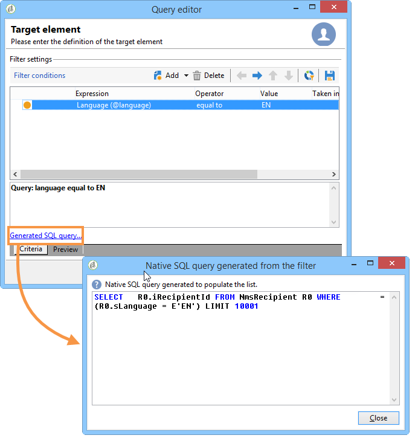

# 쿼리를 만드는 단계{#steps-to-create-a-query}

Adobe Campaign에서 쿼리를 작성하는 단계는 다음과 같습니다.

1. 작업 테이블을 선택합니다. [1단계 - 표 선택](#step-1---choose-a-table)을 참조하십시오.
1. 추출할 데이터를 선택합니다. [2단계 - 추출할 데이터 선택](#step-2---choose-data-to-extract)을 참조하십시오.
1. 데이터 정렬 순서를 정의합니다. [3단계 - 데이터 정렬](#step-3---sort-data)을 참조하십시오.
1. 데이터를 필터링합니다. [4단계 - 필터 데이터](#step-4---filter-data)를 참조하십시오.
1. 데이터의 형식을 지정합니다. [5단계 - 데이터 형식 지정](#step-5---format-data)을 참조하십시오.
1. 결과를 표시합니다. [6단계 - 데이터 미리 보기](#step-6---preview-data)를 참조하십시오.

>[!NOTE]
>
>이러한 모든 단계는 범용 쿼리 편집기에서 사용할 수 있습니다. 쿼리가 다른 컨텍스트에서 작성되면 일부 단계를 제외할 수 있습니다.\
>쿼리 활동은 [이 섹션](../../workflow/using/query.md)에 표시됩니다.

## 1단계 - {#step-1---choose-a-table} 테이블 선택

**[!UICONTROL Document type]** 창에서 쿼리할 데이터가 포함된 테이블을 선택합니다. 필요한 경우 필터 필드 또는 **[!UICONTROL Filters]** 단추를 사용하여 데이터를 필터링합니다.

## 2단계 - 데이터를 선택하여 {#step-2---choose-data-to-extract} 추출

**[!UICONTROL Data to extract]** 창에서 표시할 데이터를 선택합니다.이러한 필드는 출력 열을 구성합니다.

예를 들어 **[!UICONTROL Age]**, **[!UICONTROL Primary key]**, **[!UICONTROL Email domain]** 및 **[!UICONTROL City]**&#x200B;을 선택합니다. 결과는 이 선택에 따라 구성됩니다. 창 오른쪽에 있는 파란색 화살표를 사용하여 열 순서를 변경합니다.

공식을 식에 삽입하거나 집계 함수에서 프로세스를 실행하여 표현식을 편집할 수 있습니다. 이렇게 하려면 **[!UICONTROL Expression]** 열 필드를 클릭한 다음 **[!UICONTROL Edit expression]**&#x200B;을 선택합니다.

출력 열 데이터를 그룹화할 수 있습니다.이렇게 하려면 **[!UICONTROL Data to extract]** 창의 **[!UICONTROL Group]** 열에서 **[!UICONTROL Yes]**&#x200B;을 선택합니다. 이 함수는 선택된 그룹화 축 주위에 결과를 생성합니다. [이 섹션](../../workflow/using/querying-delivery-information.md)에서 그룹을 포함하는 쿼리의 예를 사용할 수 있습니다.

* **[!UICONTROL Handle groupings (GROUP BY + HAVING)]** 함수를 사용하면 &quot;그룹화 기준&quot; 및 그룹화된(&quot;포함&quot;)을 선택할 수 있습니다. 이 함수는 출력 열의 모든 필드에 적용됩니다. 예를 들어 이 옵션을 사용하면 출력 열의 모든 선택 항목을 그룹화하고 35에서 50 사이의 수신자와 같은 특정 유형의 정보를 복구할 수 있습니다.

   이 작업에 대한 자세한 정보는 [이 섹션](../../workflow/using/querying-using-grouping-management.md)을 참조하십시오.

* **[!UICONTROL Remove duplicate rows (DISTINCT)]** 함수를 사용하면 출력 열에서 얻은 동일한 결과를 중복 제거할 수 있습니다. 예를 들어 출력 열에서 성, 이름 및 이메일 필드를 선택하여 인구 조사를 수행하면 동일한 데이터가 포함된 항목이 제거됩니다. 이는 데이터베이스에 동일한 연락처를 여러 번 입력했음을 의미하기 때문입니다.오직 한 가지 결과만 고려될 것이다.

## 3단계 - 데이터 정렬 {#step-3---sort-data}

**[!UICONTROL Sorting]** 창에서 열 내용을 정렬할 수 있습니다. 화살표를 사용하여 열 순서를 변경합니다.

* **[!UICONTROL Sorting]** 열을 사용하면 열을 간단히 정렬하고 A부터 Z까지의 열 내용을 오름차순으로 정렬할 수 있습니다.
* **[!UICONTROL Descending sort]**&#x200B;은 Z부터 A까지 내용을 내림차순으로 정렬합니다. 이 기능은 레코드 매출을 볼 때 다음과 같이 유용합니다.가장 높은 숫자가 목록의 맨 위에 표시됩니다.

이 예에서 데이터는 수신자 페이지에 따라 오름차순으로 정렬됩니다.

## 4단계 - 데이터 필터링 {#step-4---filter-data}

쿼리 편집기를 사용하면 데이터를 필터링하여 검색을 개선할 수 있습니다.

제공된 필터는 쿼리와 관련된 테이블에 따라 다릅니다.

**[!UICONTROL Filtering conditions]**&#x200B;을 선택하면 **[!UICONTROL Target elements]** 섹션에 액세스합니다.수집할 데이터를 필터링하는 방법을 정의할 수 있습니다.

* 새 필터를 만들려면 데이터를 선택하려면 확인할 공식을 만드는 데 필요한 필드, 연산자 및 값을 선택합니다. 여러 조건을 결합할 수 있습니다(자세한 내용은 [필터 조건 정의](../../platform/using/defining-filter-conditions.md) 참조).
* 이전에 저장한 필터를 사용하려면 **[!UICONTROL Add]** 단추를 클릭하여 드롭다운 목록을 열고 **[!UICONTROL Predefined filter]**&#x200B;을 클릭한 다음 원하는 필터를 선택합니다.

   

* **[!UICONTROL Generic query editor]**&#x200B;에서 만든 필터는 다른 쿼리 응용 프로그램에서 사용할 수 있으며 그 반대의 경우도 가능합니다. 필터를 저장하려면 **[!UICONTROL Save]** 아이콘을 클릭합니다.

   >[!NOTE]
   >
   >필터 만들기 및 사용에 대한 자세한 내용은 [필터링 옵션](../../platform/using/filtering-options.md)을 참조하십시오.

다음 예에서 보듯이 모든 영어 사용 수신자를 복구하려면 다음을 선택합니다.&quot;받는 사람 언어 **이(가)** EN과 같습니다.&quot;

>[!NOTE]
>
>**값** 필드에 다음 공식을 입력하여 옵션에 직접 액세스할 수 있습니다.**$(options:OPTION_NAME)**.

필터링 조건의 결과를 보려면 **[!UICONTROL Preview]** 탭을 클릭합니다. 이 경우 모든 영어 사용 수신자는 이름, 이름 및 이메일 주소로 표시됩니다.

SQL 언어에 익숙한 사용자는 **[!UICONTROL Generate SQL query]**&#x200B;을 클릭하여 SQL에서 쿼리를 볼 수 있습니다.

## 5단계 - 데이터 형식 {#step-5---format-data}

제한 필터를 구성했으면 **[!UICONTROL Data formatting]** 창에 액세스합니다. 이 창에서 출력 열을 다시 정렬하고, 데이터를 변형하고, 열 레이블의 위쪽/아래쪽 문자를 변경할 수 있습니다. 계산된 필드를 사용하여 최종 결과에 공식을 적용할 수도 있습니다.

>[!NOTE]
>
>계산된 필드 유형에 대한 자세한 내용은 [계산된 필드 만들기](../../platform/using/defining-filter-conditions.md#creating-calculated-fields)를 참조하십시오.

선택 취소된 열은 데이터 미리 보기 창에 표시되지 않습니다.

**[!UICONTROL Transformation]** 열을 사용하면 열 레이블을 대문자 또는 소문자로 변경할 수 있습니다. 열을 선택하고 **[!UICONTROL Transformation]** 열을 클릭합니다. 다음을 선택할 수 있습니다.

* **[!UICONTROL Switch to lower case]**,
* **[!UICONTROL Switch to upper case]**,
* **[!UICONTROL First letter in upper case]**.

## 6단계 - 데이터 미리 보기 {#step-6---preview-data}

**[!UICONTROL Data preview]** 창은 마지막 단계입니다. 쿼리 결과를 얻으려면 **[!UICONTROL Start the preview of the data]**&#x200B;을 클릭합니다. 열 또는 XML 형식으로 사용할 수 있습니다. 쿼리를 SQL 형식으로 보려면 **[!UICONTROL Generated SQL queries]** 탭을 클릭합니다.

이 예에서 데이터는 수신자 페이지에 따라 오름차순으로 정렬됩니다.

>[!NOTE]
>
>기본적으로 처음 200개 줄만 **[!UICONTROL Data preview]** 창에 표시됩니다. 이를 변경하려면 **[!UICONTROL Lines to display]** 상자에 숫자를 입력하고 **[!UICONTROL Start the preview of the data]**&#x200B;을 클릭합니다.

