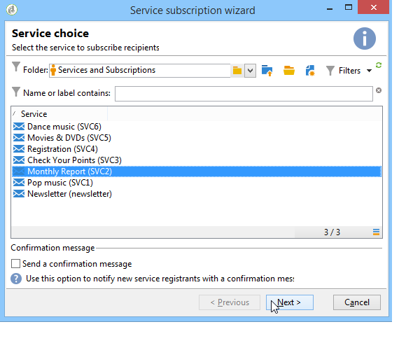

# 데이터 업데이트{#updating-data}

수신자의 프로필에 연결된 데이터는 수동 또는 자동으로 업데이트할 수 있습니다.

## 자동 업데이트 설정 {#setting-up-an-automatic-update}

자동 업데이트는 워크플로우를 통해 구성할 수 있습니다. For more on this, refer to [this section](../../workflow/using/update-data.md).

## 대량 갱신 수행 {#performing-a-mass-update}

수동 업데이트를 수행하려면 선택한 수신자를 마우스 오른쪽 단추로 클릭하여 **[!UICONTROL Actions]** 바로 가기 메뉴를 사용하거나 **[!UICONTROL Actions]** 아이콘을 사용합니다.

다음과 같은 두 가지 유형의 업데이트가 있습니다.수신자 집합에 대한 일괄 업데이트와 두 프로필 간의 데이터 병합 각 작업에 대해 마법사를 사용하여 업데이트를 구성할 수 있습니다.

### 대량 업데이트 {#mass-update}

대량 업데이트의 경우 를 **[!UICONTROL Action > Mass update of selected lines...]**&#x200B;사용하십시오. 이 마법사는 업데이트를 구성하고 실행하는 데 도움이 됩니다.

마법사의 첫 번째 단계는 업데이트할 필드를 지정하는 것입니다.

마법사의 왼쪽 섹션에 사용 가능한 필드 목록이 표시됩니다. 이 **[!UICONTROL Find]** 필드를 사용하여 이러한 필드의 검색을 실행합니다. Enter **키를** 눌러 목록을 찾습니다. 항목과 일치하는 필드 이름은 아래와 같이 굵게 표시됩니다.

업데이트할 필드를 두 번 클릭하여 마법사의 오른쪽 섹션에 표시합니다.

오류가 발생하면 **[!UICONTROL Delete]** 단추를 사용하여 업데이트할 필드 목록에서 필드를 삭제합니다.

업데이트할 프로필에 적용할 값을 선택하거나 입력합니다.

을 클릭하여 현재 폴더에 있는 수신자에 대해 선택한 필드의 값 분포를 표시할 **[!UICONTROL Distribution of values]** 수 있습니다(업데이트의 영향을 받는 수신자뿐만 아니라).

필터를 정의하여 이 창에 값 분포를 표시하거나 현재 폴더를 수정하여 다른 폴더에 값 분포를 표시할 수 있습니다. 이러한 작업은 읽기 전용 작업입니다.정의된 업데이트 구성에는 영향을 주지 않습니다.

이 창을 닫고 두 번째 업데이트 마법사 단계를 **[!UICONTROL Next]** 표시하려면 을(를) 클릭합니다. 이 단계에서 을 클릭하여 업데이트를 시작할 수 **[!UICONTROL Start]**&#x200B;있습니다.

업데이트 실행에 대한 정보는 마법사의 상단 섹션에 표시됩니다.

를 **[!UICONTROL Stop]** 사용하면 업데이트를 취소할 수 있지만 특정 레코드가 업데이트되었을 수 있으며 프로세스를 중지하면 이러한 업데이트가 취소되지 않습니다. 진행률 표시줄에는 작업이 얼마나 진행되었는지 표시됩니다.

### 데이터 병합 {#merge-data}

두 수신자 프로필의 병합을 **[!UICONTROL Merge selected lines...]** 시작하려면 선택합니다. 옵션을 선택하기 전에 병합할 프로파일을 선택해야 합니다. 병합은 마법사를 사용하여 구성 및 실행됩니다.

마법사는 소스 프로파일 중 하나 또는 다른 하나에서 완료된 각 필드에 대해 검색할 값을 표시합니다. 병합할 프로필에서 하나 이상의 필드에 다른 값이 있으면 **[!UICONTROL List of conflicts]** 섹션에 표시됩니다. 그런 다음 다음 목록 아래에 있는 라디오 단추를 사용하여 기본 프로파일을 선택할 수 있습니다.

클릭하여 원하는 결과를 **[!UICONTROL Compute]** 표시합니다.

창의 두 섹션에 있는 **[!UICONTROL Result]** 열을 확인하고 클릭하여 병합을 **[!UICONTROL Finish]** 실행합니다.

## 데이터 내보내기 {#exporting-data}

목록의 컨텐츠를 내보낼 수 있습니다. 내보내기를 구성하고 실행하려면:

1. 내보낼 레코드를 선택합니다.
1. 마우스 오른쪽 단추를 클릭하고 **[!UICONTROL Export...]**&#x200B;선택합니다.

   

1. 그런 다음 추출할 데이터를 선택합니다. 기본적으로 표시되는 모든 열이 출력 열에 추가됩니다.

   

   내보내기 마법사를 구성하는 방법에 대한 자세한 내용은 내보내기 [마법사를](../../platform/using/exporting-data.md#export-wizard)참조하십시오.

## 서비스 가입 {#subscribing-to-a-service}

대부분의 경우 수신자는 [이 섹션에](../../delivery/using/managing-subscriptions.md)설명된 대로 전용 랜딩 페이지를 통해 뉴스레터에 가입합니다. 그러나 필터링된 수신자의 프로필은 서비스(뉴스레터 또는 바이럴 서비스)에 수동으로 구독할 수 있습니다. 이렇게 하려면:

1. 가입할 수신자를 선택하고 마우스 오른쪽 단추를 클릭합니다.
1. 을 **[!UICONTROL Actions > Subscribe selection to a service]**&#x200B;선택합니다.

   

1. 원하는 서비스를 선택하고 **[!UICONTROL Next]**&#x200B;다음을 클릭합니다.

   

   >[!NOTE]
   >
   >이 편집기를 사용하여 새 서비스를 만들 수 있습니다.단추를 **[!UICONTROL Create]** 클릭합니다.

1. 수신자에게 **[!UICONTROL Send a confirmation message]** 문의하십시오. 이 메시지의 내용은 선택한 서비스에 연결된 구독 시나리오에서 구성할 수 있습니다.
1. 단추를 클릭하여 구독 프로세스를 실행합니다. **[!UICONTROL Start]**

   

창의 위쪽 섹션에서 실행 프로세스를 모니터링할 수 있습니다. 이 **[!UICONTROL Stop]** 단추를 사용하면 프로세스를 중지할 수 있습니다. 그러나 이미 처리된 수신자는 가입됩니다.

이 **[!UICONTROL Do not keep a trace of this job in the database]** 옵션의 선택을 취소하면 이 프로세스에 대한 정보가 저장되는 실행 폴더를 선택하거나 만들 수 있습니다.

이 프로세스를 확인하려면 이 작업에서 관련된 받는 사람 프로필의 **[!UICONTROL Subscriptions]** 탭으로 이동하거나 노드를 통해 액세스하는 **[!UICONTROL Subscriptions]** 탭으로 이동합니다 **[!UICONTROL Profiles and Targets > Services and Subscriptions]** .

>[!NOTE]
>
>정보 서비스 만들기 및 구성에 대한 자세한 내용은 [이 페이지를](../../delivery/using/managing-subscriptions.md)참조하십시오.

