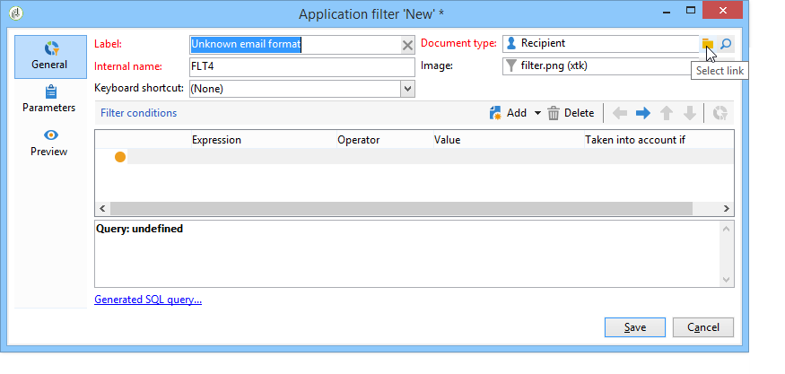

# 사용 사례{#use-case}

## 구독자의 이메일 형식에 대한 필터 만들기 {#creating-a-filter-on-the-email-format-of-subscribers}

이 사용 사례에서는 필터를 만들어 수신자 이메일 형식을 기반으로 뉴스레터 구독을 정렬하는 방법을 보여 줍니다.

이렇게 하려면 사전 정의된 파일러를 사용해야 합니다.이러한 필터는 문서 유형에 연결되어 있으며 **[!UICONTROL Administration > Configuration > Predefined filters]** 노드를 통해 액세스합니다. 이러한 데이터 필터는 애플리케이션에서 각 유형의 편집기(또는 문서)에 사용할 수 있습니다.

데이터 필터는 사전 정의된 필터와 같은 방식으로 만들어지지만, 필터를 적용할 문서 유형을 선택할 수 있는 추가 필드가 있습니다.

다음 단계를 적용합니다.

1. 노드를 통해 새 필터를 **[!UICONTROL Administration > Configuration > Predefined filters]** 만듭니다.
1. 아이콘을 클릭하여 관련 문서를 선택합니다. **[!UICONTROL Select link]**

   

1. 구독 스키마(nms:subscription)를 선택하고 을 **[!UICONTROL OK]**&#x200B;클릭합니다.

   

1. 을 **[!UICONTROL Edit link]** 클릭하여 선택한 문서의 필드를 봅니다.

   

   그런 다음 선택한 문서의 컨텐츠를 볼 수 있습니다.

   

   이러한 필드에 액세스하여 필터 편집기 본문에 필터 조건을 정의할 수 있습니다. 애플리케이션 필터는 고급 필터와 같은 방식으로 정의됩니다. 고급 [필터](../../platform/using/creating-filters.md#creating-an-advanced-filter)만들기를 참조하십시오.

1. 정의되지 않은 이메일 형식으로 구독만 표시하려면 구독에 새 필터를 만듭니다.

   

1. 이 유형의 목록에 대해 미리 정의된 필터에 필터를 **[!UICONTROL Save]** 추가하려면 클릭하십시오.
1. 이제 수신자 프로필의 **[!UICONTROL Subscriptions]** 탭에서 이 필터를 사용할 수 있습니다.단추를 클릭하여 &quot;알 수 없는 전자 메일 형식&quot; 필터에 액세스할 수 **[!UICONTROL Filters]** 있습니다.

   

   현재 필터의 이름이 목록 위에 표시됩니다. 필터를 취소하려면 **[!UICONTROL Delete this filter]** 아이콘을 클릭합니다.

   

