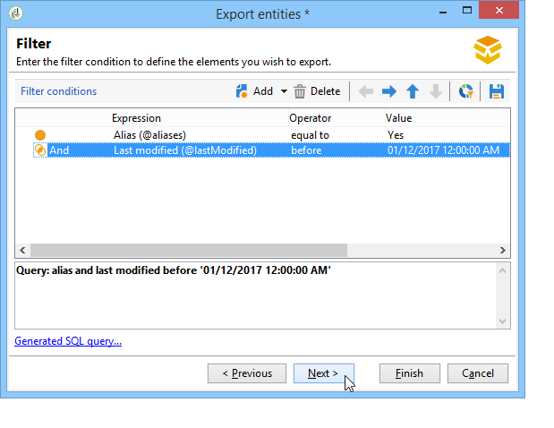
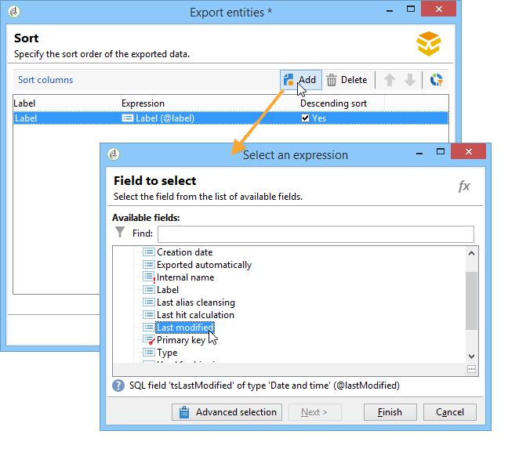

# 데이터 패키지 작업{#working-with-data-packages}

## 데이터 패키지 정보 {#about-data-packages}

Adobe Campaign을 사용하면 플랫폼 구성 및 데이터를 패키지 시스템을 통해 내보내거나 가져올 수 있습니다. 패키지에는 서로 다른 종류의 구성, 요소, 필터링되거나 필터링되지 않을 수 있습니다.

데이터 패키지를 사용하면 Adobe Campaign 데이터베이스의 엔티티가 XML 형식의 파일을 통해 표시됩니다. 패키지에 포함된 각 엔티티는 모든 데이터로 표현됩니다.

데이터 패키지의 **** 원칙은 데이터 구성을 내보내 다른 Adobe Campaign 시스템에 통합하는 것입니다. 일관된 데이터 패키지 세트를 유지 관리하는 방법에 대한 자세한 내용은 이 [기술 문서를 참조하십시오](https://docs.campaign.adobe.com/doc/AC/en/technicalResources/Technotes/AdobeCampaign_How_to_maintain_a_consistent_set_of_data_packages.pdf).

### 패키지 유형 {#types-of-packages}

내보낼 수 있는 패키지는 다음과 같은 세 가지가 있습니다.사용자 패키지, 플랫폼 패키지 및 관리 패키지.

* **사용자 패키지**:내보낼 엔티티 목록을 선택할 수 있습니다. 이 유형의 패키지는 종속성을 관리하고 오류를 확인합니다.
* **플랫폼 패키지**:여기에는 모든 추가된 기술 리소스(표준이 아님)가 포함됩니다.스키마, JavaScript 코드 등

   

* **관리 패키지**:여기에는 추가된 모든 템플릿과 비즈니스 개체(표준이 아님)가 포함됩니다.템플릿, 라이브러리 등

   

>[!CAUTION]
>
>플랫폼 **및** 관리자 **** 유형에는 내보낼 사전 정의된 개체 목록이 포함되어 있습니다. 각 엔티티는 작성된 패키지의 기본 리소스를 제거할 수 있는 필터링 조건에 연결됩니다.

## 데이터 구조 {#data-structure}

데이터 패키지에 대한 설명은 **xrk:navtree 데이터 스키마의 문법을 준수하는 구조화된 XML** 문서입니다.

데이터 패키지 예:

```
<package>
  <entities schema="nms:recipient">
    <recipient email="john.smith@adobe.com" lastName="Smith" firstName="John">      
      <folder _operation="none" name="nmsRootFolder"/>      
      <company _operation="none" name="Adobe"/>
    </recipient>
  </entities>
  <entities schema="sfa:company">
    <company name="Adobe">
      location city="London" zipCode="W11 2BQ"/>
    </company>
  </entities>
</package>
```

XML 문서는 **`<package>`** 요소로 시작하고 끝나야 합니다. 이어지는 모든 **`<entities>`** 요소는 문서 유형별로 데이터를 배포합니다.

요소에는 **`<entities>`** 스키마 **** 속성에 입력된 데이터 스키마 형식의 패키지 데이터가 포함됩니다.

패키지의 데이터에는 자동 생성된 키(**자동** 옵션)와 같이 기본 간에 호환하지 않는 내부 키가 들어 있으면 안 됩니다.

이 예제에서는 &quot;folder&quot; 및 &quot;company&quot; 링크의 조인이 대상 테이블의 &quot;상위 수준&quot; 키로 대체되었습니다.

```
<recipient>
  <folder _operation="none" name="nmsRootFolder"/>
  <company _operation="none" name="Adobe"/>
</recipient>
```

값이 &quot;none&quot;인 **`operation`** 속성은 조정 링크를 정의합니다.

데이터 패키지는 모든 텍스트 편집기에서 수동으로 생성할 수 있습니다. XML 문서의 구조가 &quot;xtk:navtree&quot; 데이터 스키마를 준수하는지 확인하면 됩니다. Adobe Campaign 콘솔에는 데이터 패키지 내보내기 및 가져오기 모듈이 있습니다.

## 패키지 내보내기 {#exporting-packages}

### 패키지 내보내기 정보 {#about-package-export}

패키지는 다음과 같은 세 가지 방법으로 내보낼 수 있습니다.

* 를 **[!UICONTROL Package Export Wizard]** 사용하면 하나의 패키지에서 객체 세트를 내보낼 수 있습니다. 자세한 내용은 패키지에서 [객체 세트 내보내기를 참조하십시오.](#exporting-a-set-of-objects-in-a-package)
* 단일 개체를 **마우스 오른쪽 단추로 클릭하고 선택하여 패키지에서 바로 내보낼 수** **[!UICONTROL Actions > Export in a package]**&#x200B;있습니다.
* **패키지 정의를** 사용하면 나중에 패키지에서 내보낼 개체를 추가할 패키지 구조를 만들 수 있습니다. 자세한 내용은 패키지 정의 [관리를 참조하십시오.](#managing-package-definitions)

패키지를 내보내면 패키지 및 추가된 모든 엔티티를 다른 Campaign 인스턴스로 가져올 수 있습니다.

### 패키지에서 객체 세트 내보내기 {#exporting-a-set-of-objects-in-a-package}

패키지 내보내기 마법사는 Adobe Campaign 클라이언트 콘솔의 **[!UICONTROL Tools > Advanced > Export package...]** 메뉴를 통해 액세스할 수 있습니다.


세 가지 유형의 패키지에 대해 마법사는 다음 단계를 제공합니다.

1. 문서 유형별로 내보낼 개체를 나열합니다.

   

   >[!CAUTION]
   >
   >폴더 **[!UICONTROL Offer category]**, **[!UICONTROL Offer environment]****[!UICONTROL Program]** 또는 **[!UICONTROL Plan]** 유형을 내보내면 데이터가 손실될 수 있으므로 **xtk:** 폴더를선택하지 마십시오. 폴더에 해당하는 엔티티를 선택합니다.오퍼 카테고리의 **** nms:offerCategory **, 오퍼 환경을 위한** nms:offerEnv **,** 프로그램용 nms: **프로그램** , nms:planfor 플랜

   목록 관리를 사용하면 구성에서 내보낼 엔티티를 추가하거나 삭제할 수 있습니다. 아이콘을 **[!UICONTROL Add]** 클릭하여 새 엔티티를 선택합니다.

   이 **[!UICONTROL Detail]** 단추는 선택한 구성을 편집합니다.

   >[!NOTE]
   >
   >종속성 메커니즘은 개체 내보내기 시퀀스를 제어합니다. 자세한 내용은 종속성 [관리를 참조하십시오](#managing-dependencies).

1. 엔티티 구성 화면은 추출할 문서 유형에 대한 필터 쿼리를 정의합니다.

   데이터 추출을 위해 필터링 절을 구성해야 합니다.

   

   >[!NOTE]
   >
   >쿼리 편집기는 [이 섹션에](../../platform/using/about-queries-in-campaign.md)설명되어 있습니다.

1. 을 클릭하고 열을 선택하여 추출 중에 데이터를 정렬합니다. **[!UICONTROL Next]**

   

1. 내보내기를 실행하기 전에 추출할 데이터를 미리 봅니다.

   

1. 패키지 내보내기 마법사의 마지막 페이지에서 내보내기를 시작할 수 있습니다. 데이터는 **[!UICONTROL File]** 필드에 지정된 파일에 저장됩니다.

   

### 종속성 관리 {#managing-dependencies}

내보내기 메커니즘을 통해 Adobe Campaign은 다양한 내보낸 요소 간의 링크를 추적할 수 있습니다.

이 메커니즘은 다음 두 가지 규칙으로 정의됩니다.

* 자체 **또는** 소유자 **** 형식 무결성이 있는 링크에 연결된 개체는 내보낸 개체와 동일한 패키지에서 내보내집니다.
* **중립적인** 링크 또는 **정의** 형식 무결성(정의된 링크)이 있는 링크는 별도로 내보내야 합니다.

>[!NOTE]
>
>스키마 요소에 연결된 무결성 유형은 [이 섹션에](../../configuration/using/database-mapping.md#links--relation-between-tables)정의됩니다.

#### 캠페인 내보내기 {#exporting-a-campaign}

다음은 캠페인을 내보내는 방법에 대한 예입니다. 내보낼 마케팅 캠페인에는 작업(레이블:&quot;MyTask&quot;) 및 워크플로우(레이블:&quot;MyWorkflow&quot; 폴더(노드:관리/프로덕션/기술 워크플로우/캠페인 프로세스/MyWorkflow).

일치 스키마는 &quot;자체&quot; 유형 무결성이 있는 링크로 연결되어 있으므로 작업 및 워크플로우는 캠페인과 동일한 패키지에서 내보내집니다.

콘텐츠 패키지:

```
<?xml version='1.0'?>
<package author="Administrator (admin)" buildNumber="7974" buildVersion="6.1" img=""
label="" name="" namespace="" vendor="">
 <desc></desc>
 <version buildDate="2013-01-09 10:30:18.954Z"/>
 <entities schema="nms:operation">
  <operation duration="432000" end="2013-01-14" internalName="OP1" label="MyCampaign"
  modelName="opEmpty" start="2013-01-09">
   <controlGroup>
    <where filteringSchema=""/>
   </controlGroup>
   <seedList>
    <where filteringSchema="nms:seedMember"></where>
    <seedMember internalName="SDM1"></seedMember>
   </seedList>
   <parameter useAsset="1" useBudget="1" useControlGroup="1" useDeliveryOutline="1"
   useDocument="1" useFCPValidation="0" useSeedMember="1" useTask="1"
   useValidation="1" useWorkflow="1"></parameter>
   <fcpSeed>
    <where filteringSchema="nms:seedMember"></where>
   </fcpSeed>
   <owner _operation="none" name="admin" type="0"/>
   <program _operation="none" name="nmsOperations"/>
   <task end="2013-01-17 10:07:51.000Z" label="MyTask" name="TSK2" start="2013-01-16 10:07:51.000Z"
   status="1">
    <owner _operation="none" name="admin" type="0"/>
    <operation _operation="none" internalName="OP1"/>
    <folder _operation="none" name="nmsTask"/>
   </task>
   <workflow internalName="WKF12" label="CampaignWorkflow" modelName="newOpEmpty"
   order="8982" scenario-cs="Notification of the workflow supervisor (notifySupervisor)"
   schema="nms:recipient">
    <scenario internalName="notifySupervisor"/>
    <desc></desc>
    <folder _operation="none" name="Folder4"/>
    <operation _operation="none" internalName="OP1"/>
   </workflow>
  </operation>
 </entities>
</package>   
```

패키지 유형에 대한 가입은 스키마에서 **@pkgAdmin 및 @pkgPlatform 속성을 사용하여** 정의됩니다. 이 두 속성은 패키지의 제휴 조건을 정의하는 XTK 표현식을 받습니다.

```
<element name="offerEnv" img="nms:offerEnv.png" 
template="xtk:folder" pkgAdmin="@id != 0">
```

마지막으로 **@pkgStatus** 속성을 사용하여 이러한 요소 또는 속성에 대한 내보내기 규칙을 정의할 수 있습니다. 속성 값에 따라 요소나 속성이 내보낸 패키지에 있습니다. 이 속성에 사용할 수 있는 세 가지 값은 다음과 같습니다.

* **안 함**:필드/링크를 내보내지 않음
* **항상**:이 필드에 대한 수출
* **preCreate**:연결된 엔티티의 작성 권한 부여

>[!NOTE]
>
>preCreate **값은** 링크 유형 이벤트에만 허용됩니다. 내보낸 패키지에 아직 로드되지 않은 엔티티를 생성하거나 가리키는 권한을 가집니다.

## 패키지 정의 관리 {#managing-package-definitions}

### 패키지 정의 정보 {#about-package-definitions}

패키지 정의를 사용하면 나중에 단일 패키지에서 내보낼 개체를 추가할 패키지 구조를 만들 수 있습니다. 그러면 이 패키지 및 추가된 모든 엔티티를 다른 Campaign 인스턴스로 가져올 수 있습니다.

**관련 항목:**

* [패키지 정의 만들기](#creating-a-package-definition)
* [패키지 정의에 개체 추가](#adding-entities-to-a-package-definition)
* [패키지 정의 생성 구성](#configuring-package-definitions-generation)
* [패키지 정의에서 패키지 내보내기](#exporting-packages-from-a-package-definition)

### 패키지 정의 만들기 {#creating-a-package-definition}

패키지 정의는 **[!UICONTROL Administration > Configuration > Package management > Package definitions]** 메뉴에서 액세스할 수 있습니다.

패키지 정의를 만들려면 **[!UICONTROL New]** 단추를 클릭한 다음 패키지 정의 일반 정보를 입력합니다.


그런 다음 패키지 정의에 개체를 추가하고 XML 파일 패키지로 내보낼 수 있습니다.

**관련 항목:**

* [패키지 정의에 개체 추가](#adding-entities-to-a-package-definition)
* [패키지 정의 생성 구성](#configuring-package-definitions-generation)
* [패키지 정의에서 패키지 내보내기](#exporting-packages-from-a-package-definition)

### 패키지 정의에 개체 추가 {#adding-entities-to-a-package-definition}

탭에서 **[!UICONTROL Content]** **[!UICONTROL Add]** 단추를 클릭하여 패키지와 함께 내보낼 엔티티를 선택합니다. 개체를 선택할 때의 우수 사례는 패키지 [섹션의 개체](#exporting-a-set-of-objects-in-a-package) 세트 내보내기에있습니다.


인스턴스의 위치에서 직접 패키지 정의에 엔티티를 추가할 수 있습니다. 이렇게 하려면 아래 절차를 따르십시오.

1. 원하는 엔티티를 마우스 오른쪽 단추로 클릭한 다음 **[!UICONTROL Actions > Export in a package]**&#x200B;선택합니다.

   

1. 을 **[!UICONTROL Add to a package definition]**&#x200B;선택한 다음 엔티티를 추가할 패키지 정의를 선택합니다.

   

1. 엔티티가 패키지 정의에 추가되면 패키지와 함께 내보내집니다(패키지 정의에서 [패키지 내보내기](#exporting-packages-from-a-package-definition)참조).

   

### 패키지 정의 생성 구성 {#configuring-package-definitions-generation}

패키지 생성 기능은 패키지 정의 **[!UICONTROL Content]** 탭에서 구성할 수 있습니다. 이렇게 하려면 **[!UICONTROL Generation parameters]** 링크를 클릭합니다.


* **[!UICONTROL Include the definition]**:패키지 정의에 현재 사용되는 정의를 포함합니다.
* **[!UICONTROL Include an installation script]**:패키지 가져오기에서 실행할 javascript 스크립트를 추가할 수 있습니다. 이 옵션을 선택하면 패키지 정의 화면에 **[!UICONTROL Script]** 탭이 추가됩니다.
* **[!UICONTROL Include default values]**:를 패키지에 추가하면 모든 엔티티 속성의 값이 추가됩니다.

   긴 내보내기를 방지하기 위해 이 옵션은 기본적으로 선택되지 않습니다. 즉, 기본값(&#39;empty string&#39;, &#39;0&#39; 및 &#39;false&#39;(스키마에 달리 정의되지 않은 경우)이 있는 엔티티&#39; 속성이 패키지에 추가되지 않으므로 내보내지지 않습니다.

   >[!CAUTION]
   >
   >이 옵션을 선택하지 않으면 로컬 버전과 가져온 버전이 병합될 수 있습니다.
   >
   >패키지를 가져오는 인스턴스에 패키지의 엔티티와 동일한 엔티티가 포함된 경우(예: 동일한 외부 ID의 경우) 해당 속성은 업데이트되지 않습니다. 이전 인스턴스의 속성에 기본값이 있을 경우 패키지에 포함되지 않으므로 이 오류가 발생할 수 있습니다.
   >
   >이 경우 이전 인스턴스의 모든 속성을 패키지와 함께 내보낼 수 있으므로 이 **[!UICONTROL Include default values]** 옵션을 선택하면 버전이 병합되지 않습니다.

### 패키지 정의에서 패키지 내보내기 {#exporting-packages-from-a-package-definition}

패키지 정의에서 패키지를 내보내려면 아래 절차를 따르십시오.

1. 내보낼 패키지 정의를 선택한 다음 **[!UICONTROL Actions]** 단추를 클릭하고 **[!UICONTROL Export the package]**&#x200B;선택합니다.
1. 내보낸 패키지에 해당하는 XML 파일이 기본적으로 선택됩니다. 패키지 정의 네임스페이스 및 이름에 따라 이름이 지정됩니다.
1. 패키지 이름과 위치가 정의되면 **[!UICONTROL Start]** 단추를 클릭하여 내보내기를 시작합니다.

   

## 패키지 가져오기 {#importing-packages}

### 패키지 가져오기 정보 {#about-package-import}

패키지 가져오기 마법사는 Adobe Campaign 클라이언트 콘솔의 기본 메뉴를 통해 액세스할 **[!UICONTROL Tools > Advanced > Package import...]** 수 있습니다.

라이선스 약관에 따라 이전에 수행한 내보내기(예: 다른 Adobe Campaign 인스턴스 또는 표준 패키지)에서 패키지를 가져올 수 있습니다.


### 파일에서 패키지 설치 {#installing-a-package-from-a-file}

기존 데이터 패키지를 가져오려면 XML 파일을 선택하고 을 **[!UICONTROL Open]**&#x200B;클릭합니다.


가져올 패키지의 컨텐츠가 편집기의 중간 섹션에 표시됩니다.

을 **[!UICONTROL Next]** 클릭하여 가져오기를 **[!UICONTROL Start]** 시작합니다.


### 표준 패키지 설치 {#installing-a-standard-package}

표준 패키지는 Adobe Campaign이 구성되면 설치됩니다. 사용 권한 및 배포 모델에 따라 새 옵션이나 추가 기능을 구입하거나 새 오퍼로 업그레이드하는 경우 새 표준 패키지를 가져올 수 있습니다.

설치할 수 있는 패키지를 확인하려면 라이선스 계약서를 참조하십시오.

표준 패키지에 대한 자세한 내용은 [이 페이지를](../../installation/using/installing-campaign-standard-packages.md)참조하십시오.
